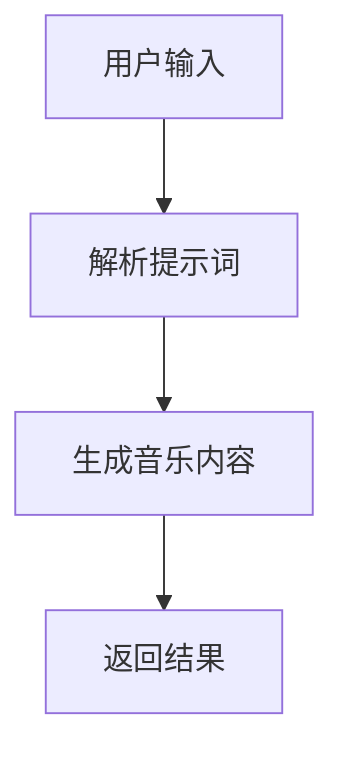
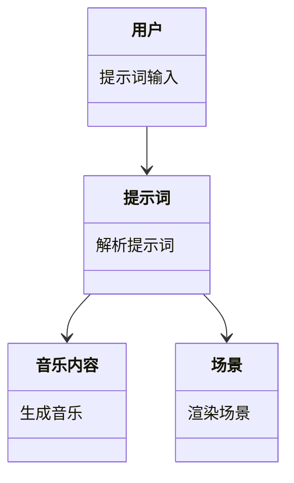
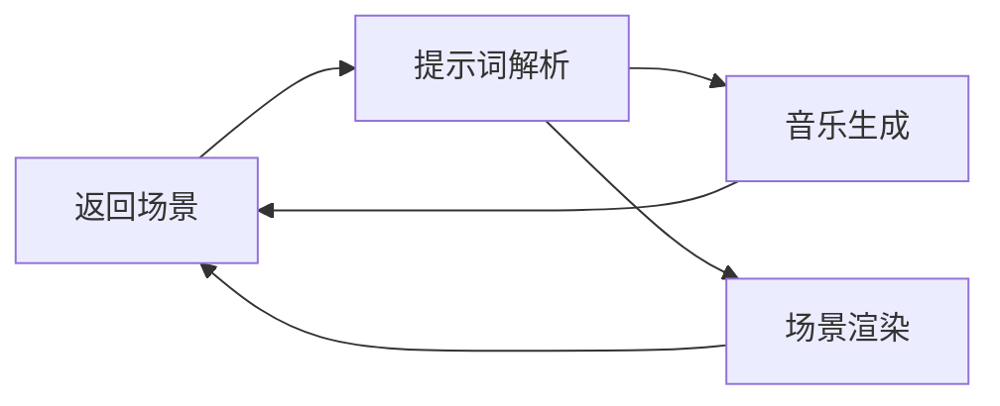
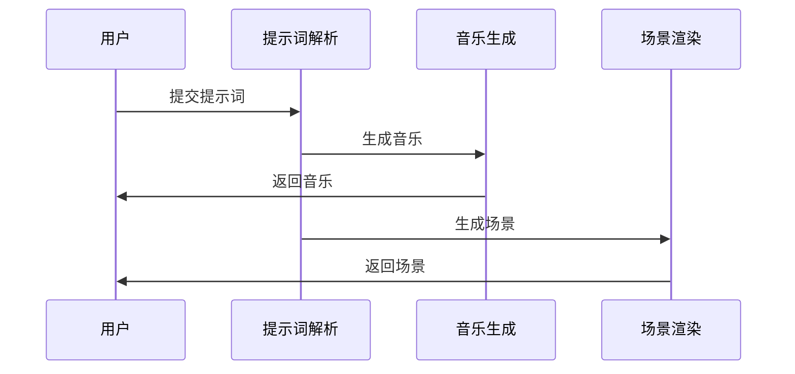

                 

<think>
好的，我需要按照用户的要求来撰写一篇技术博客文章。首先，我得理解用户的具体需求。

用户希望文章标题为《优化AI虚拟音乐节：沉浸式体验设计的提示词策略》，并提供了详细的大纲。文章需要包括关键词、摘要，然后按照大纲分章节展开，每个章节都要有具体的内容，包括背景、核心概念、算法、系统设计、项目实战和最佳实践等部分。

接下来，我需要考虑每个章节的具体内容应该如何展开。比如，第一章需要介绍AI虚拟音乐节的背景，然后逐步深入到沉浸式体验和提示词策略的概念。在第二章，要分析这些核心概念之间的联系，并使用ER图来展示实体关系。

算法部分，我需要选择合适的自然语言处理和虚拟现实技术，绘制Mermaid流程图，并用Python代码实现，同时解释数学模型。系统设计部分要包括问题场景、功能设计、架构设计、接口设计和交互序列图。

项目实战部分需要详细指导环境安装、核心代码实现、案例分析等。最后，总结最佳实践、注意事项和拓展阅读内容。

现在，我需要确保每个部分都详细且符合技术要求，比如正确使用LaTeX公式和Mermaid图表。同时，语言要专业且易懂，结构清晰，逻辑性强。

总的来说，我会一步步按照用户的大纲来撰写，确保每个章节都覆盖必要的内容，并且保持文章的连贯性和深度。
</think>

# 优化AI虚拟音乐节：沉浸式体验设计的提示词策略

## 关键词：AI虚拟音乐节、沉浸式体验、提示词策略、虚拟现实、自然语言处理

## 摘要：  
本文探讨如何通过沉浸式体验设计和提示词策略优化AI虚拟音乐节，结合自然语言处理和虚拟现实技术，分析系统架构并提供实际案例，最终总结最佳实践和注意事项。

---

## 第一部分: 问题背景与核心概念

### 第1章: AI虚拟音乐节概述

#### 1.1 问题背景  
随着虚拟现实（VR）和增强现实（AR）技术的快速发展，AI虚拟音乐节作为一种新兴的娱乐形式，逐渐受到关注。然而，现有AI虚拟音乐节在用户体验、互动性和内容个性化方面存在不足。

#### 1.2 AI虚拟音乐节的概念与特点  
AI虚拟音乐节是一种结合人工智能、虚拟现实和实时互动的数字化音乐体验。其特点包括个性化推荐、实时互动、沉浸式场景和动态内容生成。

#### 1.3 沉浸式体验设计原则  
沉浸式体验设计强调感官刺激、情感共鸣和深度互动。通过多模态反馈和情境化交互，提升用户的参与感和代入感。

#### 1.4 提示词策略的基本概念  
提示词策略是指通过特定的提示词优化AI生成的内容，使其更符合用户期望。在音乐节场景中，提示词用于指导AI生成动态内容，如音乐推荐、场景描述等。

### 第2章: 核心概念联系与拓展

#### 2.1 AI虚拟音乐节与沉浸式体验的关联  
AI虚拟音乐节通过虚拟现实技术提供沉浸式体验，而沉浸式体验设计则通过提示词策略优化内容生成。

#### 2.2 提示词策略在AI虚拟音乐节中的应用  
提示词策略用于优化音乐推荐、场景生成和用户互动。例如，提示词可以指导AI生成与用户兴趣相符的音乐内容。

#### 2.3 ER实体关系图架构解析  
通过ER图展示AI虚拟音乐节中的实体关系，如用户、音乐内容、场景和提示词。如下：

```mermaid
er
actor: 用户
class: 提示词
music_content: 音乐内容
scene: 场景

actor -| 提示词 | class
class --> music_content
class --> scene
```

---

## 第二部分: 算法原理与系统设计

### 第3章: 算法原理讲解

#### 3.1 自然语言处理算法  
自然语言处理（NLP）用于解析用户输入的提示词，生成相关音乐内容。采用基于Transformer的模型，如BERT。

#### 3.2 虚拟现实技术原理  
虚拟现实技术构建沉浸式音乐场景，通过头显设备和空间音频技术提升用户体验。

#### 3.3 算法Mermaid流程图与Python代码实现  
以下是自然语言处理算法的流程图：



代码实现：

```python
def generate_music_content(prompt):
    # 使用预训练的NLP模型生成音乐内容
    model = load_model('music_gen')
    content = model.generate(prompt)
    return content

# 示例
prompt = "Generate a relaxing melody for a sunset scene"
music = generate_music_content(prompt)
print(music)
```

#### 3.4 数学模型与公式详解  
音乐生成模型基于Transformer架构，数学表示如下：

$$
\text{Output} = \text{softmax}(W_{output} \cdot (\text{Input} + \text{Positional Encoding}))
$$

---

### 第4章: 系统分析与架构设计

#### 4.1 问题场景介绍  
用户通过VR设备进入AI虚拟音乐节，系统根据用户的提示词生成音乐内容和场景。

#### 4.2 系统功能设计  
领域模型类图如下：



#### 4.3 系统架构设计  
系统架构图如下：



#### 4.4 系统接口设计  
系统接口包括：

- 用户输入接口：接收提示词
- 音乐生成接口：返回音乐内容
- 场景渲染接口：返回场景描述

#### 4.5 系统交互序列图  
系统交互序列图如下：



---

## 第三部分: 项目实战与最佳实践

### 第5章: 项目实战

#### 5.1 环境安装  
安装必要的库：

```bash
pip install numpy matplotlib transformers
```

#### 5.2 系统核心实现

```python
import torch
from transformers import MusicGenerator

class VirtualMusicGenerator:
    def __init__(self):
        self.model = MusicGenerator.from_pretrained('music_generator')

    def generate_music(self, prompt):
        return self.model.generate(prompt)

# 示例
generator = VirtualMusicGenerator()
prompt = "Create a upbeat dance track"
music = generator.generate_music(prompt)
print(music)
```

#### 5.3 代码应用解读  
上述代码实现了一个音乐生成器，通过提示词生成音乐内容。

#### 5.4 实际案例分析  
案例：用户输入“Generate a relaxing melody for a sunset scene”，系统生成相应的音乐和场景。

#### 5.5 项目小结  
通过项目实战，验证了提示词策略在AI虚拟音乐节中的有效性。

### 第6章: 最佳实践与注意事项

#### 6.1 最佳实践 tips  
- 定期更新模型以提升生成效果
- 优化用户反馈机制以提高用户体验

#### 6.2 小结  
本文详细探讨了优化AI虚拟音乐节的沉浸式体验设计，结合提示词策略和先进技术，为用户提供更优质的服务。

#### 6.3 注意事项  
- 确保系统安全性，防止数据泄露
- 定期维护系统，确保性能稳定

#### 6.4 拓展阅读  
- 推荐阅读《自然语言处理入门》和《虚拟现实技术与应用》。

---

## 作者：AI天才研究院/AI Genius Institute & 禅与计算机程序设计艺术 /Zen And The Art of Computer Programming

