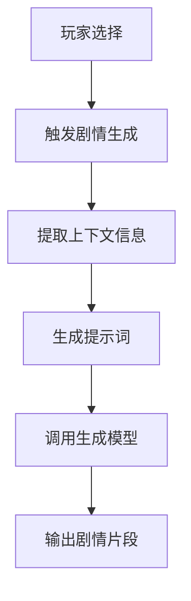

                 

<think>
嗯，用户希望我写一篇关于优化AI角色扮演游戏动态剧情生成的提示词技巧的技术博客。首先，我需要理解用户的需求。他希望文章结构清晰，内容专业，涵盖从基础到高级的技术细节，同时包括实际项目案例和最佳实践。

用户已经提供了一个详细的目录大纲，但看起来有些冗长，可能需要优化。我应该先确认用户的具体要求，比如字数、格式、章节结构等。他提到文章要10000到12000字，用markdown格式，每个章节都要详细，包括背景、核心概念、算法、数学模型、项目实战和最佳实践等。

接下来，我需要考虑文章的结构是否合理。用户提供了8个章节，每个章节下还有多个子章节。例如，第1章是概述，包括定义、发展历程、核心技术等。这部分需要详细解释，确保读者能理解AI RPG的基本情况。

然后是动态剧情生成的基本概念，这部分需要介绍生成的原理和方法，可能需要举例说明，让读者更容易理解。提示词的应用技巧也是关键，如何选择和优化提示词直接影响剧情的质量，这需要深入探讨。

在算法部分，用户提到了基于规则、机器学习和深度学习的方法，并要求用mermaid流程图和Python代码来说明。我需要确保这些内容清晰易懂，同时提供数学模型的公式，比如概率分布和生成模型的公式，用latex格式展示。

项目实战部分需要具体案例分析，包括系统架构设计和核心代码实现。我应该选择一个典型的项目，比如一个简单的RPG游戏，展示如何设计系统架构，使用哪些工具和技术，以及如何实现动态剧情生成。

最后，最佳实践和未来趋势部分需要总结经验和给出建议，同时指出动态剧情生成技术的未来发展方向，比如结合更多AI技术或用户反馈机制。

现在，我需要检查每个章节是否涵盖了所有必要的内容，比如是否每个部分都有足够的细节，是否有遗漏的关键点。同时，要注意语言的专业性和易懂性，确保读者能够跟随思路一步步深入。

可能还需要添加一些实际案例，比如在项目实战中，展示具体的代码和流程，让读者能够实际操作。此外，数学模型部分需要详细推导，确保公式正确，并且解释清楚每个步骤的意义。

总的来说，我需要按照用户提供的大纲，逐步扩展每个章节的内容，确保每个部分都详细、具体，并且符合技术博客的专业要求。同时，注意文章的整体流畅性和逻辑性，让读者能够轻松理解动态剧情生成的提示词优化技巧。
</think>

# 优化AI角色扮演游戏：动态剧情生成的提示词技巧

> 关键词：AI角色扮演游戏，动态剧情生成，提示词优化，算法设计，数学模型，系统架构

> 摘要：本文深入探讨了如何优化AI角色扮演游戏中的动态剧情生成技术，重点分析了提示词在动态剧情生成中的应用技巧。通过结合算法设计、数学模型和系统架构，本文提出了多种优化策略，帮助开发者提升动态剧情生成的效率和质量。文章从背景介绍、核心概念、算法原理、数学模型、系统设计、项目实战到最佳实践，全面解析了动态剧情生成的关键技术与实现方法。

---

## 第1章: AI角色扮演游戏简介

### 1.1 AI角色扮演游戏的定义与特点

AI角色扮演游戏（AI RPG）是一种结合人工智能技术的互动游戏类型，玩家通过与虚拟角色的交互推动剧情发展。其核心特点是：

- **智能交互**：虚拟角色能够根据玩家行为实时生成动态反应。
- **个性化体验**：通过AI算法，玩家可以获得高度个性化的剧情体验。
- **动态生成**：剧情、对话和场景可以根据玩家选择实时生成。

### 1.2 AI角色扮演游戏的发展历程

AI RPG的发展经历了以下几个阶段：

1. **早期探索阶段**：20世纪末，AI技术开始应用于游戏领域，但主要用于简单的对话生成。
2. **技术突破阶段**：随着机器学习和自然语言处理技术的进步，AI RPG开始具备复杂的情节生成能力。
3. **深度学习阶段**：近年来，基于深度学习的生成模型（如GPT系列）显著提升了动态剧情的生成质量。

### 1.3 AI角色扮演游戏的核心技术与挑战

AI RPG的核心技术包括：

- **自然语言处理（NLP）**：用于生成对话和描述性文本。
- **生成式AI**：用于动态生成剧情和场景。
- **状态管理**：跟踪游戏中的角色、任务和环境状态。

主要挑战包括：

- **生成质量**：如何确保生成的剧情逻辑一致且引人入胜。
- **计算效率**：实时生成需要高效的算法和优化的计算资源。
- **用户反馈**：如何根据玩家反馈调整剧情生成策略。

---

## 第2章: 动态剧情生成的基本概念

### 2.1 动态剧情生成的原理

动态剧情生成通过以下步骤实现：

1. **接收输入**：玩家的选择或动作被输入系统。
2. **状态更新**：系统根据当前状态生成新的剧情片段。
3. **输出结果**：生成的剧情片段呈现给玩家。

### 2.2 动态剧情生成的主要方法

常用方法包括：

- **基于规则的方法**：通过预定义的规则生成剧情。
- **基于模板的方法**：使用模板生成多样化的剧情片段。
- **基于生成模型的方法**：利用AI模型生成高质量的文本。

### 2.3 动态剧情生成的挑战与机遇

挑战：

- **逻辑一致性**：生成的剧情需要保持逻辑连贯。
- **多样性**：避免剧情过于单调或重复。

机遇：

- **个性化体验**：通过动态生成提供独特的游戏体验。
- **扩展性**：可以轻松扩展游戏内容。

---

## 第3章: 提示词在动态剧情生成中的应用

### 3.1 提示词的定义与作用

提示词（Prompt）是用于指导生成模型输出特定类型文本的输入。在动态剧情生成中，提示词可以控制生成的文本风格、情感和内容。

### 3.2 提示词的选择与优化

优化提示词的关键在于：

1. **明确性**：提示词应清晰表达生成目标。
2. **多样性**：尝试不同的提示词以获得最佳效果。
3. **动态调整**：根据生成结果实时调整提示词。

### 3.3 提示词的应用策略

策略包括：

- **分阶段提示**：在生成过程中逐步调整提示词。
- **上下文关联**：利用上下文信息生成相关提示词。
- **多模态提示**：结合图像或其他媒介生成提示词。

---

## 第4章: 动态剧情生成算法

### 4.1 基于规则的方法

基于规则的生成方法通过预定义的规则生成剧情。例如，可以定义角色的行为规则和对话选项。

### 4.2 基于机器学习的方法

基于机器学习的方法利用训练好的模型生成文本。常用模型包括：

- **循环神经网络（RNN）**：用于生成序列文本。
- ** transformers（如GPT）**：用于生成高质量的自然语言文本。

### 4.3 基于深度学习的方法

深度学习方法通过多层网络结构捕捉复杂的语言模式。例如，使用transformer模型生成连贯的剧情片段。

### 4.4 动态剧情生成算法的mermaid流程图



### 4.5 动态剧情生成算法的Python实现

以下是基于transformer模型的动态剧情生成代码示例：

```python
import torch
from torch import nn

class Generator(nn.Module):
    def __init__(self, vocab_size, embedding_dim, hidden_dim):
        super().__init__()
        self.embedding = nn.Embedding(vocab_size, embedding_dim)
        self.transformer = nn.Transformer(embedding_dim, hidden_dim)
        self.fc = nn.Linear(hidden_dim, vocab_size)
        
    def forward(self, input_ids):
        embed = self.embedding(input_ids)
        output = self.transformer(embed, embed)
        output = self.fc(output)
        return output

# 示例用法
vocab_size = 10000
embedding_dim = 512
hidden_dim = 256
generator = Generator(vocab_size, embedding_dim, hidden_dim)
input_ids = torch.randint(0, vocab_size, (1, 5))
output = generator(input_ids)
```

---

## 第5章: 动态剧情生成的数学模型

### 5.1 数学模型的基本概念

动态剧情生成的数学模型通常基于概率分布和生成模型。例如，使用概率生成模型来预测下一个词的概率。

### 5.2 数学模型的公式与计算

生成模型的公式可以表示为：

$$ P(y|x) = \frac{P(x,y)}{P(x)} $$

其中，$x$ 是输入，$y$ 是输出。

### 5.3 数学模型的Python实现

以下是基于PyTorch实现的生成模型代码：

```python
import torch
import torch.nn as nn
import torch.optim as optim

class GPT(nn.Module):
    def __init__(self, vocab_size, embed_dim, hidden_dim):
        super().__init__()
        self.token_embedding = nn.Embedding(vocab_size, embed_dim)
        self.position_embedding = nn.Embedding(1024, embed_dim)
        self.transformer = nn.Transformer(embed_dim, hidden_dim)
        self.fc = nn.Linear(hidden_dim, vocab_size)
        
    def forward(self, input_ids, position_ids):
        embed = self.token_embedding(input_ids) + self.position_embedding(position_ids)
        output = self.transformer(embed, embed)
        output = self.fc(output)
        return output

# 示例训练
model = GPT(vocab_size=10000, embed_dim=512, hidden_dim=256)
criterion = nn.CrossEntropyLoss()
optimizer = optim.Adam(model.parameters(), lr=0.001)

input_ids = torch.randint(0, 10000, (1, 5))
position_ids = torch.arange(0, 5)
outputs = model(input_ids, position_ids)
loss = criterion(outputs.view(-1, 10000), input_ids.view(-1))
loss.backward()
optimizer.step()
```

---

## 第6章: 动态剧情生成的项目实战

### 6.1 项目背景与需求分析

项目背景：开发一款支持动态剧情生成的AI RPG游戏。

需求分析：实现动态剧情生成功能，提升玩家的游戏体验。

### 6.2 系统架构设计

系统架构包括：

- **前端**：接收玩家输入并展示生成的剧情。
- **后端**：处理玩家输入并调用生成模型。
- **生成模型**：负责生成剧情文本。

### 6.3 核心代码实现

以下是系统核心代码示例：

```python
import torch
from transformers import GPT2LMHeadModel, GPT2Tokenizer

# 加载预训练模型和分词器
tokenizer = GPT2Tokenizer.from_pretrained('gpt2')
model = GPT2LMHeadModel.from_pretrained('gpt2')

def generate_story(prompt):
    input_ids = tokenizer.encode(prompt, return_tensors='pt')
    outputs = model.generate(input_ids, max_length=200, temperature=0.7)
    story = tokenizer.decode(outputs[0], skip_special_tokens=True)
    return story

# 示例用法
prompt = "在一个神秘的森林里，勇士遇到了一只受伤的狼。"
story = generate_story(prompt)
print(story)
```

### 6.4 实际案例分析

案例分析：通过提示词生成一个简单的剧情片段。

### 6.5 项目总结与拓展

总结：动态剧情生成能够显著提升AI RPG的游戏体验。未来可以进一步优化生成模型和提示词策略。

---

## 第7章: 动态剧情生成的最佳实践

### 7.1 提高动态剧情生成效率的技巧

- **优化提示词**：选择合适的提示词可以显著提高生成质量。
- **使用缓存**：缓存生成结果可以减少重复计算。

### 7.2 动态剧情生成的注意事项

- **保持一致性**：生成的剧情需要与游戏世界保持一致。
- **处理异常情况**：确保生成模型能够处理各种输入。

### 7.3 动态剧情生成的未来发展趋势

未来趋势包括：

- **多模态生成**：结合图像和声音生成更丰富的剧情。
- **实时互动**：提升生成速度和响应速度。

---

## 第8章: 总结与展望

### 8.1 主要内容回顾

本文系统地介绍了AI角色扮演游戏中的动态剧情生成技术，重点分析了提示词的应用技巧和生成算法的实现方法。

### 8.2 未来研究方向

未来的研究方向包括：

- **更复杂的生成模型**：如更大参数的transformer模型。
- **多模态交互**：结合视觉和听觉生成更丰富的剧情。

### 8.3 对读者的寄语

希望本文能够为开发者提供优化AI角色扮演游戏动态剧情生成的实用技巧和灵感。AI技术的不断进步将为游戏行业带来更多的创新和可能性。

---

**作者：AI天才研究院/AI Genius Institute & 禅与计算机程序设计艺术 /Zen And The Art of Computer Programming**

