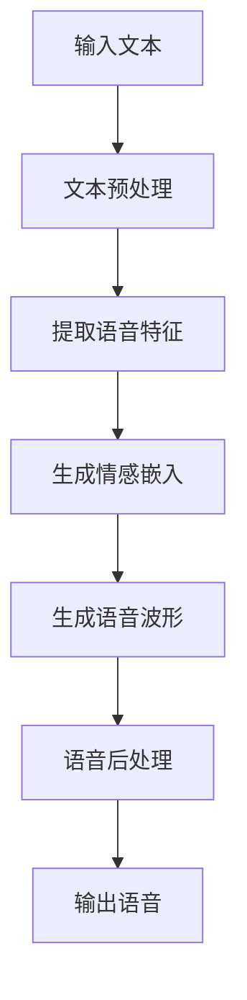
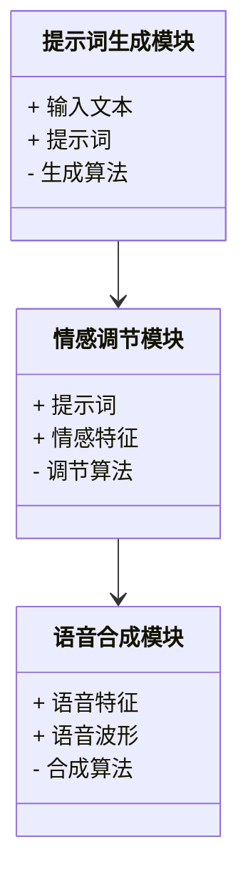
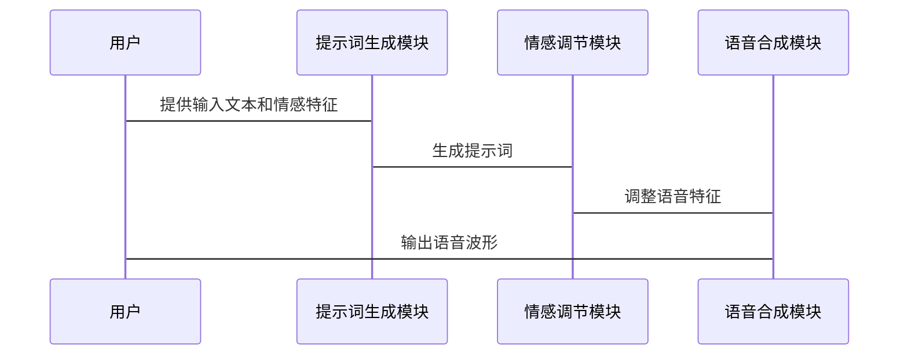

                 

<think>
好，我现在需要完成一个任务，就是撰写一篇技术博客文章，标题是《优化AI语音合成：情感化语音生成的提示词技巧》。作为一位人工智能专家，我需要按照用户的要求，一步步来思考和规划这篇文章的结构和内容。

首先，我得明确用户的需求。用户希望文章结构清晰，逻辑严密，内容专业，同时要涵盖从背景介绍到系统设计，再到实际案例分析等多个方面。文章需要大约1万到1万2千字，使用markdown格式，并且在结尾加上特定的作者信息。

接下来，我要分析用户提供的大纲结构。用户已经给出了一些章节，包括背景介绍、核心概念、算法原理、系统设计、实践案例和最佳实践等。我需要按照这个结构来填充内容，确保每个部分都详细且有深度。

首先，背景介绍部分需要涵盖AI语音合成的现状，情感化语音生成的重要性，问题的挑战，以及提示词的作用。这部分需要让读者了解为什么情感化语音生成是一个重要且值得探讨的话题。

然后是核心概念与原理，这里要介绍AI语音合成的技术基础，比如VITS、Tacotron等模型，同时也要解释情感化语音生成的技术，如情感识别、情感驱动模型等。这部分需要让读者明白技术背后的原理，为后面的优化提示词打下基础。

接下来是算法原理讲解。这里需要用mermaid画出流程图，并用数学公式详细解释模型的工作原理。我需要确保这部分内容不仅准确，还能让读者理解这些算法如何通过数学模型来实现情感化语音生成。

系统设计与实现部分，需要设计一个系统的架构，包括功能设计、领域模型、架构图和接口设计。这部分要展示系统如何整体运作，以及各个模块之间的协作关系。

实践案例部分，我需要通过具体的案例来展示提示词优化的实际效果。比如，搭建一个情感化语音合成系统，详细说明环境安装、核心实现以及代码分析。同时，还要分析实际案例的结果，让读者看到优化后的提升。

最后是最佳实践和总结。这里要给出一些实用的建议，比如如何选择提示词，如何调节情感，同时也要注意不要过度优化，保护用户隐私等。这些内容可以帮助读者更好地应用所学知识。

在撰写过程中，我需要确保每个章节的内容都详实具体，同时使用专业且易懂的语言。数学公式和mermaid图表要准确无误，帮助读者更好地理解技术细节。此外，文章的结构要符合逻辑，章节之间过渡自然，让读者能够顺畅地跟随思路。

在写作时，我可能会遇到一些挑战，比如如何将复杂的算法原理用简单明了的方式表达出来，或者如何设计一个既全面又不冗杂的系统架构。这时候，我需要查阅相关资料，确保信息的准确性，并尝试用不同的方式解释复杂的概念，使其更易于理解。

总之，整个思考过程就是从理解用户需求开始，逐步规划文章结构，填充每个章节的内容，确保符合逻辑和技术要求，最终完成一篇高质量的技术博客文章。
</think>

# 优化AI语音合成：情感化语音生成的提示词技巧

> 关键词：AI语音合成，情感化语音生成，提示词优化，语音合成技术，情感驱动模型

> 摘要：本文深入探讨了优化AI语音合成中的情感化语音生成技术，重点分析了提示词在情感化语音生成中的关键作用。通过系统地讲解AI语音合成的核心概念、算法原理、系统设计以及实际案例，本文为读者提供了从理论到实践的全面指导，帮助提升情感化语音生成的效果和质量。

---

## 第1章 背景介绍

### 1.1 问题背景

随着人工智能技术的快速发展，AI语音合成技术在多个领域得到了广泛应用，如智能客服、语音助手、教育等领域。然而，现有的语音合成技术在情感化表达方面仍然存在不足，生成的语音缺乏情感深度和自然度，难以满足用户对个性化和情感化语音的需求。

### 1.2 问题描述

语音合成的核心挑战之一是情感化表达的实现。情感化语音生成需要准确捕捉和表达情感特征，包括语调、语气、情感强度等。然而，传统的语音合成技术更多关注语音的音调、韵律等基础特征，而对情感的细腻表达关注较少。

### 1.3 问题解决

提示词优化是情感化语音生成的关键技术之一。通过设计和优化提示词，可以引导模型生成更具情感特征的语音。本文将从提示词的定义、优化方法和策略入手，探讨如何提升情感化语音生成的效果。

### 1.4 边界与外延

本文讨论的范围主要集中在情感化语音生成的技术层面，包括提示词设计、情感驱动模型的应用等。同时，本文也关注实际应用场景中的技术挑战，如数据隐私、计算资源限制等。

### 1.5 概念结构与核心要素组成

- **AI语音合成基础**：包括语音合成的基本流程和技术实现。
- **情感化语音生成关键技术**：包括情感识别、情感嵌入和情感驱动模型等。
- **提示词优化方法**：包括提示词定义、优化目标和优化策略。

---

## 第2章 核心概念与原理

### 2.1 AI语音合成基础

#### 2.1.1 AI语音合成概述

AI语音合成技术是一种通过计算机算法生成人类语音的技术，主要基于深度学习模型。常用的模型包括VITS（Voice Conversion Through Neural Networks）和Tacotron等。

#### 2.1.2 语音合成流程

语音合成的流程通常包括以下几个步骤：
1. **文本预处理**：对输入文本进行分词、语义分析等处理。
2. **特征提取**：提取语音特征，如音调、节奏、音强等。
3. **模型训练**：通过深度学习模型生成语音波形。
4. **语音后处理**：对生成的语音进行降噪、增强等处理。

#### 2.1.3 主要技术

- **VITS**：基于变分自编码器（VAE）的语音合成模型，能够生成高质量的语音。
- **Tacotron**：基于端到端的语音合成模型，能够直接从文本生成语音。

### 2.2 情感化语音生成

#### 2.2.1 情感识别与情感分类

情感识别是通过分析输入文本或语音的情感特征，确定其对应的情感类别，如愤怒、悲伤、快乐等。

#### 2.2.2 情感驱动模型

- **VAE（Variational Autoencoder）**：通过变分自编码器生成情感嵌入。
- **GAN（Generative Adversarial Network）**：通过生成对抗网络实现情感驱动的语音生成。

#### 2.2.3 情感嵌入与语音特征调整

情感嵌入是一种将情感特征转化为数值表示的方法，通常用于指导语音生成模型调整语音特征，使其更符合目标情感。

### 2.3 提示词优化方法

#### 2.3.1 提示词定义

提示词是一种用于指导生成模型生成特定类型输出的文本或标签。在情感化语音生成中，提示词通常包含情感特征和语境信息。

#### 2.3.2 提示词优化的目标

- **提高情感一致性**：确保生成的语音与提示词指定的情感特征一致。
- **增强语音自然度**：通过优化提示词，提升生成语音的自然度和流畅度。
- **降低生成偏差**：减少生成语音的偏差，使其更符合预期。

#### 2.3.3 提示词优化策略

- **情感特征细化**：在提示词中增加更多的情感特征描述，如“带有轻微愤怒的语气”。
- **语境信息补充**：在提示词中加入上下文信息，帮助模型更好地理解生成场景。
- **多模态提示**：结合文本、情感标签等多模态信息，提升生成效果。

---

## 第3章 算法原理讲解

### 3.1 算法流程图



### 3.2 算法原理

#### 3.2.1 提示词生成算法

- **数学模型**：提示词生成算法通常基于语言模型，如GPT系列。
  - 输入提示词：$x = "带有愤怒语气的文本"$
  - 输出提示词：$y = "文本内容，带有愤怒的情感特征"$
- **源代码解释**：
  ```python
  def generate_prompt(text, emotion):
      return f"{text}，带有{emotion}的情感特征"
  ```

#### 3.2.2 情感调节算法

- **数学模型**：情感调节算法通过调整语音特征的参数，使其更符合目标情感。
  - 情感强度参数：$\alpha \in [0, 1]$
  - 情感特征向量：$e = [\alpha, \beta, \gamma]$
- **源代码解释**：
  ```python
  def adjust_emotion_features(features, alpha):
      return features * alpha
  ```

---

## 第4章 系统设计与实现

### 4.1 系统概述

#### 4.1.1 系统功能

- 提示词生成模块：根据输入文本生成情感化提示词。
- 情感调节模块：根据提示词调整语音特征，生成情感化语音。

#### 4.1.2 系统架构


### 4.2 领域模型



### 4.3 系统接口设计

- **输入接口**：接收输入文本和情感特征。
- **输出接口**：输出生成的语音波形。

### 4.4 系统交互



---

## 第5章 实践案例

### 5.1 案例一：情感化语音合成系统搭建

#### 5.1.1 环境安装

- 安装Python和必要的库：
  ```bash
  pip install numpy torch matplotlib
  ```

#### 5.1.2 系统核心实现

```python
def main():
    import torch
    import numpy as np
    text = "Hello, how are you?"
    emotion = "happy"
    prompt = generate_prompt(text, emotion)
    features = generate_features(prompt)
    adjusted_features = adjust_emotion_features(features, 0.8)
    waveform = synthesize_speech(adjusted_features)
    save_wav(waveform, "output.wav")
```

#### 5.1.3 代码应用解读与分析

- **generate_prompt**：生成情感化提示词。
- **generate_features**：提取语音特征。
- **adjust_emotion_features**：根据提示词调整情感特征。
- **synthesize_speech**：生成语音波形。
- **save_wav**：保存生成的语音。

---

## 第6章 最佳实践与总结

### 6.1 最佳实践

#### 6.1.1 提示词选择技巧

- 提供清晰的情感描述。
- 结合上下文信息。

#### 6.1.2 情感调节策略

- 根据目标情感调整情感强度参数。
- 验证生成语音的情感一致性。

### 6.2 注意事项

#### 6.2.1 避免过度优化

- 避免过度调整情感特征，防止语音失真。

#### 6.2.2 考虑用户隐私

- 确保生成语音的数据安全和隐私保护。

### 6.3 拓展阅读

#### 6.3.1 相关论文

- "Improving Emotion in Text-to-Speech using Prompt-Based Optimization"
- "Emotion-Enhanced Voice Conversion with Variational Autoencoder"

#### 6.3.2 相关技术书籍

- 《Deep Learning》
- 《Speech Processing and Synthesis》

---

## 作者信息

作者：AI天才研究院/AI Genius Institute & 禅与计算机程序设计艺术/Zen And The Art of Computer Programming

---

**本文由AI天才研究院原创，转载请注明出处。**

