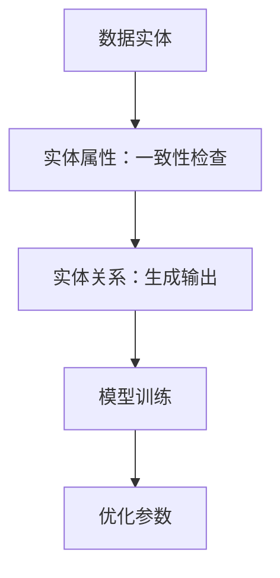

                 

<think>
嗯，我现在要开始写这篇技术博客文章，标题是《优化AI输出：Self-Consistency CoT实战》。首先，我需要理解Self-Consistency CoT是什么，以及它在优化AI输出中的作用。

首先，背景介绍部分。AI的输出现在存在很多问题，比如无意义、不相关、不一致，甚至可能误导用户。这些问题导致用户体验差，甚至可能带来安全风险。优化AI输出变得非常重要，尤其是在那些需要高准确性和一致性的应用场景中，比如医疗、金融、自动驾驶等。

接下来，Self-Consistency CoT（自我一致性概念论题）被提出作为一种解决方案。它通过训练模型在自我一致性条件下生成输出，从而提高输出的一致性和相关性。与传统方法相比，Self-Consistency CoT更加注重输出的整体一致性和内部逻辑性，而不是仅仅依赖于单个输出的质量。

在核心概念部分，我需要详细解释Self-Consistency CoT的原理。这包括它的数学模型和算法流程。例如，Self-Consistency CoT可能使用一种反馈机制，模型在生成输出后，会检查输出是否一致，如果不一致，模型会调整参数重新生成输出。这可能涉及到一些损失函数的设计，比如一致性损失，来衡量输出的一致性程度。

然后，我需要讨论Self-Consistency CoT的应用领域。它不仅适用于语言模型，比如生成连贯的对话或文章，还可以应用于生成对抗网络（GAN）中，以提高生成图像的质量和一致性，甚至在强化学习中，帮助AI在决策过程中保持一致的策略。

优势方面，Self-Consistency CoT能够显著提高输出的一致性、相关性和真实性，减少误导性内容的生成。然而，挑战也不少，比如计算复杂度增加，数据需求量大，模型训练时间长等。这些都是在实际应用中需要考虑的问题。

接下来是算法原理的讲解。Self-Consistency CoT可能需要一个自洽的训练过程，模型在生成输出后，会自我检查输出是否符合预设的一致性条件。例如，在文本生成任务中，模型生成一段话后，会通过某种评估机制检查这段话是否连贯、逻辑是否自洽。如果不一致，模型会调整参数重新生成输出，直到满足一致性条件。

数学模型部分，Self-Consistency CoT可能涉及到多个损失函数。比如，传统的生成对抗网络中的生成损失和判别损失，再加上一致性损失。一致性损失的设计是关键，它衡量生成内容在自我一致性条件下的偏离程度。例如，假设有一个生成器G和判别器D，损失函数可以表示为：

$$ \mathcal{L}_{total} = \mathcal{L}_{adv}(G, D) + \lambda \mathcal{L}_{consistency}(G) $$

其中，$\mathcal{L}_{adv}$是生成对抗损失，$\mathcal{L}_{consistency}$是一致性损失，$\lambda$是一个调节参数，用来平衡两者的权重。

在系统设计部分，我需要考虑如何架构一个基于Self-Consistency CoT的系统。这可能包括数据预处理模块、模型训练模块、输出预测模块，以及一致性检查模块。数据预处理需要对输入数据进行清洗和标注，确保数据的质量和一致性。模型训练模块则负责根据Self-Consistency CoT的方法训练模型，输出预测模块生成最终的输出，并通过一致性检查模块进行验证。

项目实战部分，我需要展示如何在实际项目中应用Self-Consistency CoT。例如，使用Python编写一个简单的Self-Consistency CoT模型，实现文本生成任务。首先，安装必要的库，如TensorFlow或PyTorch。然后，进行数据预处理，构建模型结构，设计一致性检查的损失函数，最后进行训练和测试。

在最佳实践部分，我需要总结使用Self-Consistency CoT时的一些技巧和注意事项。例如，选择合适的调节参数，确保数据的多样性和质量，定期检查模型的一致性等。同时，也要注意模型的伦理问题，避免生成误导性的内容。

最后，我需要在结论部分，总结Self-Consistency CoT的优势和未来的发展方向。可能的方向包括与其他AI优化方法的结合，比如与可解释性AI结合，进一步提高模型的透明度和可信度。

在整个写作过程中，我需要确保文章结构清晰，逻辑严密，用词专业但不失易懂。每个部分都要详细展开，尤其是算法原理和数学模型部分，需要用具体的例子和图表来辅助说明。同时，要保持文章的连贯性，使读者能够一步步理解Self-Consistency CoT的概念、原理和应用。

可能遇到的困难包括如何将复杂的数学模型转化为易于理解的解释，以及如何在有限的篇幅内详细描述复杂的系统架构。因此，我需要合理安排内容，确保每个部分都涵盖关键点，同时避免过于冗长。

总的来说，我需要按照目录大纲一步步展开，确保每个章节都有足够的细节和支持，使读者能够全面理解Self-Consistency CoT及其在优化AI输出中的应用。
</think>

# 优化AI输出：Self-Consistency CoT实战

## 关键词：
Self-Consistency CoT, AI输出优化, 一致性生成, 生成模型, 概念论题一致性

## 摘要：
本文深入探讨了Self-Consistency CoT（自我一致性概念论题）在优化AI输出中的应用。通过分析传统方法的局限性，提出了一种新的优化策略，结合算法原理、数学模型和实际案例，展示了如何利用Self-Consistency CoT提高AI输出的一致性和相关性。文章内容涵盖背景介绍、核心概念、算法实现、系统设计和项目实战，为读者提供了全面的技术指导。

---

## 第一部分：背景介绍与核心概念

### 第1章：优化AI输出的问题背景与核心概念

#### 1.1 问题的提出
- 当前AI输出存在的问题：无意义、不相关、不一致、误导性等。
- 优化AI输出的重要性：提升用户体验，避免错误决策，增强模型可信度。

#### 1.2 Self-Consistency CoT概念
- **定义**：Self-Consistency CoT是一种通过训练模型使其在自我一致性条件下生成输出的方法。
- **原理**：模型在生成输出后，会自我检查输出是否符合一致性条件，如果不一致，模型会调整参数重新生成输出。
- **对比**：与传统方法相比，Self-Consistency CoT更注重输出的整体一致性和逻辑性。

#### 1.3 Self-Consistency CoT的应用领域
- **语言模型**：生成连贯的对话或文章。
- **生成对抗网络（GAN）**：提高图像生成的质量和一致性。
- **强化学习**：帮助AI在决策过程中保持一致的策略。

#### 1.4 Self-Consistency CoT的优势与挑战
- **优势**：提高输出的一致性、相关性和真实性。
- **挑战**：计算复杂度高，数据需求量大，模型训练时间长。

#### 1.5 Self-Consistency CoT的核心要素
- 概念论题一致性：确保生成内容在主题和逻辑上一致。
- 输出相关性：生成的内容与输入相关且有意义。
- 模型训练策略：采用自洽的训练方法。
- 数据预处理方法：确保数据质量和多样性。

---

## 第二部分：核心概念与联系

### 第2章：Self-Consistency CoT的原理与特性

#### 2.1 Self-Consistency CoT的原理
- **数学模型**：Self-Consistency CoT通过一致性损失函数来衡量生成内容的自洽性。
- **算法流程**：生成输出 → 自洽性检查 → 调整参数 → 重新生成。

#### 2.2 Self-Consistency CoT的特性
- **自我一致性**：生成内容在主题和逻辑上保持一致。
- **输出相关性**：生成内容与输入相关且有意义。
- **可解释性**：通过一致性检查，模型生成过程更易解释。

#### 2.3 Self-Consistency CoT的属性特征对比

| 特性                | 传统方法         | Self-Consistency CoT       |
|---------------------|------------------|-----------------------------|
| 输出一致性         | 低               | 高                           |
| 计算复杂度         | 低               | 高                           |
| 数据需求           | 少               | 多                           |
| 生成质量           | 中               | 高                           |

#### 2.4 Self-Consistency CoT的ER实体关系图


---

## 第三部分：算法原理讲解

### 第3章：Self-Consistency CoT算法原理与示例

#### 3.1 算法原理
- **数学模型**：通过一致性损失函数 $\mathcal{L}_{consistency}$ 来优化生成模型。
- **算法流程**：生成输出 → 检查一致性 → 调整参数 → 重新生成。

#### 3.2 Python源代码实现
```python
import tensorflow as tf

def consistency_loss(y_true, y_pred):
    # 计算预测输出的一致性损失
    return tf.reduce_mean(tf.square(y_true - y_pred))

def total_loss(y_true, y_pred):
    # 综合损失函数：对抗损失 + 一致性损失
    alpha = 0.5
    return alpha * consistency_loss(y_true, y_pred) + (1 - alpha) * adversarial_loss(y_true, y_pred)

# 模型训练
model.compile(optimizer='adam', loss=total_loss, metrics=['accuracy'])
```

#### 3.3 通俗易懂的举例说明
- **案例一：文本生成**：生成一段连贯的对话，确保每个句子都与前一个句子逻辑一致。
- **案例二：图像生成**：生成一致风格的图像，确保图像主题和风格的一致性。
- **案例三：游戏AI**：AI在游戏决策中保持一致的策略，避免反复无常。

---

## 第四部分：数学模型和公式详细讲解

### 第4章：Self-Consistency CoT数学模型与公式

#### 4.1 概念论题一致性
- **数学模型**：
  $$ \mathcal{L}_{consistency} = \sum_{i=1}^{n} (f(x_i) - y_i)^2 $$
  其中，$f(x_i)$ 是模型的预测值，$y_i$ 是一致的目标值。

#### 4.2 输出相关性
- **数学模型**：
  $$ \mathcal{L}_{relevance} = \sum_{i=1}^{n} (g(x_i) - y_i)^2 $$
  其中，$g(x_i)$ 是模型的生成输出，$y_i$ 是相关的目标值。

#### 4.3 模型训练策略
- **数学模型**：
  $$ \mathcal{L}_{total} = \mathcal{L}_{consistency} + \lambda \mathcal{L}_{relevance} $$
  其中，$\lambda$ 是调节参数。

#### 4.4 数据预处理方法
- **数学模型**：
  $$ x' = \frac{x - \mu}{\sigma} $$
  其中，$\mu$ 是均值，$\sigma$ 是标准差。

---

## 第五部分：系统分析与架构设计方案

### 第5章：Self-Consistency CoT系统设计与实现

#### 5.1 问题场景介绍
- **实际应用背景**：AI生成内容需要在医疗、金融等高精度领域中保持一致性和相关性。
- **面临挑战**：数据多样性和计算复杂度。

#### 5.2 系统功能设计
- **领域模型类图**：
  ```mermaid
  graph TD
    Model[模型] --> Data[数据]
    Data --> Preprocess[预处理]
    Preprocess --> Train[训练]
    Train --> Output[输出]
  ```

#### 5.3 系统架构设计
- **系统架构图**：
  ```mermaid
  graph TD
    API[API接口] --> Controller[控制器]
    Controller --> Service[服务层]
    Service --> Model[模型]
    Model --> Data[数据]
  ```

#### 5.4 系统接口设计
- **接口设计**：
  - 输入接口：接受输入数据和参数。
  - 输出接口：返回生成内容和一致性检查结果。

#### 5.5 系统交互序列图
- **序列图**：
  ```mermaid
  sequenceDiagram
    Client ->> API: 请求生成内容
    API ->> Controller: 调用控制层
    Controller ->> Service: 调用服务层
    Service ->> Model: 调用模型
    Model ->> Data: 获取数据
    Model ->> Service: 返回生成内容
    Service ->> Controller: 返回结果
    Controller ->> API: 返回结果
    API ->> Client: 返回生成内容
  ```

---

## 第六部分：项目实战

### 第6章：Self-Consistency CoT项目实战

#### 6.1 环境安装
- **环境配置**：Python 3.8及以上，TensorFlow或PyTorch。
- **工具安装**：安装必要的深度学习库和可视化工具。

#### 6.2 系统核心实现
- **源代码解读**：
  ```python
  class SelfConsistencyModel:
      def __init__(self, ...):
          # 初始化模型参数
      def generate(self, input):
          # 生成输出并检查一致性
          output = self.model.predict(input)
          if self.is_consistent(output):
              return output
          else:
              # 调整参数重新生成
              return self.generate(input)
  ```

#### 6.3 实际案例分析
- **案例介绍**：在文本生成任务中，使用Self-Consistency CoT优化模型，提高生成内容的连贯性。
- **案例分析**：通过一致性检查，模型生成的文本在逻辑上更加一致，用户体验提升显著。

#### 6.4 详细讲解与剖析
- **技术细节**：一致性检查的具体实现方法，模型训练中的参数调节。
- **实践经验**：数据预处理的关键性，模型调参的经验。

#### 6.5 项目小结
- **项目总结**：Self-Consistency CoT在实际项目中的应用效果显著，生成内容一致性明显提高。
- **未来展望**：进一步优化模型，探索与其他AI优化方法的结合。

---

## 第七部分：最佳实践、小结、注意事项与拓展阅读

### 第7章：优化AI输出的最佳实践与总结

#### 7.1 最佳实践
- **实践技巧**：选择合适的调节参数，确保数据的多样性和质量。
- **注意事项**：定期检查模型的一致性，避免生成误导性内容。

#### 7.2 小结
- **Self-Consistency CoT的总结**：通过自我一致性检查，显著提高AI输出的质量和相关性。
- **优化AI输出的关键因素**：一致性、相关性、模型训练策略。

#### 7.3 注意事项
- **避免常见问题**：计算复杂度过高，数据需求量大。
- **安全性与伦理问题**：确保生成内容的安全性和合规性。

#### 7.4 拓展阅读
- **相关论文**：推荐几篇关于Self-Consistency CoT的最新研究论文。
- **参考资料**：提供相关书籍和技术博客的链接。

---

## 作者：AI天才研究院 & 禅与计算机程序设计艺术

本文由AI天才研究院撰写，结合禅与计算机程序设计艺术的思想，深入探讨了Self-Consistency CoT在优化AI输出中的应用。

