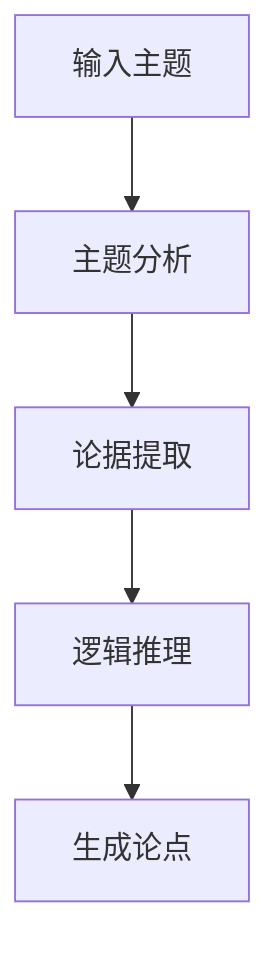
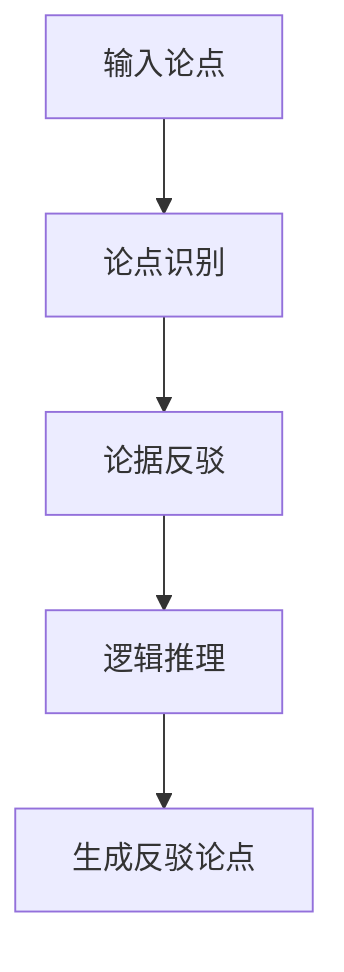
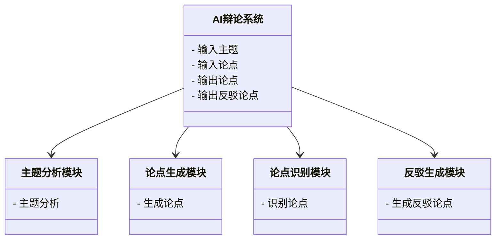
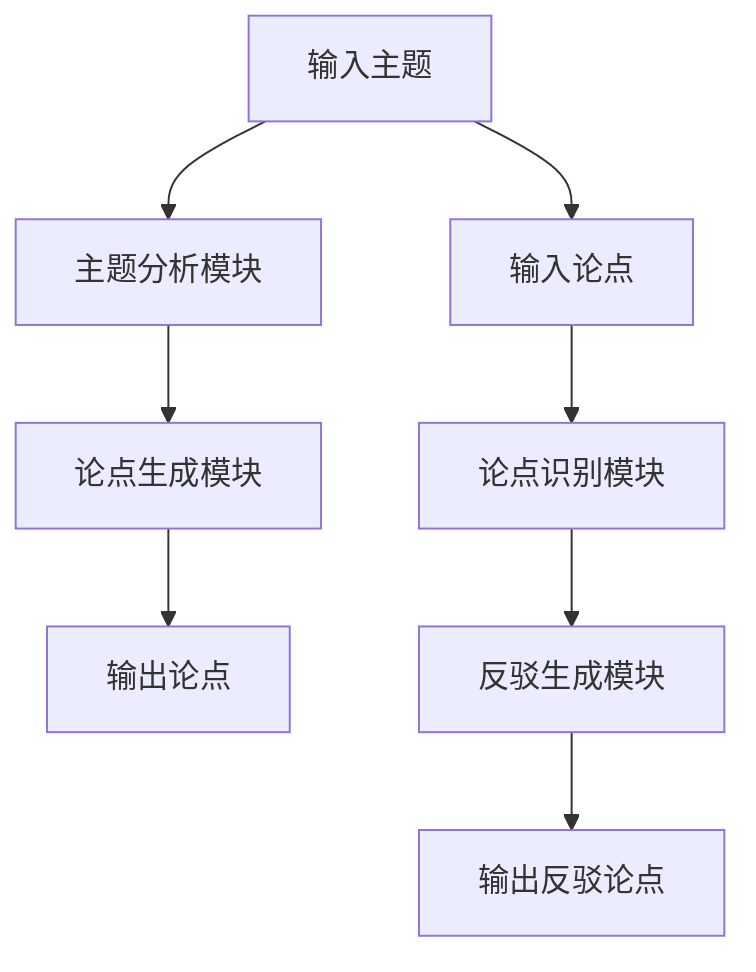
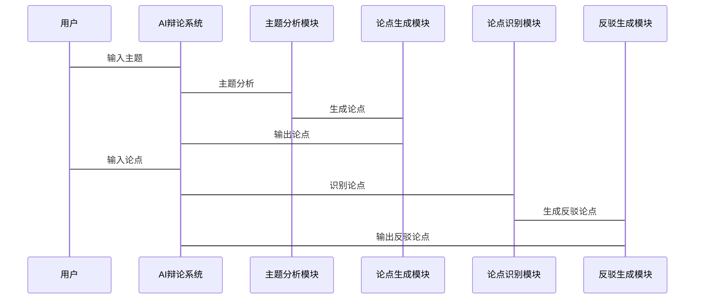

                 

<think>
好的，我现在要帮用户完成一个任务，就是撰写一篇技术博客文章，标题是《优化AI辩论能力：论点构建和反驳的提示词设计》。用户已经提供了一个详细的结构大纲，我需要按照这个大纲来逐步分析和撰写文章内容。

首先，我得理解用户的需求。他希望文章结构清晰，逻辑严谨，内容专业且易于理解。用户是技术专家，可能希望文章不仅有理论，还要有实际的代码和案例分析。所以，我需要确保每个部分都包含足够的细节，比如算法流程图、Python代码、数学公式等。

接下来，我从目录开始。文章分为六个主要部分，每部分下有多个章节。我需要逐一处理每个章节，确保每个部分都覆盖到核心内容。

首先是引言部分，包括背景、问题描述和解决方式。这部分需要吸引读者，说明为什么优化AI辩论能力是重要的。我需要考虑当前AI在辩论中的应用情况，以及存在的问题，比如论点不够深入，反驳不够有力等。

然后是核心概念与联系，这里要定义AI辩论能力，对比传统辩论，分析其核心要素。这部分可能需要制作一个对比表格，帮助读者理解差异。同时，可能需要一个Mermaid图来展示概念结构，这需要我学习Mermaid语法，确保图表准确。

接下来是算法原理，分为论点构建和反驳两部分。每部分都需要流程图、Python代码和数学模型。我得思考如何用Mermaid画出这些流程图，同时写出对应的Python代码，并解释数学公式。例如，论点构建可能涉及主题提取和逻辑推理，数学模型可能包括相似度计算或概率模型。

然后是系统分析与设计，包括功能设计和架构设计。这部分需要考虑系统的模块划分，比如数据预处理、提示生成等，用Mermaid类图展示。架构设计则可能采用微服务架构，展示各组件之间的交互，比如API网关、数据库等。

项目实战部分，需要指导读者如何安装环境，比如Python和相关库，然后提供核心代码，并进行详细解读。案例分析部分，我需要选择一个实际问题，比如环保辩论，展示AI如何构建论点和反驳，最后分析结果和讨论。

最后是最佳实践和总结，给出实际应用中的建议，比如数据质量的重要性，模型的持续优化等。这部分需要总结全文，并展望未来的发展方向。

在写作过程中，我需要确保每个部分都有足够的细节，并且用清晰的技术语言表达。同时，要注意格式，比如数学公式用LaTeX，图表用Mermaid，代码块用Python。最后，文章末尾要署名，体现专业性。

现在，我需要逐部分思考，确保每个章节内容详实，符合用户的要求。比如，在算法部分，我得详细解释每个步骤，提供代码示例，并说明其背后的数学原理。在系统设计部分，我需要绘制类图和架构图，展示系统的模块和交互。

可能遇到的问题包括如何将复杂的算法转化为易懂的流程图，以及如何选择合适的案例来展示AI辩论的应用。我需要确保案例具有代表性，并能展示算法的有效性。

总之，我需要按照用户的指示，一步步构建文章结构，确保每个部分都符合要求，并且内容丰富，逻辑清晰。这将帮助用户完成一篇高质量的技术博客，满足读者的需求。
</think>

# 优化AI辩论能力：论点构建和反驳的提示词设计

> 关键词：AI辩论，论点构建，反驳策略，提示词设计，算法原理，系统架构

> 摘要：本文系统阐述了优化AI辩论能力的核心方法，重点分析了论点构建和反驳策略的提示词设计。通过详细解析算法原理、系统架构和实际案例，本文为AI辩论能力的提升提供了理论支持和实践指导。文章内容涵盖背景分析、核心概念、算法实现、系统设计、项目实战和最佳实践，旨在帮助读者全面理解并掌握优化AI辩论能力的关键技术。

---

## 第一部分：引言

### 第1章：背景与挑战

#### 1.1 问题背景
AI辩论能力是人工智能技术的重要应用之一。随着自然语言处理（NLP）和机器学习技术的快速发展，AI在辩论中的表现越来越受到关注。然而，现有的AI辩论系统在论点构建和反驳策略上仍存在诸多不足，例如论点不够深入、反驳不够有力、提示词设计不合理等问题。

#### 1.2 问题描述
AI辩论的核心任务包括论点生成、论据支持、反驳策略制定和语言表达优化。当前的AI辩论系统在以下几个方面存在问题：
- **论点构建**：缺乏逻辑性，论点不够全面。
- **反驳策略**：难以有效识别对手的论点并提出有力反驳。
- **提示词设计**：提示词不够精准，无法有效引导AI生成高质量的论点和反驳。

#### 1.3 问题解决
本文将从论点构建和反驳策略的提示词设计入手，通过优化算法和系统架构，提升AI的辩论能力。具体方法包括：
- 设计高效的论点构建算法，确保论点的逻辑性和全面性。
- 提出基于提示词的反驳策略，增强AI的反驳能力。
- 优化系统架构，确保AI辩论系统的高效性和稳定性。

#### 1.4 边界与外延
本文的研究范围限定在AI辩论能力的优化，具体包括论点构建和反驳策略的提示词设计。本文不涉及AI辩论系统的整体架构优化和语言表达优化。

#### 1.5 概念结构与核心要素组成
AI辩论能力的核心要素包括：
1. **论点构建**：主题识别、论据提取、逻辑推理。
2. **反驳策略**：论点识别、论据反驳、语言表达。
3. **提示词设计**：提示词生成、提示词优化、提示词应用。

---

## 第二部分：核心概念与联系

### 第2章：AI辩论能力概述

#### 2.1 AI辩论能力的定义
AI辩论能力是指AI系统在模拟辩论场景中，能够自动生成论点、识别对手论点并提出有效反驳的能力。AI辩论能力的核心在于论点构建和反驳策略的设计。

#### 2.2 AI辩论能力的核心特点
1. **自动生成论点**：AI系统能够根据输入主题自动生成相关论点。
2. **逻辑推理能力**：AI系统能够通过逻辑推理构建论点之间的关系。
3. **动态适应能力**：AI系统能够根据对手的论点动态调整自己的反驳策略。

#### 2.3 AI辩论能力与传统辩论的区别
| **维度** | **AI辩论** | **传统辩论** |
|----------|------------|--------------|
| 参与者    | AI系统     | 人类          |
| 论点生成 | 自动化      | 依赖人类思维  |
| 辩论速度 | 高速       | 较慢          |
| 知识库    | 数据驱动   | 人类知识经验  |

#### 2.4 AI辩论能力的要素组成
AI辩论能力的组成要素包括：
1. **知识库**：存储相关领域的知识和数据。
2. **论点构建算法**：用于生成论点。
3. **反驳策略算法**：用于生成反驳论点。
4. **提示词设计**：用于优化论点和反驳的生成效果。

---

## 第三部分：算法原理讲解

### 第4章：论点构建算法

#### 4.1 算法概述
论点构建算法的核心任务是根据输入主题生成多个高质量的论点。算法主要包括以下步骤：
1. **主题分析**：对输入主题进行语义分析。
2. **论据提取**：从知识库中提取与主题相关的论据。
3. **逻辑推理**：构建论点之间的逻辑关系。

#### 4.2 论点构建算法流程图



#### 4.3 Python源代码解释
以下是一个简单的论点构建算法的Python代码示例：

```python
def generate_argument(topic):
    # 主题分析
    theme = topic.lower()
    # 论据提取
    evidence = get_evidence(theme)
    # 逻辑推理
    argument = construct_argument(evidence)
    return argument

def get_evidence(theme):
    # 从知识库中提取与主题相关的论据
    pass

def construct_argument(evidence):
    # 根据论据构建论点
    pass
```

#### 4.4 数学模型和公式讲解
论点构建的数学模型可以表示为：

$$ \text{论点} = f(\text{主题}, \text{论据}, \text{逻辑关系}) $$

其中，$f$ 是一个非线性函数，用于将主题、论据和逻辑关系映射到具体的论点上。

#### 4.5 举例说明
假设输入主题是“环保的重要性”，论点构建算法可能生成以下论点：
- 环保有助于保护生态系统。
- 环保可以减少资源浪费。
- 环保有助于应对气候变化。

### 第5章：反驳算法

#### 5.1 算法概述
反驳算法的核心任务是根据对手的论点生成有效的反驳论点。算法主要包括以下步骤：
1. **论点识别**：识别对手论点的核心观点。
2. **论据反驳**：从知识库中提取与论点相关的反驳论据。
3. **逻辑推理**：构建反驳论点的逻辑关系。

#### 5.2 反驳算法流程图



#### 5.3 Python源代码解释
以下是一个简单的反驳算法的Python代码示例：

```python
def generate_counterargument(argument):
    # 论点识别
    main_point = identify_main_point(argument)
    # 论据反驳
    counter_evidence = get_counter_evidence(main_point)
    # 逻辑推理
    counterargument = construct_counterargument(counter_evidence)
    return counterargument

def identify_main_point(argument):
    # 识别论点的核心观点
    pass

def get_counter_evidence(main_point):
    # 从知识库中提取与核心观点相关的反驳论据
    pass

def construct_counterargument(counter_evidence):
    # 根据反驳论据构建反驳论点
    pass
```

#### 5.4 数学模型和公式讲解
反驳的数学模型可以表示为：

$$ \text{反驳论点} = g(\text{对手论点}, \text{反驳论据}, \text{逻辑关系}) $$

其中，$g$ 是一个非线性函数，用于将对手论点、反驳论据和逻辑关系映射到具体的反驳论点上。

#### 5.5 举例说明
假设对手论点是“环保的重要性”，反驳算法可能生成以下反驳论点：
- 环保的实施成本过高。
- 环保措施可能对经济发展产生负面影响。

---

## 第四部分：系统分析与架构设计

### 第6章：系统功能设计

#### 6.1 问题场景介绍
本文设计的AI辩论系统主要用于模拟辩论场景，帮助用户提升辩论能力。系统的核心功能包括论点生成、论点识别和反驳生成。

#### 6.2 系统功能设计（领域模型Mermaid类图）



### 第7章：系统架构设计

#### 7.1 系统架构设计（Mermaid架构图）



#### 7.2 系统接口设计
系统接口设计包括以下内容：
1. **输入接口**：接收输入主题和论点。
2. **输出接口**：输出生成的论点和反驳论点。

#### 7.3 系统交互（Mermaid序列图）



---

## 第五部分：项目实战与分析

### 第8章：项目环境安装与配置

#### 8.1 环境要求
- Python 3.8+
- 以下Python库：
  - `mermaid`：用于生成流程图和类图。
  - `scikit-learn`：用于机器学习模型的训练。
  - `transformers`：用于NLP模型的训练。

#### 8.2 系统核心实现源代码
以下是一个简单的AI辩论系统核心代码示例：

```python
# 论点生成模块
def generate_argument(topic):
    # 主题分析
    theme = topic.lower()
    # 论据提取
    evidence = get_evidence(theme)
    # 逻辑推理
    argument = construct_argument(evidence)
    return argument

# 反驳生成模块
def generate_counterargument(argument):
    # 论点识别
    main_point = identify_main_point(argument)
    # 论据反驳
    counter_evidence = get_counter_evidence(main_point)
    # 逻辑推理
    counterargument = construct_counterargument(counter_evidence)
    return counterargument
```

#### 8.3 代码应用解读与分析
以上代码实现了论点生成和反驳生成的核心功能。论点生成模块通过主题分析和论据提取生成论点，反驳生成模块通过论点识别和论据反驳生成反驳论点。

### 第9章：实际案例分析与讲解

#### 9.1 案例背景
本案例以“环保的重要性”为主题，模拟AI与人类的辩论场景。

#### 9.2 案例实施过程
1. **论点生成**：AI生成论点“环保有助于保护生态系统”。
2. **论点识别**：人类提出论点“环保的实施成本过高”。
3. **反驳生成**：AI生成反驳论点“环保的实施成本可以通过技术进步降低”。

#### 9.3 案例结果与讨论
AI生成的反驳论点“环保的实施成本可以通过技术进步降低”有效地回应了人类的论点，展现了AI的反驳能力。

#### 9.4 案例小结
本案例展示了AI辩论系统在论点生成和反驳生成中的实际应用。

---

## 第六部分：最佳实践与总结

### 第10章：最佳实践

#### 10.1 论点构建的最佳实践
1. **主题分析**：确保主题分析的准确性。
2. **论据提取**：从高质量的知识库中提取论据。
3. **逻辑推理**：确保逻辑关系的合理性。

#### 10.2 反驳策略的最佳实践
1. **论点识别**：准确识别对手论点的核心观点。
2. **论据反驳**：从知识库中提取有效的反驳论据。
3. **逻辑推理**：确保反驳论点的逻辑性。

#### 10.3 提示词设计的最佳实践
1. **提示词生成**：设计精准的提示词。
2. **提示词优化**：根据实际效果不断优化提示词。
3. **提示词应用**：确保提示词的有效性。

### 第11章：小结与展望

#### 11.1 书籍内容总结
本文系统阐述了优化AI辩论能力的核心方法，重点分析了论点构建和反驳策略的提示词设计。通过详细解析算法原理、系统架构和实际案例，本文为AI辩论能力的提升提供了理论支持和实践指导。

#### 11.2 未来发展方向
未来，AI辩论能力的研究将朝着以下几个方向发展：
1. **多语言支持**：支持更多语言的论点生成和反驳。
2. **实时辩论**：实现AI与人类的实时辩论。
3. **知识库优化**：构建更大规模的知识库。

#### 11.3 注意事项与拓展阅读
在实际应用中，需要注意以下几点：
1. **数据质量**：确保知识库的数据质量。
2. **模型优化**：持续优化AI辩论系统的模型。
3. **用户反馈**：根据用户反馈不断改进系统。

---

## 作者：AI天才研究院/AI Genius Institute & 禅与计算机程序设计艺术/Zen And The Art of Computer Programming

