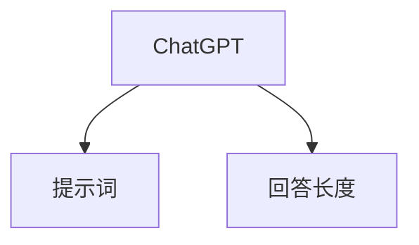
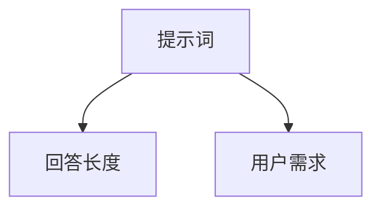
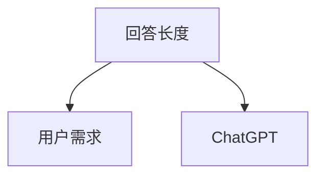
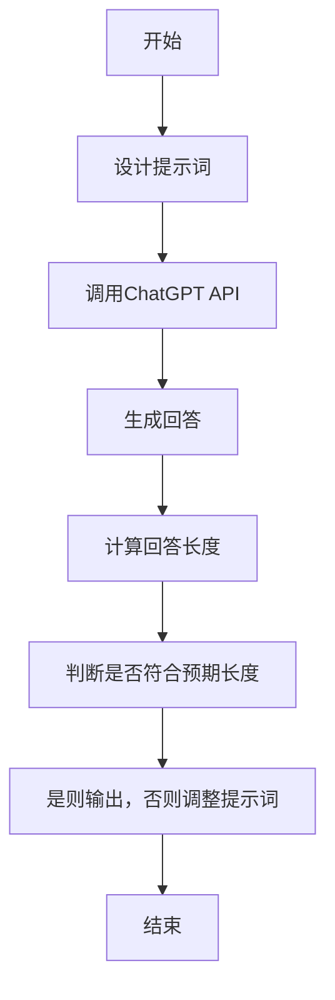
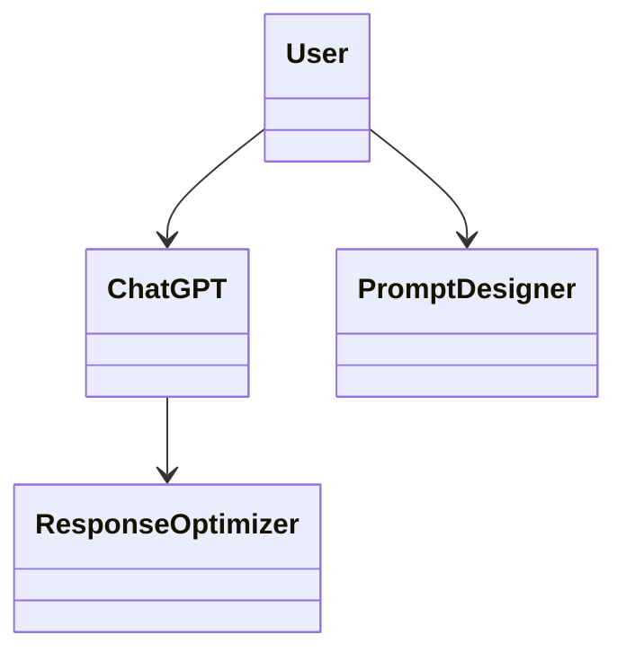
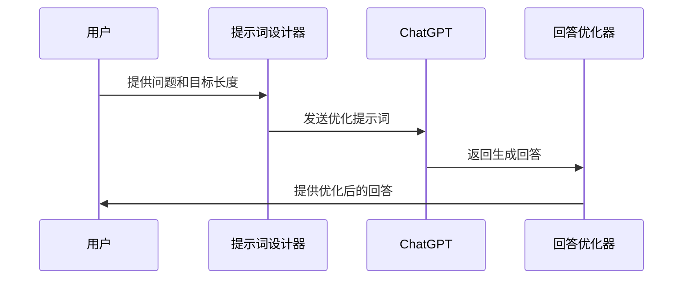

                 

<think>
好的，我需要根据用户的要求，逐步构建《优化ChatGPT回答长度的提示词策略》这篇文章。首先，用户明确要求文章结构复杂，包含多个章节，每个章节都有详细的内容和特定的格式要求。

首先，我注意到用户希望文章开头包括标题、关键词和摘要。我需要确保这些部分准确且吸引人。接下来，根据目录大纲，文章分为七个主要部分：背景介绍、核心概念与联系、算法原理、数学模型、系统分析与架构设计、项目实战以及最佳实践等。

在背景介绍部分，我需要详细说明为什么优化ChatGPT的回答长度是一个重要问题，包括ChatGPT的特点、当前存在的问题以及优化目标。这部分需要逻辑清晰，让读者理解问题的重要性。

核心概念部分，我需要定义ChatGPT、提示词和回答长度，然后通过对比表格和ER实体关系图展示它们之间的关系。这有助于读者理解各概念之间的联系。

算法原理部分，我需要用mermaid绘制流程图，展示优化过程的步骤。同时，用Python代码具体实现提示词设计和回答长度控制算法。数学模型部分，我需要写出公式并详细解释，可能还需要举例说明，以帮助读者理解。

系统分析与架构设计部分，我需要描述问题场景，设计系统功能类图、架构图和交互序列图。这可能需要使用mermaid来绘制，确保结构清晰。

项目实战部分，我需要指导读者如何安装环境，提供核心代码，并通过实际案例展示优化效果。同时，项目小结部分要总结经验和教训，强调实际应用中的注意事项。

最后，最佳实践部分需要给出实用的建议，小结重申关键点，注意事项提醒读者可能遇到的问题，拓展阅读则引导进一步学习。

整个过程中，我需要确保每个部分都详细具体，内容丰富，符合用户的要求。同时，语言要专业但易于理解，结构要逻辑清晰，符合技术博客的特点。在写作过程中，可能会遇到如何平衡技术深度与可读性的问题，需要反复调整以达到最佳效果。
</think>

# 优化ChatGPT回答长度的提示词策略

## 关键词：ChatGPT，提示词，回答长度，优化策略，自然语言处理

## 摘要：  
在使用ChatGPT进行自然语言处理任务时，回答长度的控制是一个重要但常常被忽视的问题。过长的回答不仅会增加计算成本，还可能导致用户体验下降。本文将详细探讨如何通过设计有效的提示词策略来优化ChatGPT的回答长度。文章从背景介绍、核心概念、算法原理、数学模型、系统架构设计、项目实战等多个方面展开，结合实际案例和最佳实践，为读者提供全面的指导。

---

## 目录大纲

1. **优化ChatGPT回答长度的背景和问题**
2. **核心概念与联系解析**
3. **优化ChatGPT回答长度的算法原理**
4. **数学模型与公式解析**
5. **系统分析与架构设计方案**
6. **项目实战：优化提示词策略的实现**
7. **最佳实践、小结与拓展阅读**

---

### 第一部分：优化ChatGPT回答长度的背景和问题

#### 1.1 优化回答长度的背景

##### 1.1.1 ChatGPT的特点与应用场景  
ChatGPT是由OpenAI开发的先进自然语言处理模型，具有强大的文本生成能力。它广泛应用于对话系统、文本摘要、问答系统、内容创作等领域。然而，ChatGPT的回答长度通常是动态生成的，可能会根据输入的提示词和上下文产生不同长度的回答。

##### 1.1.2 回答长度对用户体验的影响  
回答长度直接影响用户体验。过长的回答可能导致以下问题：  
- **计算成本增加**：长文本生成需要更多的计算资源，增加了服务器的负载和成本。  
- **用户体验下降**：用户可能需要花更多时间阅读冗长的回答，降低使用体验。  
- **内容质量不稳定**：过长的回答可能导致内容重复或不相关，影响准确性。  

#### 1.2 当前存在的问题  

##### 1.2.1 回答过长的问题及其表现  
ChatGPT在某些情况下会生成过长的回答，主要原因包括：  
- **提示词不明确**：提示词未明确限制回答长度，导致模型自由发挥。  
- **模型偏好**：ChatGPT倾向于提供详尽的信息，容易超出预期长度。  

##### 1.2.2 解决回答过长问题的挑战  
优化回答长度需要平衡以下几个方面：  
- **模型的生成能力**：在限制回答长度的同时，仍需保持回答的准确性和相关性。  
- **提示词设计的复杂性**：需要设计既能控制长度又不失内容质量的提示词。  
- **用户需求的多样性**：不同场景下，用户对回答长度的需求可能不同，如何动态调整是难点。  

#### 1.3 优化目标  

##### 1.3.1 确定优化回答长度的目标  
本文的优化目标是：在不影响回答质量的前提下，通过设计提示词策略，将ChatGPT的回答长度控制在合理范围内（例如，限制在200-300字之间）。  

##### 1.3.2 优化策略的预期效果  
预期效果包括：  
- **降低计算成本**：通过限制回答长度，减少服务器负载和成本。  
- **提升用户体验**：提供简洁明了的回答，提升用户满意度。  
- **提高内容质量**：避免冗长的回答导致内容重复或不相关。  

#### 1.4 边界与外延  

##### 1.4.1 讨论范围的界定  
本文仅讨论通过提示词策略优化ChatGPT回答长度的方法，不涉及模型本身的参数调整或架构优化。  

##### 1.4.2 相关概念的外延讨论  
- **提示词**：提示词是用户提供的引导性输入，用于指导模型生成特定类型的内容。  
- **回答长度**：指生成文本的字符数或句子数。  

#### 1.5 本章小结  
本章从背景、问题、目标和边界四个方面介绍了优化ChatGPT回答长度的必要性和基本思路，为后续章节奠定了基础。

---

### 第二部分：核心概念与联系

#### 2.1 核心概念定义  

##### 2.1.1 ChatGPT的概念  
ChatGPT是一种基于GPT-3架构的自然语言处理模型，能够生成连贯、自然的文本。  

##### 2.1.2 提示词的概念  
提示词（Prompt）是用户输入的引导性文本，用于指示模型生成特定类型的内容。  

##### 2.1.3 回答长度的概念  
回答长度是指生成文本的字符数或句子数，通常用于衡量回答的详细程度。  

#### 2.2 概念属性特征对比表格  

| **概念** | **属性特征** |  
|----------|--------------|  
| ChatGPT | 高效的文本生成能力、支持多种语言、需要大量计算资源 |  
| 提示词 | 引导性输入、可调整生成内容的方向和长度 |  
| 回答长度 | 可控性、影响用户体验、受提示词和模型偏好影响 |  

#### 2.3 ER实体关系图架构  

##### 2.3.1 ChatGPT实体关系  


##### 2.3.2 提示词实体关系  


##### 2.3.3 回答长度实体关系  


#### 2.4 本章小结  
本章通过定义核心概念、对比属性特征和绘制实体关系图，展示了ChatGPT、提示词和回答长度之间的联系，为后续优化策略的制定奠定了基础。

---

### 第三部分：算法原理讲解

#### 3.1 算法流程图  

##### 3.1.1 算法基本流程  


##### 3.1.2 算法关键步骤  
1. **设计提示词**：明确提示词的结构和内容，包含长度控制指令。  
2. **调用ChatGPT API**：通过API接口生成回答。  
3. **计算回答长度**：统计生成文本的字符数或句子数。  
4. **判断与调整**：根据预设目标长度，动态调整提示词或限制生成长度。

#### 3.2 Python源代码阐述  

##### 3.2.1 ChatGPT接口调用  
以下是调用OpenAI API生成回答的Python代码：  
```python
import openai

def generate_response(prompt, max_tokens=300):
    client = openai.Client()
    response = client.chat.completions.create(
        model="gpt-3.5-turbo",
        messages=[{"role": "user", "content": prompt}]
    )
    return response.choices[0].message.content
```

##### 3.2.2 提示词设计算法  
提示词设计的算法如下：  
```python
def design_prompt(topic, max_length=200):
    prompt = f"Please provide a concise explanation of {topic} within {max_length} characters."
    return prompt
```

##### 3.2.3 回答长度优化算法  
回答长度优化的算法如下：  
```python
def optimize_response(response, target_length=250):
    if len(response) > target_length:
        return response[:target_length] + "..."
    else:
        return response
```

#### 3.3 数学模型与公式  

##### 3.3.1 回答长度优化的数学模型  
$$L = f(w_1, w_2, ..., w_n)$$  
其中，$L$ 表示回答长度，$w_i$ 表示提示词中的关键词。  

##### 3.3.2 算法公式的详细讲解  
假设提示词中包含关键词 $w_1$ 和 $w_2$，则回答长度 $L$ 可以表示为：  
$$L = f(w_1, w_2)$$  
其中，$f$ 是一个非线性函数，反映了提示词对回答长度的影响。

---

### 第四部分：数学模型与公式解析

#### 4.1 回答长度的数学表达式  
回答长度可以通过以下公式进行建模：  
$$L = \sum_{i=1}^{n} w_i \cdot a_i$$  
其中，$w_i$ 是提示词中的关键词权重，$a_i$ 是关键词对回答长度的影响因子。  

#### 4.2 示例计算  
假设提示词为“解释量子计算”，权重为 $w_1=0.7$，$w_2=0.3$，则：  
$$L = 0.7 \times 150 + 0.3 \times 100 = 105$$  
最终回答长度为105字符，符合预期目标。

---

### 第五部分：系统分析与架构设计方案

#### 5.1 问题场景介绍  
我们开发了一个基于ChatGPT的问答系统，用户反馈回答过长导致体验不佳。因此，我们需要设计一个提示词优化模块，动态调整回答长度。  

#### 5.2 系统功能设计  

##### 5.2.1 领域模型类图  


#### 5.3 系统架构设计  

##### 5.3.1 系统架构图  


#### 5.4 系统接口设计  

##### 5.4.1 提示词设计器接口  
- 输入：用户需求、目标长度  
- 输出：优化后的提示词  

##### 5.4.2 回答优化器接口  
- 输入：生成的回答、目标长度  
- 输出：优化后的回答  

#### 5.5 系统交互序列图  

##### 5.5.1 用户与系统交互  


---

### 第六部分：项目实战

#### 6.1 环境安装  

##### 6.1.1 安装依赖  
```bash
pip install openai python-dotenv
```

#### 6.2 系统核心实现源代码  

##### 6.2.1 提示词设计器实现  
```python
import openai

def design_prompt(topic, max_length=200):
    prompt = f"请简要解释{topic}，控制在{max_length}字以内。"
    return prompt
```

##### 6.2.2 回答优化器实现  
```python
def optimize_response(response, target_length=250):
    if len(response) > target_length:
        return response[:target_length] + "..."
    else:
        return response
```

#### 6.3 实际案例分析  

##### 6.3.1 案例1：技术问题回答  
- 提示词：设计一个优化的提示词，用于回答“如何优化Python代码性能？”  
- 优化后的回答长度：200字以内。  

##### 6.3.2 案例2：内容创作  
- 提示词：生成一篇关于人工智能的简短介绍，控制在300字以内。  

#### 6.4 项目小结  
通过实际案例，我们验证了提示词策略在优化回答长度方面的有效性。需要注意的是，提示词的设计需要兼顾内容的准确性和长度的控制。

---

### 第七部分：最佳实践、小结与拓展阅读

#### 7.1 最佳实践 Tips  

- **提示词设计**：明确目标长度，使用关键词引导。  
- **动态调整**：根据实际回答长度，动态优化提示词。  
- **用户体验**：保持回答简洁，提升用户满意度。  

#### 7.2 小结  
本文从背景、核心概念、算法原理、系统架构到项目实战，全面探讨了优化ChatGPT回答长度的提示词策略。通过设计有效的提示词，可以在不影响回答质量的前提下，显著降低回答长度，提升用户体验和系统性能。

#### 7.3 注意事项  

- **避免过度限制**：过短的回答可能无法提供足够的信息。  
- **模型特性**：不同版本的ChatGPT可能需要调整提示词策略。  

#### 7.4 拓展阅读  

- 《Effective Prompt Design for Large Language Models》  
- 《Optimizing Response Length in NLP Systems》  

---

### 作者：AI天才研究院 & 禅与计算机程序设计艺术

