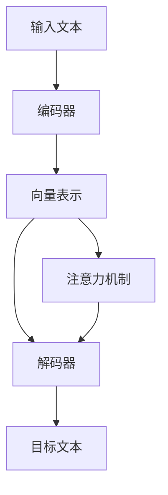
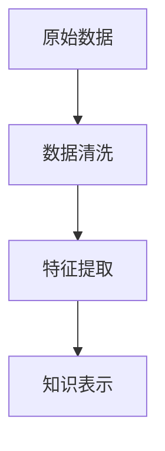
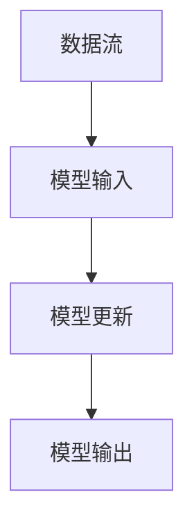
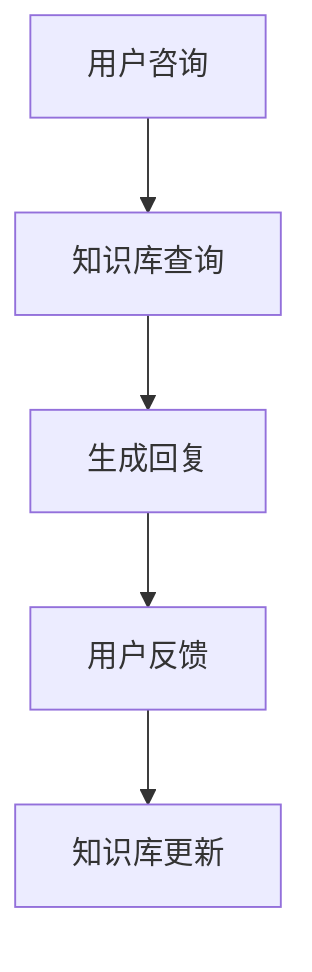

                 

<think>
嗯，用户希望我以“优化LLM应用的知识更新与维护流程”为标题，写一篇技术博客文章。他给了我一个详细的结构大纲，我需要按照这个结构来展开。

首先，我需要理解用户的需求。他可能是一位技术专家，或者是正在研究大语言模型的开发人员，想了解如何优化知识更新和维护流程。他需要一篇结构清晰、内容详实的专业文章，大约1万到1.2万字。

用户已经提供了一个大纲，包括引言、核心概念、更新技术、维护策略、案例研究、最佳实践和结论。我需要按照这个结构来填充内容，确保每个部分都有足够的细节。

接下来，我应该先写文章的开头，包括关键词和摘要。关键词要选5-7个，比如大语言模型、知识更新、维护流程、优化策略、案例研究。摘要部分需要简明扼要地概述文章的核心内容，强调优化知识更新的重要性，以及通过分阶段方法提升模型性能和用户体验。

然后是各个章节的内容。第一章介绍优化LLM应用的重要性，需要涵盖问题背景、核心概念和术语，以及知识更新和维护的作用。这部分需要详细说明问题，比如数据漂移和模型退化，以及它们的影响。

第二章是核心概念与原理，我需要解释什么是LLM，其架构，以及相关的核心概念。可能需要使用图表来帮助读者理解，比如用Mermaid绘制模型架构图。

第三章关于知识更新技术，我需要讨论数据收集、预处理、知识抽取和表示，以及知识的摄入和整合。这里可能需要详细的技术细节，比如迁移学习和主动学习的方法，并用代码示例来说明。

第四章是维护策略，包括持续学习、监控评估和定期维护。需要讨论不同的方法，比如微调和强化学习，并提供实现代码和案例分析。

第五章是案例研究，展示实际应用中的知识更新过程，比如在客服系统中的应用。需要详细描述整个流程，包括数据准备、模型训练和结果分析。

第六章总结最佳实践，包括工具选择、监控指标、模型迭代和用户反馈。这部分需要提供实用的建议和注意事项，帮助读者更好地实施这些策略。

最后，结论部分需要回顾文章的主要内容，并展望未来的研究方向，比如自动化更新和多模态模型的结合。

在写作过程中，我需要确保每个部分都符合用户的要求：使用Markdown格式，包含图表和代码示例，公式用Latex表示，结构紧凑且逻辑清晰。同时，文章需要详细具体，确保读者能够理解并应用这些优化策略。

可能遇到的困难包括如何将复杂的概念用简单易懂的语言表达出来，以及如何将理论与实际案例相结合。我需要仔细思考每个部分的内容，确保覆盖所有必要的知识点，并且例子生动具体。

总之，我需要按照用户提供的大纲，逐步展开每个章节的内容，确保文章结构完整，内容丰富，满足专业读者的需求。
</think>

# 优化LLM应用的知识更新与维护流程

## 关键词：大语言模型、知识更新、维护流程、优化策略、案例研究

## 摘要

随着大语言模型（Large Language Models, LLMs）的广泛应用，知识更新与维护成为了确保模型性能和用户体验的关键挑战。本文系统地探讨了如何优化LLM应用的知识更新与维护流程，从核心概念到具体技术实现，从理论分析到实际案例，为读者提供全面的指导。通过分阶段的方法，我们不仅能够提升模型的知识更新效率，还能降低维护成本，最终实现更智能、更可靠的LLM应用。

---

## 第一章 引言

### 1.1 问题背景

大语言模型的崛起带来了前所未有的机遇，但同时也带来了新的挑战。随着数据的变化和用户需求的多样化，LLM模型的知识库可能会逐渐“老化”，导致模型输出的质量下降。这种现象被称为**数据漂移（data drift）**或**模型退化（model degradation）**。如何有效地更新和维护LLM的知识库，成为了一个亟待解决的问题。

### 1.2 核心概念与术语

- **大语言模型（LLM）**：基于大规模神经网络的自然语言处理模型，具有强大的语言理解和生成能力。
- **知识更新**：通过新增数据或调整模型参数，保持模型对最新知识的掌握。
- **维护流程**：包括数据更新、模型调优、性能监控等一系列操作，以确保模型的稳定性和可靠性。

### 1.3 问题解决

通过优化知识更新与维护流程，我们可以显著提升LLM的性能和用户体验。本文将从以下几个方面展开：

1. **知识更新技术**：包括数据收集、预处理、模型微调等方法。
2. **维护策略**：通过监控和评估模型性能，制定定期维护计划。
3. **案例研究**：通过实际案例分析，展示知识更新与维护的具体实现。

---

## 第二章 核心概念与原理

### 2.1 大语言模型的架构

LLM的典型架构包括以下几个部分：

1. **编码器（Encoder）**：将输入文本转换为向量表示。
2. **解码器（Decoder）**：根据编码器的输出生成目标文本。
3. **注意力机制（Attention）**：用于捕捉文本中的长距离依赖关系。

### 2.2 核心概念与联系

以下是核心概念之间的关系图（使用Mermaid）：

### 2.3 知识更新的核心原理

知识更新的本质是通过引入新数据，优化模型的参数分布，使其能够适应新的语义环境。以下是两种主要的知识更新方法：

1. **微调（Fine-tuning）**：在预训练模型的基础上，使用新数据进行小规模训练。
2. **迁移学习（Transfer Learning）**：通过适配新任务，提升模型的泛化能力。

### 2.4 数学模型与公式

以下是一个简单的微调过程示例：

$$
L = \frac{1}{N}\sum_{i=1}^{N} \text{Loss}(x_i, y_i)
$$

其中，$x_i$表示输入文本，$y_i$表示目标输出，$N$表示训练样本的数量。

---

## 第三章 知识更新技术

### 3.1 数据收集与预处理

数据收集是知识更新的第一步，主要包括以下步骤：

1. **数据源选择**：从可靠的来源获取新数据。
2. **数据清洗**：去除噪声数据，确保数据质量。
3. **数据格式化**：将数据转换为模型可接受的格式。

### 3.2 知识抽取与表示

知识抽取的目标是将新数据中的有用信息提取出来，并表示为模型可以理解的形式。以下是知识抽取的流程图：

### 3.3 知识摄入与整合

知识摄入的核心是将新知识融入现有模型中，以下是具体的实现步骤：

1. **模型微调**：使用新数据对模型进行小规模训练。
2. **知识蒸馏**：通过教师-学生网络，将知识迁移到更小的模型中。
3. **增量学习**：逐步更新模型参数，保持模型的最新性。

---

## 第四章 维护策略

### 4.1 持续学习与适应

持续学习是一种动态更新模型知识的方法，适用于数据流式更新的场景。以下是持续学习的实现框架：

### 4.2 监控与评估

模型监控是维护流程中的重要环节，主要包括以下指标：

1. **性能指标**：如准确率、召回率等。
2. **用户体验指标**：如响应时间、用户满意度等。

### 4.3 定期维护与更新

定期维护的核心是制定合理的维护计划，以下是具体的实施步骤：

1. **周期性更新**：根据业务需求，定期对模型进行知识更新。
2. **版本控制**：记录每次更新的版本信息，便于回溯和优化。

---

## 第五章 案例研究

### 5.1 案例研究1：客服系统的知识更新

以下是一个客服系统的知识更新流程：

### 5.2 案例研究2：新闻平台的知识更新

新闻平台的知识更新需要实时跟踪热点事件，以下是具体的实现步骤：

1. **数据采集**：实时采集新闻数据。
2. **自动分类**：将新闻分类到知识库的相应位置。
3. **动态更新**：根据用户查询频率，自动调整知识库权重。

---

## 第六章 最佳实践与小结

### 6.1 最佳实践

1. **工具选择**：选择适合的工具和框架，如Hugging Face、TensorFlow等。
2. **监控指标**：建立全面的监控指标体系，实时跟踪模型性能。
3. **模型迭代**：定期评估模型性能，及时进行知识更新。

### 6.2 注意事项

1. **数据质量**：确保新数据的质量，避免引入噪声。
2. **模型稳定性**：在更新过程中，注意保持模型的稳定性，避免性能波动。
3. **用户反馈**：结合用户反馈，优化知识更新策略。

### 6.3 拓展阅读

建议读者进一步阅读以下内容：

- 《Effective Machine Learning: Rethinking Practices and Pitfalls》
- 《Large Language Models: A Comprehensive Survey》

---

## 结论

优化LLM应用的知识更新与维护流程是一个复杂但重要的任务。通过系统的知识更新技术和科学的维护策略，我们可以显著提升模型的性能和用户体验。未来，随着技术的不断发展，知识更新与维护将更加智能化和自动化，为LLM的应用带来更广阔的发展空间。

---

## 作者

作者：AI天才研究院/AI Genius Institute & 禅与计算机程序设计艺术 /Zen And The Art of Computer Programming

