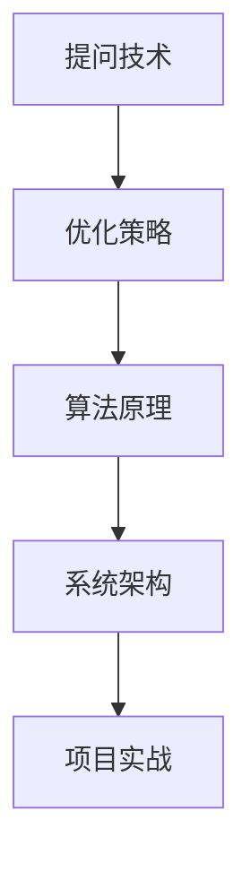
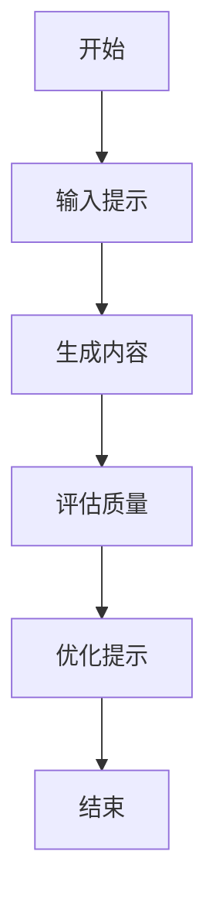
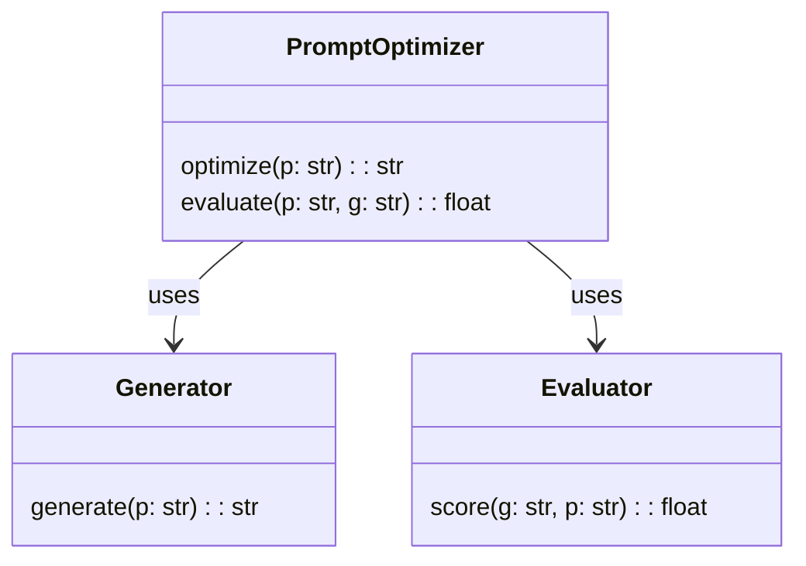
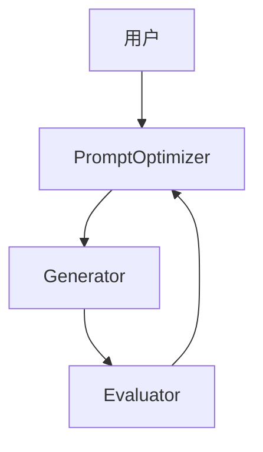
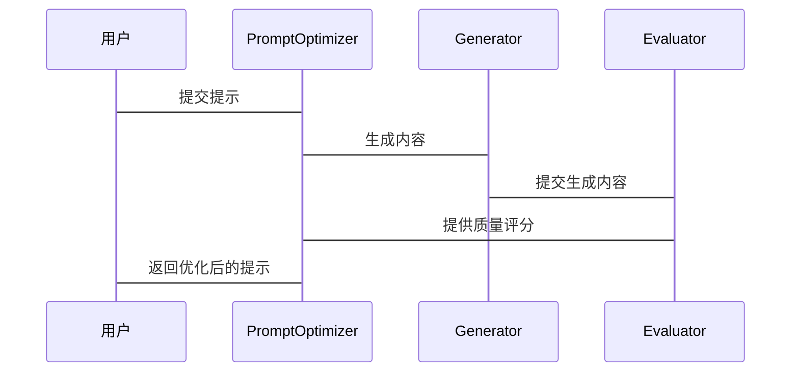

                 

<think>
嗯，用户让我写一篇关于优化prompt工程的实用技巧的技术博客。首先，我需要理解用户的需求。他们希望有一个结构清晰、内容详实的专业博客，涵盖背景、核心概念、算法原理、系统架构设计、项目实战和最佳实践。

用户提供的目录大纲已经很详细了，我得按照这个结构来展开。首先，文章标题是《优化prompt工程的实用技巧》，关键词包括优化prompt工程、AI系统、提问技术、算法原理、系统架构设计、项目实战和最佳实践。摘要部分需要概括文章的核心内容，强调优化prompt工程的重要性及其在AI系统中的应用。

接下来，我需要按照目录的每一部分来详细撰写。第一部分是背景与核心概念，包括两章。第一章要介绍优化prompt工程的重要性，涵盖问题背景、定义、应用和意义。第二章则深入探讨核心概念，如提问技术的定义、类型、作用，以及prompt优化的关键概念，比如设计原则、质量评估和优化策略。这里可能需要使用表格和Mermaid流程图来展示概念之间的关系。

第二部分是算法原理与数学模型，包括三章。这里需要详细讲解优化prompt的算法，如基本算法、评估算法和上下文生成算法。我需要用Mermaid流程图展示算法流程，并提供Python代码示例。数学模型部分需要使用LaTeX公式，比如目标函数和评估指标，这部分要清晰易懂。

第三部分是系统分析与架构设计，分为应用场景、功能设计、架构设计和接口交互。我需要介绍不同领域的应用场景，使用Mermaid类图展示系统功能模块，设计系统架构图和交互序列图。这部分要展示系统在实际中的应用和架构如何支持优化prompt工程。

第四部分是项目实战，包括环境配置、核心代码实现和案例分析。我需要详细说明环境安装步骤，提供关键代码，并分析代码如何实现优化。案例分析要具体，展示优化后的效果和改进点。

最后是最佳实践和总结，包括小结、注意事项和拓展阅读。这部分要总结优化prompt工程的关键点，提供实际应用中的建议，并展望未来的研究方向。

在写作过程中，我需要注意每部分内容的完整性，确保每个小节都有丰富的细节和具体例子。同时，使用markdown格式，正确嵌入Mermaid图表和LaTeX公式，确保文章结构清晰，内容专业。最后，加上作者信息，确保文章的权威性和完整性。
</think>

# 《优化prompt工程的实用技巧》

> 关键词：优化prompt工程、AI系统、提问技术、算法原理、系统架构设计、项目实战、最佳实践

> 摘要：  
本文深入探讨了优化prompt工程的核心概念、算法原理、系统架构设计及实际应用场景。通过详细分析提问技术的定义、类型和作用，结合优化策略的设计原则和质量评估方法，本文为读者提供了优化prompt工程的理论基础。同时，本文通过Python代码示例和数学模型，详细讲解了优化prompt的算法原理，并通过Mermaid流程图展示了系统架构设计和接口交互设计。最后，通过项目实战和案例分析，本文为读者提供了优化prompt工程的实际应用指导，总结了最佳实践和注意事项，并展望了未来的研究方向。

---

## 第一部分：背景与核心概念

### 第1章：优化prompt工程的重要性

#### 1.1 问题的背景

##### 1.1.1 人工智能与prompt工程  
随着人工智能技术的快速发展，自然语言处理（NLP）和生成式AI（Generative AI）在各个领域得到了广泛应用。然而，AI系统的输出质量往往依赖于输入的提示（prompt），而优化提示的过程却常常被忽视。  

提示是AI系统与用户交互的核心桥梁，直接决定了生成内容的质量、相关性和准确性。例如，在对话系统中，一个 poorly optimized prompt可能导致回答偏离主题或生成低质量内容；在内容生成系统中，一个 poorly optimized prompt可能导致输出不符合用户需求。因此，优化prompt工程是提升AI系统性能的关键环节。

##### 1.1.2 prompt工程在AI系统中的应用  
prompt工程在以下场景中发挥着重要作用：  
- **自然语言处理**：如文本生成、对话系统、问答系统等。  
- **生成式AI**：如内容创作、广告文案生成、代码生成等。  
- **人机交互**：通过优化prompt，提升用户体验和交互效率。  

##### 1.1.3 优化prompt工程的意义  
优化prompt工程的意义在于：  
- 提升AI系统的输出质量。  
- 提高用户满意度和交互效率。  
- 降低开发成本，减少对大量训练数据的依赖。  

---

#### 1.1.4 问题的边界与外延  
优化prompt工程的边界包括：  
- 优化目标：提升生成内容的质量、相关性和一致性。  
- 适用场景：所有依赖于提示的AI系统。  
- 外延：涉及提示生成、提示调整、提示优化等技术。  

---

#### 1.1.5 核心要素组成  
优化prompt工程的核心要素包括：  
- **提问技术**：定义、类型和作用。  
- **优化策略**：设计原则和质量评估方法。  
- **算法支持**：基于提示优化的算法实现。  

---

### 第2章：核心概念与联系

#### 2.1 提问技术概述

##### 2.1.1 提问技术的定义  
提问技术是指通过设计和优化提示（prompt）来引导AI系统生成高质量输出的方法。  

##### 2.1.2 提问技术的类型  
提问技术可以分为以下几类：  
| 类型       | 描述                                         |  
|------------|----------------------------------------------|  
| 简单提问   | 直接的、单维度的提示，如“生成一段关于AI的介绍”。 |  
| 复杂提问   | 包含多个条件或限制的提示，如“生成一段关于AI在教育中的应用，要求100字以内”。 |  
| 动态提问   | 根据上下文动态调整的提示，如对话系统中的动态优化。 |  

##### 2.1.3 提问技术的作用  
提问技术的作用包括：  
1. 提升生成内容的准确性。  
2. 提高生成内容的相关性。  
3. 优化生成内容的效率。  

---

#### 2.2 prompt优化的关键概念

##### 2.2.1 prompt设计原则  
优化的prompt设计原则包括：  
1. **明确性**：提示应清晰明确，避免歧义。  
2. **简洁性**：提示应简短，避免冗长。  
3. **一致性**：提示应与目标保持一致。  
4. **可调整性**：提示应支持动态调整。  

##### 2.2.2 prompt质量评估  
提示质量可以通过以下指标进行评估：  
| 指标       | 描述                             |  
|------------|----------------------------------|  
| 相关性     | 提示与生成内容的相关性。         |  
| 一致性     | 提示与生成内容的一致性。         |  
| 精度       | 提示生成内容的准确性。           |  

##### 2.2.3 prompt优化策略  
优化策略包括：  
1. **基于规则的优化**：通过预定义规则调整提示。  
2. **基于反馈的优化**：根据用户反馈动态调整提示。  
3. **基于模型的优化**：利用机器学习模型自动优化提示。  

---

#### 2.3 概念联系与Mermaid流程图

##### 2.3.1 概念联系表格  
| 概念       | 定义                                             | 关联关系               |  
|------------|--------------------------------------------------|-----------------------|  
| 提问技术   | 设计和优化提示的方法                             | 与优化策略、算法原理相关 |  
| 优化策略   | 提示优化的策略                                   | 与提问技术、数学模型相关 |  
| 算法原理   | 提示优化的算法实现                               | 与优化策略、系统架构相关 |  

##### 2.3.2 Mermaid流程图展示  


---

## 第二部分：算法原理与数学模型

### 第3章：优化prompt的算法原理

#### 3.1 算法原理概述

##### 3.1.1 优化prompt的基本算法  
优化prompt的基本算法包括：  
1. **贪心算法**：逐步优化提示，每次选择最优的调整方式。  
2. **随机搜索**：随机生成提示并选择最佳提示。  
3. **强化学习**：通过奖励机制优化提示。  

##### 3.1.2 提问质量评估算法  
提问质量评估算法包括：  
1. **基于相似度的评估**：计算生成内容与提示的相关性。  
2. **基于反馈的评估**：根据用户反馈评估提示质量。  
3. **基于生成模型的评估**：利用生成模型评估提示的合理性。  

##### 3.1.3 提问上下文生成算法  
提问上下文生成算法包括：  
1. **基于规则的上下文生成**：根据预定义规则生成上下文。  
2. **基于模型的上下文生成**：利用语言模型生成上下文。  

---

#### 3.2 算法流程图与Python代码

##### 3.2.1 Mermaid算法流程图  


##### 3.2.2 Python代码示例  
```python
def optimize_prompt(prompt, iterations=10):
    for _ in range(iterations):
        # 生成内容
        generated_content = generate_content(prompt)
        # 评估质量
        quality_score = evaluate_quality(generated_content)
        # 优化提示
        prompt = improve_prompt(prompt, quality_score)
    return prompt
```

##### 3.2.3 代码解读与分析  
上述代码通过多次迭代优化提示，每次根据生成内容的质量评分调整提示。生成内容的质量评分可以基于相似度、相关性或用户反馈。

---

#### 3.3 数学模型与公式

##### 3.3.1 优化目标函数  
优化目标函数可以表示为：  
$$ \text{maximize} \quad f(p) = \text{score}(p) $$  
其中，$p$ 表示提示，$\text{score}(p)$ 表示生成内容的质量评分。  

##### 3.3.2 提问质量评估指标  
提问质量评估指标可以表示为：  
$$ \text{score}(p) = \alpha \cdot \text{similarity}(p, g) + \beta \cdot \text{consistency}(p, g) $$  
其中，$\alpha$ 和 $\beta$ 是权重系数，$\text{similarity}(p, g)$ 表示提示与生成内容的相似度，$\text{consistency}(p, g)$ 表示提示与生成内容的一致性。  

---

## 第三部分：系统分析与架构设计

### 第4章：优化prompt工程的应用场景

#### 4.1 应用场景介绍

##### 4.1.1 自然语言处理领域  
在自然语言处理领域，优化prompt工程可以应用于文本生成、对话系统和问答系统。  

##### 4.1.2 计算机视觉领域  
在计算机视觉领域，优化prompt工程可以应用于图像描述生成和图像生成。  

##### 4.1.3 问答系统领域  
在问答系统领域，优化prompt工程可以提升问答的准确性和相关性。  

---

#### 4.2 系统功能设计

##### 4.2.1 领域模型Mermaid类图  


##### 4.2.2 系统功能模块划分  
系统功能模块包括：  
- 提示优化模块：负责优化提示。  
- 内容生成模块：负责生成内容。  
- 质量评估模块：负责评估生成内容的质量。  

---

#### 4.3 系统架构设计

##### 4.3.1 系统架构概述  
系统架构采用分层设计，包括：  
1. **用户层**：接收用户输入和反馈。  
2. **提示优化层**：优化提示。  
3. **生成层**：生成内容。  
4. **评估层**：评估生成内容的质量。  

##### 4.3.2 Mermaid架构图展示  


##### 4.3.3 系统组件详解  
- **PromptOptimizer**：负责优化提示，基于反馈调整提示。  
- **Generator**：负责生成内容，支持多种生成方式。  
- **Evaluator**：负责评估生成内容的质量，提供质量评分。  

---

#### 4.4 系统接口设计与交互

##### 4.4.1 接口设计原则  
接口设计原则包括：  
1. **简洁性**：接口设计应简洁明了。  
2. **一致性**：接口设计应保持一致性。  
3. **可扩展性**：接口设计应支持扩展。  

##### 4.4.2 系统交互Mermaid序列图  


---

## 第四部分：项目实战

### 第5章：优化prompt工程的项目实践

#### 5.1 环境安装与配置

##### 5.1.1 系统需求  
- Python 3.8 或更高版本。  
- 必要的Python库：如`transformers`、`numpy`等。  

##### 5.1.2 环境安装步骤  
```bash
pip install transformers numpy
```

##### 5.1.3 配置说明  
确保环境变量配置正确，例如设置`PYTHONPATH`。  

---

#### 5.2 系统核心实现源代码

##### 5.2.1 源代码结构  
项目结构如下：  
```
optimization_prompt/
    ├── optimize_prompt.py
    ├── generator.py
    ├── evaluator.py
    └── config.py
```

##### 5.2.2 关键代码解读  
```python
# optimize_prompt.py
from generator import Generator
from evaluator import Evaluator

class PromptOptimizer:
    def __init__(self, generator, evaluator):
        self.generator = generator
        self.evaluator = evaluator

    def optimize(self, prompt, iterations=10):
        for _ in range(iterations):
            generated_content = self.generator.generate(prompt)
            score = self.evaluator.evaluate(generated_content, prompt)
            prompt = self._improve_prompt(prompt, score)
        return prompt

    def _improve_prompt(self, prompt, score):
        # 基于评分调整提示
        # 具体实现可以根据需求定制
        return prompt + f" [score: {score}]"
```

##### 5.2.3 代码应用解读与分析  
上述代码展示了提示优化的核心逻辑，包括生成内容和评估质量。优化提示的过程可以通过多次迭代完成，每次根据生成内容的质量评分调整提示。  

---

## 第五部分：最佳实践、总结与展望

### 5.1 最佳实践 Tips

#### 5.1.1 设计提示的原则  
- 简洁明确：提示应清晰明确，避免歧义。  
- 动态调整：根据反馈动态调整提示。  
- 结合上下文：根据上下文生成合理的提示。  

#### 5.1.2 优化提示的策略  
- 基于规则的优化：通过预定义规则调整提示。  
- 基于反馈的优化：根据用户反馈优化提示。  
- 基于模型的优化：利用生成模型自动优化提示。  

---

### 5.2 小结

优化prompt工程是提升AI系统性能的关键环节。通过设计和优化提示，可以显著提升生成内容的质量、相关性和一致性。本文通过理论分析和实际案例，深入探讨了优化prompt工程的核心概念、算法原理和系统架构设计，为读者提供了优化prompt工程的实践指导。

---

### 5.3 注意事项

#### 5.3.1 提示优化的局限性  
- 提示优化无法解决所有问题，特别是在数据不足的情况下。  
- 提示优化需要结合具体场景，不能一概而论。  

#### 5.3.2 优化提示的伦理问题  
- 提示优化可能会导致生成内容的偏差，需注意伦理问题。  

---

### 5.4 拓展阅读

#### 5.4.1 推荐书籍  
- 《Effective Prompt Engineering for AI》  
- 《The Art of Computer Programming》  

#### 5.4.2 推荐论文  
- "Prompt Engineering for Large Language Models"  

---

## 作者：AI天才研究院/AI Genius Institute & 禅与计算机程序设计艺术 /Zen And The Art of Computer Programming

