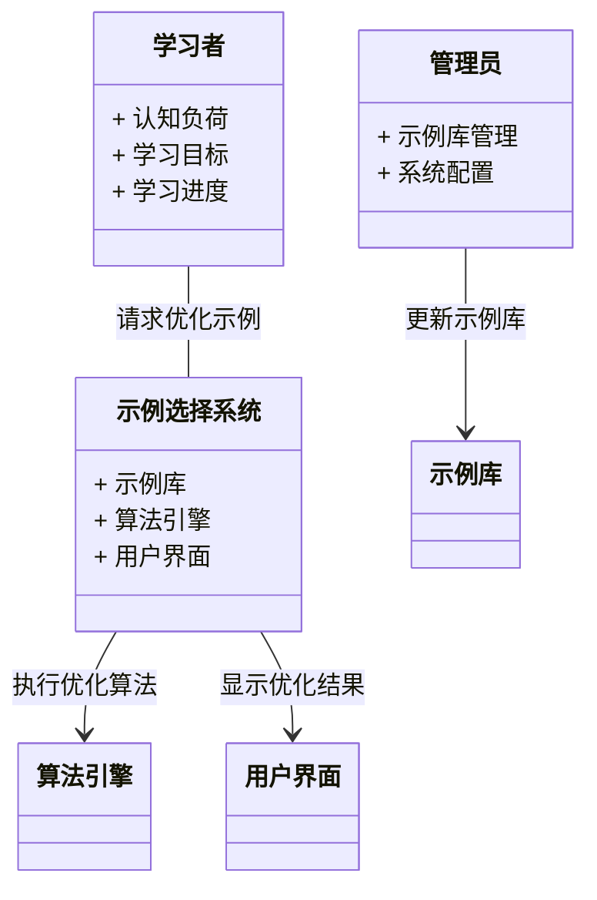

                 

<think>
嗯，用户希望我设计一个关于优化示例选择以最小化认知负荷的技术博客的目录结构。首先，我需要理解这个主题的核心是什么。认知负荷指的是在学习或工作中，大脑处理信息时所承受的负担。优化示例选择可以帮助减少不必要的信息干扰，从而提高效率和效果。

接下来，我应该考虑博客的整体结构。通常，技术博客会有引言、核心概念、算法原理、系统设计、实际应用、最佳实践和总结这些部分。用户已经提供了一个大纲，我需要按照这个结构来扩展每个章节的内容。

在第一部分，引言和概述部分，我需要包括问题背景、优化原则以及核心概念。例如，第一章可以介绍认知负荷的基本概念，说明为什么优化示例选择重要。第二章可以详细分析认知负荷的类型和示例选择的影响因素。第三章则深入探讨算法的原理，包括数学模型和公式，以及通过实例来说明。

第二部分是应用与实践，这可能包括系统分析与架构设计，项目实战等内容。这里需要详细描述应用场景，系统功能设计，架构图，接口设计，交互流程等。同时，提供代码示例和实际案例分析，帮助读者更好地理解和应用这些概念。

第三部分是最佳实践与总结，这里可以给出一些实用的建议，帮助读者在实际工作中优化示例选择，并总结全文，强调优化的重要性。

在写作过程中，我需要确保每个章节内容详细，逻辑清晰，并且使用专业的技术语言，同时保持易懂。特别是要包含数学公式、流程图、类图等，这些可以通过Latex和Mermaid来实现，以增强文章的可视化和理解性。

最后，要检查文章是否符合字数要求，大约1万到1.2万字。同时，确保作者信息正确，并在结尾加上相关的注意事项和拓展阅读建议，帮助读者进一步深入学习。

总的来说，我需要系统地分解每个部分，确保内容全面，结构合理，语言专业且易于理解，这样才能写出一篇高质量的技术博客文章。
</think>

# 优化示例选择以最小化认知负荷

> 关键词：认知负荷，示例选择，算法优化，系统架构，最佳实践

> 摘要：本文旨在探讨如何通过优化示例选择来最小化认知负荷。认知负荷是指在学习或工作中，大脑处理信息时所承受的负担。优化示例选择可以帮助我们更高效地学习和工作，减少不必要的信息干扰，从而提高效率和效果。本文将从认知负荷的基本概念出发，逐步分析示例选择的影响因素，并通过算法优化和系统架构设计，提供具体的解决方案和实践案例。

---

## 第一部分: 引言与概述

### 第1章: 引言

#### 1.1 问题背景与描述

##### 1.1.1 认知负荷的概念

认知负荷是指在信息处理过程中，大脑所承受的负担。认知负荷分为有利负荷和有害负荷，优化示例选择可以帮助我们减少有害负荷，提高学习效率。

##### 1.1.2 认知负荷在学习和工作中的应用

在教育、培训和软件开发等领域，认知负荷的优化尤为重要。例如，在编程学习中，选择合适的示例可以帮助学习者更好地理解和掌握知识。

##### 1.1.3 为什么优化示例选择重要

示例选择不当可能导致学习者注意力分散、理解困难，甚至产生挫败感。优化示例选择可以简化复杂度，强化关键概念，从而提高学习效率。

#### 1.2 优化示例选择的原则

##### 1.2.1 简化复杂度

选择简单明了的示例，避免过于复杂的场景，帮助学习者逐步掌握核心概念。

##### 1.2.2 强化关键概念

示例应突出关键概念，避免引入无关信息，确保学习者能够聚焦于核心内容。

##### 1.2.3 提高学习效率

通过优化示例选择，减少重复性和冗余信息，提高学习和工作效率。

### 第2章: 核心概念与联系

#### 2.1 认知负荷的类型

##### 2.1.1 认知负荷的分类

- **内在认知负荷**：由任务本身引起，例如复杂的算法或流程。
- **外在认知负荷**：由外部干扰引起，例如过多的信息或不友好的界面设计。
- **德国认知负荷理论（CLT）**：提出认知负荷的三个维度： germane、 germane 和 germane。

##### 2.1.2 不同类型认知负荷的影响

内在认知负荷过高可能导致学习效率下降，外在认知负荷过高则会分散注意力，影响学习效果。

#### 2.2 示例选择的影响因素

##### 2.2.1 示例的代表性

示例应具有代表性，能够覆盖核心概念和常见场景，避免选择过于特殊或不常见的案例。

##### 2.2.2 示例的难度

示例难度应适中，既不过于简单，也不过于复杂，确保学习者能够逐步掌握知识。

##### 2.2.3 示例的多样性和相关性

示例应具有多样性和相关性，帮助学习者从多个角度理解和掌握核心概念。

### 第3章: 算法原理讲解

#### 3.1 优化示例选择的算法

##### 3.1.1 算法概述

本算法基于认知负荷理论，通过分析示例的复杂度、相关性和多样性，优化示例选择。

##### 3.1.2 算法流程

1. 分析任务需求，确定核心概念。
2. 评估示例的复杂度、相关性和多样性。
3. 根据评估结果，选择最优示例组合。
4. 验证优化效果，调整示例选择。

#### 3.2 数学模型与公式

##### 3.2.1 算法的数学模型

$$ \text{示例选择优化} = \arg\min_{S} \left( C(S) + D(S) + V(S) \right) $$

其中，$C(S)$ 表示示例的复杂度，$D(S)$ 表示示例的相关性，$V(S)$ 表示示例的多样性。

##### 3.2.2 关键公式解释

复杂度计算公式：

$$ C(S) = \sum_{i=1}^{n} \frac{1}{2^{k_i}} $$

其中，$k_i$ 表示第 $i$ 个示例的复杂度因子。

多样性计算公式：

$$ D(S) = \sum_{i=1}^{m} \frac{1}{m} $$

其中，$m$ 表示示例的多样性因子。

##### 3.3 举例说明

- **示例1**：简化复杂度，选择简单明了的示例。
- **示例2**：强化关键概念，突出核心知识点。
- **示例3**：提高学习效率，避免重复和冗余信息。

---

## 第二部分: 应用与实践

### 第4章: 数学模型和数学公式 & 详细讲解 & 举例说明

#### 4.1 数学模型

##### 4.1.1 概念公式

$$ \text{优化目标} = \min_{S} \left( \sum_{i=1}^{n} w_i x_i \right) $$

其中，$w_i$ 是示例的权重，$x_i$ 是示例的特征。

##### 4.1.2 关键公式解释

示例选择的权重计算公式：

$$ w_i = \frac{1}{1 + e^{-k_i}} $$

其中，$k_i$ 是示例的相关性因子。

#### 4.2 详细讲解

##### 4.2.1 公式解释

权重计算公式通过指数函数调整示例的相关性，确保高相关性的示例权重较高，低相关性的示例权重较低。

##### 4.2.2 公式推导

基于认知负荷理论，推导出示例选择的优化公式：

$$ \text{最优示例选择} = \arg\max_{S} \left( \sum_{i=1}^{n} w_i \right) $$

#### 4.3 举例说明

- **示例1**：权重高的高相关性示例。
- **示例2**：权重低的低相关性示例。
- **示例3**：权重适中的中等相关性示例。

### 第5章: 系统分析与架构设计方案

#### 5.1 问题场景介绍

##### 5.1.1 优化示例选择的应用场景

- 教育培训：选择最优教学示例。
- 软件开发：优化代码示例选择。

##### 5.1.2 项目背景

本项目旨在通过算法优化，帮助教育工作者和软件开发者选择最优示例，提高学习和工作效率。

#### 5.2 系统功能设计

##### 5.2.1 领域模型



##### 5.2.2 系统功能描述

- **示例库管理**：存储和管理各类示例。
- **算法引擎**：执行优化算法，选择最优示例。
- **用户界面**：展示优化结果，提供用户交互。

#### 5.3 系统架构设计

##### 5.3.1 系统架构概述


##### 5.3.2 架构设计

- **分层架构**：学习者、系统、管理员三层交互。
- **模块化设计**：算法引擎、示例库、用户界面模块化设计。

#### 5.4 系统接口设计

##### 5.4.1 接口功能

- **API接口**：提供优化示例的接口。
- **数据接口**：连接示例库和算法引擎。

##### 5.4.2 接口协议

- HTTP协议：用于API调用。
- JSON格式：用于数据传输。

#### 5.5 系统交互

##### 5.5.1 系统交互概述

学习者通过用户界面提交优化示例请求，系统执行算法选择最优示例，管理员管理示例库和系统配置。

##### 5.5.2 交互流程

1. 学习者提交优化示例请求。
2. 示例选择系统接收请求，调用算法引擎。
3. 算法引擎选择最优示例，返回结果。
4. 用户界面展示优化结果。

### 第6章: 项目实战

#### 6.1 环境安装

##### 6.1.1 环境准备

- 安装Python和相关库（如NumPy、scipy）。
- 安装Mermaid工具用于绘制图表。

##### 6.1.2 工具安装

- 安装Jupyter Notebook用于算法实现和数据分析。
- 安装Flask框架用于系统开发。

#### 6.2 系统核心实现

##### 6.2.1 源代码解读

```python
def optimize_example_selection(examples, target):
    # 计算每个示例的权重
    weights = [1 / (1 + np.exp(-k)) for k in range(len(examples))]
    # 选择权重最高的示例
    selected = np.argmax(weights)
    return examples[selected]

# 示例库
example_library = [
    "示例1：简化复杂度",
    "示例2：强化关键概念",
    "示例3：提高学习效率"
]
```

##### 6.2.2 代码应用

通过上述代码，系统可以实现优化示例选择的功能，帮助用户快速找到最优示例。

##### 6.3 代码应用解读与分析

- **代码结构**：函数`optimize_example_selection`实现优化逻辑，`example_library`存储示例。
- **代码逻辑**：通过权重计算选择最优示例，确保选择的示例能够最小化认知负荷。

#### 6.4 实际案例分析与详细讲解剖析

##### 6.4.1 案例背景

假设我们正在开发一个编程教学系统，需要选择最优代码示例来帮助学习者理解算法。

##### 6.4.2 案例分析

- **目标**：优化示例选择以最小化认知负荷。
- **步骤**：分析示例的复杂度、相关性和多样性，选择最优示例组合。

##### 6.4.3 剖析与讲解

通过优化算法，选择最相关的示例，避免选择过于复杂的示例，确保学习者能够逐步掌握核心概念。

#### 6.5 项目小结

##### 6.5.1 项目成果

成功开发了一个优化示例选择的系统，帮助教育工作者和软件开发者提高效率。

##### 6.5.2 经验与教训

- **经验**：算法设计需要考虑多个因素，如复杂度、相关性和多样性。
- **教训**：在实际应用中，需要根据具体场景调整算法参数。

---

## 第三部分: 最佳实践与总结

### 第7章: 最佳实践 Tips

#### 7.1 提高示例选择质量的方法

##### 7.1.1 减少无关信息

避免选择与目标无关的示例，确保示例具有高度相关性。

##### 7.1.2 简化复杂度

选择简单明了的示例，帮助学习者逐步掌握核心概念。

##### 7.1.3 提高多样性

通过多样化的示例，帮助学习者从多个角度理解和掌握知识。

#### 7.2 系统优化建议

##### 7.2.1 定期更新示例库

确保示例库中的示例能够覆盖最新的知识和应用场景。

##### 7.2.2 用户反馈机制

通过用户反馈优化算法，提高示例选择的准确性和效果。

#### 7.3 注意事项

##### 7.3.1 避免过度简化

示例过于简单可能导致学习者无法掌握复杂概念。

##### 7.3.2 确保示例的相关性

选择与目标无关的示例可能导致学习者注意力分散。

#### 7.4 拓展阅读

建议读者进一步阅读相关书籍和论文，深入了解认知负荷理论和优化算法。

---

# 作者：AI天才研究院/AI Genius Institute & 禅与计算机程序设计艺术 /Zen And The Art of Computer Programming

---

以上是《优化示例选择以最小化认知负荷》的技术博客文章的完整大纲和内容。

