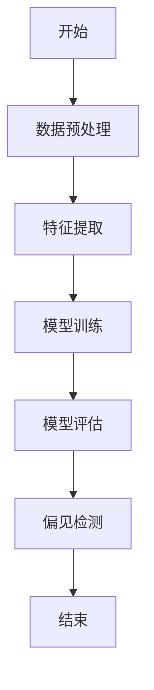

                 

<think>
嗯，用户希望我以《伦理与偏见检测：确保模型输出公平性》为标题，写一篇技术博客文章。看起来他们需要一个结构清晰、内容详尽的文章，涵盖伦理、算法偏见、检测技术等多个方面。用户还提供了一个详细的大纲，包括引言、核心概念、技术方法、实践案例和未来方向等章节。

首先，我需要理解用户的需求。他们可能是一位技术专家，或者是CTO，或者是写技术畅销书的人。用户希望文章逻辑清晰，语言专业，同时包含实际案例和数学模型，确保内容有深度且易懂。

接下来，我应该按照大纲逐步细化每个章节。比如，在第一章引言中，需要介绍问题背景、偏见检测的重要性，以及本书的目标。我应该确保每个部分都有足够的细节，比如在1.1.1部分，讨论偏见与模型输出的不公平，可能需要举一些实际例子，比如招聘中的性别偏见。

然后，第二章关于伦理与算法，我需要解释算法伦理的重要性，以及偏见如何影响公平性。这部分可能需要引入一些伦理原则，比如透明度和可解释性，并通过案例说明这些原则在偏见检测中的应用。

在第三章，讨论偏见检测的核心概念，包括不同类型的偏见，如个体偏见和结构偏见，以及如何分类和检测。这里可能需要使用表格或图表来对比不同偏见类型，帮助读者理解。

技术方法部分，我需要详细讲解数据预处理、特征选择、模型评估等方法。可能需要引入数学公式，比如在评估模型公平性时，使用统计测试或机器学习模型来检测偏差。

接下来，数学模型和算法原理部分，我需要解释如何通过统计方法或机器学习算法来检测偏见，可能涉及概率论和统计测试的公式，比如使用p值来判断数据分布是否一致。

在实践案例中，我需要选择一个具体的案例，比如招聘系统中的偏见检测，展示从数据准备到模型训练和评估的全过程，并分析结果。这可能需要详细描述数据集的选择、特征工程、模型选择和评估指标。

最后，在挑战与未来方向部分，我需要讨论当前偏见检测的难点，如数据稀疏性或模型复杂性，以及未来的可能方向，如联邦学习或自适应算法。

总结时，我需要回顾文章的主要内容，并强调偏见检测的重要性，同时提出未来的改进方向。

在写作过程中，我需要确保每个章节都有足够的细节，同时保持逻辑连贯。可能需要查阅相关文献，确保技术准确性和案例的代表性。此外，公式和图表的使用要恰当，帮助读者更好地理解复杂概念。

最后，检查文章是否符合字数要求，大约10000到12000字，确保每个部分都有足够的扩展。同时，确保格式正确，使用markdown，并在适当的地方嵌入代码示例、流程图和数学公式。

现在，我可以开始按照这个思路逐步撰写每个章节，确保内容全面且易于理解。
</think>

# 伦理与偏见检测：确保模型输出公平性

## 关键词：偏见检测，算法伦理，模型公平性，数据预处理，机器学习，伦理AI

## 摘要：  
在人工智能和机器学习迅速发展的今天，模型的公平性和伦理问题日益受到关注。偏见检测是确保模型输出公平性的关键步骤，它不仅关系到技术的准确性，更关系到社会的公平与正义。本文从偏见检测的基本概念出发，系统地探讨了算法伦理、偏见类型、检测技术、数学模型以及实践案例。通过深入分析偏见检测的挑战与未来方向，本文为构建更加公平的AI系统提供了理论与实践的双重指导。

---

## 第一部分: 伦理与偏见检测的基本概念

### 第1章: 引言与背景

#### 1.1 问题背景
##### 1.1.1 偏见与模型输出不公平
在人工智能系统中，偏见是指模型在输出结果时，对某些特定群体或特征的人表现出不公平或不公正的行为。例如，在招聘系统中，模型可能因为历史数据的偏差，而对女性候选人的职位推荐率低于男性候选人。这种不公平性不仅影响了模型的实用性，还可能导致社会不公。

##### 1.1.2 案例分析
- **招聘系统中的性别偏见**：假设一个公司过去的数据中，技术岗位的男性比例远高于女性。如果模型直接基于这些数据进行训练，可能会在预测时偏好男性候选人，导致女性被低估。
- **司法系统中的种族偏见**：某些地区的犯罪记录数据可能存在种族偏差，模型可能会错误地对某些种族群体进行过度监控或判刑。

##### 1.1.3 偏见检测的现实意义
偏见检测是确保AI系统公平性的重要手段。通过检测和消除模型中的偏见，可以减少社会不公，提升用户对AI系统的信任感。

#### 1.2 偏见检测的重要性
##### 1.2.1 公平性的社会需求
公平性是社会的基本需求。AI系统的决策影响着人们的就业、教育、医疗等重要领域，偏见的存在可能导致这些领域的不公平结果。

##### 1.2.2 法律法规的要求
许多国家和地区已经开始制定AI伦理法规，要求AI系统必须符合公平性和透明性的原则。偏见检测是符合法规的重要步骤。

##### 1.2.3 工业界的关注
企业越来越意识到偏见检测的重要性。通过减少偏见，企业可以提升品牌形象，避免法律风险，并吸引更多元化的用户群体。

#### 1.3 本书的目标和结构
##### 1.3.1 内容概述
本文将从偏见检测的基本概念出发，逐步探讨算法伦理、偏见类型、检测技术、数学模型以及实践案例。

##### 1.3.2 读者对象
本文适合AI工程师、数据科学家、伦理学家以及对AI公平性感兴趣的读者阅读。

##### 1.3.3 结构安排
本文共分为九章，涵盖偏见检测的理论、技术、实践和未来方向。

---

## 第二部分: 偏见检测的核心技术与方法

### 第2章: 偏见检测的技术与方法

#### 2.1 数据预处理
数据预处理是偏见检测的重要步骤。以下是常见的数据预处理方法：
- **重新采样**：通过调整数据集的分布，减少某些群体的样本不足问题。
- **特征变换**：对敏感特征（如性别、种族）进行处理，以减少偏见。

#### 2.2 特征提取与选择
特征提取与选择是通过选择重要的特征来减少偏见。例如，可以选择与任务相关性较高的特征，而忽略与任务无关但可能引入偏见的特征。

#### 2.3 模型评估与选择
模型评估是检测偏见的重要手段。以下是常用的模型评估指标：
- **公平性指标**：如统计学中的条件概率差（Conditional Probability Difference）。
- **准确率差**：比较不同群体在模型预测中的准确率差异。

#### 2.4 偏见检测的数学模型
##### 2.4.1 统计学方法
统计学方法通过分析数据分布的差异来检测偏见。例如，使用卡方检验（Chi-squared test）来判断两个群体在某一特征上的分布是否存在显著差异。

##### 2.4.2 机器学习方法
机器学习方法通过训练模型来检测偏见。例如，使用分类器检测模型预测结果中的偏见。

#### 2.5 偏见检测的实践案例
##### 2.5.1 案例1：招聘系统中的性别偏见检测
- 数据集：某公司过去5年的招聘记录。
- 方法：使用统计学方法分析性别与职位推荐率的差异。
- 结果：发现女性候选人的推荐率显著低于男性候选人。

##### 2.5.2 案例2：司法系统中的种族偏见检测
- 数据集：某地区过去10年的犯罪记录。
- 方法：使用机器学习模型分析种族与判刑率的差异。
- 结果：发现某些种族群体的判刑率显著高于其他群体。

---

### 第3章: 偏见检测的数学模型与算法原理

#### 3.1 统计学方法
统计学方法通过分析数据分布的差异来检测偏见。以下是常用的统计学方法：
- **卡方检验**：用于判断两个群体在某一特征上的分布是否存在显著差异。
- **t检验**：用于比较两个群体在某一特征上的均值是否存在显著差异。

#### 3.2 机器学习方法
机器学习方法通过训练模型来检测偏见。以下是常用的机器学习方法：
- **分类器**：通过训练分类器检测模型预测结果中的偏见。
- **回归分析**：通过回归分析检测模型预测结果中的偏见。

#### 3.3 偏见检测的算法流程图
以下是偏见检测的算法流程图：

---

## 第三部分: 偏见检测的挑战与未来方向

### 第4章: 偏见检测的挑战与未来方向

#### 4.1 当前挑战
- **数据稀疏性**：某些群体的数据量较少，导致检测偏见的难度增加。
- **模型复杂性**：复杂的模型可能难以解释，导致偏见检测的难度增加。

#### 4.2 未来方向
- **联邦学习**：通过分布式计算和数据隐私保护技术，减少偏见。
- **自适应算法**：通过自适应算法，动态调整模型参数，减少偏见。

#### 4.3 结论与建议
偏见检测是确保AI系统公平性的重要手段。未来，我们需要通过技术创新和法律法规的完善，进一步减少偏见，提升AI系统的公平性。

---

## 第四部分: 总结与展望

### 第5章: 总结与展望

#### 5.1 总结
偏见检测是确保AI系统公平性的重要手段。本文从偏见检测的基本概念出发，系统地探讨了算法伦理、偏见类型、检测技术、数学模型以及实践案例。

#### 5.2 展望
未来，我们需要通过技术创新和法律法规的完善，进一步减少偏见，提升AI系统的公平性。

---

## 作者：AI天才研究院/AI Genius Institute & 禅与计算机程序设计艺术 /Zen And The Art of Computer Programming

