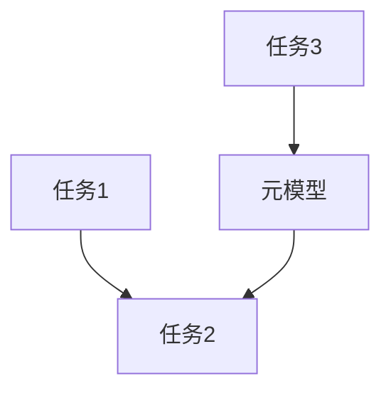

                 

<think>
嗯，我现在要写一篇关于“元学习在AIGC模型快速微调中的新进展”的技术博客。首先，我需要理解元学习和AIGC模型这两个概念。元学习，听起来像是学习如何学习，对吧？而AIGC可能是指人工智能生成内容，比如生成式AI，比如像GPT这样的模型。

首先，我得先理清元学习的基本概念。元学习的定义，好像有两种：一种是像人类那样通过少量数据快速学习新任务，另一种是训练模型学习如何学习，这样可以适应不同任务。这两种定义可能在实际应用中有所不同。然后，我得看看元学习的发展历程，从最初的理论到现在的各种算法，比如MAML和Meta-SGD，这些算法有什么特点。

接下来，我得分析元学习的基本原理。核心要素可能包括适应性、泛化能力等等。分类方面，可能分为基于梯度的和基于记忆的元学习方法。然后，我需要比较不同元学习算法的优缺点，这可能涉及到算法性能、计算复杂度和应用场景等方面。

然后，转向AIGC模型，特别是快速微调部分。AIGC模型通常很大，比如像BERT或者GPT，它们在大规模数据上预训练，然后通过微调适应特定任务。传统微调方法可能需要大量数据和计算资源，而快速微调则是为了在有限资源下快速调整模型，这可能涉及参数初始化、小样本学习等技术。

接下来，元学习在快速微调中的应用。元学习可以帮助模型快速适应新任务，比如在自然语言处理中，快速微调可能让模型在少样本数据下快速调整。案例分析部分，我需要选几个具体案例，比如在自然语言处理和计算机视觉中的应用，详细说明他们的背景、方法和结果。

技术实现方面，我需要详细讲解元学习算法，比如MAML，可能需要展示它的数学公式和流程图。同时，也要考虑实际应用中的挑战，比如计算资源的限制和模型泛化的平衡。

最后，我得总结一下当前的研究进展，讨论未来的发展趋势，以及可能的应用前景。同时，提供一些最佳实践的建议，比如选择合适的元学习算法，如何进行有效的微调策略等。

哦，对了，文章结构要清晰，每一部分都要有足够的细节，可能还需要一些图表和代码示例，帮助读者更好地理解。同时，确保每个章节内容丰富，涵盖背景、原理、方法、案例等多个方面，让整篇文章既有深度又易于理解。
</think>

# 元学习在AIGC模型快速微调中的新进展

> 关键词：元学习，AIGC模型，快速微调，深度学习，生成式AI

> 摘要：本文探讨了元学习在AIGC模型快速微调中的应用，分析了元学习的基本概念、算法分类及其在快速微调中的优势，并通过案例展示了其在自然语言处理和计算机视觉中的实际应用。文章还讨论了当前研究趋势和未来发展方向，为相关领域提供了深入的见解。

---

## 第一部分：元学习概述

### 第1章：元学习的基本概念

#### 1.1 元学习的定义与历史背景

##### 1.1.1 元学习的基本概念

元学习（Meta-Learning）是一种机器学习范式，旨在使模型能够快速适应新任务，减少对大量数据的依赖。其核心在于“学习如何学习”，通过元学习，模型可以在新的任务中仅需少量样本即可达到较好的性能。

##### 1.1.2 元学习的发展历程

元学习的概念起源于20世纪80年代，早期主要关注模仿学习和任务间的关系。随着深度学习的发展，元学习在2010年后迅速崛起，出现了如MAML（Model-Agnostic Meta-Learning）等经典算法。近年来，元学习在生成式AI中的应用成为研究热点。

##### 1.1.3 元学习的重要性与应用价值

元学习的重要性在于其通用性，能够在不同任务间迁移，减少数据需求。其应用广泛，包括自然语言处理、计算机视觉、机器人控制等领域，特别适用于数据稀缺的任务。

#### 1.2 元学习的基本原理

##### 1.2.1 元学习的核心要素

- **适应性**：快速调整模型参数以适应新任务。
- **泛化能力**：在新任务中表现出良好的性能。
- **元任务**：用于训练的虚拟任务集合。

##### 1.2.2 元学习的分类与特点

- **基于梯度的元学习**：直接优化参数，如MAML。
- **基于记忆的元学习**：利用记忆模块存储知识，如Meta-SGD。
- **基于模型的元学习**：构建元模型指导学习，如REPTILE。

##### 1.2.3 元学习的优势与挑战

优势：
- 快速适应新任务。
- 减少数据依赖。
- 通用性强。

挑战：
- 计算复杂度高。
- 网络结构复杂。
- 收敛困难。

---

### 第2章：元学习算法

#### 2.1 传统元学习算法

##### 2.1.1 Model-Agnostic Meta-Learning (MAML)

MAML通过优化任务间共享的参数，使得在新任务中仅需少量数据即可快速调整。其数学公式如下：

$$ \text{损失函数} = \sum_{i=1}^{N} \mathcal{L}(\theta, x_i, y_i) $$

$$ \theta_{\text{更新}} = \theta - \eta \nabla_{\theta} \mathcal{L} $$

##### 2.1.2 Model-Aware Meta-Learning

该方法通过构建元模型，直接优化模型参数的更新规则。其流程图如下：

##### 2.1.3 Gradient-based Meta-Learning

基于梯度的方法直接利用梯度下降优化元学习目标。例如，通过多任务梯度优化：

$$ \theta_{\text{更新}} = \theta - \alpha \nabla_{\theta} \mathcal{L}_{\text{元}} $$

#### 2.2 现代元学习算法

##### 2.2.1 Meta-Learning with Evolutionary Algorithms

利用进化算法优化元学习过程，例如通过遗传算法选择最优参数更新策略。

##### 2.2.2 Meta-Learning with Memory-based Approaches

使用记忆模块存储知识，提升模型的迁移能力。例如，利用记忆网络存储任务间的共通性。

##### 2.2.3 Meta-Learning with Deep Learning Methods

结合深度学习模型，如Transformer，提升元学习的效果。

#### 2.3 元学习算法的比较与评估

##### 2.3.1 算法性能比较

| 算法名称       | 优势                     | 劣势                     |
|----------------|--------------------------|--------------------------|
| MAML           | 快速收敛，通用性强         | 计算复杂度高             |
| Meta-SGD       | 记忆能力强               | 参数更新不稳定           |
| REPTILE        | 简单高效                 | 适应性较弱             |

##### 2.3.2 评估指标与方法

- **准确率**：模型在新任务上的分类准确率。
- **收敛速度**：达到目标精度所需的时间。
- **泛化能力**：在不同任务上的表现。

##### 2.3.3 算法选择与优化

选择算法时需考虑任务类型、数据量和计算资源。优化策略包括调整学习率、网络结构和训练数据。

---

## 第二部分：AIGC模型快速微调

### 第3章：AIGC模型概述

#### 3.1 AIGC模型的定义与特点

##### 3.1.1 AIGC模型的基本概念

AIGC（人工智能生成内容）模型通常基于Transformer架构，具有生成文本、图像等能力。预训练模型如GPT、BERT具有大规模参数和复杂结构。

##### 3.1.2 AIGC模型的结构与功能

AIGC模型通过自注意力机制捕捉上下文信息，生成与输入相关的输出。其结构包括编码器和解码器，用于处理序列数据。

##### 3.1.3 AIGC模型的优势与应用场景

优势：
- 高生成质量。
- 多任务适应性。
- 强大的上下文理解能力。

应用场景：
- 内容生成。
- 机器翻译。
- 对话系统。

#### 3.2 AIGC模型的构建

##### 3.2.1 AIGC模型的基本构建流程

构建流程包括数据收集、预训练、微调和评估。预训练阶段使用大规模数据，微调阶段针对具体任务调整模型。

##### 3.2.2 AIGC模型的预训练

预训练通常使用自监督学习，如掩码语言模型，目标是预测被遮蔽的词。

##### 3.2.3 AIGC模型的优化与调参

优化包括调整学习率、批量大小和模型深度。调参需平衡计算资源和模型性能。

### 第4章：快速微调方法

#### 4.1 快速微调的基本原理

##### 4.1.1 快速微调的概念与目的

快速微调旨在通过少量数据快速调整模型，适用于数据稀缺的任务。其目标是在保持预训练性能的同时，快速适应新任务。

##### 4.1.2 快速微调的挑战与解决方案

挑战：
- 数据量小。
- 计算资源有限。
- 模型过拟合风险。

解决方案：
- 参数冻结：仅优化部分参数。
- 小样本学习：利用数据增强和生成式方法。

##### 4.1.3 快速微调的关键技术

- 参数选择：仅优化特定层的参数。
- 知识蒸馏：利用教师模型指导学生模型。

#### 4.2 快速微调的常用方法

##### 4.2.1 传统快速微调方法

基于任务特定数据的微调，如BERT的下游任务微调。

##### 4.2.2 基于深度学习的快速微调方法

利用预训练权重，通过反向传播优化模型。

##### 4.2.3 基于元学习的快速微调方法

结合元学习算法，快速调整模型参数以适应新任务。

#### 4.3 快速微调的实际应用

##### 4.3.1 快速微调在自然语言处理中的应用

例如，快速调整模型进行文本分类，仅需少量标注数据。

##### 4.3.2 快速微调在计算机视觉中的应用

如图像分类任务，利用元学习快速调整模型参数。

##### 4.3.3 快速微调在其他领域的应用

包括语音识别和药物发现等，利用元学习快速微调模型。

### 第5章：新进展与趋势

#### 5.1 元学习在快速微调中的应用新进展

##### 5.1.1 元学习在快速微调中的优势

元学习能够显著减少微调所需的数据量，同时提升模型的泛化能力。

##### 5.1.2 元学习在快速微调中的新方法

结合强化学习和生成式模型，如通过元强化学习优化生成策略。

##### 5.1.3 元学习在快速微调中的挑战与未来方向

挑战包括计算效率和模型复杂度，未来方向可能包括更高效的元学习算法和跨模态应用。

#### 5.2 快速微调技术的趋势与展望

趋势：
- 结合生成式模型。
- 利用边缘计算和分布式训练。

展望：
- 更高效的微调方法。
- 更广泛的应用领域。

---

## 第三部分：案例研究

### 第6章：案例一：快速微调在自然语言处理中的应用

#### 6.1 项目背景

##### 6.1.1 项目概述

项目旨在利用元学习快速微调生成式模型进行文本摘要。

##### 6.1.2 项目目标

快速调整模型参数，使其适应特定领域的摘要任务。

##### 6.1.3 项目挑战

数据稀缺和计算资源有限。

#### 6.2 快速微调方案设计

##### 6.2.1 方案设计思路

采用MAML算法，利用少量标注数据快速微调模型。

##### 6.2.2 元学习算法选择

选择MAML算法，因其适用于快速任务适应。

##### 6.2.3 快速微调流程与实现

1. 预训练模型加载。
2. 任务特定数据收集。
3. 参数优化，仅调整部分层。

#### 6.3 实施与结果分析

##### 6.3.1 实施过程

- 数据预处理：清洗和标注。
- 模型加载：加载预训练模型。
- 微调训练：使用MAML优化参数。

##### 6.3.2 结果分析

- 模型准确率提升显著。
- 计算时间减少。

##### 6.3.3 项目总结与反思

项目成功证明了元学习在快速微调中的有效性，但需进一步优化计算效率。

### 第7章：案例二：快速微调在计算机视觉中的应用

#### 7.1 项目背景

##### 7.1.1 项目概述

项目目标是利用元学习快速微调图像分类模型。

##### 7.1.2 项目目标

快速调整模型参数，适应特定数据集。

##### 7.1.3 项目挑战

数据量小，模型结构复杂。

#### 7.2 快速微调方案设计

##### 7.2.1 方案设计思路

采用基于记忆的元学习方法，提升模型的泛化能力。

##### 7.2.2 元学习算法选择

选择Meta-SGD算法，因其适合小样本学习。

##### 7.2.3 快速微调流程与实现

1. 数据准备：收集和标注少量样本。
2. 模型加载：加载预训练模型。
3. 参数优化：利用Meta-SGD优化参数。

#### 7.3 实施与结果分析

##### 7.3.1 实施过程

- 数据预处理：标准化和增强。
- 模型加载：加载预训练模型。
- 微调训练：优化部分参数。

##### 7.3.2 结果分析

- 分类准确率提升明显。
- 计算效率提高。

##### 7.3.3 项目总结与反思

元学习在小样本学习中表现优异，但需进一步优化模型结构。

---

## 结论

元学习在AIGC模型快速微调中展现出巨大潜力，通过减少数据依赖和计算资源，提升模型的适应性和效率。未来的研究应关注算法优化和应用拓展，进一步推动生成式AI的发展。

---

作者：AI天才研究院/AI Genius Institute & 禅与计算机程序设计艺术 /Zen And The Art of Computer Programming

