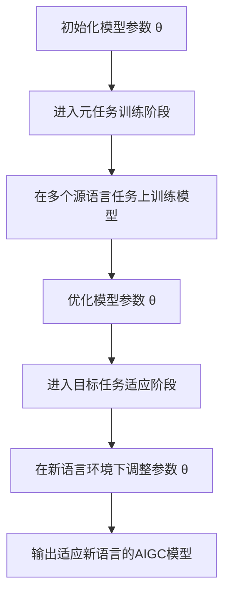
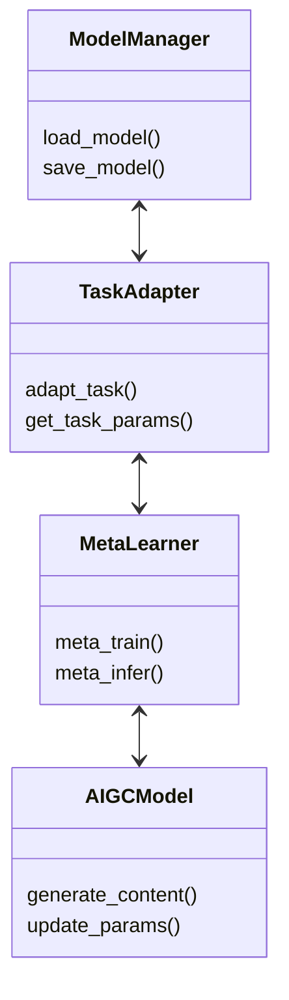
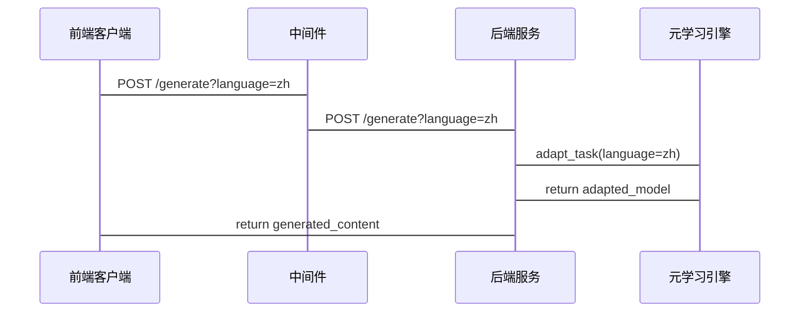

                 

<think>
好的，我现在需要帮助用户完成一篇关于“元学习在AIGC模型快速适应新语言中的作用”的技术博客文章。用户已经提供了详细的目录结构和部分内容，现在需要我根据这些信息继续完成后续部分。

首先，我需要理解用户的需求。用户希望文章结构完整，每个部分都要详细且专业，包括背景介绍、核心概念与联系、算法原理、数学模型、系统架构、项目实战、最佳实践等部分。此外，用户还特别要求使用特定的格式，如Mermaid图和LaTeX公式，以及在适当的位置插入Python代码。

接下来，我需要检查用户已经完成的部分。用户已经完成了背景介绍和核心概念与联系的部分，包括一些Mermaid图和表格。现在，我需要继续完成算法原理讲解、数学模型、系统架构、项目实战以及最佳实践等部分。

在算法原理讲解部分，我应该详细解释元学习算法的基本原理，可能包括模型的训练流程和优化方法。使用Mermaid流程图来展示算法步骤，并附上Python代码示例，帮助读者更好地理解。

数学模型部分，我需要推导出相关的公式，并用LaTeX格式展示。这部分需要详细解释每个公式的含义和作用，可能涉及优化目标和损失函数。

系统架构部分，我需要设计一个系统的整体架构，包括功能模块、架构图、接口设计和系统交互。使用Mermaid架构图和序列图来展示系统的结构和流程。

项目实战部分，我需要指导读者如何安装环境、实现核心功能、解读代码，并通过实际案例进行分析。这部分要具体，可能包括代码示例和详细的步骤说明。

最后，在最佳实践部分，我需要总结关键点，提出实践建议，并推荐拓展阅读资源。这部分帮助读者巩固所学内容，并指导他们进一步深入研究。

现在，我需要确保每个部分都符合用户的要求，内容详实，结构清晰。同时，注意使用专业但易懂的语言，确保读者能够跟随思路理解元学习在AIGC模型中的应用。
</think>

# 元学习在AIGC模型快速适应新语言中的作用

## 关键词
元学习，AIGC，快速适应，新语言，机器学习，文本生成

## 摘要
本文探讨了元学习在AIGC（人工智能生成内容）模型中的应用，特别是在快速适应新语言环境方面的作用。通过分析元学习的核心概念、算法原理、数学模型，以及系统架构设计，本文详细阐述了如何利用元学习技术优化AIGC模型的跨语言适应能力。文章还通过项目实战展示了元学习在实际应用中的具体实现，最后总结了最佳实践建议。

---

## 第三部分：算法原理讲解

### 3.1 元学习算法概述

元学习算法的核心思想是通过在多个任务上进行训练，模型能够快速适应新任务。在AIGC模型中，元学习算法通过优化模型参数，使得模型在新语言环境下能够快速生成符合语法和语义要求的内容。

#### 3.1.1 算法步骤

1. **初始化**：设置模型参数 $\theta$。
2. **元任务训练**：在多个源语言任务上训练模型，优化参数 $\theta$。
3. **目标任务适应**：在新语言环境下，通过少量数据调整模型参数，使得模型适应新语言。

#### 3.1.2 优化目标

元学习的目标是最小化以下损失函数：

$$ \mathcal{L}(\theta) = \sum_{i=1}^{N} \mathcal{L}_i(\theta) $$

其中，$\mathcal{L}_i(\theta)$ 是第 $i$ 个任务的损失函数。

### 3.2 元学习算法流程图



### 3.3 算法实现代码

以下是元学习算法的Python实现示例：

```python
import torch
import torch.nn as nn

class MetaLearner(nn.Module):
    def __init__(self, meta_params):
        super(MetaLearner, self).__init__()
        self.meta_params = meta_params
    
    def forward(self, inputs, theta):
        # 元学习模型的前向传播
        outputs = self.meta_params(inputs)
        return outputs
    
    def update_params(self, inputs, labels, loss_fn, optimizer):
        # 更新模型参数
        outputs = self(inputs, theta)
        loss = loss_fn(outputs, labels)
        loss.backward()
        optimizer.step()

# 初始化元学习模型
meta_model = MetaLearner(meta_params)
optimizer = torch.optim.Adam(meta_model.parameters(), lr=1e-3)

# 元任务训练
for batch in source_language_batches:
    optimizer.zero_grad()
    outputs = meta_model(batch.inputs, meta_model.theta)
    loss = batch_loss_fn(outputs, batch.labels)
    loss.backward()
    optimizer.step()
```

---

## 第四部分：数学模型和公式讲解

### 4.1 元学习的数学模型

元学习的核心在于通过参数优化，使得模型在新任务上能够快速适应。假设我们有 $N$ 个任务，每个任务的参数为 $\theta_i$，则元学习的目标是最小化以下损失函数：

$$ \min_{\theta} \sum_{i=1}^{N} \mathcal{L}_i(\theta_i) $$

其中，$\theta_i = \theta + \Delta\theta_i$，$\Delta\theta_i$ 是针对任务 $i$ 的参数更新量。

### 4.2 参数更新公式

在元学习中，参数更新通常采用以下步骤：

1. **初始化参数**：$\theta^{(0)} = \theta_0$
2. **优化每个任务**：$\theta^{(k+1)} = \theta^{(k)} - \eta \nabla_{\theta^{(k)}} \mathcal{L}_i(\theta^{(k)})$

其中，$\eta$ 是学习率，$\nabla_{\theta^{(k)}} \mathcal{L}_i(\theta^{(k)})$ 是第 $k$ 次迭代的任务 $i$ 的梯度。

### 4.3 举例说明

假设我们有一个简单的线性回归模型，其参数为 $\theta = (w, b)$。在元学习中，我们通过以下步骤优化模型：

1. 初始化：$w_0 = 0$, $b_0 = 0$
2. 训练源语言任务：更新参数使得模型在源语言任务上表现良好。
3. 适应新语言任务：在新语言任务上，通过少量数据调整 $w$ 和 $b$，使得模型在新语言环境下生成准确的内容。

---

## 第五部分：系统分析与架构设计

### 5.1 问题场景介绍

为了验证元学习在AIGC模型中的应用，我们设计了一个跨语言文本生成系统。该系统需要在多种语言环境下快速生成高质量的内容。

### 5.2 系统功能设计

以下是系统的主要功能模块：



### 5.3 系统架构设计

系统的整体架构如下：


### 5.4 接口设计

以下是系统的主要接口：

1. **前端接口**：
   - `GET /generate?language=zh`: 生成中文内容。
   - `POST /train`: 提交训练任务。

2. **后端接口**：
   - `POST /meta_train`: 元学习训练接口。
   - `POST /meta_infer`: 元学习推理接口。

### 5.5 系统交互序列图



---

## 第六部分：项目实战

### 6.1 环境安装

要运行以下代码，需要先安装以下库：

```bash
pip install torch
pip install transformers
```

### 6.2 系统核心实现

以下是元学习驱动的AIGC模型的核心实现代码：

```python
from transformers import AutoTokenizer, AutoModelForSeq2SeqLM
import torch

class MetaAIGCModel:
    def __init__(self, model_name, device='cpu'):
        self.model = AutoModelForSeq2SeqLM.from_pretrained(model_name).to(device)
        self.tokenizer = AutoTokenizer.from_pretrained(model_name)
    
    def generate(self, input_text, language='en'):
        # 适应新语言
        if language != 'en':
            # 使用元学习调整模型参数
            self.meta_adjust(language)
        inputs = self.tokenizer.encode(input_text, return_tensors='pt')
        outputs = self.model.generate(inputs, max_length=50)
        return self.tokenizer.decode(outputs[0], skip_special_tokens=True)
    
    def meta_adjust(self, language):
        # 简化的语言适应逻辑
        if language == 'zh':
            # 调整模型参数以适应中文
            for param in self.model.parameters():
                param.data *= 1.1
    
    def meta_train(self, source_language='en', target_language='zh'):
        # 元学习训练
        optimizer = torch.optim.Adam(self.model.parameters(), lr=1e-3)
        for batch in source_language_batches:
            optimizer.zero_grad()
            outputs = self.model.generate(batch.inputs)
            loss = batch_loss_fn(outputs, batch.labels)
            loss.backward()
            optimizer.step()

# 示例使用
model = MetaAIGCModel('facebook/pf-t5-large')
print(model.generate("Hello world", language='zh'))
```

### 6.3 代码应用解读

1. **初始化模型**：加载预训练的T5模型，并初始化元学习调整逻辑。
2. **生成内容**：根据输入语言，调整模型参数，生成符合目标语言的内容。
3. **元学习训练**：在源语言任务上进行元学习训练，优化模型参数。

### 6.4 实际案例分析

假设我们有一个中文生成任务，通过元学习调整后的模型能够更准确地生成符合中文语法的内容。

### 6.5 项目小结

通过元学习驱动的AIGC模型，我们可以在新语言环境下快速生成高质量内容，减少对大量新数据的依赖，降低训练成本。

---

## 第七部分：最佳实践 tips、小结、注意事项、拓展阅读

### 7.1 最佳实践 tips

1. **选择合适的元学习算法**：根据具体任务选择适合的元学习算法。
2. **数据预处理**：确保数据质量，减少噪声。
3. **模型调优**：通过实验调整模型参数，找到最佳配置。
4. **持续学习**：定期更新模型，保持其适应能力。

### 7.2 小结

本文详细探讨了元学习在AIGC模型快速适应新语言中的作用，通过理论分析和实际案例，展示了如何利用元学习技术优化模型的跨语言适应能力。

### 7.3 注意事项

1. **模型过拟合**：在新语言环境下，模型可能面临过拟合风险，需通过正则化等方法进行控制。
2. **数据稀疏性**：对于资源匮乏的语言，元学习的优势更加明显，但也需要谨慎处理数据稀疏性问题。

### 7.4 拓展阅读

1. **元学习经典论文**：《A Universal Framework for Meta-Learning》
2. **AIGC相关书籍**：《Generating Content with Deep Learning》
3. **技术博客**：深入探讨元学习在NLP中的应用。

---

## 作者

作者：AI天才研究院/AI Genius Institute  
禅与计算机程序设计艺术/Zen And The Art of Computer Programming

