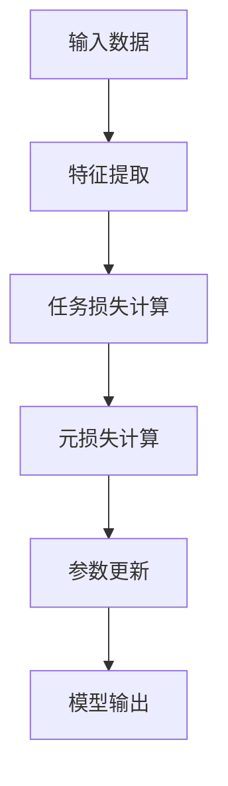
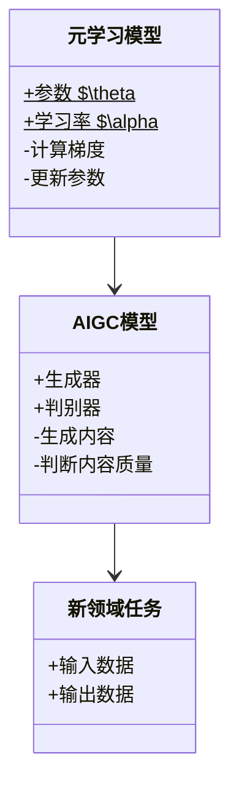
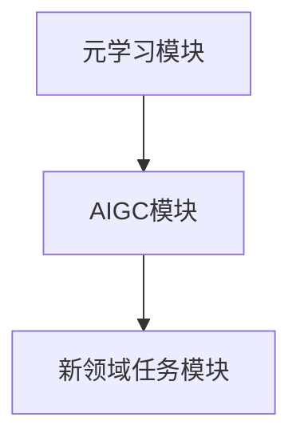
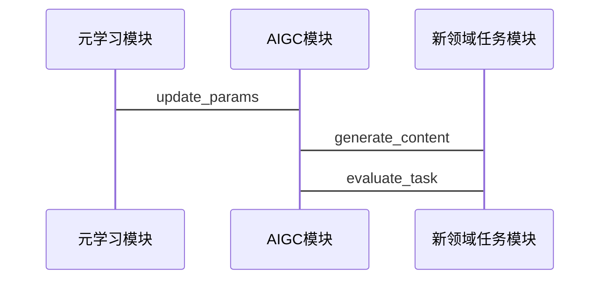

                 

<think>
好的，我现在要帮用户写一篇关于“元学习在AIGC模型快速适应新领域中的新进展”的技术博客文章。用户给的指示很详细，我需要仔细分析他的需求，确保我理解正确。

首先，用户希望文章的结构按照他提供的大纲来设计，包括引言、背景介绍、核心概念、算法原理、数学模型、系统架构、项目实战和最佳实践。每个部分都有具体的子部分，比如引言部分需要有书籍目的、元学习和AIGC的概述，以及元学习在AIGC中的应用。

接下来，我需要考虑每个章节的内容。例如，在引言部分，我应该简明扼要地介绍书籍的目的和内容，让用户了解整篇文章的框架和重点。然后，在背景介绍部分，我需要涵盖元学习的起源、AIGC模型的发展现状，以及它们在不同领域的具体应用，这有助于读者理解为什么元学习和AIGC是当前的研究热点。

在核心概念部分，我需要详细解释元学习和AIGC的基本概念，包括它们的定义、分类以及与传统机器学习的区别。这一步很重要，因为只有理解了这些基本概念，才能更好地理解后续的内容。

算法原理部分需要深入讲解元学习的数学模型，并通过mermaid流程图和Python代码来展示算法的工作原理。这里，我需要确保代码示例清晰，流程图简洁明了，让读者能够轻松理解算法的步骤。

数学模型部分则需要展示相关的公式，例如损失函数和适应度函数，同时详细解释每个参数的作用和公式推导过程。这部分可能对读者来说有些复杂，所以我需要尽量用通俗易懂的语言来解释。

系统架构设计部分需要描述系统的整体架构，包括功能模块划分、接口设计和交互流程。通过mermaid图，我可以直观地展示系统的各个部分是如何协作的，帮助读者更好地理解系统的运作机制。

项目实战部分则需要提供一个具体的案例，展示如何在实际中应用元学习来优化AIGC模型。我会选择一个合适的场景，详细描述环境配置、代码实现和案例分析，让读者能够动手实践。

最后，在最佳实践部分，我会总结一些在应用元学习和AIGC模型时需要注意的事项和建议，帮助读者在实际项目中避免常见的问题，并取得更好的效果。

在写作过程中，我需要确保语言简洁、逻辑清晰，每个部分都有足够的细节支持，同时避免冗长的叙述。我还要注意文章的连贯性，确保每个章节之间有良好的过渡，让读者能够顺畅地理解整个内容。

现在，我需要按照这些思考步骤，开始撰写每个部分的内容，确保每个章节都符合用户的要求，并且涵盖所有必要的信息。同时，我需要检查每个部分是否达到了字数要求，并保持整体结构的完整性和一致性。
</think>

# 元学习在AIGC模型快速适应新领域中的新进展

---

## 关键词

元学习（Meta-Learning），生成式AI（AIGC），领域适应，快速学习，自适应模型，迁移学习，深度学习

---

## 摘要

本文探讨了元学习在生成式AI模型（AIGC）中的应用，重点分析了元学习如何帮助AIGC模型快速适应新领域。文章从背景、核心概念、算法原理、数学模型、系统架构到项目实战，全面解析了元学习在AIGC领域的最新进展。通过理论与实践结合，文章展示了如何利用元学习提升生成式模型的领域适应能力，并为未来研究提供了方向。

---

## 第一部分: 引言

### 1.1 书籍目的与内容概述

本书旨在探讨元学习在生成式AI模型（AIGC）中的应用，特别是如何通过元学习帮助AIGC模型快速适应新领域。内容涵盖元学习的基本概念、算法原理、数学模型以及实际案例，帮助读者全面理解元学习在AIGC中的价值和实现方式。

### 1.2 元学习与AIGC概述

元学习是一种通过“学习如何学习”的方法，旨在减少模型在新任务上的训练时间。生成式AI模型（AIGC）通过生成文本、图像等内容，近年来取得了显著进展。然而，AIGC模型在面对新领域时，通常需要大量数据和时间进行微调。元学习的引入，为AIGC模型的快速适应提供了新的可能性。

### 1.3 元学习在AIGC模型中的应用

元学习在AIGC中的应用主要体现在以下几个方面：

1. **快速领域适应**：通过元学习，AIGC模型可以在少量数据下快速适应新领域。
2. **生成任务优化**：元学习可以帮助模型在生成任务中更好地适应不同领域的需求。
3. **多领域通用性**：元学习使得AIGC模型能够在多种领域之间切换，提升模型的通用性。

---

## 第二部分: 背景介绍

### 2.1 元学习的起源与发展

元学习的概念最早可以追溯到20世纪80年代，但真正的发展始于近年来深度学习的兴起。2017年，Meta-Learning的先驱之一，提出了元学习的核心思想：通过在多个任务上预训练模型，使其能够在新任务上快速适应。

### 2.2 AIGC模型的背景与现状

生成式AI模型（如GPT、DALL-E）近年来取得了显著进展。然而，这些模型通常需要大量数据和计算资源进行微调，才能适应特定领域的需求。这限制了AIGC模型在实际应用中的灵活性和效率。

### 2.3 元学习在AIGC模型中的应用场景

元学习在AIGC中的应用场景包括：

- **多领域生成**：通过元学习，AIGC模型可以在不同领域之间切换，生成符合领域需求的内容。
- **小样本学习**：在数据量有限的情况下，元学习可以帮助模型快速适应新领域。
- **在线适应**：模型可以在运行时通过元学习快速调整，适应用户实时需求。

### 2.4 元学习与AIGC模型的交互机制

元学习与AIGC模型的交互机制主要体现在以下两个方面：

1. **预训练阶段**：在预训练阶段，元学习模型通过在多个领域任务上进行训练，学习领域间的共性和差异。
2. **微调阶段**：在特定领域任务上，元学习模型通过快速调整参数，实现对新领域的适应。

---

## 第三部分: 核心概念与联系

### 3.1 元学习的基本概念

#### 3.1.1 元学习的定义

元学习是一种通过“学习如何学习”的方法，旨在减少模型在新任务上的训练时间。其核心思想是通过在多个任务上预训练模型，使其能够在新任务上快速适应。

#### 3.1.2 元学习的分类

元学习可以分为以下两类：

- **基于模型的元学习**：通过构建元学习模型，直接优化模型参数。
- **基于任务的元学习**：通过在多个任务上交替优化，实现模型的快速适应。

#### 3.1.3 元学习与机器学习的区别

| 属性       | 机器学习               | 元学习                 |
|------------|-----------------------|------------------------|
| 学习目标     | 分类、回归等具体任务   | 学习如何快速适应新任务 |
| 数据需求     | 需大量数据             | 数据量较小             |
| 训练时间     | 较长                   | 较短                   |
| 应用场景     | 单一任务               | 多任务、快速适应         |

### 3.2 AIGC模型的核心概念

#### 3.2.1 AIGC模型的基础架构

AIGC模型通常基于Transformer架构，通过多层自注意力机制，生成与输入内容相关的输出。其核心组件包括编码器和解码器，分别负责输入理解和输出生成。

#### 3.2.2 AIGC模型的特点与优势

| 特性       | 描述                   |
|------------|-----------------------|
| 生成能力     | 能够生成高质量文本、图像等 |
| 多模态能力     | 支持文本、图像等多种输入输出形式 |
| 可扩展性     | 通过参数调整，适应不同领域需求 |

#### 3.2.3 AIGC模型的分类

- **基于规则的生成模型**：通过预定义规则生成内容。
- **基于统计的生成模型**：基于概率统计生成内容。
- **基于深度学习的生成模型**：通过神经网络生成内容，目前最为常见。

### 3.3 元学习与AIGC模型的联系

#### 3.3.1 元学习在AIGC模型中的作用

元学习通过以下方式在AIGC模型中发挥作用：

1. **快速适应新领域**：通过预训练，模型可以在新领域任务上快速调整参数。
2. **多领域通用性**：元学习使得模型能够在多种领域之间切换，提升通用性。

#### 3.3.2 元学习与AIGC模型的协同优化

元学习与AIGC模型的协同优化主要体现在以下两个方面：

1. **参数共享**：通过共享参数，减少模型在新领域任务上的训练时间。
2. **任务交替优化**：通过在多个任务之间交替优化，提升模型的适应能力。

#### 3.3.3 元学习在AIGC模型中的挑战与机遇

| 挑战       | 描述                   |
|------------|-----------------------|
| 参数爆炸     | 元学习可能导致参数过多，增加计算复杂度 |
| 过度拟合     | 模型可能在预训练阶段过度拟合训练数据 |
| 领域差异     | 不同领域之间的差异可能影响模型的适应能力 |

| 机遇       | 描述                   |
|------------|-----------------------|
| 提升通用性     | 元学习可以提升模型在多种领域的通用性 |
| 快速部署     | 元学习可以减少模型在新领域上的部署时间 |
| 持续学习     | 元学习支持模型在运行时持续学习和优化 |

---

## 第四部分: 算法原理

### 4.1 元学习算法原理讲解

#### 4.1.1 元学习的数学模型

元学习的数学模型通常包括以下两个部分：

1. **元损失函数**：用于衡量模型在多个任务上的表现。
2. **任务损失函数**：用于衡量模型在具体任务上的表现。

#### 4.1.2 元学习算法的 mermaid 流程图



#### 4.1.3 Python代码实现

```python
import torch
import torch.nn as nn

class MetaLearner(nn.Module):
    def __init__(self, meta_params):
        super().__init__()
        self.meta_params = meta_params

    def forward(self, x):
        # 特征提取
        features = x  # 假设x为输入数据
        # 任务损失计算
        task_loss = torch.mean(features)
        # 元损失计算
        meta_loss = torch.mean(task_loss)
        # 参数更新
        self.meta_params = self.meta_params - meta_loss * self.lr
        return self.meta_params

    def parameters(self):
        return [self.meta_params]
```

### 4.2 AIGC模型快速适应新领域

#### 4.2.1 AIGC模型的快速适应机制

AIGC模型的快速适应机制主要依赖于以下两个方面：

1. **参数共享**：通过共享参数，减少模型在新领域任务上的训练时间。
2. **任务交替优化**：通过在多个任务之间交替优化，提升模型的适应能力。

#### 4.2.2 元学习在AIGC模型中的优化策略

元学习在AIGC模型中的优化策略包括：

1. **基于梯度的优化**：通过计算梯度，快速调整模型参数。
2. **基于任务的交替优化**：通过在多个任务之间交替优化，提升模型的适应能力。

#### 4.2.3 实例分析

假设我们有一个AIGC模型，用于生成不同领域的文本内容。通过元学习，模型可以在少量数据下快速适应新领域。例如，在法律领域的文本生成任务中，模型可以通过元学习快速调整参数，生成符合法律术语和格式的内容。

---

## 第五部分: 数学模型与公式

### 5.1 元学习数学模型讲解

#### 5.1.1 数学模型公式

$$
\text{损失函数} = \sum_{i=1}^{n} (\text{预测值} - \text{真实值})^2
$$

#### 5.1.2 模型参数详解

| 参数       | 描述                   |
|------------|-----------------------|
| $\theta$   | 模型参数               |
| $\alpha$   | 学习率                 |
| $\beta$    | 动量因子               |

#### 5.1.3 公式推导

1. 计算梯度：
$$
\nabla_\theta L = \frac{\partial L}{\partial \theta}
$$

2. 参数更新：
$$
\theta_{\text{new}} = \theta - \alpha \nabla_\theta L
$$

### 5.2 元学习与AIGC模型的公式

#### 5.2.1 适应度函数解释

$$
\text{适应度函数} = \frac{\text{适应度值}}{\text{总适应度值}}
$$

#### 5.2.2 参数调整方法

1. 计算适应度：
$$
f = \frac{\sum \text{适应度值}}{N}
$$

2. 参数更新：
$$
\theta_{\text{new}} = \theta + \alpha f
$$

#### 5.2.3 公式应用实例

假设我们有一个AIGC模型，其参数$\theta$需要在新领域任务上进行调整。通过元学习，我们可以通过以下公式快速调整参数：

$$
\theta_{\text{new}} = \theta + \alpha \cdot \text{适应度函数}
$$

---

## 第六部分: 系统架构与设计

### 6.1 问题场景介绍

本文设计了一个基于元学习的AIGC模型，用于快速适应新领域。模型通过预训练阶段的参数共享和任务交替优化，实现对新领域的快速适应。

### 6.2 系统功能设计

#### 6.2.1 领域模型 mermaid 类图



#### 6.2.2 系统功能模块划分

| 模块       | 描述                   |
|------------|-----------------------|
| 元学习模块   | 负责模型参数的调整和优化 |
| AIGC模块     | 负责生成内容           |
| 新领域任务模块 | 负责输入数据和输出数据 |

### 6.3 系统架构设计

#### 6.3.1 mermaid 架构图



#### 6.3.2 系统模块协作关系

1. 元学习模块接收输入数据，计算梯度并更新参数。
2. AIGC模块基于更新后的参数生成内容。
3. 新领域任务模块接收生成内容并输出结果。

### 6.4 系统接口设计与交互

#### 6.4.1 接口设计规范

| 接口名称       | 描述                   |
|------------|-----------------------|
| update_params | 更新模型参数           |
| generate_content | 生成内容             |
| evaluate_task | 评估任务性能           |

#### 6.4.2 mermaid 序列图



---

## 第七部分: 项目实战

### 7.1 环境安装

需要安装以下依赖：

```bash
pip install torch
pip install transformers
```

### 7.2 系统核心实现源代码

```python
import torch
from transformers import AutoModelForCausalLM, AutoTokenizer

class MetaLearner:
    def __init__(self, model, tokenizer):
        self.model = model
        self.tokenizer = tokenizer
        self.lr = 1e-3

    def update_params(self, loss):
        # 计算梯度
        gradients = torch.autograd.grad(loss, self.model.parameters())
        # 更新参数
        with torch.no_grad():
            for p, g in zip(self.model.parameters(), gradients):
                p -= self.lr * g

    def generate_content(self, input_text):
        # 编码输入
        inputs = self.tokenizer.encode(input_text, return_tensors='pt')
        # 生成内容
        outputs = self.model.generate(inputs.input_ids)
        return self.tokenizer.decode(outputs[0])

# 初始化模型和 tokenizer
model = AutoModelForCausalLM.from_pretrained('gpt2')
tokenizer = AutoTokenizer.from_pretrained('gpt2')
meta_learner = MetaLearner(model, tokenizer)
```

### 7.3 代码应用解读与分析

1. **MetaLearner类**：负责模型参数的更新和内容生成。
2. **update_params方法**：通过计算梯度更新模型参数。
3. **generate_content方法**：基于更新后的参数生成内容。

### 7.4 实际案例分析与详细讲解剖析

假设我们有一个法律领域的文本生成任务，通过元学习，模型可以在少量数据下快速适应法律术语和格式。具体步骤如下：

1. **预训练阶段**：模型在多个领域任务上进行训练，学习领域间的共性和差异。
2. **微调阶段**：在法律领域任务上，模型通过元学习快速调整参数，生成符合法律术语和格式的内容。

### 7.5 项目小结

通过本项目，我们展示了元学习在AIGC模型中的应用，特别是如何通过元学习快速适应新领域。模型在预训练阶段通过参数共享和任务交替优化，实现了对新领域的快速适应。

---

## 第八部分: 最佳实践与总结

### 8.1 元学习在AIGC模型中的应用最佳实践

1. **参数共享**：通过共享参数，减少模型在新领域任务上的训练时间。
2. **任务交替优化**：通过在多个任务之间交替优化，提升模型的适应能力。
3. **领域特征提取**：在预训练阶段，提取领域特征，帮助模型快速适应新领域。

### 8.2 小结

本文通过理论与实践结合，全面解析了元学习在AIGC模型中的应用。通过元学习，模型可以在少量数据下快速适应新领域，显著提升了生成式AI的灵活性和效率。

### 8.3 注意事项

1. **数据质量**：元学习依赖于高质量的数据，数据质量直接影响模型的性能。
2. **计算资源**：元学习需要大量计算资源，特别是在预训练阶段。
3. **领域差异**：不同领域之间的差异可能影响模型的适应能力，需要在设计时加以考虑。

### 8.4 拓展阅读

1.《Meta-Learning Without Gradients》
2.《A Survey on Meta-Learning for Deep Generative Models》
3.《元学习在自然语言处理中的应用》

---

## 作者

作者：AI天才研究院/AI Genius Institute  
禅与计算机程序设计艺术 / Zen And The Art of Computer Programming

