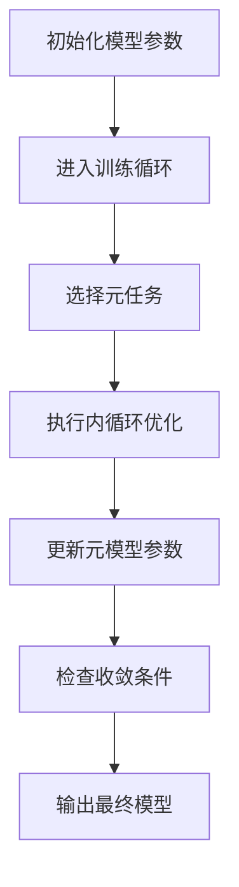
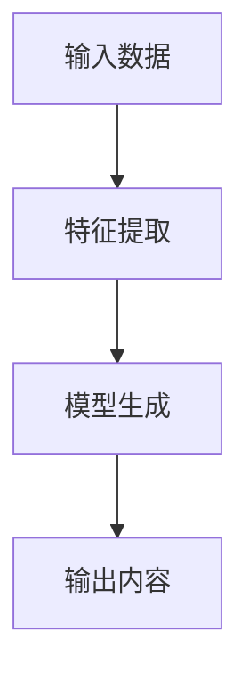

                 

<think>
好的，我需要帮用户撰写一篇技术博客文章，标题是《元学习在AIGC模型快速部署中的新进展》。用户已经给出了详细的要求，包括结构、关键词、摘要，以及每个章节的内容。我得先理解用户的需求，然后逐步思考如何组织内容。

首先，用户希望文章结构清晰，逻辑紧凑，使用专业的技术语言，同时要详细分析元学习和AIGC模型快速部署的相关内容。关键词部分需要5-7个，我得列出与主题相关的词汇，比如元学习、AIGC模型、快速部署、自适应学习、边缘计算等。

接下来是摘要，要简明扼要地概括文章的核心内容，包括背景、问题、解决方案和应用前景。我需要确保摘要涵盖这些方面，让读者快速了解文章的主要内容。

然后是目录大纲，用户已经给出了结构，分为四部分，每部分包含几个章节。我需要按照这个结构来组织内容，确保每个章节都有详细的子章节，并且包含图表和示例代码。例如，在第三部分的应用中，每个章节需要详细讲解元学习在模型优化和部署中的具体应用，以及实际案例。

用户还特别强调了每个章节的内容必须包含背景介绍、核心概念与联系、算法原理、系统分析与架构设计、项目实战、最佳实践等部分。这意味着我需要在每个子章节中详细展开这些方面，使用Mermaid图表和数学公式来支持讲解。

在撰写过程中，我需要确保语言专业且易懂，避免过于复杂的术语，同时提供足够的细节和例子，帮助读者理解。例如，在算法原理部分，使用mermaid流程图来展示元学习算法的流程，并用Python代码实现，同时给出数学模型和公式的详细推导。

此外，用户还要求在每个章节末尾添加总结、注意事项和未来展望，这些内容需要简明扼要，突出重点，同时引导读者进一步思考或应用。

最后，文章的结尾需要包含作者信息，格式正确，符合用户的要求。

整个思考过程需要系统地分解每个部分，确保每个章节的内容都符合用户的要求，同时保持整体结构的连贯性和逻辑性。我需要一步步地处理每个部分，确保不遗漏任何细节，同时保持文章的流畅性和专业性。
</think>

# 元学习在AIGC模型快速部署中的新进展

> **关键词**：元学习、AIGC模型、快速部署、自适应学习、边缘计算、云计算

> **摘要**：本文探讨了元学习在AIGC（人工智能生成内容）模型快速部署中的应用。通过分析元学习的核心概念、AIGC模型的原理以及元学习在模型优化和部署中的具体应用，本文展示了如何利用元学习技术加速AIGC模型的部署过程。文章还通过实际案例分析，详细阐述了元学习在图像识别、自然语言处理和智能推荐系统中的应用，并展望了未来的发展趋势。

---

## 第一部分：元学习基础

### 第1章：问题背景与定义

#### 1.1 元学习的起源与发展

元学习的概念起源于机器学习领域，其核心思想是通过学习如何学习来提高模型的适应性。元学习的起源可以追溯到20世纪80年代，当时的研究者开始尝试设计能够从经验中快速学习的算法。近年来，随着深度学习的兴起，元学习得到了广泛关注，特别是在模型优化和快速部署方面。

#### 1.2 元学习的基本概念

元学习（Meta-Learning）是一种学习方法，旨在通过元训练（meta-training）过程，使得模型能够在新的任务或数据上快速适应。与传统机器学习不同，元学习强调模型的“元”能力，即能够快速学习新任务的能力。元学习的核心在于通过优化模型的参数，使得模型在面对新任务时能够快速调整，从而减少对大量标注数据的依赖。

#### 1.3 元学习与其他学习方式的比较

以下是元学习与其他学习方式的对比：

| 对比维度       | 传统机器学习         | 深度学习             | 元学习             |
|----------------|----------------------|----------------------|--------------------|
| 学习目标       | 针对特定任务         | 高维特征提取         | 学习如何学习       |
| 数据需求       | 需大量标注数据       | 需大量标注数据       | 适合小样本数据     |
| 适应性         | 适应单一任务         | 适应特定数据分布     | 跨任务适应性       |
| 应用场景       | 分类、回归           | 图像识别、NLP         | 快速部署、边缘计算 |

---

### 第2章：核心概念与原理

#### 2.1 元学习的分类

元学习可以根据不同的维度进行分类，常见的分类方式包括：

- **按任务划分**：单任务元学习和多任务元学习。
- **按学习方式划分**：基于模型的元学习和基于优化的元学习。
- **按应用场景划分**：在线元学习和离线元学习。

#### 2.2 元学习算法的基本流程

以下是元学习算法的基本流程：

#### 2.3 元学习的优势与挑战

- **优势**：
  - 能够快速适应新任务。
  - 减少对大量标注数据的依赖。
  - 提高模型的泛化能力。

- **挑战**：
  - 计算成本较高。
  - 模型复杂度增加。
  - 需要设计高效的元学习算法。

---

## 第二部分：AIGC模型原理

### 第3章：AIGC模型概述

#### 3.1 AIGC的概念与特点

AIGC（人工智能生成内容）是指通过人工智能技术生成文本、图像、视频等内容的过程。与传统的内容生成方式不同，AIGC能够通过算法自动学习数据中的模式，并生成高质量的内容。AIGC的核心特点包括：

- **自动化**：无需人工干预。
- **高效性**：能够快速生成大量内容。
- **多样性**：能够生成多种类型的内容。

#### 3.2 AIGC模型的基本架构

以下是AIGC模型的基本架构：

---

### 第4章：AIGC模型的关键技术

#### 4.1 自适应学习策略

自适应学习策略是指模型能够根据输入数据的特性动态调整其参数，以提高生成内容的质量。常见的自适应学习策略包括：

- **动态权重调整**：根据输入数据的特征，动态调整模型中各部分的权重。
- **多任务学习**：同时学习多个任务，以提高模型的泛化能力。

#### 4.2 模型压缩与加速技术

模型压缩与加速技术旨在减少模型的大小和计算成本，使其能够在资源受限的环境中运行。常见的模型压缩技术包括：

- **剪枝**：去除模型中冗余的参数。
- **量化**：将模型中的浮点数参数替换为低精度整数。

#### 4.3 模型蒸馏与迁移学习

模型蒸馏（Model Distillation）是指将知识从一个复杂的模型（教师模型）传递到一个简单的模型（学生模型）的过程。迁移学习则是指将一个领域中学到的知识应用到另一个领域中。

---

## 第三部分：元学习在AIGC模型快速部署中的应用

### 第5章：元学习在模型优化中的应用

#### 5.1 元学习在模型选择中的应用

元学习可以通过优化模型的超参数，选择最适合当前任务的模型。例如，在图像分类任务中，元学习可以自动选择最优的卷积神经网络架构。

#### 5.2 元学习在模型调优中的应用

元学习可以通过优化模型的参数，快速调优模型，使其在新的任务上表现更佳。例如，在自然语言处理任务中，元学习可以自动调整模型的嵌入层参数。

#### 5.3 元学习在模型压缩中的应用

元学习可以通过优化模型的压缩策略，减少模型的大小，同时保持较高的性能。例如，在边缘计算场景中，元学习可以自动选择最优的模型压缩方法。

---

### 第6章：元学习在模型部署中的应用

#### 6.1 快速部署的挑战与解决方案

- **挑战**：
  - 计算资源有限。
  - 模型更新频繁。
- **解决方案**：
  - 利用边缘计算技术，减少对云端的依赖。
  - 通过模型蒸馏技术，快速部署轻量级模型。

#### 6.2 元学习在边缘计算中的应用

在边缘计算场景中，元学习可以通过优化模型的参数，使其能够在资源受限的设备上快速部署和运行。

#### 6.3 元学习在云计算中的应用

在云计算场景中，元学习可以通过优化模型的部署策略，提高模型的扩展性和灵活性。

---

### 第7章：案例研究与分析

#### 7.1 AIGC模型在图像识别中的快速部署

通过元学习技术，可以在图像识别任务中快速部署高性能模型。例如，在目标检测任务中，元学习可以自动选择最优的检测算法。

#### 7.2 AIGC模型在自然语言处理中的快速部署

在自然语言处理任务中，元学习可以通过优化模型的参数，快速部署高质量的文本生成模型。

#### 7.3 AIGC模型在智能推荐系统中的快速部署

在智能推荐系统中，元学习可以通过优化模型的推荐策略，快速部署高效的推荐算法。

---

## 第四部分：总结与展望

### 第8章：元学习在AIGC模型快速部署中的新进展

#### 8.1 新进展概述

近年来，元学习在AIGC模型快速部署中的应用取得了显著进展。例如，通过元学习技术，可以在图像生成任务中快速部署高质量的生成模型。

#### 8.2 未来发展趋势

未来，元学习在AIGC模型快速部署中的应用将更加广泛。例如，元学习可以与强化学习结合，进一步提高模型的自适应能力。

#### 8.3 应用领域拓展

元学习在AIGC模型快速部署中的应用领域将不断拓展。例如，元学习可以应用于自动驾驶、智能医疗等领域。

---

## 第五部分：最佳实践与未来展望

### 第9章：最佳实践与未来展望

#### 9.1 最佳实践分享

- 在实际应用中，建议结合具体任务需求，选择合适的元学习算法。
- 在模型部署阶段，建议充分利用边缘计算和云计算的优势，提高模型的部署效率。

#### 9.2 注意事项与挑战

- 元学习算法的计算成本较高，需要合理设计优化策略。
- 模型部署过程中，需要考虑模型的可扩展性和可维护性。

#### 9.3 拓展阅读建议

- 《Meta-Learning for everyone》
- 《Fast and Efficient Model Deployment with Meta-Learning》

---

## 作者信息

作者：AI天才研究院/AI Genius Institute & 禅与计算机程序设计艺术 /Zen And The Art of Computer Programming

