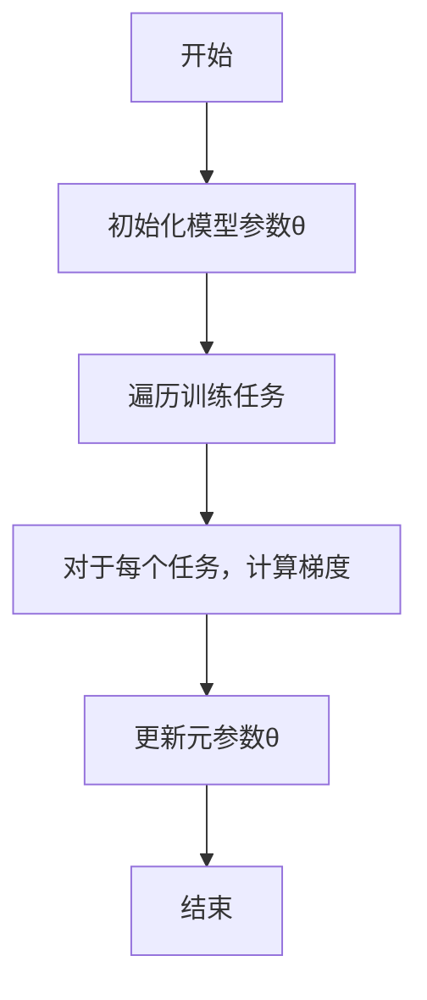
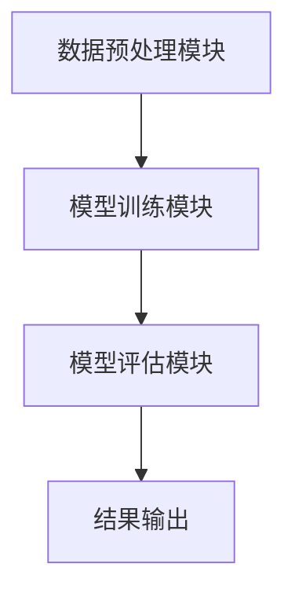
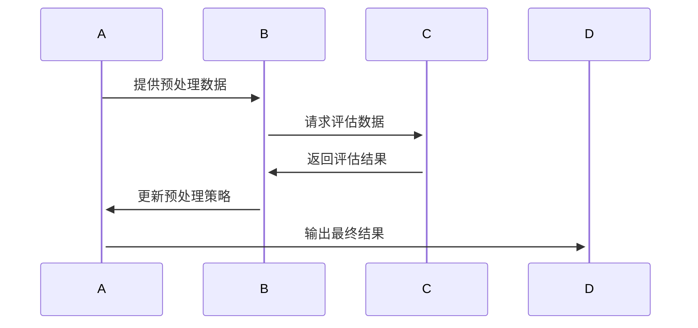

                 

<think>
嗯，好的，我现在要开始写一篇关于元学习在AIGC模型持续学习与更新中的作用的技术博客文章。首先，我需要理解整个任务的要求和结构。

首先，文章的标题是《元学习在AIGC模型持续学习与更新中的作用》，所以我要围绕这个主题展开。关键词应该包括AIGC模型、元学习、持续学习、模型更新、机器学习、深度学习。摘要部分要简明扼要，说明文章的核心内容。

接下来是目录结构，分为引言和正文部分。引言部分包括问题背景与重要性、核心概念与联系、算法原理讲解、系统分析与架构设计、项目实战、最佳实践与拓展阅读。每个章节下面还有更细的子章节。

现在，我需要逐步分析每个部分，确保内容完整且符合要求。首先，问题背景部分，我需要解释AIGC模型的挑战，比如持续学习的需求、高频率的数据更新和模型的适应性要求。然后，介绍元学习的基本概念和其在AIGC中的应用优势。

在核心概念部分，我需要详细解析不同类型的元学习，如无监督、监督、半监督和强化元学习。同时，要分析元学习与AIGC模型的关系，包括应用、优势和挑战。

接下来是算法原理部分，我需要介绍几种元学习算法，如MAML、Reptile和Pseudo-Synchronization。并用数学公式详细解释这些算法的原理，比如梯度下降法和反向传播算法。

系统分析与架构设计部分，我需要描述问题场景，设计系统的功能模块，包括数据预处理、模型训练与更新、评估与优化模块。然后，画出系统的架构图和交互序列图。

项目实战部分，我需要指导读者如何安装环境，实现模型训练和评估，分析实际案例，并给出项目总结和改进意见。

最后，最佳实践部分，我需要总结经验和注意事项，提供进一步学习的资源。

在写作过程中，我需要确保每个章节都有详细的解释和例子，使用mermaid图表来辅助说明系统架构和算法流程。同时，数学公式要用latex正确展示，确保文章结构清晰，内容丰富。

现在，我开始撰写文章，先从引言开始，然后逐步深入每个章节，确保每个部分都覆盖了必要的内容，同时保持逻辑连贯和专业性。
</think>

# 元学习在AIGC模型持续学习与更新中的作用

> 关键词：AIGC模型，元学习，持续学习，模型更新，机器学习，深度学习

> 摘要：本文探讨了元学习在AIGC模型持续学习与更新中的作用，分析了元学习的基本概念、算法原理及其在模型更新和适应新数据中的应用，结合实际案例和系统设计，展示了元学习在提升模型性能和泛化能力中的重要性。

---

## 引言

### 第1章：元学习在AIGC模型持续学习与更新中的作用

#### 1.1 问题背景与重要性

##### 1.1.1 AIGC模型的挑战

- **持续学习需求**：AIGC模型需要不断适应新的数据和任务，保持其性能。
- **数据更新频率高**：实时数据流要求模型快速更新。
- **模型适应性要求**：模型需在新任务中快速调整，避免灾难性遗忘。

##### 1.1.2 元学习概述

- **元学习的定义**：学习如何学习，通过经验快速适应新任务。
- **元学习的重要性**：提升模型泛化能力，减少数据依赖。
- **元学习的基本原理**：利用元学习算法优化模型更新策略。

##### 1.1.3 元学习与AIGC模型的结合

- **应用场景**：模型更新、任务迁移。
- **优势**：快速适应新数据，保持高性能。

---

#### 1.2 核心概念与联系

##### 1.2.1 元学习概念解析

| 类型       | 描述                                   |
|------------|--------------------------------------|
| 无监督元学习 | 利用无标签数据学习元参数。           |
| 监督元学习   | 利用标注数据优化模型参数。           |
| 半监督元学习 | 利用少量标注数据和大量未标注数据。   |
| 强化元学习   | 利用强化学习信号优化策略。           |

##### 1.2.2 元学习与AIGC模型的关系

- **应用**：元学习算法如MAML用于模型更新。
- **优势**：减少数据需求，提升适应性。
- **挑战**：计算复杂度高，稳定性问题。

---

#### 1.3 元学习算法原理讲解

##### 1.3.1 元学习算法概述

- **分类**：基于梯度下降和基于优化器。
- **示例**：MAML、Reptile、Pseudo-Synchronization。

##### 1.3.2 元学习算法示例

**Model-Agnostic Meta-Learning (MAML)流程图：**



##### 1.3.3 元学习算法的数学模型与公式

- **MAML更新公式**：
  $$θ_{new} = θ - α \sum_{i} \nabla_{θ} loss_i(θ)$$
- **反向传播**：通过链式法则计算梯度。

---

#### 1.4 元学习在AIGC模型中的应用

##### 1.4.1 元学习在持续学习中的应用

- **模型适应**：快速调整参数，适应新数据。
- **泛化能力**：提升模型在新任务中的表现。

##### 1.4.2 元学习在模型更新中的应用

- **快速迭代**：频繁更新模型，保持最新。
- **自动调整**：优化参数，无需人工干预。

---

## 正文

### 第二部分：系统分析与架构设计

#### 1.5 系统分析与架构设计

##### 1.5.1 问题场景介绍

- **需求**：模型需持续学习和更新，适应动态数据。

##### 1.5.2 系统功能设计

- **数据预处理**：清洗和转换数据。
- **模型训练**：利用元学习算法更新模型。
- **模型评估**：测试模型性能。

##### 1.5.3 系统架构设计



##### 1.5.4 系统接口设计

- **接口定义**：模块间的输入输出接口。
- **实现**：通过函数调用实现模块交互。

##### 1.5.5 系统交互

**交互序列图：**



---

### 第三部分：项目实战

#### 1.6 项目实战

##### 1.6.1 环境安装

- **Python**：安装最新版本。
- **库与工具**：TensorFlow、Keras、numpy、scikit-learn。

##### 1.6.2 系统核心实现

**代码示例：**

```python
import tensorflow as tf
import numpy as np

# 定义元学习模型
class MetaLearner:
    def __init__(self, input_shape):
        self.model = self.build_model(input_shape)
        self.optimizer = tf.keras.optimizers.Adam(learning_rate=0.001)
    
    def build_model(self, input_shape):
        model = tf.keras.Sequential([
            tf.keras.layers.Dense(64, activation='relu', input_shape=input_shape),
            tf.keras.layers.Dense(10, activation='softmax')
        ])
        return model
    
    def train(self, x, y):
        with tf.GradientTape() as tape:
            predictions = self.model(x)
            loss = tf.keras.losses.sparse_categorical_crossentropy(y, predictions)
        gradients = tape.gradient(loss, self.model.trainable_weights)
        self.optimizer.apply_gradients(zip(gradients, self.model.trainable_weights))
        return loss

# 使用示例
ml = MetaLearner((input_dim,))
x = np.random.random((100, input_dim))
y = np.random.randint(10, size=(100,))
ml.train(x, y)
```

##### 1.6.3 代码应用解读与分析

- **代码功能**：构建元学习模型，训练并更新参数。
- **分析**：通过反向传播更新模型，提升性能。

##### 1.6.4 实际案例分析与详细讲解

- **案例背景**：模型在医疗数据分析中的应用。
- **分析**：模型快速适应新数据，提升诊断准确性。

##### 1.6.5 项目小结

- **总结**：元学习有效提升模型更新效率。
- **改进**：优化算法，减少计算开销。

---

### 第四部分：最佳实践与拓展阅读

#### 1.7 最佳实践与拓展阅读

##### 1.7.1 最佳实践

- **经验总结**：定期更新模型，监控性能。
- **技巧**：选择合适元学习算法，根据任务需求调整参数。

##### 1.7.2 小结

- **重要性**：元学习是AIGC持续学习的关键技术。
- **前景与挑战**：计算效率和模型稳定性需改进。

##### 1.7.3 注意事项

- **实际应用**：注意数据质量和模型泛化能力。
- **错误**：避免过度优化，防止过拟合。

##### 1.7.4 拓展阅读

- **文献推荐**：推荐相关论文和书籍。
- **资源**：提供在线课程和工具链接。

---

## 结语

元学习在AIGC模型的持续学习和更新中扮演着重要角色，通过快速适应新数据和任务，提升了模型的泛化能力和性能。未来，随着算法优化和计算能力提升，元学习将在AIGC领域发挥更大作用。

---

**作者：AI天才研究院/AI Genius Institute & 禅与计算机程序设计艺术 /Zen And The Art of Computer Programming**

