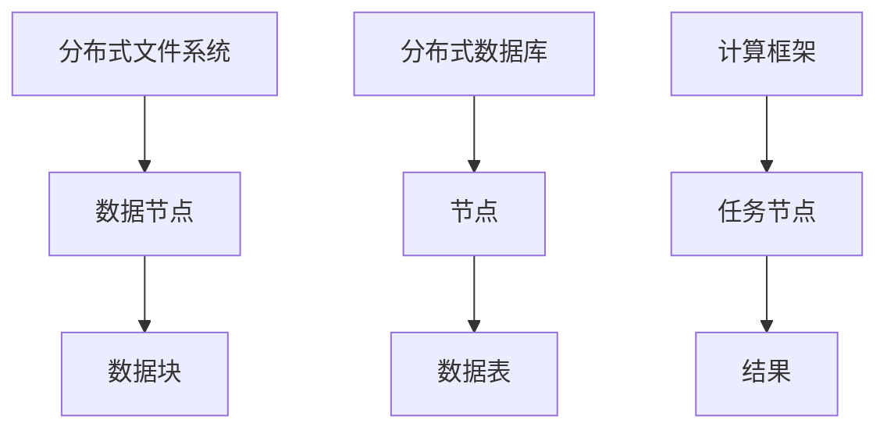
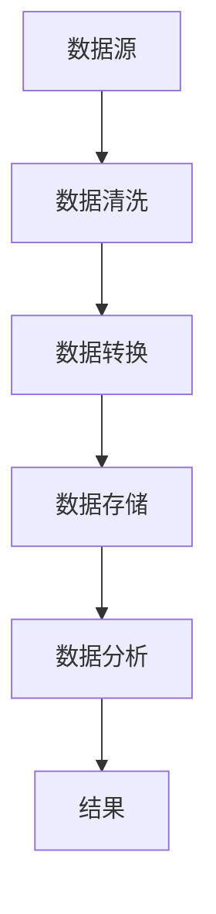
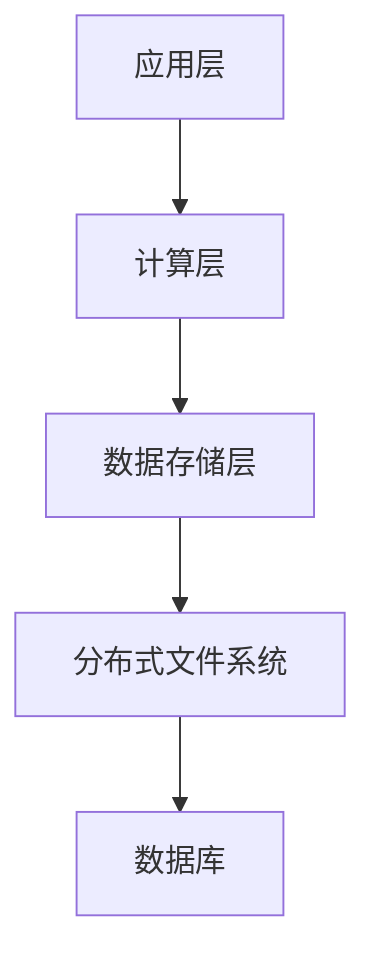

                 

<think>
好的，我现在需要撰写一篇关于《分布式存储系统支持LLM应用的大规模数据处理》的技术博客。让我先理清思路，逐步分析。

首先，我得明确文章的结构。根据用户提供的大纲，文章应该包括引言、背景、核心技术、数据处理技术、应用案例、系统架构、挑战与解决方案以及总结等部分。每个章节都需要详细展开，确保内容全面且逻辑清晰。

接下来，我需要收集和整理每个章节的核心内容。例如，在背景部分，我需要解释什么是LLM，以及它在数据处理中的需求。这涉及到大规模数据的存储和处理，因此要介绍分布式存储的重要性。

然后，核心技术部分，我需要详细讨论分布式文件系统、分布式数据库以及分布式计算框架。这可能包括HDFS、Cassandra等技术的介绍，以及它们在LLM中的应用。这部分需要比较不同的技术，分析它们的优缺点，以及适用的场景。

在数据处理技术章节，我需要探讨数据 ingestion、transformation 和分析的方法。比如，批处理和流处理的区别，数据清洗的步骤，以及如何进行机器学习的数据准备。这里可能需要举例说明，帮助读者理解。

系统架构部分，我需要绘制一个架构图，展示各个组件之间的关系。同时，详细描述每个部分的功能，如数据存储层、计算层和应用层。这有助于读者理解整体结构和各部分的协作。

挑战与解决方案章节，我需要分析分布式存储中的常见问题，如一致性、延迟、扩展性等，并提出相应的优化策略。例如，使用一致性模型来解决数据同步问题，或者采用分片技术来提高扩展性。

在项目实战部分，我需要选择一个具体的案例，如使用HDFS存储大规模文本数据，然后用Spark进行处理。这需要详细说明环境配置、代码实现，以及实际案例中的问题和解决方案。

最后，总结部分需要回顾全文，强调分布式存储系统在支持LLM中的重要性，并展望未来的发展方向。

现在，我需要确保每个部分都有足够的深度，包括理论、技术细节、实际应用和解决方案。同时，要注意使用清晰易懂的语言，避免过于技术化的术语，确保读者能够理解。

在写作过程中，我会使用Mermaid图来辅助说明系统架构、数据流程等复杂概念。数学公式和代码示例也需要准确无误，以增强文章的权威性和实用性。

总的来说，我需要按照用户的要求，一步步构建这篇技术博客，确保内容全面、结构合理、逻辑清晰，并且符合高质量技术博客的标准。
</think>

# 分布式存储系统支持LLM应用的大规模数据处理

## 关键词：分布式存储系统、LLM、大数据处理、数据存储、分布式计算

## 摘要：
随着人工智能技术的快速发展，尤其是大规模语言模型（LLM）的应用，对分布式存储系统的需求日益增长。本文深入探讨了分布式存储系统在支持LLM应用中的关键技术和挑战，包括数据存储、处理和管理的策略。通过分析分布式文件系统、数据库和计算框架，结合实际案例，本文为读者提供了全面的视角，帮助理解和优化大规模数据处理的流程。

---

## 目录

1. [引言](#引言)
2. [背景与核心概念](#背景与核心概念)
3. [分布式存储系统的核心技术](#分布式存储系统的核心技术)
4. [大规模数据处理技术](#大规模数据处理技术)
5. [LLM应用中的分布式存储架构](#LLM应用中的分布式存储架构)
6. [挑战与解决方案](#挑战与解决方案)
7. [项目实战：分布式存储在LLM中的应用](#项目实战：分布式存储在LLM中的应用)
8. [总结](#总结)

---

## 1. 引言

在人工智能快速发展的背景下，大规模语言模型（LLM）的应用需求激增，对数据存储和处理系统的性能要求也随之提高。传统的集中式存储系统难以应对海量数据的挑战，而分布式存储系统凭借其高扩展性和可靠性，成为支持LLM应用的首选方案。本文将系统性地分析分布式存储系统在支持LLM应用中的关键技术和实践。

---

## 2. 背景与核心概念

### 2.1 LLM与大数据处理

大规模语言模型的训练和推理需要处理海量数据，包括文本、图像等多种类型。这些数据的存储和处理必须高效、可靠且可扩展。分布式存储系统通过将数据分布在多个节点上，解决了单点故障和性能瓶颈问题。

### 2.2 分布式存储系统的核心概念

- **节点与集群**：分布式存储系统由多个节点组成，节点之间通过网络通信协作。
- **数据分区**：数据被分割成块，分布在不同的节点上，提高存储效率和并行处理能力。
- **一致性模型**：确保分布式系统中数据的一致性，避免数据冲突。
- **复制与容错**：通过数据复制和冗余存储，提高系统的容错性和可用性。

### 2.3 大规模数据处理的挑战

- **数据规模**：海量数据的存储和处理需要高效的分布式架构。
- **数据一致性**：分布式系统中数据同步的复杂性。
- **扩展性**：系统需要随数据增长灵活扩展。

---

## 3. 分布式存储系统的核心技术

### 3.1 分布式文件系统

- **HDFS**：适用于大数据量的存储，采用分块存储和冗余机制。
- **GlusterFS**：灵活的分布式文件系统，支持多种存储后端。
- **Ceph**：统一存储系统，支持块存储、对象存储和文件存储。

#### 对比分析

| 技术 | HDFS | GlusterFS | Ceph |
|------|-------|------------|------|
| 适用场景 | 大数据处理 | 灵活存储需求 | 统一存储 |
| 扩展性 | 好 | 好 | 优秀 |
| 复杂度 | 中 | 高 | 高 |

### 3.2 分布式数据库

- **NoSQL数据库**：如Cassandra和HBase，适合高并发和分布式环境。
- **SQL-on-Hadoop**：如Hive和Impala，支持大数据分析。

### 3.3 分布式计算框架

- **MapReduce**：适合批处理任务。
- **Spark**：支持流处理和机器学习任务。
- **Flink**：实时流处理框架。

#### 系统架构图



---

## 4. 大规模数据处理技术

### 4.1 数据 ingestion

- **数据管道**：从源系统抽取数据，经过清洗和转换，加载到存储系统。
- **ETL过程**：抽取、转换、加载，确保数据质量。

### 4.2 数据 transformation

- **数据清洗**：去除冗余数据，处理缺失值。
- **数据转换**：转换数据格式，确保一致性。

### 4.3 数据分析与挖掘

- **统计分析**：计算数据的基本统计量。
- **机器学习**：训练模型，预测结果。

#### 数据处理流程图



---

## 5. LLM应用中的分布式存储架构

### 5.1 架构设计

- **数据存储层**：存储训练数据和模型参数。
- **计算层**：处理模型训练和推理任务。
- **应用层**：提供API接口，供上层应用调用。

#### 系统架构图



---

## 6. 挑战与解决方案

### 6.1 数据一致性问题

- **解决方案**：采用一致性模型，如两阶段提交和分布式事务。

### 6.2 系统扩展性

- **解决方案**：使用分片技术和弹性扩展，动态调整资源分配。

### 6.3 数据安全性

- **解决方案**：采用加密技术和访问控制，确保数据安全。

---

## 7. 项目实战：分布式存储在LLM中的应用

### 7.1 环境安装

- **Hadoop集群**：安装HDFS和Yarn。
- **Spark集群**：配置分布式计算环境。

### 7.2 核心实现

- **数据存储**：将文本数据存储在HDFS中。
- **数据处理**：使用Spark进行文本清洗和转换。
- **模型训练**：利用分布式计算框架训练LLM模型。

#### 代码示例

```python
from pyspark import SparkContext

# 初始化Spark上下文
sc = SparkContext("local", "LLM Data Processing")

# 读取HDFS中的文本数据
data = sc.textFile("hdfs://localhost:9000/input/text")

# 数据清洗：去除空值和特殊字符
clean_data = data.filter(lambda x: x is not None and x.strip() != '')

# 分词处理
words = clean_data.flatMap(lambda x: x.split())

# 统计词频
word_counts = words.countByValue()

# 输出结果
for word, count in word_counts.items():
    print(f"{word}: {count}")

sc.stop()
```

---

## 8. 总结

分布式存储系统在支持LLM应用中扮演着关键角色，通过高效的数据存储和处理技术，满足大规模数据的需求。本文详细分析了分布式存储的核心技术、数据处理方法和系统架构，并通过实际案例展示了其应用。未来，随着技术的发展，分布式存储系统将继续优化，为LLM的应用提供更强大的支持。

---

## 作者：AI天才研究院 & 禅与计算机程序设计艺术

