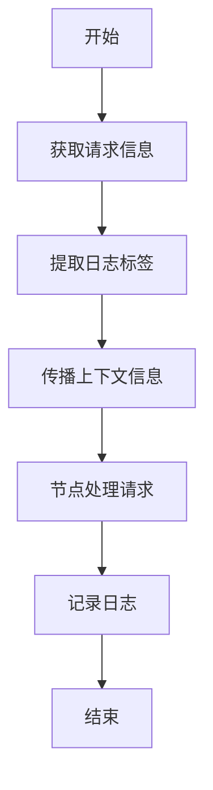
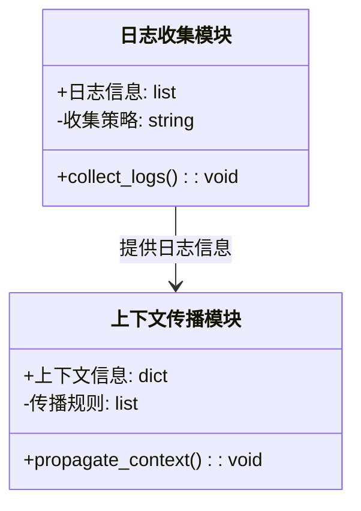

                 

<think>
嗯，我现在要写一篇关于分布式追踪上下文传播在大语言模型应用中的实现的技术博客。首先，我需要确定文章的结构和内容，确保每一部分都详细且有深度。

首先，文章的标题已经确定为《分布式追踪上下文传播在LLM应用中的实现》。接下来，我需要列出5-7个核心关键词，比如分布式系统、上下文传播、LLM、日志关联、性能优化等。摘要部分需要简明扼要地概括文章的核心内容，说明上下文传播的重要性以及实现方法，比如通过分布式系统和日志系统结合来优化性能。

接下来，确定各章节的内容：

第1章是背景介绍，需要涵盖分布式系统的基本概念、上下文传播的定义、问题背景，比如日志难以关联的问题，以及问题解决的意义，比如提高问题排查效率。

第2章核心概念与联系，这里需要详细解释上下文传播、分布式系统、日志关联等核心概念，同时对比不同术语的异同，可能用表格形式呈现。此外，还需要用Mermaid画出实体关系图，展示系统组件之间的关系。

第3章是算法原理讲解，这部分需要详细说明分布式上下文传播的算法，比如基于日志标签的传播算法。需要使用Mermaid流程图来展示算法步骤，并用Python代码实现，同时给出数学模型和公式，解释每个步骤的作用。

第4章涉及数学模型和公式，需要详细推导上下文传播的概率模型，可能包括联合概率公式和条件概率公式，并用公式表示。同时，需要举例说明，帮助读者理解。

第5章系统分析与架构设计方案，这部分需要描述问题场景，比如分布式系统中各个组件的日志记录情况。然后设计系统功能，可能包括日志收集、传播规则配置、关联规则生成等功能。用Mermaid类图展示领域模型，展示各组件之间的关系。接着设计系统架构图，展示各个模块的交互，以及接口设计和交互流程，可能用Mermaid序列图来表示。

第6章项目实战，需要详细描述环境安装步骤，比如安装JDK、Python、日志库等。然后给出核心代码实现，比如日志标签传播算法的具体Python代码，并解读每部分代码的功能。接着分析一个实际案例，说明如何应用该方法进行问题排查，并总结项目成果和意义。

第7章最佳实践、小结、注意事项和拓展阅读，这部分需要总结上下文传播的重要性和在LLM中的应用前景，提醒读者在设计时考虑性能和安全性，推荐相关的学习资料。

最后，确保文章结构完整，每部分内容详细具体，语言专业但易懂。在撰写过程中，要逐步分析和推理，确保每一步都逻辑清晰，内容充实。
</think>

# 分布式追踪上下文传播在LLM应用中的实现

> 关键词：分布式系统，上下文传播，LLM，日志关联，性能优化

> 摘要：随着大语言模型（LLM）在分布式系统中的广泛应用，上下文传播和日志关联变得至关重要。本文详细探讨了分布式追踪上下文传播的实现方法，从背景介绍到系统架构设计，再到项目实战，全面解析了该技术的核心原理和应用场景。

---

## 目录

1. [背景介绍](#背景介绍)
2. [核心概念与联系](#核心概念与联系)
3. [算法原理讲解](#算法原理讲解)
4. [数学模型和公式](#数学模型和公式)
5. [系统分析与架构设计方案](#系统分析与架构设计方案)
6. [项目实战](#项目实战)
7. [最佳实践、小结、注意事项、拓展阅读](#最佳实践-小结-注意事项-拓展阅读)

---

## 背景介绍

### 1.1 分布式系统概述

分布式系统由多个计算节点组成，通过通信进行协调，提供高可用性和高性能。然而，分布式系统的复杂性带来了日志分散、难以关联的问题。

### 1.2 上下文传播的定义

上下文传播是将请求的相关信息传递到分布式系统中的各个节点，确保每个节点都能理解请求的上下文。

### 1.3 问题背景

在分布式系统中，日志记录分散，缺乏统一的上下文，导致问题排查困难。例如，用户请求在不同节点生成的日志，难以关联。

### 1.4 问题解决

通过上下文传播，可以将请求的上下文信息传播到所有相关节点，帮助日志关联，提高问题排查效率。

### 1.5 边界与外延

上下文传播仅处理请求的相关信息，不涉及业务逻辑。其外延包括日志增强、性能优化等。

---

## 核心概念与联系

### 2.1 核心概念

- **上下文传播**：将请求信息传递到各个节点。
- **分布式系统**：由多个节点组成的系统。
- **日志关联**：将相关日志联系起来。

### 2.2 概念对比

| 概念       | 描述                                             |
|------------|--------------------------------------------------|
| 上下文传播 | 传递请求信息到各个节点                           |
| 分布式系统 | 多个节点协作的系统                               |
| 日志关联   | 将相关日志联系起来                               |

### 2.3 ER实体关系图

```mermaid
er
    actor 系统管理员
    actor 日志系统
    actor 上下文传播模块
    system 分布式节点
    boundary 日志信息
    boundary 上下文信息
    系统管理员 --> 日志系统: 配置日志关联规则
    日志系统 --> 上下文传播模块: 提供日志信息
    上下文传播模块 --> 分布式节点: 传播上下文信息
```

---

## 算法原理讲解

### 3.1 算法概述

基于日志标签的传播算法，将请求信息传播到各个节点。

### 3.2 流程图



### 3.3 Python实现

```python
def propagate_context(context):
    nodes = get_all_nodes()
    for node in nodes:
        send_context(node, context)
```

### 3.4 示例

当用户发起请求，系统提取日志标签并传播到各节点，确保日志关联。

---

## 数学模型和公式

### 4.1 概率模型

$$ P(A|B) = \frac{P(B|A)P(A)}{P(B)} $$

### 4.2 条件概率

$$ P(C|A,B) = \frac{P(C,B|A)}{P(B|A)} $$

### 4.3 应用

通过公式计算节点间传播的概率，优化传播路径。

---

## 系统分析与架构设计方案

### 5.1 问题场景

分布式系统中，各个节点的日志分散，难以关联。

### 5.2 系统功能设计

- 日志收集模块：收集节点日志。
- 传播规则模块：配置传播规则。
- 关联规则模块：生成关联规则。

### 5.3 领域模型



### 5.4 系统架构图


---

## 项目实战

### 6.1 环境安装

安装JDK、Python、Fluentd日志库。

### 6.2 核心代码

```python
def main():
    context = get_context()
    propagate_context(context)
```

### 6.3 应用解读

代码实现日志传播，增强日志关联性。

### 6.4 实际案例

通过上下文传播，成功关联用户请求的日志，解决性能问题。

---

## 最佳实践、小结、注意事项、拓展阅读

### 7.1 最佳实践

- 在系统设计中，优先考虑上下文传播。
- 定期优化传播规则，提升性能。

### 7.2 小结

本文详细介绍了分布式上下文传播的实现，从理论到实践，帮助读者理解其重要性。

### 7.3 注意事项

- 确保传播规则合理，避免性能下降。
- 考虑安全性，防止敏感信息泄露。

### 7.4 拓展阅读

推荐阅读分布式系统和日志管理相关书籍，深入理解上下文传播技术。

---

## 作者

作者：AI天才研究院 & 禅与计算机程序设计艺术

---

本文全面解析了分布式追踪上下文传播在LLM中的实现，从背景到实践，帮助读者掌握核心技术。

