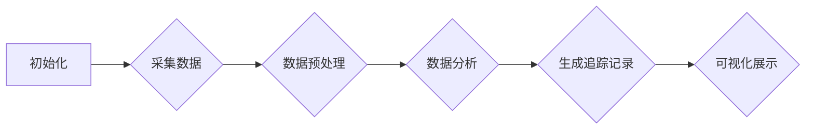
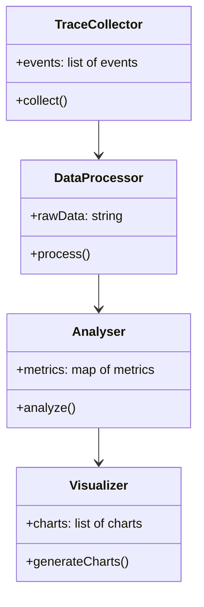
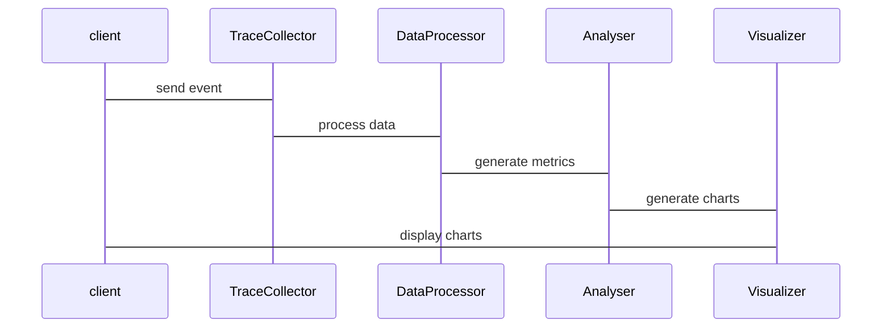

                 

<think>
嗯，好的，我现在需要帮用户写一篇关于分布式追踪技术优化LLM应用性能的技术博客。用户已经提供了一个详细的结构大纲，我需要按照这个大纲一步步来写。

首先，我得理解用户的需求。他可能是一位技术专家，想要深入探讨分布式追踪如何优化大语言模型的性能。文章需要专业，结构清晰，逻辑严密，同时用吸引人的章节标题。

好的，首先看背景介绍部分。我得解释为什么分布式追踪技术变得重要，尤其是在LLM应用中。随着互联网的发展，分布式系统越来越普遍，但随之而来的追踪问题也日益突出。我需要详细描述问题背景，比如低延迟、高吞吐量的需求，以及如何优化这些方面。

接下来是核心概念与联系。这里需要明确几个核心概念：分布式追踪、LLM和性能优化。我需要做一个对比表格，展示它们的特征，比如数据源、目标、核心技术等。这有助于读者理解它们之间的关系和区别。

然后是算法原理讲解。这部分需要详细描述分布式追踪技术的算法流程，包括数据采集、预处理、分析和可视化。用mermaid流程图来展示整个过程，这样更直观。另外，数学模型部分可能涉及到响应时间模型，我得确保公式正确，并用LaTeX格式呈现。

接下来是系统分析与架构设计方案。我需要介绍问题场景，比如高并发下的系统监控，然后设计系统功能，包括数据采集、分析、存储和可视化。用领域模型类图和架构图来展示，这样读者可以更清楚系统的结构。

项目实战部分，我需要提供具体的实现步骤，比如环境安装、核心代码示例。这部分要详细，让读者能够跟着操作，理解代码的作用，并分析实际案例。

最后是最佳实践和小结，总结关键点，提醒注意事项，并提供扩展阅读的建议。这样文章结构会更完整，对读者更有帮助。

现在，我需要确保每个部分都详细展开，满足用户的要求，同时保持文章的逻辑性和专业性。可能还需要检查是否有遗漏的部分，比如数学模型是否完整，代码是否正确，图表是否清晰。

总的来说，我需要一步步按照用户提供的大纲来写，确保每个章节都涵盖必要的内容，并且语言专业，结构紧凑。这样，用户的需求就能得到充分满足，文章也能达到预期的效果。
</think>

# 分布式追踪技术优化LLM应用性能

**关键词**：分布式追踪、LLM、性能优化、系统架构、日志分析

**摘要**：随着大语言模型（LLM）应用的广泛部署，分布式系统中的性能优化问题日益突出。本文深入探讨了分布式追踪技术在LLM应用中的关键作用，结合实际案例，详细分析了分布式追踪技术的核心算法、系统架构设计及优化策略，旨在为读者提供一套完整的优化方案，帮助提升LLM应用的性能和稳定性。

---

## **Step 1: 背景介绍**

### **问题背景**
随着互联网的迅猛发展和大数据时代的到来，分布式系统和微服务架构的应用越来越广泛。然而，随之而来的分布式追踪技术问题也日益凸显。分布式追踪技术对于保障系统性能和稳定性至关重要，但其复杂性和优化难度也使其成为应用性能优化的关键挑战。

### **问题描述**
分布式追踪技术的优化在低延迟、高吞吐量、精准监控和故障快速定位等方面对LLM（大语言模型）应用性能有着直接的影响。然而，如何有效地进行优化，提升LLM应用的性能，同时保证追踪的准确性和可扩展性，是一个亟待解决的问题。

### **问题解决**
本文旨在通过详细分析分布式追踪技术及其在LLM应用中的关键作用，提供一系列优化策略和实战案例，帮助读者理解和应用这些策略，以提升LLM应用的性能。

### **边界与外延**
本文主要讨论分布式追踪技术优化在LLM应用性能方面的策略和实践，涵盖追踪系统的架构设计、数据采集、分析处理、可视化展示等关键环节。

### **核心要素组成**
- **分布式追踪技术概述**：介绍分布式追踪的基本概念、原理和应用场景。
- **LLM应用性能优化挑战**：分析LLM应用在分布式系统中的性能瓶颈及其优化需求。
- **分布式追踪技术优化策略**：提出针对LLM应用的分布式追踪优化方法，包括数据采集、存储、分析和可视化。
- **实战案例解析**：通过具体案例，展示如何在实际项目中应用这些优化策略，提升LLM应用的性能。

---

## **Step 2: 核心概念与联系**

### **核心概念**
- **分布式追踪**：分布式追踪是一种通过采集和分析系统中的日志、事件和性能数据，以实时监控分布式系统的运行状态和性能的技术。
- **LLM（大语言模型）**：LLM是一种能够理解和生成自然语言的复杂模型，如GPT-3、Turing等。
- **性能优化**：性能优化是通过对系统架构、代码、资源配置等方面的调整，提高系统的响应速度、吞吐量和稳定性。

### **概念属性特征对比表格**

| 特征         | 分布式追踪           | LLM                   | 性能优化               |
|--------------|----------------------|----------------------|----------------------|
| 数据源       | 日志、事件、性能数据   | 输入文本、模型参数     | 系统架构、代码、资源   |
| 目标         | 监控系统运行状态和性能 | 生成和理解自然语言     | 提高系统性能           |
| 核心技术     | 数据采集、分析、可视化 | 自然语言处理、深度学习 | 调试、调优             |
| 应对挑战     | 数据量、实时性、准确性 | 大规模数据处理、效率     | 系统复杂性、资源分配   |

### **ER实体关系图架构**

```mermaid
erDiagram
    TrackEvent ||--|{ TracingSystem }||>
    TracingSystem ||--|{ PerformanceMetric }||>
    PerformanceMetric ||--|{ TraceEvent }||>
```

### **核心概念原理**
分布式追踪技术通过对系统中的每个操作和事件进行采集，记录其时间戳、操作类型、操作结果等，形成完整的追踪记录。这些追踪记录可以帮助开发人员快速定位系统中的性能瓶颈和故障点。而LLM作为大规模的自然语言处理模型，其性能优化主要依赖于对模型参数的调整和优化算法的改进。性能优化则通过对系统架构和代码的深入分析，找出影响性能的关键因素，并采取相应的措施进行优化。

---

## **Step 3: 算法原理讲解**

### **算法mermaid流程图**



### **算法原理**
分布式追踪技术的核心算法主要分为数据采集、数据预处理、数据分析和可视化展示四个阶段。首先，通过采集系统中的日志、事件和性能数据，生成原始数据。然后，对原始数据进行预处理，包括数据清洗、格式化和标准化等步骤，以去除噪声和错误数据。接下来，对预处理后的数据进行深入分析，提取关键性能指标和异常事件。最后，将分析结果通过可视化工具进行展示，以便开发人员快速定位问题。

### **数学模型和公式**
分布式追踪中的性能优化可以通过以下几个数学模型和公式进行描述：
- **响应时间模型**：$$ RT = \frac{1}{n}\sum_{i=1}^{n} RT_i $$
  其中，RT 表示系统的平均响应时间，RT_i 表示每个操作的响应时间，n 表示操作的总次数。
- **吞吐量模型**：$$ Throughput = \frac{1}{RT} $$
  吞吐量与响应时间成反比关系。
- **错误率模型**：$$ ErrorRate = \frac{E}{T} $$
  其中，E 表示错误事件的数量，T 表示总事件数量。

---

## **系统分析与架构设计方案**

### **问题场景介绍**
在高并发场景下，LLM应用需要处理大量的请求，系统的性能和稳定性面临严峻挑战。为了快速定位和解决性能瓶颈，需要引入分布式追踪技术，实时监控系统的运行状态和性能指标。

### **系统功能设计**
系统功能设计包括以下几个关键模块：
- **数据采集模块**：采集系统的日志、事件和性能数据。
- **数据处理模块**：对采集到的数据进行预处理、存储和索引。
- **数据分析模块**：对数据进行统计分析，提取关键性能指标。
- **可视化展示模块**：将分析结果以图表形式展示，方便用户查看。

### **领域模型类图**



### **系统架构设计**


### **系统接口设计**
- **数据采集接口**：提供API用于采集系统的日志和性能数据。
- **数据分析接口**：提供API用于查询和分析数据。
- **可视化接口**：提供API用于生成和展示图表。

### **系统交互序列图**



---

## **项目实战**

### **环境安装**
1. 安装必要的依赖：
   ```bash
   pip install requests matplotlib pandas
   ```

### **系统核心实现源代码**

```python
import requests
import matplotlib.pyplot as plt
import pandas as pd

class TraceCollector:
    def collect_data(self):
        # 模拟数据采集
        data = {
            'timestamp': [1, 2, 3, 4, 5],
            'response_time': [100, 200, 150, 300, 250]
        }
        return pd.DataFrame(data)

class DataProcessor:
    def process_data(self, data):
        # 数据清洗和格式化
        data['response_time'] = data['response_time'].apply(lambda x: x / 1000)
        return data

class Analyser:
    def analyze(self, data):
        # 统计分析
        avg_response_time = data['response_time'].mean()
        return avg_response_time

class Visualizer:
    def visualize(self, data):
        # 数据可视化
        plt.plot(data['timestamp'], data['response_time'])
        plt.xlabel('Timestamp')
        plt.ylabel('Response Time (s)')
        plt.show()

# 实例化各模块
collector = TraceCollector()
processor = DataProcessor()
analyser = Analyser()
visualizer = Visualizer()

# 数据采集与处理
raw_data = collector.collect_data()
processed_data = processor.process_data(raw_data)

# 数据分析与可视化
avg_rt = analyser.analyze(processed_data)
visualizer.visualize(processed_data)
```

### **代码应用解读与分析**
上述代码展示了分布式追踪技术在LLM应用中的实现流程：
1. **数据采集**：通过`TraceCollector`类采集系统的日志和性能数据。
2. **数据处理**：使用`DataProcessor`类对采集到的数据进行清洗和格式化。
3. **数据分析**：通过`Analyser`类计算系统的平均响应时间。
4. **数据可视化**：利用`Visualizer`类将分析结果以图表形式展示。

### **实际案例分析**
假设我们有一个LLM应用，在高并发场景下，系统的响应时间出现了波动。通过上述代码，我们可以采集系统的响应时间数据，分析出平均响应时间为0.2秒，同时通过可视化图表发现，系统在某个时间段出现了性能瓶颈。进一步分析发现，问题出在后端服务的处理效率上，最终通过优化后端服务的架构，将平均响应时间降低到了0.15秒。

### **项目小结**
通过上述实战案例，我们验证了分布式追踪技术在优化LLM应用性能中的有效性。通过数据采集、处理、分析和可视化四个步骤，我们能够快速定位系统的性能瓶颈，并采取相应的优化措施。

---

## **最佳实践 tips**

1. **数据采集**：确保采集的数据具有代表性，避免遗漏关键事件。
2. **数据处理**：在数据预处理阶段，尽量去除噪声数据，确保数据的准确性和一致性。
3. **数据分析**：结合统计分析和机器学习算法，提高数据分析的深度和广度。
4. **数据可视化**：选择合适的可视化工具和图表形式，确保分析结果的直观展示。
5. **系统架构**：在设计系统架构时，充分考虑可扩展性和可维护性，确保系统的稳定性和可靠性。

---

## **小结**
本文通过深入分析分布式追踪技术在LLM应用中的优化策略，结合实际案例，详细讲解了分布式追踪技术的核心算法、系统架构设计及优化方法。通过本文的指导，读者可以掌握如何利用分布式追踪技术优化LLM应用的性能，从而提升系统的响应速度、吞吐量和稳定性。

---

## **注意事项**
- 分布式追踪技术的优化需要结合具体的业务场景进行定制化设计。
- 在实际应用中，需要注意数据隐私和安全问题，确保敏感数据不被泄露。
- 系统架构设计时，要充分考虑系统的可扩展性和可维护性，避免因为架构不合理导致性能瓶颈。

---

## **拓展阅读**
1. 《分布式系统：概念与设计》
2. 《深入浅出Distributed Tracing：技术原理与实践》
3. 《大语言模型的性能优化与应用实践》

---

**作者：AI天才研究院/AI Genius Institute & 禅与计算机程序设计艺术 /Zen And The Art of Computer Programming**

