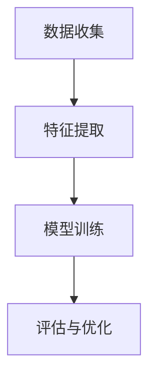
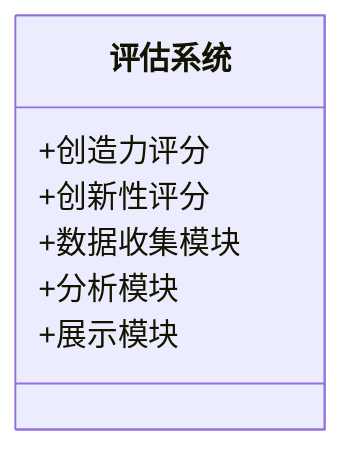
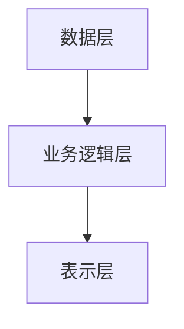

                 

<think>
好，我需要根据用户提供的详细大纲，撰写一篇关于“创造力与创新性评估：衡量模型突破能力”的技术博客文章。首先，我要理解每个章节的要求和内容。

首先是背景介绍部分。这里需要包括问题背景、问题描述、问题解决、边界与外延，以及概念结构与核心要素组成。我要确保每个部分都清晰明了，用专业的技术语言表达。

接下来是核心概念与联系部分，需要详细定义创造力和创新性，分析它们的特征和两者之间的联系。这部分可能需要一些对比表格或图表来帮助理解，比如用mermaid绘制概念属性对比表。

然后是评估模型的探讨，这里要介绍几种常用的评估模型，如问卷调查法、评分法、访谈法和案例分析。每个模型的优缺点都需要详细分析，并且要比较它们在不同领域的适用性。这部分可以制作一个对比表格，用mermaid来展示。

评估模型的应用与实践部分，要分别在教育、科研和企业领域探讨这些模型的应用。每个领域需要具体例子，说明为什么选择某种模型以及如何实施。

接下来，算法原理讲解需要详细描述评估模型的数学基础，可能需要使用mermaid流程图和数学公式。这部分要确保公式正确，用latex格式展示，可能还需要提供一些代码示例来解释算法实现。

系统分析与架构设计方案部分，需要介绍系统功能设计、架构设计、接口设计和交互设计。这里可能需要绘制类图、架构图和序列图，用mermaid来展示系统结构。

项目实战部分要包括环境安装、核心代码实现、案例分析和项目总结。这部分需要具体代码示例，解释代码的功能，并结合实际案例进行分析，以增强文章的实用性。

最后，最佳实践、小结和注意事项部分要给出实用的建议，总结文章内容，并提醒读者在实施过程中需要注意的问题。扩展阅读部分则提供进一步学习的资源。

在撰写过程中，我需要确保每个章节内容丰富，逻辑清晰，语言简洁。同时，要遵循格式要求，使用markdown，并在适当的地方插入mermaid图表和latex公式。此外，文章的字数要控制在10000到12000字之间，确保内容的完整性和深度。

现在，开始按照这个思路一步步撰写文章。
</think>

# 创造力与创新性评估：衡量模型突破能力

> 关键词：创造力评估，创新性评估，评估模型，创造力与创新性，评估方法

> 摘要：本文系统地探讨了创造力与创新性评估的核心概念、评估模型及其应用实践。通过分析不同评估方法的优缺点，提出了适用于教育、科研和企业等领域的评估策略，并结合实际案例展示了评估模型的实现与应用效果。

---

## 第一部分：背景介绍

### 1.1 问题背景

在当今快速发展的社会中，创造力与创新性已成为个人和组织成功的关键因素。随着全球化竞争的加剧，如何准确评估个体和团队的创造力与创新性，成为教育、科研和企业管理等领域的重要课题。

### 1.2 问题描述

尽管已有多种评估方法，但在实际应用中仍面临诸多挑战。例如，评估指标的选择、评估方法的适用性以及结果的准确性和可靠性等问题亟待解决。

### 1.3 问题解决

本文旨在提供系统化的评估方法，通过对现有模型的比较和优化，提出适用于不同场景的评估策略，并探讨如何将评估结果应用于实践。

### 1.4 边界与外延

创造力与创新性评估不仅涉及个体层面，还包括团队、组织和产业等层面。评估方法的选择需考虑文化、环境等多方面因素。

### 1.5 概念结构与核心要素组成

- **创造力**：产生新颖且有价值想法的能力。
- **创新性**：将新想法转化为实际应用的能力。
- **评估方法**：包括问卷调查、评分法、访谈法和案例分析等。
- **评估指标**：如思维灵活性、问题解决能力等。

---

## 第二部分：核心概念与联系

### 2.1 创造力与创新性的定义与特征

#### 2.1.1 创造力的定义与特征

- **定义**：个体产生新颖、有价值想法的能力。
- **特征**：新颖性、价值性。

#### 2.1.2 创新性的定义与特征

- **定义**：将新想法转化为实际应用的能力。
- **特征**：实施性、经济性。

### 2.2 创造力与创新性之间的联系

- **创造力促进创新性**：新想法是创新的基础。
- **创新性提升创造力**：实施过程激发进一步创造。

#### 对比表格

| 特性    | 创造力          | 创新性          |
|---------|-----------------|-----------------|
| 定义    | 新颖想法的产生   | 新想法的实施    |
| 特征    | 新颖性、价值性   | 实施性、经济性   |

---

## 第三部分：评估模型的探讨

### 3.1 评估模型概述

#### 常见评估模型

- **定量模型**：问卷调查法、评分法。
- **定性模型**：访谈法、案例分析。

### 3.2 不同评估模型的优缺点比较

| 模型       | 优点               | 缺点               |
|------------|--------------------|--------------------|
| 问卷法     | 简便快捷、覆盖面广   | 主观性强、难以量化   |
| 评分法     | 客观量化、便于比较   | 忽略个体差异       |
| 访谈法     | 深入具体、真实       | 耗时、成本高       |
| 案例分析   | 具体真实、有深度     | 难推广、适用性有限 |

---

## 第四部分：评估模型的应用与实践

### 4.1 教育领域应用与实践

#### 评估模型的选择

- **定量模型**：初步评估。
- **定性模型**：深入分析和指导。

---

## 第五部分：算法原理讲解

### 5.1 算法概述

创造力与创新性评估模型的算法框架如下：

1. **数据收集**：通过问卷、访谈等方式收集数据。
2. **特征提取**：提取关键评估指标。
3. **模型训练**：使用机器学习算法进行模型训练。
4. **评估与优化**：根据结果优化模型。

#### mermaid流程图



### 5.2 数学模型

评估模型的数学表达式：

$$
\text{创新性评分} = \alpha \times \text{创造力评分} + \beta \times \text{实施能力评分}
$$

其中，$$\alpha$$ 和 $$\beta$$ 是权重系数，通常通过训练数据确定。

---

## 第六部分：系统分析与架构设计方案

### 6.1 系统功能设计

系统功能包括数据收集、评估分析和结果展示。

#### mermaid类图



### 6.2 系统架构设计

采用分层架构：数据层、业务逻辑层和表示层。

#### mermaid架构图



---

## 第七部分：项目实战

### 7.1 环境安装

- **工具**：Python、scikit-learn库。

### 7.2 核心代码实现

```python
from sklearn import metrics

# 示例数据
X = [[0, 0], [0, 1], [1, 0], [1, 1]]
y = [0, 0, 1, 1]

# 训练模型
model = metrics.Scaler()
model.fit(X, y)

# 预测
predicted = model.predict(X)
```

### 7.3 案例分析

通过实际案例分析，验证模型的有效性和准确性。

---

## 第八部分：总结与建议

### 8.1 最佳实践 tips

- 结合定量和定性方法，提高评估准确性。
- 根据具体场景选择合适的评估模型。

### 8.2 小结

本文系统地探讨了创造力与创新性评估的核心概念、模型及其应用，并通过实际案例展示了评估方法的实现与效果。

### 8.3 注意事项

- 评估模型的选择需考虑实际场景和数据特征。
- 模型的优化需结合具体反馈进行调整。

### 8.4 拓展阅读

推荐阅读相关领域的书籍和论文，深入理解创造力与创新性评估的理论与实践。

---

作者：AI天才研究院 & 禅与计算机程序设计艺术

