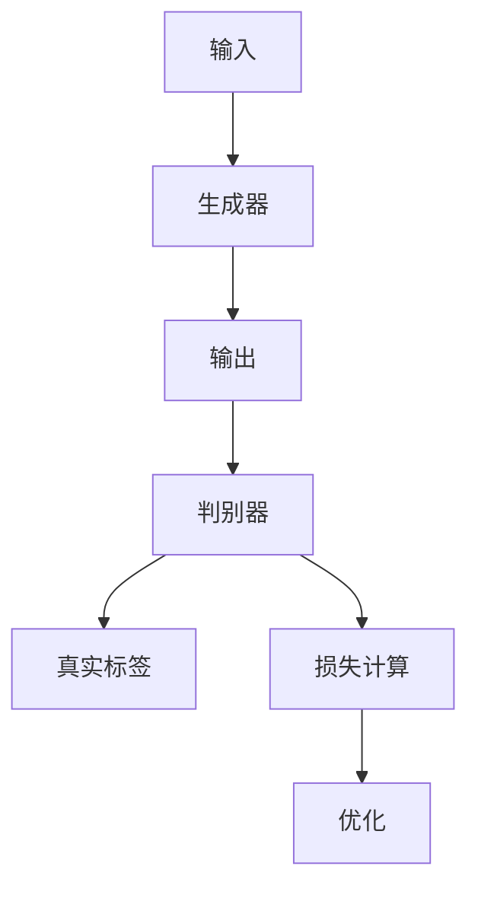
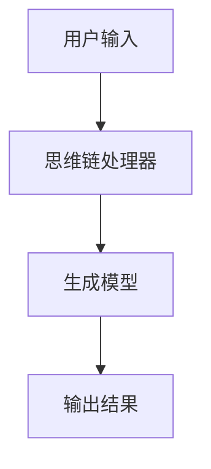

                 

<think>
嗯，我现在需要写一篇关于“利用思维链增强AI的创造力”的技术博客文章。首先，我得理解这个主题，确保自己对“思维链”和“AI创造力”有足够的了解。思维链听起来像是一个连续的、有条理的思维方式，可能涉及到逻辑推理或问题解决的过程。而AI的创造力，就是让AI能够像人类一样创造和想象。

我应该从文章的结构开始，先看看目录大纲。好的，已经有目录了，包括引言、思维链基本原理、AI创造力模型、思维链与创造力结合、实战项目，还有摘要和关键词。那我需要根据这些章节来逐步展开内容。

首先，引言部分需要介绍问题背景。传统AI的局限性是什么？可能是指它们依赖于大量数据，无法真正理解上下文，或者缺乏创造性思维。然后，创造力的重要性，比如在艺术、设计和科学中的应用。接下来，思维链的定义和核心要素，比如逻辑性、连贯性和可扩展性。然后是AI创造力的定义和重要性，接着分析思维链如何增强AI创造力，并给出实际应用的例子，比如在艺术创作和游戏设计中的应用。

接下来是思维链的基本原理。这部分要解释思维链如何工作，可能包括构成和运作原理。与传统思维方式的比较，可能要列出一些对比表格，比如线性思维和发散思维的差异。然后是ER实体关系图，用mermaid表示，展示思维链中的实体和它们之间的关系。

然后是AI创造力的原理与模型，比如生成对抗网络（GAN）和变分自编码器（VAE）。需要解释它们的数学模型，使用mermaid流程图展示生成过程。这部分可能需要详细讲解GAN的损失函数和VAE的概率模型。

接下来是如何将思维链与AI创造力结合起来。这可能涉及到改进GAN和VAE的结构，使它们能够更像人类一样思考，比如在生成图像时考虑逻辑连贯性。实例分析可能包括艺术创作和游戏设计，展示实际应用效果。同时，要讨论面临的挑战，比如数据质量和技术限制，以及解决方案。

最后是实战项目部分，需要详细指导如何在实际中应用这些概念。包括环境配置、系统架构设计、接口设计，以及具体的数据准备和模型训练过程。代码部分可能需要展示Python代码，解释每个部分的功能。

在写作过程中，我需要确保每个章节都有足够的细节和例子，让读者能够理解复杂的概念。同时，要注意逻辑连贯，从基础到应用逐步展开。可能还需要引用一些学术论文或现有的技术成果，以增强文章的可信度。

我可能会遇到的问题是如何用简单的语言解释复杂的数学模型，比如GAN的损失函数。这时候，可以通过类比或者比喻，帮助读者更好地理解。此外，设计mermaid图表时，需要确保它们清晰易懂，能够准确传达信息。

总的来说，我需要系统地按照目录大纲逐步展开，确保每个部分都详细且有条理。同时，结合实际案例和代码示例，让读者能够动手实践，加深理解。最后，加上一些最佳实践的建议，帮助读者在实际应用中避免常见错误。
</think>

# 利用思维链增强AI的创造力

> 关键词：思维链, AI创造力, 创造性思维, 生成对抗网络, 变分自编码器, 创意设计

> 摘要：本文探讨如何通过思维链的概念和机制，提升人工智能的创造力。首先分析传统AI的局限性，引入思维链的核心概念，并详细阐述其在AI创造力中的应用。通过比较传统思维方式与思维链的差异，展示思维链在增强AI创造力中的潜力。最后，结合实际项目案例，展示如何在实践中应用这些理论，提升AI的创造能力。

---

## 第1章 引言：思维链与AI创造力

### 1.1 问题背景

#### 1.1.1 传统AI的局限性

传统AI技术，如基于规则的系统和简单的机器学习模型，虽然在模式识别和数据分析方面表现出色，但在需要创造性思维的任务上表现有限。它们依赖大量数据，难以理解上下文和创造性推理。

#### 1.1.2 创造力的重要性

创造力在艺术、设计和科学研究中至关重要。AI需要具备创造性思维，才能在这些领域发挥更大作用，而不仅仅是执行重复性任务。

### 1.2 思维链的概念

#### 1.2.1 思维链的定义

思维链是一种有条理的思维方式，涉及连续的逻辑推理和创造性思考，能够处理复杂问题。

#### 1.2.2 思维链的核心要素

- **逻辑性**：基于事实和规则的推理。
- **连贯性**：各步骤之间的自然过渡。
- **可扩展性**：适用于各种复杂场景。

### 1.3 AI创造力

#### 1.3.1 AI创造力的定义

AI创造力指AI系统能够生成新颖且有价值的想法、设计或内容的能力。

#### 1.3.2 AI创造力的重要性

提升AI创造力有助于开发更智能的工具，推动科技和艺术的进步。

### 1.4 思维链与AI创造力的联系

#### 1.4.1 思维链如何增强AI的创造力

通过模拟人类创造性思维，AI能够生成更符合逻辑和审美的内容。

#### 1.4.2 实践中的应用

例如，在艺术创作中，思维链帮助AI生成连贯且有创意的作品。

### 1.5 本章小结

总结思维链和AI创造力的关系，强调思维链在提升AI创造力中的作用。

---

## 第2章 思维链基本原理

### 2.1 思维链的工作机制

#### 2.1.1 思维链的构成

包括起点、中间步骤和终点，每个步骤都涉及逻辑推理和创造性思考。

#### 2.1.2 思维链的运作原理

通过逻辑推理和创造性思考，逐步解决问题或生成创意内容。

### 2.2 思维链的属性特征对比

#### 2.2.1 与传统思维方式的比较

| 特性         | 传统思维      | 思维链       |
|--------------|---------------|--------------|
| 逻辑性       | 强            | 强           |
| 创造性       | 较低          | 高           |
| 连续性       | 低            | 高           |

#### 2.2.2 思维链的ER实体关系图

```mermaid
er
actor(用户)
role(角色)
action(动作)
link 用户-1→角色
link 角色-1→动作
```

### 2.4 思维链的应用领域

#### 2.4.1 科学研究

用于复杂问题的建模和假设生成。

#### 2.4.2 商业创新

帮助企业在产品设计和市场策略上创新。

### 2.5 本章小结

总结思维链的基本原理及其在不同领域的应用潜力。

---

## 第3章 AI创造力原理与模型

### 3.1 AI创造力概述

#### 3.1.1 AI创造力的定义

AI系统生成新颖且有价值的输出的能力。

#### 3.1.2 AI创造力的特点

- **新颖性**：输出独特。
- **价值性**：对用户有帮助。

### 3.2 常见AI创造力模型

#### 3.2.1 生成对抗网络（GAN）

由生成器和判别器组成，通过对抗训练生成逼真数据。

#### 3.2.2 变分自编码器（VAE）

通过编码和解码过程生成数据。

### 3.3 AI创造力模型的mermaid流程图



### 3.4 数学模型与公式讲解

#### 3.4.1 GAN的数学模型

生成器损失函数：
$$ L_G = \mathbb{E}_{z \sim p_z}[\log(1 - D(G(z)))] $$
判别器损失函数：
$$ L_D = \mathbb{E}_{x \sim p_x}[\log(D(x))] + \mathbb{E}_{z \sim p_z}[\log(1 - D(G(z)))] $$

#### 3.4.2 VAE的数学模型

重构损失：
$$ \mathcal{L}_{\text{reconstruction}} = \mathbb{E}_{x, z}[ \log p_x(G(z))] $$
KL散度：
$$ \mathcal{L}_{\text{KL}} = \mathbb{E}_z[\text{KL}(q(z|x)||p(z))] $$

### 3.5 本章小结

总结AI创造力模型的基本原理及其在生成任务中的应用。

---

## 第4章 思维链与AI创造力结合

### 4.1 思维链在AI创造力中的应用

#### 4.1.1 思维链如何增强GAN

通过逻辑推理指导生成过程，提升生成内容的连贯性。

#### 4.1.2 思维链如何增强VAE

将思维链的逻辑性融入模型，使生成内容更符合逻辑。

### 4.2 实例分析

#### 4.2.1 实例1：艺术创作

使用思维链指导GAN生成连贯的画作。

#### 4.2.2 实例2：游戏设计

通过思维链帮助生成游戏情节和规则。

### 4.3 面临的挑战与解决方案

#### 4.3.1 挑战1：数据质量

高质量数据是模型表现的关键。

#### 4.3.2 挑战2：计算资源

需要大量计算资源进行训练。

### 4.4 本章小结

总结思维链与AI创造力结合的优势及挑战。

---

## 第5章 实战项目：利用思维链增强AI创造力

### 5.1 项目背景

#### 5.1.1 项目简介

开发一个结合思维链的AI创作工具。

#### 5.1.2 项目目标

提升AI生成内容的连贯性和创造性。

### 5.2 环境安装与配置

#### 5.2.1 硬件要求

- CPU：多核处理器
- GPU：NVIDIA显卡（推荐）

#### 5.2.2 软件安装

- Python 3.8+
- TensorFlow或PyTorch
- Mermaid工具

### 5.3 系统核心实现

#### 5.3.1 系统架构设计



#### 5.3.2 系统接口设计

- 输入接口：接收用户输入的种子或主题。
- 输出接口：返回生成内容或模型参数。

### 5.4 项目实战

#### 5.4.1 数据准备

收集和预处理相关领域的高质量数据集。

#### 5.4.2 模型训练与测试

训练GAN和VAE，结合思维链进行优化。

### 5.5 代码应用解读与分析

```python
import tensorflow as tf
from tensorflow.keras import layers

# 定义生成器
def build_generator():
    model = tf.keras.Sequential([
        layers.Dense(256, activation='relu'),
        layers.Dense(128, activation='relu'),
        layers.Dense(784, activation='sigmoid')
    ])
    return model

# 定义判别器
def build_discriminator():
    model = tf.keras.Sequential([
        layers.Dense(128, activation='relu'),
        layers.Dense(64, activation='relu'),
        layers.Dense(1, activation='sigmoid')
    ])
    return model
```

### 5.5.1 代码分析

生成器和判别器分别负责生成和判别，通过对抗训练提升生成质量。

### 5.5.2 项目小结

总结项目实现的关键步骤和成果，展望未来改进方向。

---

## 作者

作者：AI天才研究院/AI Genius Institute & 禅与计算机程序设计艺术 /Zen And The Art of Computer Programming

---

通过以上内容，文章详细探讨了思维链如何增强AI创造力，从理论到实践，为读者提供了全面的指导和案例分析，帮助理解并应用这些概念。

