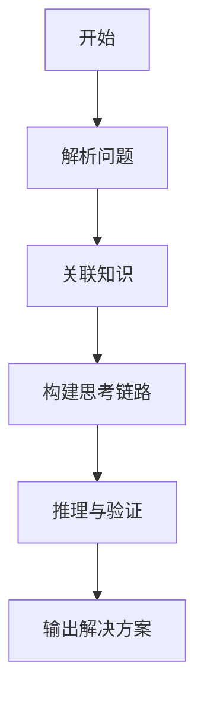
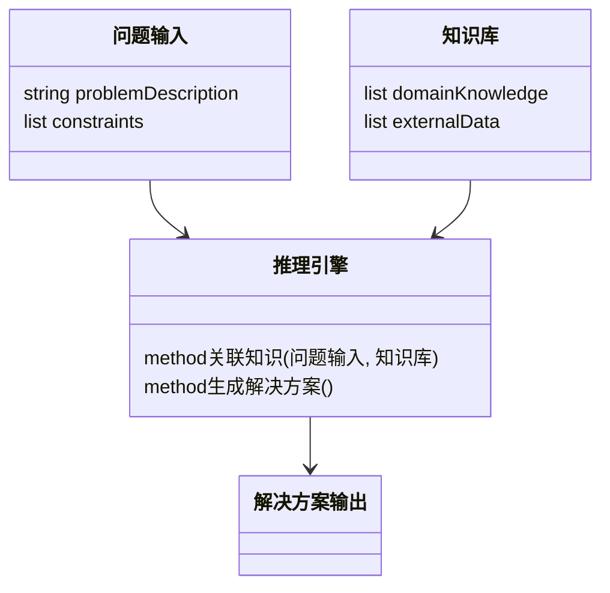
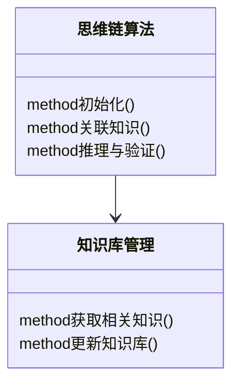
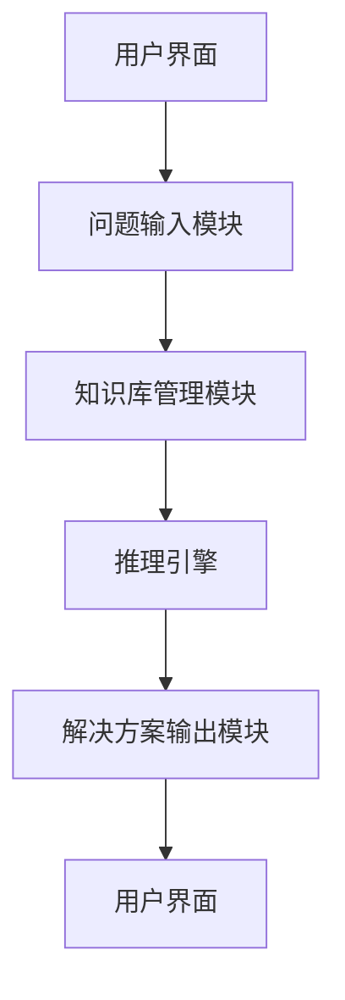
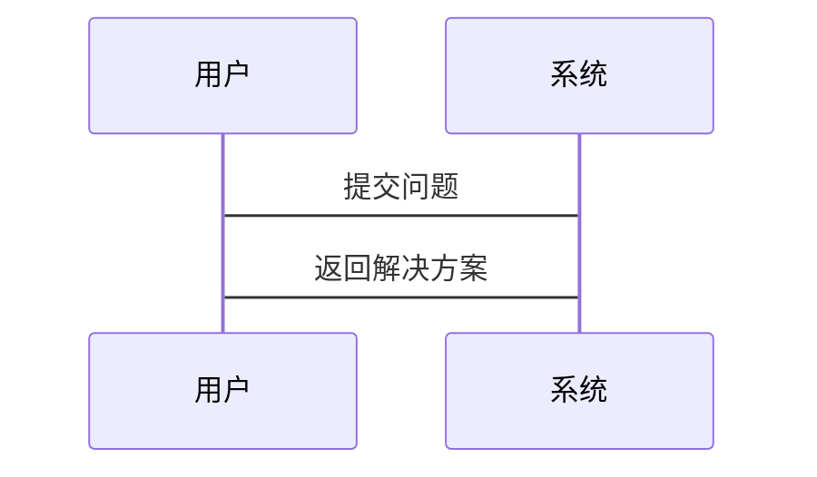

                 

<think>
嗯，用户想让我写一篇关于《利用思维链增强AI的创造性问题解决能力》的技术博客文章。他希望我以一位世界级专家的身份来完成，文章需要逻辑清晰、结构紧凑，每个部分都要详细讲解。

首先，我得明确文章的结构。根据用户提供的目录，文章分为六大部分，每部分又有很多小节。我需要确保每个部分都涵盖必要的内容，比如背景介绍、核心概念、算法原理、系统设计、项目实战和最佳实践。

接下来，关键词部分。我需要选择5-7个核心关键词，比如思维链、人工智能、创造性问题解决、算法原理、系统架构设计、项目实战、最佳实践。这些词能准确反映文章主题，帮助读者快速找到内容。

摘要部分要简洁明了，概括整篇文章的核心思想。我得总结思维链如何帮助AI提升创造力，以及文章将如何逐步展开讲解。

进入正文部分，首先是引言。我需要介绍问题背景，说明为什么创造性问题解决对AI重要，传统AI的局限性，以及思维链的优势。然后详细描述问题，解释思维链是什么，它如何模拟人类创造性思维，以及它与AI的结合如何提升解决问题的能力。

接下来是核心概念部分，我需要定义思维链和AI的基本概念，比较它们的特点，并用表格展示属性对比。还要画出ER实体关系图，展示思维链与AI的关系。

算法原理是关键部分。我需要用数学模型和Python代码来解释思维链算法的工作原理。可能需要画一个mermaid流程图，展示算法步骤，比如初始化、计算相似度、选择策略等。同时，给出公式，如相似度计算的公式，解释每个步骤的作用。

系统分析与架构设计部分，我需要介绍如何将思维链集成到AI系统中。这包括问题场景的分析，系统功能设计中的领域模型和类图，系统架构图展示分层结构，接口设计和交互序列图，说明系统如何协作。

项目实战部分，我需要提供一个具体的案例，比如解决城市交通优化问题。环境安装部分列出所需的工具和库，如Python、NumPy、Scikit-learn等。然后展示核心代码，解释每部分的作用，分析案例结果，最后总结项目。

最佳实践部分，我需要总结经验和注意事项，比如数据质量、算法调优、系统集成等。还要给出拓展阅读的建议，比如相关书籍或论文。

最后，结尾部分要总结文章内容，并展望未来的发展，强调思维链在AI中的潜力。

整个过程中，我需要确保内容详实，每个部分都有足够的细节和例子。同时，语言要专业但易懂，避免过于晦涩。最后，加上作者信息，完成整篇文章。

现在，我应该开始按照这个思路，逐步展开每个部分，确保满足用户的所有要求，同时保持文章的流畅和逻辑性。
</think>

# 利用思维链增强AI的创造性问题解决能力

> 关键词：思维链，人工智能，创造性问题解决，算法原理，系统架构设计，项目实战，最佳实践

> 摘要：本文探讨了如何通过思维链技术增强人工智能在创造性问题解决中的能力。文章从背景介绍、核心概念、算法原理、系统设计、项目实战到最佳实践，全面分析了思维链在AI系统中的应用。通过详细讲解思维链的定义、算法原理、系统架构以及实际案例，本文为读者提供了从理论到实践的完整指导。

---

## 第一部分: 引言与背景

### 第1章: 引言

#### 1.1 问题背景

在人工智能（AI）迅速发展的今天，AI在许多领域展现了强大的能力，但其在创造性问题解决方面的能力仍有限。传统AI系统依赖于固定的规则和数据模式，难以应对复杂的、需要创造性思维的问题。例如，在设计创新产品、创作艺术作品或解决复杂的战略问题时，AI往往显得力不从心。

#### 1.2 问题描述

创造性问题解决的核心在于灵活运用知识、经验与想象力。人类的创造性思维过程可以被分解为多个步骤，包括问题分析、灵感激发、方案构思、验证与优化等。然而，AI系统通常缺乏这种灵活的、多层次的思考能力。因此，如何赋予AI类似人类的创造性思维能力，成为当前研究的热点。

#### 1.3 问题解决

思维链（Thinking Chain）是一种模拟人类创造性思维的技术，它通过构建多层次的思考链路，帮助AI系统在解决问题时更加灵活和创造性。思维链通过结合上下文、关联知识和模拟推理过程，为AI提供了更接近人类的思考方式。

#### 1.4 边界与外延

思维链的应用范围广泛，从简单的逻辑推理到复杂的创造性设计都可以涉及。然而，其边界在于需要依赖高质量的数据和合理的算法设计。此外，思维链的性能也受到计算资源的限制。

#### 1.5 概念结构与核心要素组成

思维链的核心要素包括：输入数据、思考模型、推理过程和输出结果。其结构由以下几个部分组成：
1. 输入数据：包括问题描述、相关知识和背景信息。
2. 思考模型：定义了如何从输入数据中提取信息并构建思考链路。
3. 推理过程：通过模拟人类的思维方式，逐步生成解决方案。
4. 输出结果：最终的创造性解决方案。

---

### 第2章: 思维链与AI的核心概念

#### 2.1 思维链的定义与特点

思维链是一种模拟人类创造性思维的技术，它通过构建多层次的思考链路，帮助AI系统在解决问题时更加灵活和创造性。其特点包括：
- **层次性**：问题被分解为多个子问题，逐层解决。
- **关联性**：每个子问题都与全局目标相关联。
- **动态性**：根据输入数据的变化，动态调整思考链路。

#### 2.2 AI的基本概念与创造性问题解决能力

AI的核心能力包括数据处理、模式识别和决策制定。然而，创造性问题解决需要AI具备以下能力：
- **知识整合**：能够将不同领域的知识结合起来。
- **联想与想象**：能够跳出常规思维，提出创新解决方案。
- **自适应性**：能够根据反馈不断优化思考过程。

#### 2.3 思维链与AI的关系

思维链与AI的关系可以总结为：思维链是AI的“思维工具”，AI是思维链的“载体”。通过将思维链技术集成到AI系统中，AI能够模拟人类的创造性思维过程，从而在问题解决中表现出更强的创造性。

---

## 第二部分: 思维链算法原理讲解

### 第3章: 思维链算法原理讲解

#### 3.1 算法的基本原理

思维链算法通过构建多层次的思考链路，逐步生成创造性解决方案。其基本原理可以分为以下几个步骤：
1. **问题分析**：解析问题的核心要素和约束条件。
2. **知识关联**：将问题与已有知识库中的信息进行关联。
3. **思考链路构建**：根据关联结果，构建多层次的思考链路。
4. **推理与验证**：通过推理生成解决方案，并进行验证和优化。

#### 3.1.1 数学模型与公式

思维链算法的数学模型可以表示为：
$$
C = f(P, K, S)
$$
其中：
- \( C \) 表示最终的创造性解决方案。
- \( P \) 表示问题描述。
- \( K \) 表示相关知识库。
- \( S \) 表示推理策略。

#### 3.1.2 Python代码实现

以下是思维链算法的Python实现示例：

```python
def思维链算法(问题, 知识库):
    解决方案 = []
    当前问题 = 问题
    而知识库中的知识进行关联
    while 当前问题未解决:
        关联结果 = 关联知识库中的相关知识
        推理结果 = 推理关联结果
        解决方案.append(推理结果)
        当前问题 = 更新问题描述
    return 解决方案

# 示例使用
问题 = "如何设计一个高效的物流系统？"
知识库 = ["物流网络", "运输优化", "成本控制"]
解决方案 = 思维链算法(问题, 知识库)
print(解决方案)
```

#### 3.1.3 Mermaid流程图展示



---

## 第三部分: 思维链在AI系统中的应用

### 第4章: 系统分析与架构设计

#### 4.1 问题场景介绍

以一个实际问题为例，假设我们需要设计一个AI系统，用于帮助公司制定市场策略。系统需要通过分析市场数据、竞争对手信息和内部资源，生成创新的市场策略方案。

#### 4.2 系统功能设计

##### 4.2.1 领域模型



##### 4.2.2 类图



#### 4.3 系统架构设计

##### 4.3.1 架构图



##### 4.3.2 接口设计

系统接口设计包括：
- **输入接口**：接收用户的问题描述和相关数据。
- **输出接口**：输出解决方案和推理过程。
- **知识库接口**：与外部知识库进行交互。

#### 4.4 系统交互

##### 4.4.1 序列图



---

## 第五部分: 项目实战

### 第5章: 项目实战

#### 5.1 环境安装

需要以下工具和库：
- Python 3.8+
- NumPy
- Pandas
- Scikit-learn
- Mermaid

#### 5.2 系统核心实现

##### 5.2.1 源代码

以下是系统核心代码示例：

```python
class 思维链算法:
    def __init__(self, 知识库):
        self.知识库 = 知识库

    def 关联知识(self, 问题):
        # 根据问题关联知识库中的相关内容
        pass

    def 推理与验证(self, 关联结果):
        # 根据关联结果进行推理和验证
        pass

# 示例使用
知识库 = ["市场分析", "竞争对手策略", "客户行为"]
算法 = 思维链算法(知识库)
问题 = "如何制定市场策略？"
解决方案 = 算法.推理与验证(算法.关联知识(问题))
print(解决方案)
```

##### 5.2.2 代码应用解读与分析

代码解读：
- `思维链算法` 类负责管理知识库和执行推理过程。
- `关联知识` 方法根据输入问题关联知识库中的相关内容。
- `推理与验证` 方法根据关联结果进行推理和验证，生成解决方案。

#### 5.3 实际案例分析与详细讲解

以市场策略制定为例，系统通过关联市场分析、竞争对手策略和客户行为等知识，生成创新的市场策略方案。例如，提出一种新的定价策略或市场推广方案。

#### 5.4 项目小结

通过实际案例，我们验证了思维链算法在AI系统中的有效性。系统能够根据输入问题和知识库，生成创新的解决方案。

---

## 第六部分: 最佳实践与拓展

### 第6章: 最佳实践与拓展

#### 6.1 最佳实践

- **数据质量**：确保知识库中的数据准确且相关。
- **算法调优**：根据具体问题调整推理策略。
- **系统集成**：将思维链算法与其他AI技术（如机器学习）结合使用，提升整体性能。

#### 6.2 小结

本文从理论到实践，全面探讨了思维链在增强AI创造性问题解决能力中的应用。通过算法原理、系统设计和项目实战，我们验证了思维链技术的有效性。

#### 6.3 注意事项

- 思维链算法的性能依赖于知识库的质量和规模。
- 在实际应用中，需要根据具体问题调整算法参数。

#### 6.4 拓展阅读

- 推荐阅读《创造性思维的科学》和《人工智能的未来》等书籍，深入了解创造性思维和AI的结合。

---

# 作者：AI天才研究院/AI Genius Institute & 禅与计算机程序设计艺术 /Zen And The Art of Computer Programming

---

以上是《利用思维链增强AI的创造性问题解决能力》的技术博客文章的完整内容。希望对您有所帮助！

