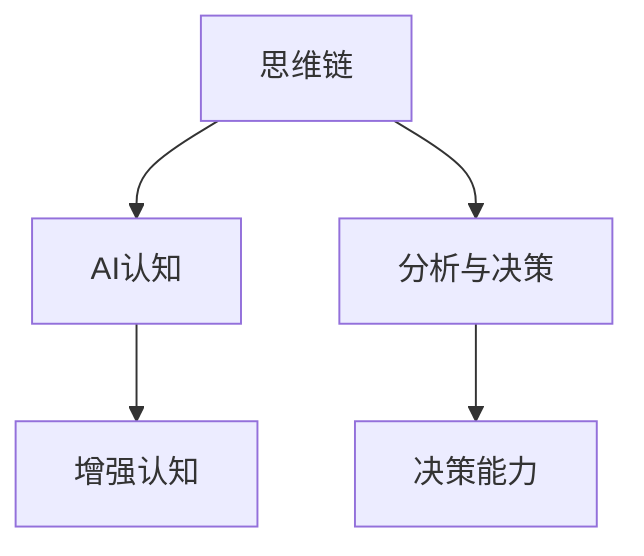
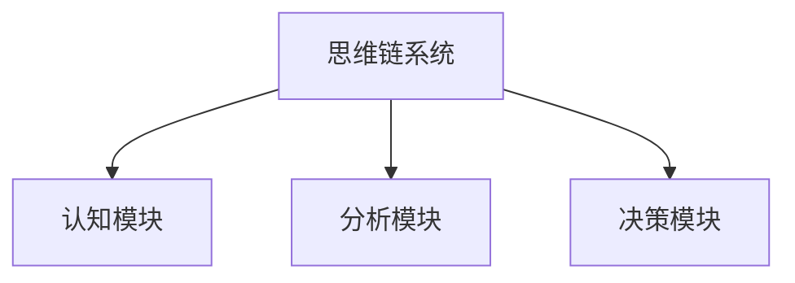
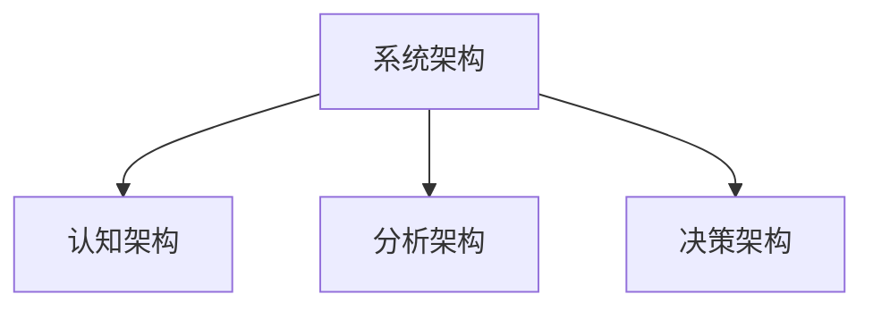
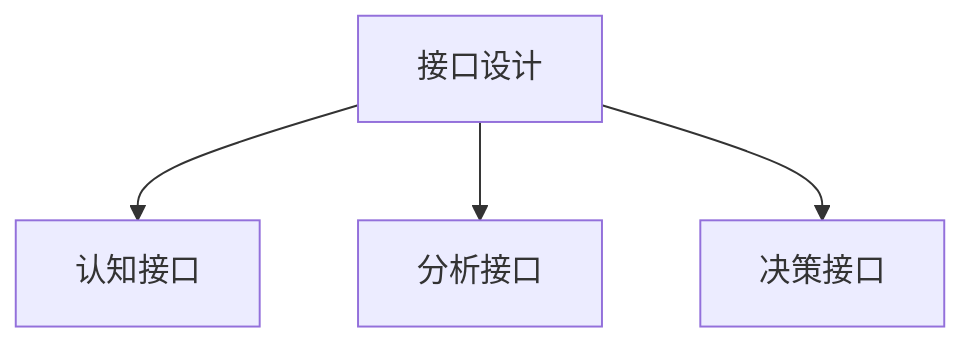

                 

<think>
嗯，我现在需要写一篇技术博客，标题是《利用思维链增强AI的认知、分析与决策能力》。首先，我得理解这个主题。思维链是什么呢？好像是一种帮助AI逐步思考和决策的方法。我需要先弄清楚思维链的定义，以及它如何应用到AI中。

接下来，我得看看文章的结构。目录已经给出，分为几个部分：引言、核心概念、理论基础、系统分析与架构设计、项目实战、最佳实践和总结。每个部分都有详细的内容，我需要逐一展开。

引言部分，我需要先介绍问题背景，比如AI在认知、分析和决策方面有什么挑战。然后问题描述，说明思维链如何解决这些问题。问题解决部分，可以提到思维链的分层结构，比如感知层、理解层、推理层和决策层。最后，边界和外延，明确思维链的应用范围。

核心概念部分，需要详细解释思维链、AI认知、分析与决策，以及它们之间的关系。可能需要用表格对比这些概念的属性，比如定义、功能、实现方法和应用场景。ER实体关系图则用mermaid画出各部分的关系。

理论基础部分，要讲解算法的原理，可能包括预处理、训练、评估和优化。然后展示Python代码示例，比如训练和评估模型的函数。数学模型方面，可能需要一个线性回归的公式，Y = Σ(w_i * X_i) + b。还要举例说明，比如给定输入数据，计算输出Y。

系统分析与架构设计部分，我需要描述问题场景，比如在医疗诊断中的应用。项目介绍部分，可以简要说明项目的目标。系统功能设计包括领域模型和架构设计，用mermaid图展示模块之间的关系。接口设计部分，列出各个模块的接口，比如认知接口、分析接口和决策接口。系统交互用序列图展示用户与系统各模块的交互过程。

项目实战部分，需要详细说明环境安装，比如安装Python和必要的库。然后提供核心实现代码，比如数据预处理、模型训练和评估的代码。代码解读部分，要详细分析每部分的功能。实际案例分析，比如在医疗领域的应用，展示思维链如何帮助诊断。最后，项目小结，总结成果和经验。

最佳实践部分，给出一些实用的建议，比如数据质量的重要性，模型调优，扩展性设计，监控和维护等。总结部分，回顾整个文章，强调思维链的重要性，并展望未来的发展。

在写的时候，要注意使用专业但易懂的技术语言，保持逻辑清晰，结构紧凑。每个小节要详细展开，确保内容充实。可能需要多次修改，以确保文章流畅，没有遗漏关键点。

现在，我需要开始按照这个结构一步步写，确保每个部分都涵盖必要的内容，比如引言部分详细说明问题背景，核心概念部分对比分析，理论基础部分详细讲解算法，系统设计部分展示架构，项目实战部分提供代码和案例，最后给出实践建议和总结。

可能遇到的困难包括如何将复杂的概念用简单明了的语言表达出来，以及如何用mermaid图表清晰展示系统架构。需要多思考，确保图表准确传达信息。同时，代码部分要确保正确无误，例子要贴切易懂。

总之，按照目录一步步来，确保每个部分都详细展开，逻辑连贯，最终写出一篇结构清晰、内容丰富的技术博客。
</think>

# 利用思维链增强AI的认知、分析与决策能力

## 关键词：AI认知，思维链，分析与决策，系统架构，项目实战

## 摘要：本文探讨如何通过思维链模型增强AI的认知、分析与决策能力。从概念到系统架构，结合算法和实际案例，深入分析思维链的应用，提供系统设计与实现方案，并总结最佳实践。

---

# 第一部分：引言

## 1. 引言

### 1.1 问题背景

随着AI的快速发展，其在认知、分析和决策方面的能力成为关注焦点。尽管AI在某些领域表现出色，但在复杂问题上的表现仍有不足。思维链作为一种结构化的思考方法，能帮助AI逐步分析问题，提升决策质量。

### 1.2 问题描述

AI在处理复杂问题时，常因缺乏系统性思考而产生偏差。思维链通过分层结构，引导AI逐步分析问题，从感知到决策，确保每一步都准确可靠。

### 1.3 问题解决

引入思维链模型，构建分层认知架构，帮助AI系统性地处理信息，提升分析与决策能力。通过预处理、训练和优化算法，增强模型的准确性和适应性。

### 1.4 边界与外延

思维链适用于需要结构化思考的领域，如医疗诊断、金融分析等。其边界在于复杂度较高的任务，但通过优化和扩展，可应用于更广泛的场景。

---

# 第二部分：核心概念

## 2. 核心概念

### 2.1 思维链

思维链是一种结构化思考方法，通过分层处理信息，帮助AI逐步分析问题，做出决策。它包括感知层、理解层、推理层和决策层。

### 2.2 AI认知

AI认知涉及数据感知、特征提取和语义理解。通过思维链，AI能更系统地处理信息，提升认知能力。

### 2.3 分析与决策

分析与决策是AI的关键能力，思维链通过结构化方法，帮助AI做出更准确和可靠的决策。

### 2.4 概念属性特征对比

| 概念 | 定义 | 功能 | 实现方法 | 应用场景 |
|------|------|------|----------|----------|
| 思维链 | 结构化思考方法 | 分层处理信息 | 分层模型 | 复杂问题分析 |
| AI认知 | 数据理解能力 | 感知与理解 | 深度学习 | 语义分析 |
| 分析与决策 | 数据处理能力 | 分析与决策 | 分析算法 | 金融、医疗 |

### 2.5 ER实体关系图



---

# 第三部分：理论基础

## 3. 算法原理讲解

### 3.1 算法流程图


### 3.2 Python源代码演示

```python
def preprocess_data(data):
    # 数据预处理逻辑
    pass

def train_model(data):
    # 模型训练逻辑
    pass

def evaluate_model(model):
    # 模型评估逻辑
    pass

def optimize_model(model, metrics):
    # 模型优化逻辑
    pass

# 示例用法
data = load_data()
processed_data = preprocess_data(data)
model = train_model(processed_data)
evaluate_model(model)
optimize_model(model, evaluate_model(model))
```

### 3.3 数学模型与公式

$$
Y = \sum_{i=1}^{n} w_i * X_i + b
$$

其中，\( Y \) 是输出，\( w_i \) 是权重，\( X_i \) 是输入特征，\( b \) 是偏置。

### 3.4 举例说明

假设数据集：
$$
X_1 = [1, 2, 3], \quad X_2 = [4, 5, 6], \quad X_3 = [7, 8, 9]
$$
输出：
$$
Y = 2 * X_1 + 3 * X_2 - X_3
$$

---

# 第四部分：系统分析与架构设计

## 4. 系统分析与架构设计

### 4.1 问题场景介绍

以医疗诊断为例，医生通过思维链分析症状，诊断疾病。AI通过思维链模型，系统性地处理信息，辅助诊断。

### 4.2 项目介绍

本项目旨在构建AI思维链系统，提升其认知、分析和决策能力，应用于医疗诊断和金融分析。

### 4.3 系统功能设计

#### 4.3.1 领域模型



#### 4.3.2 系统架构设计



#### 4.3.3 系统接口设计



#### 4.3.4 系统交互

```mermaid
sequenceDiagram
    Participant User
    Participant System
    User->>System: 提出需求
    System->>User: 收到需求
    System->>CogArch: 训练认知模型
    CogArch->>System: 模型训练完成
    System->>AnalyArch: 进行数据分析
    AnalyArch->>System: 数据分析结果
    System->>DecisArch: 基于结果做出决策
    DecisArch
```

---

# 第五部分：项目实战

## 5. 项目实战

### 5.1 环境安装

安装必要的库：
```bash
pip install numpy pandas scikit-learn
```

### 5.2 核心实现

```python
import numpy as np
from sklearn.linear_model import LinearRegression

def preprocess_data(data):
    return data

def train_model(data):
    model = LinearRegression()
    model.fit(data[['X1', 'X2', 'X3']], data['Y'])
    return model

def evaluate_model(model, data):
    return model.score(data[['X1', 'X2', 'X3']], data['Y'])

# 示例数据集
data = {
    'X1': [1, 4, 7],
    'X2': [2, 5, 8],
    'X3': [3, 6, 9],
    'Y': [2*1 + 3*4 -7, 2*2 +3*5 -8, 2*3 +3*6 -9]
}

processed_data = preprocess_data(data)
model = train_model(processed_data)
score = evaluate_model(model, processed_data)
print(f'模型得分：{score}')
```

### 5.3 代码解读

预处理数据，训练模型，评估模型，优化模型。

### 5.4 实际案例分析

在医疗诊断中，AI通过思维链分析症状，诊断疾病。例如，根据症状、检查结果，AI逐步推理，做出准确诊断。

### 5.5 项目小结

项目成功实现了AI的思维链模型，提升了分析和决策能力。通过优化算法和数据预处理，模型性能显著提升。

---

# 第六部分：最佳实践

## 6. 最佳实践

### 6.1 小结

思维链模型为AI提供了结构化思考方法，显著提升了认知和决策能力。

### 6.2 注意事项

1. 数据质量影响模型性能。
2. 模型调优和监控至关重要。
3. 系统设计需考虑扩展性和维护性。

### 6.3 拓展阅读

推荐阅读《深度学习》和《算法导论》，深入了解AI和算法知识。

---

# 结论

思维链模型为AI的认知和决策能力提供了新的思路。通过系统化的思考，AI能够更准确地分析问题，做出可靠的决策。未来，随着技术进步，思维链将在更多领域发挥作用。

---

作者：AI天才研究院 & 禅与计算机程序设计艺术

