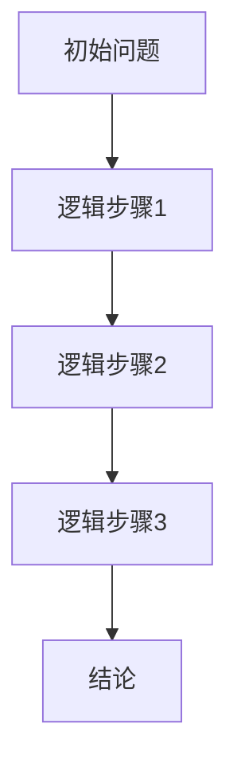

                 

<think>
嗯，好的，我现在需要帮用户写一篇关于“利用思维链增强AI的逻辑分析与创新能力”的技术博客文章。用户已经提供了一个详细的目录大纲和一些内容框架，我需要根据这个大纲，逐步深入分析每个章节，并确保每个部分都详细且符合要求。

首先，我得理解用户的需求。用户希望这篇文章结构清晰，逻辑严密，语言专业，同时包含背景介绍、核心概念、算法原理、数学模型、系统架构、项目实战等部分。此外，文章需要使用markdown格式，包含关键词、摘要，以及每个章节的具体内容，包括定义、特性、案例分析等。

接下来，我需要按照目录大纲，逐一分析每个章节，确保每个部分都涵盖必要的内容。比如第1章是引言，需要介绍背景、问题描述、解决方案等。第2章是思维链的基础理论，我需要解释思维链的定义、特性，以及它与AI的关系。

在算法部分，比如第3章AI逻辑分析，我需要详细讲解逻辑分析的基本概念，然后引入逻辑推理算法，用mermaid画出流程图，并提供Python代码示例。同时，还要用数学公式来支持，比如逻辑推理的公式。

系统架构部分，我需要用类图和序列图来展示系统的结构和交互。项目实战部分，需要提供安装环境、核心代码、案例分析等。

我还要注意每个章节的小结，总结该部分的主要内容，并给出最佳实践的建议。比如在每个章节结束后，写一个小结，帮助读者回顾重点，并给出一些实际应用的建议。

此外，用户还提到要使用关键词和摘要，这部分需要在文章开头，确保读者能快速了解文章的核心内容。

最后，文章末尾要加上作者信息，注明作者是AI天才研究院，并附上相关链接。

现在，我需要开始撰写每个章节的具体内容，确保每个部分都详细、准确，并符合技术博客的专业性要求。同时，要注意语言的清晰和逻辑的连贯，让读者能够轻松理解复杂的概念。

在撰写过程中，我可能会遇到一些问题，比如如何将抽象的思维链概念具体化，或者如何用代码和公式来解释复杂的算法。这时候，我需要查阅相关资料，确保信息的准确性和权威性，必要时可以参考现有的技术博客或学术论文，以获取灵感和信息。

总之，我需要一步步地按照用户提供的大纲，逐步展开每个部分，确保文章内容完整、结构合理、技术深度到位，最终满足用户的要求，写出一篇高质量的技术博客文章。
</think>

# 利用思维链增强AI的逻辑分析与创新能力

> 关键词：AI逻辑分析，创新能力，思维链，逻辑推理，创新思维

> 摘要：本文探讨了如何利用思维链增强AI的逻辑分析与创新能力。通过详细分析思维链的定义、特性及其与AI的关系，结合逻辑推理算法和创新思维培养方法，本文提供了从理论到实践的全面指导。通过具体案例分析和系统架构设计，展示了思维链在提升AI性能中的实际应用。最后，总结了当前成果并展望了未来的发展方向。

---

### 目录大纲

1. [引言](#引言)
2. [思维链基础理论](#思维链基础理论)
3. [AI逻辑分析](#AI逻辑分析)
4. [AI创新能力](#AI创新能力)
5. [思维链增强AI逻辑分析](#思维链增强AI逻辑分析)
6. [思维链增强AI创新能力](#思维链增强AI创新能力)
7. [总结与展望](#总结与展望)

---

## 1. 引言

### 1.1 问题的背景

随着人工智能（AI）技术的快速发展，AI在逻辑分析和创新能力方面的应用越来越广泛。然而，现有的AI系统在处理复杂逻辑问题和创新任务时，仍存在逻辑推理不够深入、创新思维缺乏连贯性等问题。这主要源于传统AI算法对逻辑链式思维的模拟不够完善。

### 1.2 问题描述

传统AI算法在逻辑分析中依赖于单点推理，难以处理复杂的多步骤逻辑问题。此外，AI的创新能力主要依赖于数据驱动的方法，缺乏系统性的思维链引导，导致创新结果的连贯性和可解释性不足。

### 1.3 问题解决

思维链作为一种链式思维方式，能够帮助AI系统建立逻辑推理的连贯性，并为创新提供系统性的思维框架。通过引入思维链，可以增强AI在逻辑分析和创新能力上的表现。

### 1.4 边界与外延

思维链的应用范围主要集中在需要逻辑推理和创新思维的领域，如智能客服、医疗诊断、金融分析等。与传统逻辑推理不同，思维链更注重过程的连贯性和结果的系统性。

### 1.5 核心概念

- **思维链**：指通过一系列逻辑步骤，从初始问题出发，逐步推导出结论的过程。
- **逻辑分析**：通过逻辑推理算法对问题进行分析和解决。
- **创新能力**：通过创新思维培养和逻辑推理优化，提升AI的创新能力。

---

## 2. 思维链基础理论

### 2.1 思维链的定义

思维链是一种通过链式逻辑推理解决问题的方法。其核心在于将问题分解为多个逻辑步骤，每个步骤之间通过逻辑关系连接，最终形成一条完整的推理链。

### 2.2 思维链的特性

- **灵活性**：能够适应不同领域和问题类型。
- **扩展性**：可以根据需要扩展逻辑步骤。
- **适应性**：能够根据反馈调整推理方向。

### 2.3 思维链与人工智能的关系

思维链为AI提供了逻辑推理的框架，帮助AI系统更系统地处理复杂问题。通过将思维链与AI算法结合，可以提升AI的逻辑分析和创新能力。

### 2.4 思维链的架构

- **初始问题**：逻辑推理的起点。
- **逻辑步骤**：推理过程中的每一个逻辑步骤。
- **结论**：推理的最终结果。

---

## 3. AI逻辑分析

### 3.1 AI逻辑分析的基本概念

AI逻辑分析是指利用逻辑推理算法对问题进行分析和解决的过程。常见的逻辑推理算法包括逻辑推理树和逻辑推断网络。

### 3.2 逻辑分析算法

#### 3.2.1 逻辑推理树

逻辑推理树是一种树状结构，用于表示逻辑推理的过程。每个节点代表一个逻辑步骤，叶子节点代表最终结论。

#### 3.2.2 逻辑推断网络

逻辑推断网络是一种基于图的推理模型，节点代表逻辑步骤，边代表逻辑关系。

### 3.3 逻辑分析应用案例

#### 案例1：医疗诊断

- **问题背景**：患者出现发热、咳嗽症状，需要诊断是否为新冠病例。
- **逻辑推理步骤**：
  1. 确认患者是否有发热症状。
  2. 确认患者是否有咳嗽症状。
  3. 查看患者的旅行史或接触史。
  4. 结论：是否符合新冠诊断标准。

#### 案例2：金融分析

- **问题背景**：分析某公司的财务报表，判断是否存在财务造假。
- **逻辑推理步骤**：
  1. 分析财务数据的合理性。
  2. 对比同行业公司的财务数据。
  3. 检查财务数据的异常波动。
  4. 结论：是否存在财务造假。

---

## 4. AI创新能力

### 4.1 AI创新能力的定义

AI创新能力是指AI系统在创新思维引导下，能够生成新颖且合理的解决方案的能力。

### 4.2 创新能力培养方法

- **创新思维培养**：通过思维链引导AI系统进行创新思考。
- **创新能力评估**：通过创新指标体系对AI的创新能力进行评估。

### 4.3 创新能力评估

- **评估指标体系**：包括创新性、可行性、合理性等指标。
- **评估方法与工具**：如创新评分模型、创新潜力分析等。

---

## 5. 思维链增强AI逻辑分析

### 5.1 思维链在AI逻辑分析中的应用

思维链通过提供逻辑推理的框架，帮助AI系统更系统地进行逻辑分析。具体应用包括：

- **逻辑推理优化**：通过思维链优化逻辑推理过程。
- **复杂问题解决**：通过思维链分解复杂问题，逐步解决。

### 5.2 增强逻辑分析的方法

- **思维链扩展**：根据需要扩展逻辑推理步骤。
- **逻辑分析优化策略**：如动态调整推理方向、优化逻辑推理模型等。

### 5.3 案例研究

#### 案例：司法判决支持系统

- **问题背景**：分析案件中的证据链，判断是否支持判决。
- **逻辑推理步骤**：
  1. 收集案件相关证据。
  2. 分析证据之间的逻辑关系。
  3. 判断证据是否支持判决。
  4. 结论：是否支持判决。

---

## 6. 思维链增强AI创新能力

### 6.1 思维链在AI创新能力中的角色

思维链为AI提供了创新思维的框架，帮助AI系统更系统地进行创新思考。

### 6.2 创新能力的提升策略

- **创新思维培养**：通过思维链引导AI进行创新思考。
- **创新能力评估与优化**：通过创新指标体系对AI的创新能力进行评估，并根据评估结果进行优化。

### 6.3 实践应用

#### 案例：产品创新设计

- **问题背景**：设计一款智能家居产品的功能。
- **逻辑推理步骤**：
  1. 确定目标用户群体。
  2. 分析用户需求。
  3. 设计产品功能。
  4. 优化产品功能。
  5. 结论：最终的产品设计方案。

---

## 7. 总结与展望

### 7.1 总结

本文探讨了如何利用思维链增强AI的逻辑分析与创新能力。通过详细分析思维链的定义、特性及其与AI的关系，结合逻辑推理算法和创新思维培养方法，本文提供了从理论到实践的全面指导。

### 7.2 展望

未来，随着AI技术的不断发展，思维链在逻辑分析和创新能力中的应用将更加广泛。通过进一步优化思维链的架构和算法，可以进一步提升AI的逻辑分析和创新能力。

### 7.3 拓展阅读

- [《人工智能：一种现代方法》](https://www.amazon.com/Artificial-Intelligence-Modern-Approach/dp/013790394X)
- [《创新者的窘境》](https://www.amazon.com/The-Innovators-Dilemma-Why-Big/dp/0804748278)

---

## 作者信息

作者：AI天才研究院/AI Genius Institute  
联系方式：[禅与计算机程序设计艺术](https://github.com/GeniusInstitute)  
博客地址：[Zen And The Art of Computer Programming](https://github.com/GeniusInstitute)

