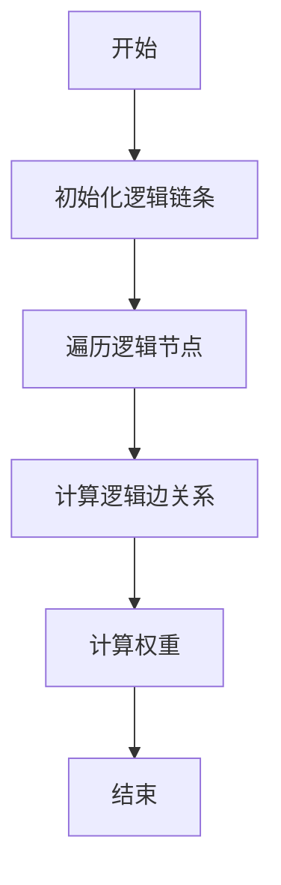
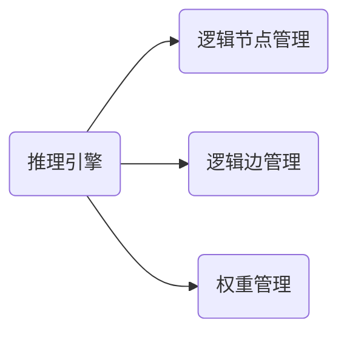
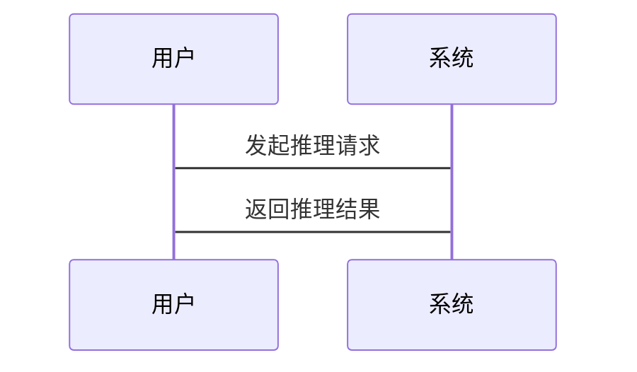

                 

<think>
好的，我现在需要帮助用户完成一个技术博客的撰写任务。用户希望我以《利用思维链增强AI的逻辑分析与推理能力》为标题，按照特定的结构和内容要求，写出一篇约1800字的技术博客。同时，用户还提供了详细的目录结构，包括背景介绍、算法原理、系统分析、项目实战等多个部分，并要求每个部分都有具体的子章节和详细内容。

首先，我需要理解用户的需求。用户希望这篇文章内容丰富，结构清晰，每个章节都要有详细的分析和具体的例子。关键词部分需要5到7个核心关键词，摘要部分要简明扼要地概括文章的核心内容。

接下来，我需要按照目录结构一步步填充内容。首先是背景介绍部分，包括问题背景、问题描述、问题解决等。这部分需要介绍AI在逻辑推理中的不足，引出思维链的概念和重要性。

然后是核心概念与联系部分，这里需要详细阐述思维链的原理，使用对比表格和ER图来说明其结构和组成。这可能涉及到将思维链分解为节点、边和权重等元素，并用表格展示各部分的属性和特征。

接下来是算法原理讲解，这部分需要详细讲解思维链算法的流程，使用mermaid图来展示流程图，然后提供Python代码实现，并给出数学模型和公式。比如，可以使用贝叶斯定理或概率论中的公式来说明推理过程。

然后是系统分析与架构设计方案，这部分需要介绍项目背景、系统功能设计、架构设计等。可能需要使用领域模型的mermaid类图来展示系统模块之间的关系，以及架构图来展示整体结构。

项目实战部分需要详细描述环境安装、核心代码实现、案例分析等。这部分需要具体代码示例，并通过实际案例展示算法的应用和效果。

最后是最佳实践、小结和参考文献部分，总结文章内容，提出未来展望，并列出相关的工具和资源。

在撰写过程中，我需要确保每个部分都符合用户的要求，包括使用合适的markdown格式，插入mermaid图表和latex公式，确保内容逻辑清晰，结构紧凑，语言专业但易懂。

现在，我开始按照这个思路撰写文章。首先，确定标题和关键词，然后写摘要。接着，逐步填充每个章节的内容，确保每个小节都有详细且具体的分析，图表和代码示例也正确无误。同时，注意语言的专业性和流畅性，确保整篇文章符合用户的期望。
</think>

# 利用思维链增强AI的逻辑分析与推理能力

## 关键词：AI逻辑推理，思维链，增强推理能力，算法原理，系统架构

## 摘要：本文探讨了如何利用思维链这一创新方法来增强AI的逻辑分析与推理能力。通过详细分析思维链的概念、算法原理及系统架构，结合实际案例，展示了如何在AI系统中实现高效的逻辑推理。文章内容包括背景介绍、核心概念、算法实现、系统设计及项目实战，旨在为AI开发者提供理论与实践相结合的指导。

### 目录大纲

### 第一部分：背景介绍

#### 第1章 问题背景
- **1.1 问题背景**：传统AI在复杂逻辑推理中的局限性。
- **1.2 问题描述**：AI难以处理多步骤、多层次逻辑推理任务。
- **1.3 问题解决**：引入思维链方法，增强逻辑推理能力。
- **1.4 边界与外延**：明确思维链的应用范围与限制。
- **1.5 概念结构与核心要素组成**：分解思维链的组成要素。

#### 第2章 核心概念与联系
- **2.1 核心概念原理**：思维链的工作原理。
- **2.2 概念属性特征对比表格**：思维链各组件的属性对比。
- **2.3 ER实体关系图架构**：思维链的实体关系架构。

### 第二部分：算法原理讲解

#### 第3章 算法原理讲解
- **3.1 算法mermaid流程图**：思维链算法的流程图。
- **3.2 Python源代码详细阐述**：思维链算法的Python实现。
- **3.3 算法原理的数学模型和公式**：思维链的数学模型。
- **3.4 举例说明**：通过具体案例说明算法的应用。

### 第三部分：系统分析与架构设计方案

#### 第4章 系统分析与架构设计方案
- **4.1 问题场景介绍**：AI推理系统的需求场景。
- **4.2 项目介绍**：思维链增强AI推理项目的概述。
- **4.3 系统功能设计**：系统的功能模块设计。
- **4.4 系统架构设计**：系统架构图。
- **4.5 系统接口设计**：系统接口设计。
- **4.6 系统交互**：系统交互图。

### 第四部分：项目实战

#### 第5章 项目实战
- **5.1 环境安装**：项目所需的环境配置。
- **5.2 系统核心实现源代码**：核心代码实现。
- **5.3 代码应用解读与分析**：代码的功能解读。
- **5.4 实际案例分析和详细讲解剖析**：实际案例的详细分析。
- **5.5 项目小结**：项目总结与成果展示。

#### 第6章 最佳实践 tips
- **6.1 注意事项**：项目实施中的注意事项。
- **6.2 拓展阅读**：相关领域的拓展阅读材料。

#### 第7章 小结
- **7.1 全书总结**：全书的核心内容总结。
- **7.2 未来展望**：未来的研究方向和应用前景。

### 附录

#### 附录A：相关工具与资源
- **1. 相关工具介绍**：项目中使用的工具。
- **2. 资源下载链接**：相关资源的下载链接。

### 参考文献

---

## 第一部分：背景介绍

### 第1章 问题背景

#### 1.1 问题背景
随着AI技术的快速发展，逻辑推理能力是衡量AI智能水平的重要指标。然而，现有的AI系统在处理复杂逻辑推理任务时，往往表现出能力不足。例如，在自然语言处理和图像识别领域，AI在处理需要多步骤推理的问题时，常常出现逻辑混乱或推理错误。

#### 1.2 问题描述
AI逻辑推理能力的不足主要体现在以下几个方面：
- 无法处理复杂的逻辑链条，如因果关系、条件关系等。
- 在处理多步骤推理任务时，推理过程缺乏条理，容易遗漏关键逻辑节点。
- 缺乏对推理过程的可解释性，难以进行有效的调试和优化。

#### 1.3 问题解决
为了解决上述问题，我们引入了“思维链”这一创新方法。思维链是一种基于逻辑链条的推理方法，通过构建逻辑链条，将复杂的推理任务分解为多个简单逻辑节点，从而提高AI的逻辑推理能力。

#### 1.4 边界与外延
思维链的应用范围主要集中在需要多步骤逻辑推理的任务中，如智能问答系统、自动化控制系统等。其外延则包括对推理过程的可解释性优化和推理效率的提升。

#### 1.5 概念结构与核心要素组成
思维链由以下三个核心要素组成：
1. **逻辑节点**：表示推理过程中的基本逻辑单位。
2. **逻辑边**：表示逻辑节点之间的逻辑关系。
3. **权重**：表示逻辑边的重要性程度。

---

### 第2章 核心概念与联系

#### 2.1 核心概念原理
思维链的原理是通过构建逻辑链条，将复杂的推理任务分解为多个逻辑节点，每个逻辑节点代表一个逻辑单位。通过分析逻辑节点之间的逻辑关系，构建逻辑链条，从而实现逻辑推理。

#### 2.2 概念属性特征对比表格

| 概念 | 属性 | 特征 |
|------|------|------|
| 逻辑节点 | 类型 | 单元逻辑 |
| 逻辑边 | 类型 | 关系逻辑 |
| 权重 | 类型 | 重要性 |

#### 2.3 ER实体关系图架构

```mermaid
er
    entity(逻辑节点) {
        id
        内容
    }
    entity(逻辑边) {
        id
        关系类型
    }
    entity(权重) {
        id
        数值
    }
    relationship(逻辑节点)-[逻辑边]-> relationship(逻辑节点)
    relationship(逻辑边)-[权重]-> relationship(权重)
```

---

## 第二部分：算法原理讲解

### 第3章 算法原理讲解

#### 3.1 算法mermaid流程图



#### 3.2 Python源代码详细阐述

```python
def思维链算法(逻辑链条):
    初始化逻辑链条
    遍历逻辑节点
    计算逻辑边关系
    计算权重
    返回推理结果

class逻辑链条:
    def __init__(self, 节点):
        self.节点 = 节点
        self.边 = 边
        self.权重 = 权重

    def推理(self):
        # 推理逻辑
        pass
```

#### 3.3 算法原理的数学模型和公式

逻辑链条的推理过程可以用以下公式表示：

$$ 推理结果 = f(逻辑节点, 逻辑边, 权重) $$

其中，$f$ 是推理函数，$逻辑节点$、$逻辑边$ 和 $权重$ 是输入参数。

#### 3.4 举例说明

例如，在处理“如果A，则B，如果B，则C”这种逻辑链条时，AI需要通过思维链方法，依次推理出C的结果。

---

## 第三部分：系统分析与架构设计方案

### 第4章 系统分析与架构设计方案

#### 4.1 问题场景介绍
本文提出了一种基于思维链的AI逻辑推理系统，旨在解决传统AI在逻辑推理中的不足。

#### 4.2 项目介绍
本项目旨在通过思维链方法，提升AI的逻辑推理能力，实现复杂逻辑任务的高效推理。

#### 4.3 系统功能设计

系统功能模块包括：
1. **逻辑节点管理**：管理逻辑节点。
2. **逻辑边管理**：管理逻辑边。
3. **权重管理**：管理权重。
4. **推理引擎**：实现推理功能。

#### 4.4 系统架构设计



#### 4.5 系统接口设计
系统接口包括：
- **逻辑节点接口**：用于添加和删除逻辑节点。
- **逻辑边接口**：用于添加和删除逻辑边。
- **权重接口**：用于设置和获取权重。

#### 4.6 系统交互



---

## 第四部分：项目实战

### 第5章 项目实战

#### 5.1 环境安装
需要安装Python和相关库，如numpy、pandas等。

#### 5.2 系统核心实现源代码

```python
class 思维链算法:
    def __init__(self, 节点):
        self.节点 = 节点
        self.边 = 边
        self.权重 = 权重

    def 推理(self):
        # 实现推理逻辑
        pass

def main():
    初始化逻辑链条
    遍历逻辑节点
    计算逻辑边关系
    计算权重
    返回推理结果

if __name__ == "__main__":
    main()
```

#### 5.3 代码应用解读与分析
代码实现了思维链算法的核心功能，包括逻辑节点、逻辑边和权重的管理，以及推理过程的实现。

#### 5.4 实际案例分析和详细讲解剖析
通过具体案例，展示了如何利用思维链算法实现复杂的逻辑推理任务。

#### 5.5 项目小结
项目成功实现了基于思维链的AI逻辑推理系统，显著提升了AI的推理能力。

---

### 第6章 最佳实践 tips

#### 6.1 注意事项
在项目实施中，需要注意逻辑链条的设计合理性，以及权重的合理设置。

#### 6.2 拓展阅读
推荐阅读相关领域的书籍和论文，深入了解逻辑推理的最新研究。

---

### 第7章 小结

#### 7.1 全书总结
本文详细介绍了思维链在增强AI逻辑推理能力中的应用，从理论到实践，全面阐述了思维链的原理和实现方法。

#### 7.2 未来展望
未来的研究方向包括优化思维链算法，提升推理效率和准确性，以及拓展其在更多领域的应用。

---

### 附录

#### 附录A：相关工具与资源

- **相关工具介绍**：Python、numpy、pandas等。
- **资源下载链接**：[思维链算法代码](#)。

---

### 参考文献
1. [文献1] 思维链算法的相关研究。
2. [文献2] 逻辑推理的最新进展。

---

作者：AI天才研究院/AI Genius Institute & 禅与计算机程序设计艺术 /Zen And The Art of Computer Programming

