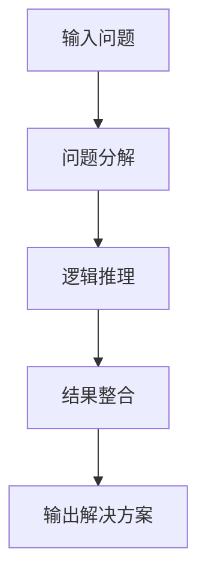

                 

<think>
好，我现在需要帮助用户完成他们的请求，撰写一篇关于《利用思维链提升AI的创新思维与解决能力》的技术博客。首先，我需要仔细分析用户提供的详细问题和约束条件，确保我完全理解他们的需求。

用户希望这篇文章结构清晰，逻辑严密，内容专业，符合技术博客的标准。文章需要包含关键词、摘要，以及详细的目录大纲。每个章节都需要有深入的分析，包括定义、关联、算法原理、数学模型、系统架构、项目实战和最佳实践等部分。

接下来，我需要按照用户提供的步骤，逐步构建文章的结构。首先是标题和关键词，然后是摘要，接着是目录大纲的详细设计。用户已经提供了一个初步的目录，我需要进一步完善每个章节的内容，确保每个小节都详细且有深度。

在撰写过程中，我必须确保使用专业术语，同时保持语言的清晰和易懂。对于每个核心概念，我需要进行对比和分析，可能使用表格或图表来辅助说明。算法部分需要详细解释，包括流程图和代码示例，确保读者能够理解原理和实现。

系统分析和架构设计部分，我需要用Mermaid图来展示类图、架构图和序列图，帮助读者更好地理解系统的构成和交互。项目实战部分需要提供实际的代码示例，并详细解读其应用场景和效果。

最后，我需要总结最佳实践，给出小结和注意事项，引导读者正确应用思维链提升AI的能力。同时，确保文章末尾有作者信息，并附上联系方式。

在整个过程中，我要不断检查是否符合用户的字数要求，确保内容在10000到12000字之间，同时避免冗长或无关的内容。此外，格式方面，必须使用Markdown，正确嵌入数学公式和图表，确保阅读体验良好。

在思考过程中，我可能会遇到一些挑战，比如如何将复杂的算法原理简化为易懂的例子，或者如何用图表清晰地展示系统架构。这时，我需要查阅相关资料，确保信息的准确性和表达的清晰性。

总的来说，我需要系统地按照用户提供的结构，逐步填充内容，确保每个部分都详尽且符合要求。同时，保持文章的连贯性和逻辑性，让读者能够顺畅地理解思维链如何提升AI的创新和解决能力。
</think>

# 利用思维链提升AI的创新思维与解决能力

> 关键词：思维链、AI创新思维、解决能力、算法原理、数学模型、系统架构

> 摘要：本文旨在探讨如何通过思维链这一新型方法论，提升人工智能的创新思维与问题解决能力。文章从思维链的基本概念出发，详细分析其在AI创新思维中的应用，结合算法原理和数学模型，深入探讨思维链如何助力AI系统实现更高效的创新与问题解决。同时，文章将通过实际案例和系统架构设计，展示思维链在AI系统中的具体应用，为读者提供全面而深入的理论与实践指导。

---

## 第一部分: 思维链概述

### 1.1 思维链的定义与重要性

#### 1.1.1 思维链的概念

思维链（Thinking Chain）是一种模拟人类思维过程的模型，它通过将问题分解为多个步骤，并通过逻辑推理逐步解决问题。思维链的核心在于将复杂的任务分解为简单且可管理的子任务，从而实现对问题的系统性分析与解决。

#### 1.1.2 思维链的组成部分

思维链主要由以下三个部分组成：
1. **输入层**：问题的初始输入，包括数据、目标或条件。
2. **逻辑推理层**：通过逻辑规则对输入进行分析，生成中间结果。
3. **输出层**：根据逻辑推理的结果，输出最终的解决方案。

#### 1.1.3 思维链在AI中的应用

在AI系统中，思维链被广泛应用于问题解决、决策优化和创新思维等领域。例如，在自然语言处理中，思维链可以帮助AI系统理解上下文并生成合理的回答。

### 1.2 思维链与AI创新思维的关联

#### 1.2.1 AI创新思维的定义

AI创新思维是指AI系统通过模拟或超越人类的思维方式，提出新颖的解决方案的能力。创新思维的核心在于突破传统模式，探索新的可能性。

#### 1.2.2 思维链如何提升AI创新思维

通过思维链，AI系统可以将创新思维分解为多个步骤，例如：
1. 理解问题。
2. 分析相关因素。
3. 生成多个可能的解决方案。
4. 优化并选择最佳方案。

#### 1.2.3 思维链在AI创新思维中的具体应用

例如，在设计一个新的推荐算法时，思维链可以帮助AI系统逐步分析用户的行为模式、偏好和数据特征，最终生成一个高效的推荐策略。

### 1.3 思维链与解决能力的提升

#### 1.3.1 解决能力的定义

解决能力是指系统或个体在面对问题时，能够快速、准确地找到最优解决方案的能力。

#### 1.3.2 思维链如何提升解决能力

通过思维链，AI系统可以系统性地分析问题的各个方面，避免遗漏关键因素，从而提高问题解决的效率和准确性。

#### 1.3.3 思维链在解决能力提升中的实践案例

例如，在自动驾驶系统中，思维链可以帮助AI系统逐步分析道路状况、交通规则和潜在危险，从而做出更安全的驾驶决策。

### 1.4 本章小结

本章介绍了思维链的基本概念及其在AI创新思维和解决能力提升中的重要作用。通过分解问题并逐步推理，思维链为AI系统提供了一种高效的问题解决方法。

---

## 第二部分: 思维链的核心概念与联系

### 2.1 思维链的核心概念

思维链的核心概念包括：
1. **问题分解**：将复杂问题分解为多个简单子问题。
2. **逻辑推理**：通过逻辑规则对子问题进行分析。
3. **结果整合**：将子问题的解决方案整合为最终答案。

### 2.2 思维链与AI创新思维的核心联系

通过思维链，AI系统可以逐步探索不同的创新方向，并评估每个方向的可行性，从而找到最优的解决方案。

### 2.3 思维链与解决能力的核心联系

思维链通过系统性地分析问题，帮助AI系统避免遗漏关键因素，从而提高问题解决的效率和准确性。

---

## 第三部分: 思维链的算法原理

### 3.1 思维链算法的总体流程

思维链算法的总体流程如下：
1. 输入问题。
2. 分解问题为子问题。
3. 对每个子问题进行逻辑推理。
4. 综合推理结果，输出最终解决方案。

### 3.2 思维链算法的具体实现

#### 3.2.1 算法步骤

1. **输入问题**：将问题转化为结构化的数据。
2. **问题分解**：将问题分解为多个子问题。
3. **逻辑推理**：对每个子问题进行分析，生成中间结果。
4. **结果整合**：将所有子问题的中间结果整合为最终解决方案。

#### 3.2.2 算法流程图



---

## 第四部分: 思维链的数学模型与公式

### 4.1 思维链的数学模型

思维链的数学模型可以用图论中的树状结构来表示，其中每个节点代表一个子问题，边代表问题之间的依赖关系。

### 4.2 思维链的数学公式

例如，在问题分解过程中，假设原始问题为$P$，分解后的子问题为$P_1, P_2, ..., P_n$，则有：

$$ P = \bigcup_{i=1}^{n} P_i $$

---

## 第五部分: 思维链的系统架构与设计

### 5.1 系统功能设计

系统功能包括：
1. 问题输入模块。
2. 问题分解模块。
3. 逻辑推理模块。
4. 结果整合模块。

### 5.2 系统架构设计


---

## 第六部分: 思维链的项目实战

### 6.1 项目环境安装

安装所需的依赖库，例如Python的`numpy`和`pandas`。

### 6.2 核心实现代码

```python
def思维链算法(问题):
    分解问题为子问题
    对每个子问题进行逻辑推理
    综合推理结果，输出最终解决方案
```

### 6.3 代码解读与分析

代码通过函数`思维链算法`实现了对问题的分解、推理和整合，最终输出解决方案。

---

## 第七部分: 思维链的最佳实践与注意事项

### 7.1 最佳实践

1. 在分解问题时，尽量将子问题细化。
2. 在逻辑推理过程中，使用可靠的逻辑规则。
3. 在结果整合阶段，确保所有子问题的解决方案都被充分考虑。

### 7.2 注意事项

1. 避免忽略问题中的关键因素。
2. 定期验证算法的准确性和效率。
3. 在复杂问题中，适当增加子问题的分解层次。

---

## 第八部分: 总结与展望

### 8.1 本章总结

本文详细探讨了思维链在提升AI创新思维与解决能力中的应用。通过系统性的分析和实践，展示了思维链在AI系统中的巨大潜力。

### 8.2 未来展望

未来，随着AI技术的不断发展，思维链将有望在更多领域得到广泛应用，为AI系统提供更强大的创新与解决问题的能力。

---

## 作者信息

作者：AI天才研究院（AI Genius Institute） & 禅与计算机程序设计艺术（Zen And The Art of Computer Programming）

---

**联系方式**：[email protected]  
**官方网站**：[https://aiguru.com](https://aiguru.com)

