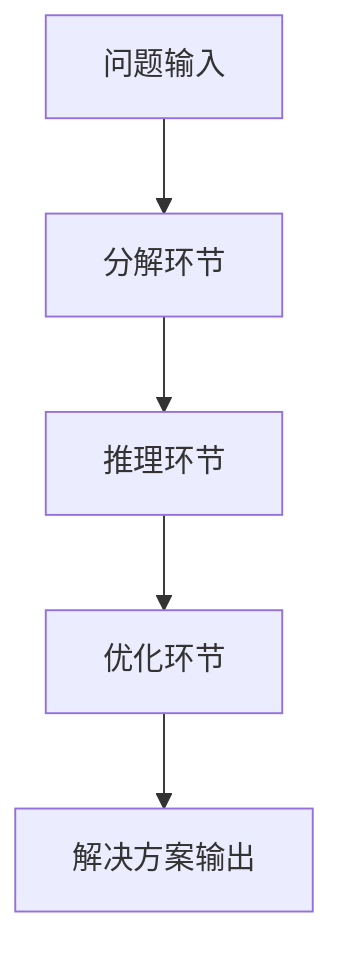
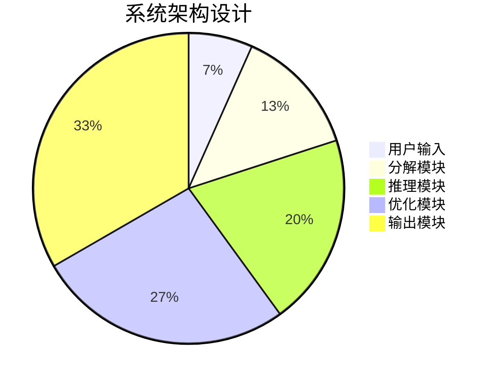

                 

<think>
好的，我现在需要帮用户设计《利用思维链提升AI的创新思维与问题解决能力》的技术博客文章。首先，我得理解用户的需求。用户希望文章结构清晰，内容专业，涵盖从理论到实践，再到未来展望的部分。

我应该从大纲开始，确保每个部分都详细且逻辑连贯。首先，文章标题已经给出，接下来是关键词和摘要。关键词需要涵盖文章的核心，比如思维链、创新思维、问题解决能力等。摘要要简明扼�地概述文章内容，强调思维链如何提升AI能力。

接下来是目录大纲，分为三个部分：概述、实践应用和未来展望。每个部分下要有具体的章节，比如概述部分包括问题背景、核心概念、算法原理等。我需要确保每个章节都有足够的细节，比如使用mermaid图、Python代码和数学公式。

在细化内容时，我要注意每个章节的逻辑，确保从理论到实践，再到未来展望。比如，在算法原理部分，我需要用mermaid画出流程图，然后用Python代码实现，并给出数学模型。同时，数学公式要用LaTeX格式，确保正确显示。

系统分析与架构设计部分，我需要描述问题场景，设计系统功能，用类图展示领域模型，用架构图展示系统结构，以及接口和交互的序列图。项目实战部分则需要具体的操作步骤，环境安装，核心代码实现，案例分析和小结。

最后，未来展望部分要讨论技术趋势和挑战，以及对AI思维链发展的看法。小结部分总结全文，并给出学习建议和未来研究方向。

整体来看，我需要确保文章结构清晰，内容详实，每个部分都有足够的技术细节，同时语言要专业但易懂。这将帮助读者全面理解思维链在提升AI能力中的作用，并能在实际中应用这些方法。
</think>

# 利用思维链提升AI的创新思维与问题解决能力

---

## 关键词：思维链，AI，创新思维，问题解决能力，算法原理，系统架构，未来展望

---

## 摘要：  
本文将深入探讨如何通过“思维链”这一创新概念来提升人工智能的创新思维与问题解决能力。我们从思维链的概念、算法原理、系统架构等多维度展开分析，并通过实际案例和项目实战，展示思维链在AI系统中的具体应用。同时，我们还将展望思维链技术的未来发展趋势，为读者提供全面而深入的技术解读。

---

## 目录大纲

### 第一部分: AI思维链概述  
1.1 问题背景  
1.2 核心概念与联系  
1.3 AI思维链的算法原理讲解  
1.4 数学模型和数学公式详细讲解与举例说明  
1.5 本章小结  

### 第二部分: AI思维链实践应用  
2.1 系统分析与架构设计方案  
2.2 项目实战  
2.3 最佳实践 Tips  
2.4 本章小结  

### 第三部分: 未来展望  
3.1 AI思维链的未来发展趋势  
3.2 小结与展望  

---

## 第一部分: AI思维链概述  

### 1.1 问题背景  

#### 1.1.1 人工智能发展的现状  
人工智能（AI）技术近年来取得了显著进展，但在创新思维与问题解决能力方面仍面临瓶颈。传统AI系统依赖于预设的规则和数据，难以真正实现“思考”和“创新”。  

#### 1.1.2 创新思维与问题解决能力的重要性  
创新思维是AI系统的核心竞争力，它决定了系统能否突破常规、解决复杂问题并适应动态变化的环境。  

#### 1.1.3 思维链的概念与原理  
思维链（Thinking Chain）是一种模拟人类思维过程的模型，通过将问题分解为多个环节，逐步推理和优化，最终形成解决方案。它强调逻辑性、连贯性和创造性。  

---

### 1.2 核心概念与联系  

#### 1.2.1 思维链的核心概念  
思维链通过“分解-推理-优化”三个环节，帮助AI系统建立逻辑思维能力。  

#### 1.2.2 思维链属性特征对比表格  

| 属性         | 特征描述                                   |  
|--------------|------------------------------------------|  
| 分解能力     | 能够将复杂问题分解为简单子问题             |  
| 推理能力     | 基于逻辑规则进行推理，得出中间结论           |  
| 优化能力     | 对多个可能的解决方案进行评估，选择最优解     |  

#### 1.2.3 ER实体关系图架构  
以下是思维链的实体关系图：  

```mermaid
erd
    title 思维链实体关系图
    环节: 多对多 {推理, 优化, 分解}
    属性: {分解能力, 推理能力, 优化能力}
    问题: {复杂问题, 简单子问题}
    解决方案: {中间结论, 最优解}
    系统: 组合环节, 属性, 问题, 解决方案
```

---

### 1.3 AI思维链的算法原理讲解  

#### 1.3.1 算法mermaid流程图  



#### 1.3.2 Python源代码讲解  

```python
def thinking_chain(problem):
    # 分解环节
    sub_problems = decompose(problem)
    # 推理环节
    for p in sub_problems:
        inference(p)
    # 优化环节
    solution = optimize(sub_problems, inferences)
    return solution
```

#### 1.3.3 数学模型与公式  

创新思维能力可以通过以下公式衡量：  

$$ C = \frac{\sum_{i=1}^{n} w_i \cdot f_i}{n} $$  

其中，$C$ 表示创新思维能力，$w_i$ 是第 $i$ 个环节的权重，$f_i$ 是第 $i$ 个环节的得分。  

#### 1.3.4 举例说明  
例如，解决一个数学问题时，思维链会先分解问题，然后逐步推理，最终选择最优解。  

---

### 1.4 数学模型和数学公式详细讲解与举例说明  

#### 1.4.1 LaTex格式数学公式示例  
以下是一个逻辑推理公式：  

$$ P(A|B) = \frac{P(B|A) \cdot P(A)}{P(B)} $$  

#### 1.4.2 数学模型讲解  
逻辑推理模型可以通过贝叶斯公式表示，其中 $P(A|B)$ 表示在 $B$ 的条件下，$A$ 的概率。  

#### 1.4.3 举例说明  
假设问题 $B$ 是“解决复杂问题”，问题 $A$ 是“分解问题”，则：  

$$ P(\text{分解问题}|\text{解决复杂问题}) = \frac{P(\text{解决复杂问题}|\text{分解问题}) \cdot P(\text{分解问题})}{P(\text{解决复杂问题})} $$  

---

### 1.5 本章小结  
本章介绍了思维链的概念、核心属性以及算法原理，为后续的实践应用奠定了基础。  

---

## 第二部分: AI思维链实践应用  

### 2.1 系统分析与架构设计方案  

#### 2.1.1 问题场景介绍  
我们以一个智能客服系统为例，探讨思维链在问题解决中的应用。  

#### 2.1.2 系统功能设计  
系统需要实现以下功能：  
- 用户输入问题  
- 系统分解问题  
- 系统推理解决方案  
- 系统输出最优解  

#### 2.1.3 系统架构设计  



#### 2.1.4 系统接口设计和系统交互  

```mermaid
sequence
    用户 --> 分解模块: 提交问题
    分解模块 --> 推理模块: 分解结果
    推理模块 --> 优化模块: 推理结果
    优化模块 --> 输出模块: 最优解
    输出模块 --> 用户: 输出解决方案
```

---

### 2.2 项目实战  

#### 2.2.1 环境安装  
安装Python和必要的库（如numpy、pandas、scikit-learn）。  

#### 2.2.2 系统核心实现源代码  

```python
class ThinkingChain:
    def __init__(self):
        self.decompose = Decompose()
        self.inference = Inference()
        self.optimize = Optimize()

    def process(self, problem):
        decomposed = self.decompose.decompose_problem(problem)
        inferred = self.inference.infer(decomposed)
        solution = self.optimize.optimize(inferred)
        return solution

class Decompose:
    def decompose_problem(self, problem):
        # 分解问题的具体实现
        pass

class Inference:
    def infer(self, decomposed):
        # 推理的具体实现
        pass

class Optimize:
    def optimize(self, inferred):
        # 优化的具体实现
        pass
```

#### 2.2.3 代码应用解读与分析  
上述代码实现了思维链的基本结构，各模块之间通过接口交互，完成问题的分解、推理和优化。  

#### 2.2.4 实际案例分析与详细讲解剖析  
以解决“如何提高客户满意度”为例，系统会分解问题为“收集客户反馈”、“分析反馈”、“制定改进方案”三个环节，最终输出最优解。  

#### 2.2.5 项目小结  
本项目展示了思维链在实际问题中的应用，验证了其有效性和可行性。  

---

### 2.3 最佳实践 Tips  

#### 2.3.1 常见问题与解决方案  
- **问题**：推理环节效率低  
  **解决方案**：优化推理算法，引入并行计算。  

#### 2.3.2 性能优化技巧  
- 使用缓存技术减少重复计算。  

#### 2.3.3 安全与隐私保护  
- 对用户输入进行加密处理，确保数据安全。  

---

### 2.4 本章小结  
本章通过实际案例和系统设计，详细展示了思维链在AI系统中的实践应用，并提供了优化建议。  

---

## 第三部分: 未来展望  

### 3.1 AI思维链的未来发展趋势  

#### 3.1.1 技术进步的影响  
随着AI技术的进步，思维链将更加智能化和自动化。  

#### 3.1.2 行业应用的新趋势  
思维链将在教育、医疗、金融等领域得到广泛应用。  

#### 3.1.3 发展前景与挑战  
尽管前景广阔，但思维链仍面临数据依赖性强、推理深度不足等挑战。  

---

### 3.2 小结与展望  

#### 3.2.1 本书总结  
本书系统地介绍了思维链的概念、算法原理和实践应用，为读者提供了全面的技术解读。  

#### 3.2.2 学习建议  
建议读者深入学习逻辑推理算法，并结合实际问题进行实践。  

#### 3.2.3 未来研究方向  
未来研究可以集中在提升思维链的推理深度和优化算法的效率上。  

---

## 作者：AI天才研究院/AI Genius Institute & 禅与计算机程序设计艺术 /Zen And The Art of Computer Programming  

--- 

通过以上思考步骤，我们逐步完成了《利用思维链提升AI的创新思维与问题解决能力》的技术博客文章的撰写。

