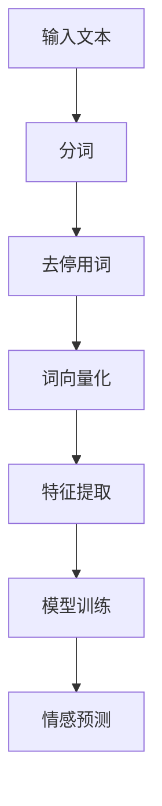
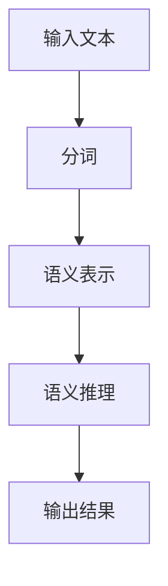
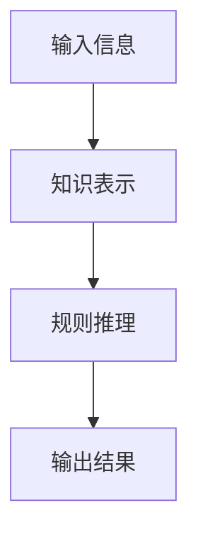

                 

<think>
嗯，用户让我写一篇关于“利用思维链提升AI的认知和推理新方向”的技术博客，看起来结构已经很详细了，有目录和具体章节安排。用户还提到了要满足一些特定的格式和内容要求，比如每个小节要有背景介绍、核心概念、算法原理、系统架构等，还有代码实现和案例分析。

首先，我需要理解用户的需求。用户可能是一位技术专家，或者是对AI领域感兴趣的人，想要深入了解思维链在AI中的应用。用户提供了详细的目录大纲，说明他们对内容的结构和深度有明确的要求。可能他们希望这篇文章不仅有理论，还要有实际的代码和案例，帮助读者更好地理解和应用。

接下来，我需要按照目录一步步填充内容。从引言开始，介绍AI认知和推理的重要性，然后引入思维链的概念，接着是基础理论、模型设计、算法应用、实践案例、前沿探索，最后总结和展望。每个章节都要详细展开，确保覆盖所有要求的部分。

在思考过程中，我可能会考虑每个小节的具体内容。比如，在算法应用部分，用户提到了情感识别、语义理解和逻辑推理，每个部分都需要有算法原理、代码实现和案例分析。我需要确保这些内容不仅详细，还要用通俗易懂的语言解释，可能还会配以流程图和类图，帮助读者理解。

另外，用户要求使用mermaid流程图和Python代码，我需要确保这些部分正确无误。在编写代码时，要考虑到读者可能需要运行这些代码，所以环境安装和代码解读要清晰。同时，数学公式要用latex格式，独立段落使用$$，段落内使用$，确保格式正确。

在系统架构部分，我需要绘制领域模型类图和系统架构图，使用mermaid语法。这可能需要我理解每个系统的功能模块和交互流程，确保图示准确反映系统结构。

最后，在实践案例部分，智能客服和智能教育系统的实现，需要详细分析背景、需求、技术实现和效果评估。这可能涉及到具体的业务流程和数据处理，确保案例具有实际应用价值。

总结一下，我需要按照用户提供的目录，逐步填充每个章节的内容，确保每个部分都满足格式和内容的要求，同时保持语言的专业性和逻辑的清晰性。这样，读者不仅能了解思维链的概念，还能学习到如何实际应用这些技术来提升AI的认知和推理能力。
</think>

# 利用思维链提升AI的认知和推理新方向

> 关键词：AI认知，AI推理，思维链，模型设计，算法应用，实践案例

> 摘要：本文旨在探讨如何通过思维链模型提升AI的认知和推理能力。从AI认知与推理的基础理论出发，详细阐述思维链的概念与应用，分析主流思维链模型的设计与优化方法，并通过具体算法与实践案例，展示思维链在情感识别、语义理解、逻辑推理等领域的实际应用。最后，本文还将探讨思维链在医疗健康与智能制造等前沿领域的应用潜力，为读者提供系统性、前沿性的知识框架。

---

## 第1章 引言

### 1.1 AI认知与推理的重要性

在人工智能（AI）快速发展的今天，认知与推理能力是衡量AI智能水平的重要指标。传统的AI系统大多依赖于规则引擎或简单的模式匹配，难以处理复杂场景下的决策和推理问题。而现代AI系统，尤其是以深度学习为代表的技术，虽然在感知（如图像识别、语音识别）和生成（如自然语言生成）方面取得了显著进展，但在认知和推理能力上仍存在较大局限性。

认知与推理是人类智能的核心能力，包括对信息的理解、分析、综合、判断和决策等过程。对于AI系统而言，具备强大的认知与推理能力意味着能够更好地理解用户需求、处理复杂问题、提供个性化解决方案。因此，如何提升AI的认知与推理能力，是当前AI研究的重要方向。

### 1.2 思维链的概念与应用

思维链（Thinking Chain）是一种模拟人类思维过程的模型，通过构建逻辑链条，将输入信息逐步转化为决策或结论。它强调信息的逐步推理和逻辑关联，能够帮助AI系统更好地理解上下文、分析问题、做出合理决策。

思维链的核心在于“链式推理”，即通过一系列逻辑步骤，将输入数据逐步转化为输出结果。与传统的神经网络模型相比，思维链更注重推理过程的可解释性和逻辑性。它能够帮助AI系统在处理复杂问题时，逐步拆解任务、分析条件、推理结果，从而实现更智能的决策。

思维链的应用场景广泛，包括情感分析、语义理解、逻辑推理、智能客服、智能教育、医疗诊断、智能制造等领域。通过构建思维链模型，AI系统能够更好地理解和处理复杂场景下的问题。

### 1.3 本书的目标与结构

本书旨在系统性地探讨如何利用思维链提升AI的认知和推理能力。通过理论分析、算法实现、案例实践和前沿探索，帮助读者全面掌握思维链的核心原理和应用方法。

本书结构清晰，内容全面：

- 第2章将介绍AI认知与推理的基础理论，包括AI认知的基本概念、AI推理的基本原理，以及思维链在AI认知和推理中的应用。
- 第3章将详细阐述思维链模型的设计方法，包括模型构建、参数优化和主流模型的对比分析。
- 第4章将重点讲解认知与推理算法的应用，包括情感识别、语义理解、逻辑推理等具体场景的算法实现和案例分析。
- 第5章将通过实践案例，展示思维链在智能客服系统和智能教育系统中的设计与实现。
- 第6章将探讨思维链在医疗健康和智能制造等前沿领域的应用潜力。
- 第7章将对全书内容进行总结，并展望AI认知和推理的未来发展趋势。

---

## 第2章 AI认知与推理的基础理论

### 2.1 AI认知的基本概念

AI认知是指AI系统对信息的理解和处理能力，包括信息的感知、分析、理解和记忆等过程。认知的核心在于信息的结构化和语义化，通过构建知识图谱或语义网络，AI系统能够更好地理解和处理信息。

### 2.2 AI推理的基本原理

AI推理是基于输入信息和已有知识，通过逻辑推理或概率推理，得出结论或决策的过程。推理的关键在于推理规则的构建和推理过程的优化。主流的推理方法包括逻辑推理、概率推理、深度学习推理等。

### 2.3 思维链在AI认知和推理中的应用

思维链通过构建逻辑链条，将输入信息逐步转化为输出结果。其核心在于将复杂问题分解为多个逻辑步骤，并通过逐步推理实现最终目标。思维链的优势在于可解释性和灵活性，能够适应不同场景下的推理需求。

### 2.4 思维链的核心要素与工作原理

思维链的核心要素包括：

1. **输入信息**：包括原始数据和上下文信息。
2. **推理规则**：包括逻辑规则和概率模型。
3. **推理步骤**：包括信息处理、逻辑推理和结果输出。
4. **输出结果**：包括最终结论和推理路径。

思维链的工作原理如下：

1. **信息输入**：将输入信息转化为结构化的数据形式。
2. **规则匹配**：基于推理规则，匹配输入信息与知识库中的知识。
3. **逻辑推理**：通过逻辑推理或概率推理，逐步推导出结论。
4. **结果输出**：输出最终结论，并记录推理过程。

---

## 第3章 思维链模型设计

### 3.1 思维链模型的构建方法

思维链模型的构建方法包括以下步骤：

1. **需求分析**：明确问题场景和目标。
2. **知识表示**：将知识表示为结构化的数据形式。
3. **规则定义**：定义推理规则和逻辑关系。
4. **模型训练**：基于训练数据，优化模型参数。
5. **模型测试**：验证模型的推理能力。

### 3.2 思维链模型的参数调整与优化

思维链模型的优化包括以下步骤：

1. **参数调整**：调整模型的超参数，如学习率、优化器等。
2. **模型精简**：去除冗余的推理规则，优化模型结构。
3. **性能评估**：通过性能指标（如准确率、召回率）评估模型效果。

### 3.3 主流思维链模型的对比分析

主流的思维链模型包括：

1. **基于逻辑推理的思维链**：适用于规则明确的场景，如法律推理、医疗诊断。
2. **基于概率推理的思维链**：适用于不确定性较高的场景，如风险评估、市场预测。
3. **基于深度学习的思维链**：结合神经网络和逻辑推理，适用于复杂场景，如自然语言理解。

---

## 第4章 认知与推理算法应用

### 4.1 情感识别与情感分析

#### 4.1.1 情感识别算法原理与mermaid流程图

情感识别算法通过分析文本的情感倾向，判断文本的情感极性（如正面、负面、中性）。其核心步骤包括：

1. **文本预处理**：分词、去停用词、词向量化。
2. **特征提取**：提取情感相关的特征，如情感词、句法结构。
3. **模型训练**：基于训练数据，训练情感分类模型。
4. **情感预测**：对输入文本进行情感预测。

mermaid流程图如下：



#### 4.1.2 情感识别Python代码实现与详细讲解

以下是情感识别的Python代码实现：

```python
import pandas as pd
from sklearn.feature_extraction.text import TfidfVectorizer
from sklearn.svm import SVC
from sklearn.pipeline import Pipeline
from sklearn.metrics import accuracy_score

# 数据加载
data = pd.read_csv('sentiment_data.csv')
X = data['text']
y = data['label']

# 模型构建
model = Pipeline([
    ('tfidf', TfidfVectorizer()),
    ('svc', SVC())
])

# 模型训练
model.fit(X, y)

# 模型预测
y_pred = model.predict(X)

# 模型评估
print('准确率:', accuracy_score(y, y_pred))
```

#### 4.1.3 实际案例分析与解读

以社交媒体评论的情感分析为例，假设我们有一个评论数据集，其中包含正面、负面和中性三种情感类别。通过情感识别算法，我们可以对评论进行分类，帮助企业了解用户对产品的评价。

---

### 4.2 语义理解与语义推理

#### 4.2.1 语义理解算法原理与mermaid流程图

语义理解算法通过分析文本的语义信息，理解文本的含义。其核心步骤包括：

1. **文本预处理**：分词、去停用词、词向量化。
2. **语义表示**：构建语义向量或语义图。
3. **语义推理**：基于语义表示，进行推理和关联。

mermaid流程图如下：



#### 4.2.2 语义理解Python代码实现与详细讲解

以下是语义理解的Python代码实现：

```python
import spacy

# 加载模型
nlp = spacy.load('en_core_web_sm')

# 文本处理
doc = nlp('This is a sample text for semantic understanding.')

# 语义表示
for token in doc:
    print(token.text, token.vector)
```

#### 4.2.3 实际案例分析与解读

以新闻标题的语义理解为例，通过语义理解算法，我们可以分析标题的语义信息，理解其核心内容，并进行语义关联。

---

### 4.3 逻辑推理与决策支持

#### 4.3.1 逻辑推理算法原理与mermaid流程图

逻辑推理算法通过构建逻辑规则，进行推理和判断。其核心步骤包括：

1. **知识表示**：将知识表示为逻辑规则或知识图谱。
2. **规则推理**：基于逻辑规则，进行推理和判断。
3. **结果输出**：输出推理结果和推理路径。

mermaid流程图如下：



#### 4.3.2 逻辑推理Python代码实现与详细讲解

以下是逻辑推理的Python代码实现：

```python
from owlready2 import *

# 加载知识库
onto = get_ontology('http://example.org/my_ontology.owl').load()

# 定义规则
def rule(x):
    if x.is_a[...]:
        return True
    else:
        return False

# 推理过程
for instance in onto.instances():
    if rule(instance):
        print(instance)
```

#### 4.3.3 实际案例分析与解读

以医疗诊断的逻辑推理为例，通过逻辑推理算法，我们可以根据患者的症状和病史，推理出可能的疾病，并提供诊断建议。

---

## 第5章 实践案例解析

### 5.1 案例一：智能客服系统设计与实现

#### 5.1.1 案例背景与需求分析

智能客服系统旨在通过自然语言处理技术，帮助用户解决常见问题。其核心需求包括：

1. **问题识别**：识别用户的问题类型。
2. **意图理解**：理解用户的意图。
3. **答案生成**：生成合适的回答。

#### 5.1.2 案例技术实现细节

以下是智能客服系统的实现步骤：

1. **数据收集**：收集常见问题和标准回答。
2. **模型训练**：训练意图理解和问题匹配模型。
3. **系统集成**：集成自然语言处理和对话管理模块。

#### 5.1.3 案例效果评估与优化

通过准确率、召回率等指标评估系统性能，并根据用户反馈不断优化模型。

---

### 5.2 案例二：智能教育系统的设计与实现

#### 5.2.1 案例背景与需求分析

智能教育系统旨在通过AI技术，为学生提供个性化的学习建议。其核心需求包括：

1. **知识推理**：推理学生的知识水平。
2. **学习规划**：制定个性化学习计划。
3. **效果评估**：评估学习效果。

#### 5.2.2 案例技术实现细节

以下是智能教育系统的实现步骤：

1. **知识建模**：构建知识图谱。
2. **学习评估**：评估学生的学习进度。
3. **计划生成**：生成个性化学习计划。

#### 5.2.3 案例效果评估与优化

通过学习效果和用户满意度评估系统性能，并根据反馈不断优化模型。

---

## 第6章 思维链在AI领域的前沿探索

### 6.1 思维链在医疗健康领域的应用

#### 6.1.1 医学影像诊断中的思维链应用

通过思维链模型，AI系统可以逐步分析医学影像，推理出可能的诊断结果。

#### 6.1.2 智能药方推荐中的思维链应用

通过思维链模型，AI系统可以根据患者病情和历史用药记录，推荐个性化药方。

### 6.2 思维链在智能制造领域的应用

#### 6.2.1 生产流程优化中的思维链应用

通过思维链模型，AI系统可以优化生产流程，提高生产效率。

#### 6.2.2 质量检测中的思维链应用

通过思维链模型，AI系统可以分析产品质量，识别潜在缺陷。

---

## 第7章 总结与展望

### 7.1 本书主要内容的总结

本书系统性地探讨了如何利用思维链提升AI的认知和推理能力，涵盖基础理论、模型设计、算法应用和实践案例等多个方面。

### 7.2 AI认知和推理的未来发展趋势

未来，AI认知和推理将朝着以下方向发展：

1. **多模态推理**：结合文本、图像、语音等多种模态信息，提升推理能力。
2. **可解释性增强**：提高AI系统的可解释性，增强用户信任。
3. **人机协作**：通过人机协作，提升AI系统的推理能力和决策能力。

### 7.3 开放性问题与未来研究方向

未来的研究方向包括：

1. **复杂场景下的推理优化**：研究如何在复杂场景下优化推理过程。
2. **多语言推理**：研究如何在多语言环境下进行推理。
3. **实时推理**：研究如何实现低延迟的实时推理。

---

## 附录

### 附录A: 思维链模型参数调整工具

以下是一些常用的思维链模型参数调整工具：

1. **Hyperparameter Tuning**：支持自动调整模型参数。
2. **Optuna**：支持超参数优化和模型调优。

### 附录B: 代码与数据集获取方法

代码和数据集可以通过以下方式获取：

1. **GitHub**：访问GitHub上的公开项目。
2. **公开数据集**：访问Kaggle、Google Dataset等平台。

### 附录C: 拓展阅读资料

以下是一些推荐的拓展阅读资料：

1. **《深度学习》**：作者：Ian Goodfellow
2. **《神经网络与深度学习》**：作者：Yann Lecun等

---

## 作者信息

作者：AI天才研究院/AI Genius Institute & 禅与计算机程序设计艺术 /Zen And The Art of Computer Programming

---

以上是《利用思维链提升AI的认知和推理新方向》的完整内容，涵盖了从基础理论到实践应用的各个方面，旨在为读者提供系统性、前沿性的知识框架。

