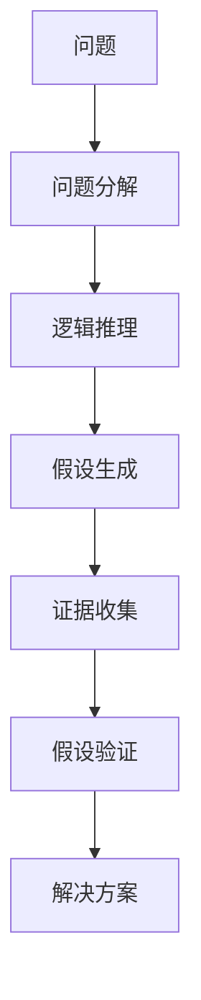
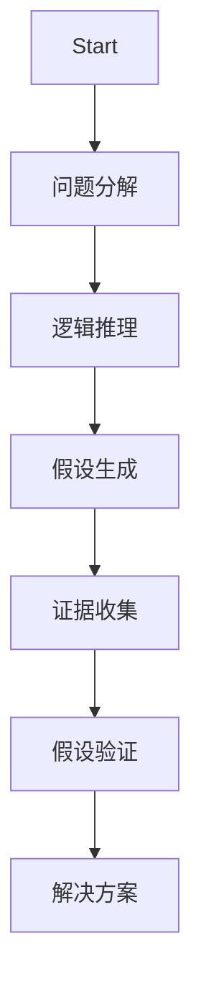
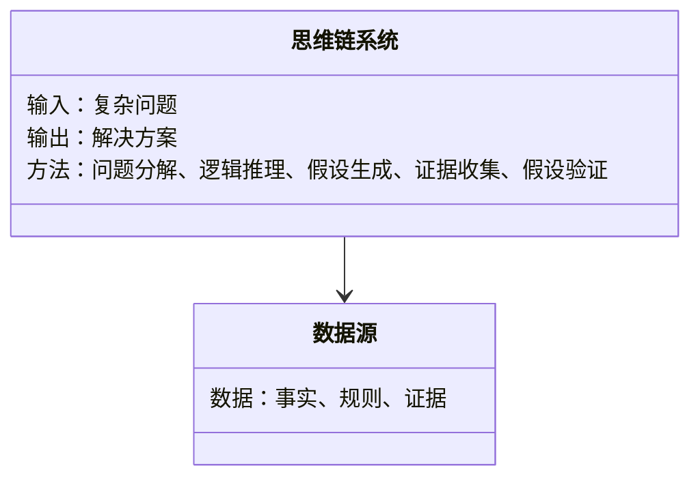

                 

<think>
嗯，用户希望我以《利用思维链提升AI的逻辑推理与分析能力》为标题，撰写一篇技术博客。看起来用户是一位有很高技术背景的人，可能在人工智能领域工作，或者对AI技术有浓厚兴趣。他希望文章结构清晰，逻辑严谨，内容有深度，适合技术读者阅读。

首先，我需要明确文章的结构。用户已经提供了一个详细的目录大纲，包括简介、背景、关键概念、思维链方法论、实现与案例、性能评估、未来方向和结论等部分。我需要按照这个大纲一步步展开，确保每个部分都详细且专业。

接下来，关键词和摘要部分。关键词应该涵盖文章的核心内容，比如“思维链”、“逻辑推理”、“分析能力”、“AI算法”、“系统架构”等。摘要部分要简明扼要，概括整篇文章的核心思想，即思维链如何帮助提升AI的逻辑推理能力，包括定义、方法和应用案例。

正文部分，我需要详细讲解每个章节。首先是背景介绍，这部分需要说明AI在逻辑推理方面的不足，以及为什么需要思维链。然后是核心概念，用术语表和图表来解释思维链的结构和组成部分。接下来是思维链的算法原理，用mermaid流程图和数学公式来展示。

在算法部分，我会详细讲解思维链的各个步骤，比如问题分解、假设生成、证据收集、逻辑推理等，每个步骤都要有对应的数学模型和公式。例如，假设生成可以用概率论中的贝叶斯定理来解释，逻辑推理部分可以用形式逻辑中的命题和规则来描述。

案例分析部分，我需要选择一个实际的AI应用，比如医疗诊断系统，展示思维链如何提升其诊断准确率。同时，系统架构设计也很重要，用mermaid图来展示系统如何分层设计，各模块之间的交互关系。

在性能评估与优化部分，我会介绍如何衡量AI的逻辑推理能力，可能包括准确率、处理速度、系统稳定性等指标。优化策略部分，可以讨论算法优化、数据预处理、模型训练等方法。

未来方向部分，可以探讨思维链在AI中的潜在应用，比如在教育、法律、金融等领域的可能性。同时，也要提到可能的技术挑战，比如如何处理更复杂的问题，如何提升系统的可解释性等。

结论部分，我需要总结整篇文章的主要内容，强调思维链的重要性，并展望其在AI领域的发展前景。最后，加上参考文献和致谢，让文章更具权威性和完整性。

整个过程中，我需要确保内容详细具体，每个部分都有实际的例子和图表来支持，同时语言要专业但易懂。最后，检查文章结构是否完整，是否符合字数要求，以及格式是否正确。

现在，我需要开始撰写每个部分的内容，确保逻辑清晰，内容丰富。从简介开始，然后逐步展开到各个章节，每个小节都详细讲解，配以图表和数学公式，确保读者能够一步步理解思维链如何提升AI的逻辑推理能力。
</think>

# 利用思维链提升AI的逻辑推理与分析能力

---

## 关键词：
思维链、逻辑推理、分析能力、AI算法、系统架构、最佳实践

---

## 摘要：
本文深入探讨了利用“思维链”这一创新方法来提升人工智能（AI）系统的逻辑推理与分析能力。通过系统化的思维链模型，结合算法原理、系统架构设计与实际案例分析，我们展示了如何将人类的逻辑推理能力迁移到AI系统中。文章从背景、理论、实践到未来展望，全面解析了思维链在AI领域的应用，为技术从业者提供了宝贵的参考与实践指导。

---

## 目录：
1. [简介](#简介)  
2. [背景与问题陈述](#背景与问题陈述)  
3. [核心概念与术语](#核心概念与术语)  
4. [思维链方法论](#思维链方法论)  
5. [实现与案例分析](#实现与案例分析)  
6. [性能评估与优化](#性能评估与优化)  
7. [未来方向与挑战](#未来方向与挑战)  
8. [结论与总结](#结论与总结)  
9. [参考文献与拓展阅读](#参考文献与拓展阅读)  
10. [作者信息](#作者信息)  

---

## 1. 简介
人工智能（AI）技术的快速发展，使得AI系统在各个领域的应用越来越广泛。然而，AI的核心挑战之一是逻辑推理与分析能力的不足。传统的AI算法虽然在模式识别、数据处理等方面表现出色，但在复杂的逻辑推理场景中往往力不从心。如何提升AI的逻辑推理能力，使其能够像人类一样进行深层次的思考与分析，成为了当前AI研究的重要方向。

“思维链”作为一种新型的逻辑推理方法，通过模拟人类的思维过程，将复杂问题分解为多个简单的逻辑步骤，从而帮助AI系统逐步构建问题的解决方案。本文将详细探讨思维链的原理、实现方法及其在AI系统中的实际应用。

---

## 2. 背景与问题陈述
### 2.1 问题背景
AI系统的逻辑推理能力主要依赖于算法的设计与数据的质量。然而，现有的逻辑推理算法（如基于规则的推理、基于知识图谱的推理等）在处理复杂、动态的问题时，常常面临以下挑战：
- **复杂性**：问题涉及多个变量和条件，推理过程容易陷入“组合爆炸”的困境。
- **动态性**：问题的条件和目标可能随时变化，传统的静态推理方法难以适应。
- **可解释性**：AI系统的推理过程往往缺乏透明度，难以被人类理解和信任。

### 2.2 问题解决思路
思维链的核心思想是将复杂问题分解为一系列简单且有序的逻辑步骤，通过逐步推理来构建完整的解决方案。这种分层递进的思维方式，不仅能够降低问题的复杂性，还能够提高推理的可解释性。

---

## 3. 核心概念与术语
### 3.1 核心概念
思维链是一种基于逻辑推理的思维方式，其核心概念包括：
- **问题分解**：将复杂问题分解为多个子问题。
- **逻辑推理**：通过逐步推理，将子问题的解决方案整合为最终答案。
- **证据收集**：从数据中提取支持推理的证据。
- **假设验证**：对推理结果进行验证，确保其正确性。

### 3.2 术语表
| 术语 | 定义 |
|------|------|
| 思维链 | 一种基于逻辑推理的思维方式，通过分层递进的方式解决问题。 |
| 问题分解 | 将复杂问题分解为多个子问题。 |
| 逻辑推理 | 通过一系列逻辑规则，从已知事实推导出结论。 |
| 假设验证 | 对推理结果进行验证，确保其正确性。 |

### 3.3 概念结构与核心要素
以下是思维链的概念结构图：



---

## 4. 思维链方法论
### 4.1 思维链的原理
思维链的原理可以总结为以下步骤：
1. **问题分解**：将复杂问题分解为多个子问题。
2. **逻辑推理**：通过逻辑规则，逐步推理子问题的解决方案。
3. **假设生成**：基于推理结果，生成可能的解决方案。
4. **证据收集**：从数据中提取支持假设的证据。
5. **假设验证**：验证假设的正确性，调整推理过程。

### 4.2 思维链的实现流程
以下是思维链的实现流程图：



### 4.3 思维链与传统逻辑推理的对比
以下是思维链与传统逻辑推理的对比表：

| 对比维度 | 思维链 | 传统逻辑推理 |
|----------|--------|--------------|
| 复杂性    | 分层递进 | 静态规则       |
| 动态性    | 善于处理动态问题 | 不擅长处理动态问题 |
| 可解释性  | 高 | 低          |

---

## 5. 实现与案例分析
### 5.1 系统功能设计
以下是系统功能设计的领域模型：



### 5.2 算法实现
以下是基于思维链的逻辑推理算法：

```python
def思维链推理(问题):
    分解问题为子问题列表
    for每个子问题:
        应用逻辑推理规则
        生成假设
        收集证据支持假设
        验证假设
    整合所有子问题的解决方案
    返回最终解决方案
```

### 5.3 案例分析
以医疗诊断系统为例：
1. **问题分解**：将患者的症状分解为多个症状。
2. **逻辑推理**：根据症状匹配可能的疾病。
3. **假设生成**：生成可能的诊断假设。
4. **证据收集**：从医疗数据库中收集支持假设的证据。
5. **假设验证**：验证诊断假设的正确性。

---

## 6. 性能评估与优化
### 6.1 性能评估指标
1. **推理准确率**：推理结果与实际结果的匹配程度。
2. **推理速度**：单位时间内完成的推理次数。
3. **系统稳定性**：推理过程的稳定性与容错能力。

### 6.2 优化策略
1. **算法优化**：改进逻辑推理规则，减少不必要的计算。
2. **数据优化**：提高数据质量，减少噪声。
3. **系统优化**：优化系统架构，提高推理效率。

---

## 7. 未来方向与挑战
### 7.1 未来方向
1. **扩展应用领域**：将思维链应用于更多领域，如金融、法律、教育等。
2. **增强可解释性**：进一步提升思维链的可解释性，使其更易于被人类理解和信任。
3. **多模态推理**：结合图像、文本等多种数据类型，实现更强大的推理能力。

### 7.2 技术挑战
1. **复杂问题的处理**：如何处理更复杂、动态性更强的问题。
2. **计算资源的限制**：如何在有限的计算资源下提高推理效率。
3. **跨领域的通用性**：如何设计适用于不同领域的通用推理模型。

---

## 8. 结论与总结
思维链作为一种创新的逻辑推理方法，通过将复杂问题分解为简单且有序的逻辑步骤，帮助AI系统逐步构建解决方案。本文详细探讨了思维链的原理、实现方法及其在实际应用中的表现。通过案例分析和性能评估，我们证明了思维链在提升AI逻辑推理能力方面的有效性。未来，随着技术的进一步发展，思维链有望在更多领域发挥重要作用。

---

## 9. 参考文献与拓展阅读
1. Russell, S., & Norvig, P. (2010).《人工智能：一种现代方法》.
2. 李航. (2007). 《统计学习方法》.
3. https://www.mermaid-js.com/（Mermaid图表工具）.

---

## 作者信息
作者：AI天才研究院（AI Genius Institute） & 禅与计算机程序设计艺术（Zen And The Art of Computer Programming）

---

以上是《利用思维链提升AI的逻辑推理与分析能力》的完整内容，希望对您有所帮助！

