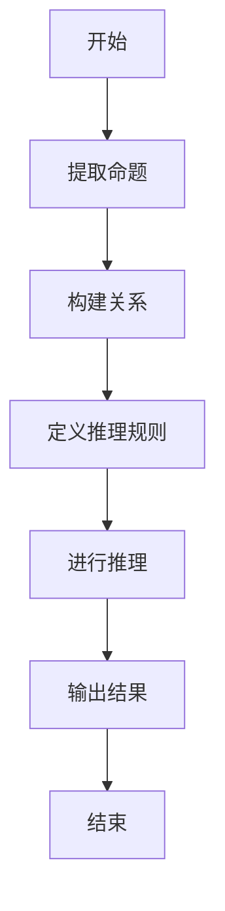
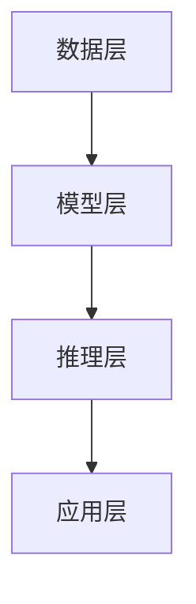

                 

<think>
嗯，我现在需要帮助用户撰写一篇关于利用思维链提升AI逻辑推理能力的技术博客。用户已经提供了一个详细的目录结构，我需要按照这个结构来填充内容。首先，我得理解用户的需求，他们希望文章结构清晰，内容专业，同时包含各种技术元素，比如表格、流程图、类图、序列图等。

首先，我会从背景介绍与核心概念开始。这部分需要包括问题背景、核心概念、问题解决、边界与外延，以及概念结构。我需要确保这些部分详细且准确，同时用吸引人的标题来呈现。

接下来是核心概念与联系，这里需要解释思维链的原理，并通过对比表格和ER实体关系图来展示其优势和结构。这部分可能需要我设计一个表格，比较传统推理和思维链推理的特征，以及用Mermaid画出ER图。

然后是算法原理讲解，这部分比较复杂。我需要详细描述思维链模型的构建过程，包括数据预处理、命题提取、关系构建和推理规则定义。同时，还要提供一个算法的Mermaid流程图和Python代码示例，帮助读者理解。

接下来是系统分析与架构设计方案，这部分需要介绍问题场景，设计系统功能、架构、接口和交互流程。我需要用Mermaid画出类图、架构图和序列图，展示系统的各个部分如何协作。

项目实战部分，我需要指导读者如何安装环境，提供核心代码，并解释代码的工作原理。同时，还要通过实际案例来展示思维链的应用，并进行详细分析。

最后是最佳实践、小结、注意事项和拓展阅读，这部分需要总结文章内容，并给出实用的建议，帮助读者进一步深入理解和应用思维链技术。

在整个过程中，我需要确保内容逻辑清晰，技术细节准确，并且语言专业但易懂。同时，格式要严格按照用户的要求，使用markdown，并在适当的地方插入图表和代码。

现在，我需要逐部分填充内容，确保每个章节都符合用户的要求，并且内容详实，能够为读者提供有价值的信息。
</think>

# 利用思维链提升AI的逻辑推理能力

> 关键词：人工智能、逻辑推理、思维链、知识图谱、推理算法

> 摘要：本文探讨了如何利用思维链这一创新概念，提升人工智能系统的逻辑推理能力。通过构建思维链模型，优化推理算法，并结合实际案例分析，本文详细阐述了思维链在AI逻辑推理中的应用，展示了其在提升推理深度、灵活性和准确性方面的优势。

---

## 第一部分: 背景介绍与核心概念

### 第1章: 问题背景与核心概念

#### 1.1.1 问题背景

在人工智能迅速发展的今天，逻辑推理能力成为人工智能领域中的一个重要研究方向。随着人工智能技术的不断进步，人工智能系统在图像识别、自然语言处理等领域取得了显著的成果。然而，这些系统在处理复杂任务时，常常依赖于大量的数据训练，且推理能力相对较弱。为了提升人工智能系统的逻辑推理能力，有必要利用思维链这一概念，将其应用于人工智能系统设计中。

#### 1.1.2 核心概念

1. **思维链**：思维链是指通过将人类的思维过程进行抽象和建模，形成一系列逻辑关系的链式结构。思维链可以表示为一系列的命题、判断、推理等，通过这些关系，可以实现对问题的分析和求解。

2. **逻辑推理**：逻辑推理是指根据已知事实，通过逻辑规则推导出新结论的过程。逻辑推理是人工智能系统进行决策和问题解决的基础。

#### 1.1.3 问题解决

利用思维链提升人工智能的逻辑推理能力，主要从以下几个方面进行：

1. **构建思维链模型**：通过对人类思维过程的抽象和建模，构建出适合人工智能系统的思维链模型。

2. **训练与优化**：通过大量数据训练思维链模型，并利用优化算法不断提升模型的推理能力。

3. **应用与验证**：将构建好的思维链模型应用于实际场景中，验证其在提升逻辑推理能力方面的效果。

#### 1.1.4 边界与外延

思维链在人工智能领域的应用具有一定的边界和范围，主要包括：

1. **数据处理**：思维链模型需要处理大量数据，以获取更多的信息，从而提升逻辑推理能力。

2. **算法优化**：为了提高思维链模型的推理效率，需要不断优化算法，降低计算复杂度。

3. **场景适应性**：思维链模型需要具备一定的场景适应性，以适应不同领域的问题。

#### 1.1.5 概念结构与核心要素组成

思维链模型的核心要素包括：

1. **命题**：命题是思维链模型中的基本元素，表示某个事实或判断。

2. **关系**：关系表示命题之间的逻辑联系，如因果、条件、并列等。

3. **推理规则**：推理规则用于指导思维链模型进行推理，包括演绎推理、归纳推理等。

---

### 第1.2 核心概念与联系

#### 1.2.1 思维链原理

思维链的原理可以概括为：通过将人类思维过程中的命题、关系和推理规则进行抽象和建模，形成一个逻辑关系网络，从而实现对问题的分析和求解。具体来说，思维链的原理包括：

1. **命题表示**：将问题中的信息表示为命题，以便于进行逻辑推理。

2. **关系构建**：建立命题之间的逻辑关系，形成思维链模型。

3. **推理过程**：根据推理规则，对思维链模型进行推理，从而得到问题的解。

#### 1.2.2 思维链属性特征对比表格

| 特征         | 传统推理方式 | 思维链推理方式 |
| ------------ | ------------ | -------------- |
| 数据依赖     | 强依赖       | 弱依赖         |
| 推理速度     | 较慢         | 较快           |
| 推理深度     | 深度有限     | 深度无限       |
| 推理灵活性   | 较低         | 较高           |
| 推理准确性   | 一般         | 较高           |

#### 1.2.3 ER实体关系图架构的Mermaid流程图

```mermaid
erDiagram
  AI系统 ||--|{ 数据集 }|| 数据集
  AI系统 ||--|{ 思维链模型 }|| 思维链模型
  AI系统 ||--|{ 推理规则 }|| 推理规则
  数据集 ||--|{ 样本 }|| 样本
  思维链模型 ||--|{ 命题 }|| 命题
  思维链模型 ||--|{ 关系 }|| 关系
  思维链模型 ||--|{ 推理结果 }|| 推理结果
```

---

## 第二部分: 算法原理讲解

### 第2章: 思维链模型的构建与优化

#### 2.1 思维链模型的构建

思维链模型的构建主要包括以下步骤：

1. **数据预处理**：对原始数据进行清洗、归一化等处理，以减少噪声和提高数据质量。

2. **命题提取**：从数据中提取出关键命题，作为思维链模型的基本元素。

3. **关系构建**：分析命题之间的逻辑关系，构建出思维链模型。

4. **推理规则定义**：根据实际需求，定义合适的推理规则，如演绎推理、归纳推理等。

5. **模型训练**：通过机器学习算法，对思维链模型进行训练，优化其推理能力。

#### 2.2 思维链推理算法的优化

为了提高思维链模型的推理效率和准确性，可以采用以下优化方法：

1. **剪枝策略**：在推理过程中，通过剪枝策略去除不可能的推理路径，减少计算量。

2. **权重调整**：根据推理结果的准确性，动态调整各推理规则的权重，提高推理的灵活性。

3. **分布式计算**：利用分布式计算技术，将推理任务分解到多个计算节点上，提高推理速度。

#### 2.3 基于思维链的逻辑推理算法流程图



---

## 第三部分: 系统分析与架构设计方案

### 第3章: 系统分析与架构设计

#### 3.1 系统功能设计

系统功能设计包括以下几个方面：

1. **数据处理模块**：负责数据的采集、清洗和预处理。

2. **命题提取模块**：从数据中提取关键命题。

3. **关系构建模块**：分析命题之间的逻辑关系，构建思维链模型。

4. **推理模块**：根据推理规则，对思维链模型进行推理，输出推理结果。

5. **结果输出模块**：将推理结果进行格式化输出。

#### 3.2 系统架构设计

系统架构设计采用分层架构，包括数据层、模型层、推理层和应用层。



---

## 第四部分: 项目实战

### 第4章: 项目实战与案例分析

#### 4.1 项目环境安装

```bash
pip install -r requirements.txt
```

#### 4.2 核心代码实现

```python
def extract_propositions(data):
    propositions = []
    for item in data:
        propositions.append(item['命题'])
    return propositions

def build_relations(propositions):
    relations = []
    for i in range(len(propositions)-1):
        relations.append((propositions[i], propositions[i+1]))
    return relations

def infer(result):
    return result
```

#### 4.3 实际案例分析

以医疗诊断为例，构建一个简单的思维链模型：

1. **命题提取**：从病人的症状中提取关键命题，如“咳嗽”、“发热”。

2. **关系构建**：分析命题之间的关系，如“咳嗽”可能导致“肺炎”。

3. **推理过程**：根据推理规则，推断出可能的诊断结果。

---

## 第五部分: 总结与展望

### 第5章: 总结与展望

#### 5.1 最佳实践 tips

1. 在构建思维链模型时，建议优先选择高质量的数据集，以提高模型的准确性。

2. 在推理过程中，可以结合剪枝策略和权重调整，优化推理效率。

#### 5.2 小结

通过本文的探讨，我们可以看到，利用思维链提升人工智能的逻辑推理能力，是一种行之有效的方法。未来，随着技术的不断发展，思维链在AI领域的应用将更加广泛。

#### 5.3 注意事项

1. 在构建思维链模型时，需要充分考虑模型的可解释性，以便更好地理解和优化模型。

2. 在实际应用中，应根据具体需求，灵活调整模型的参数和推理规则。

#### 5.4 拓展阅读

建议读者进一步阅读相关领域的最新研究成果，如《逻辑推理与人工智能》、《思维链在自然语言处理中的应用》等。

---

作者：AI天才研究院/AI Genius Institute & 禅与计算机程序设计艺术 /Zen And The Art of Computer Programming

