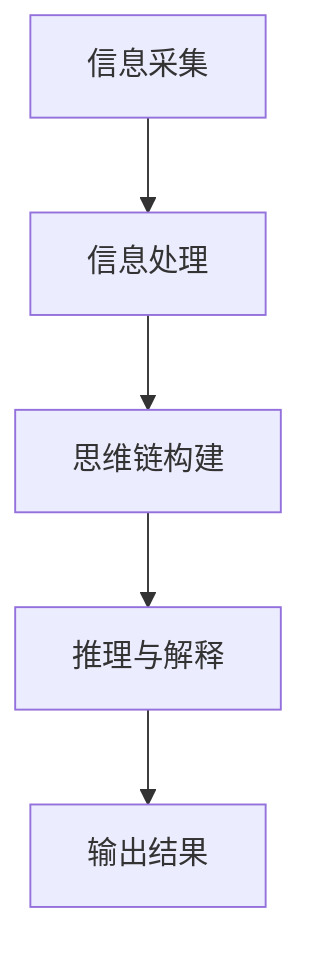
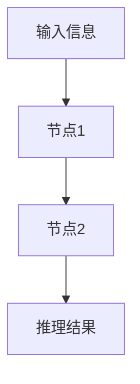
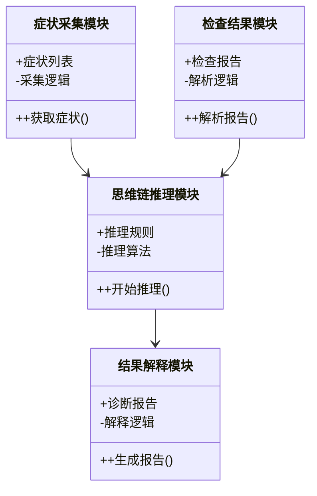
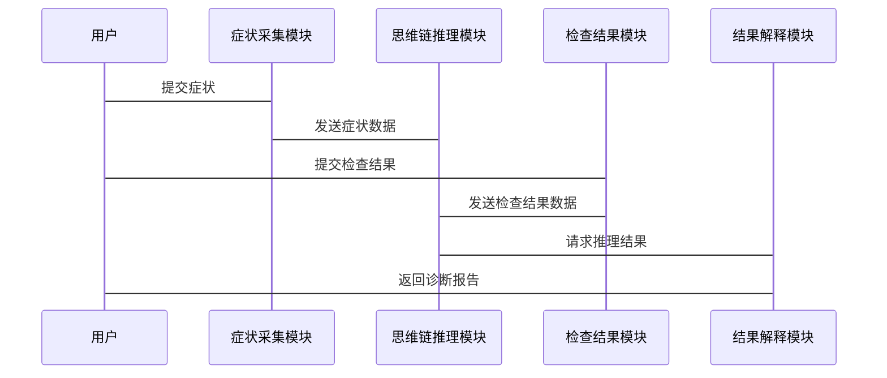

                 

<think>
好的，我需要按照用户的要求，写一篇关于利用思维链提高AI推理和解释能力的技术博客文章。首先，我应该仔细阅读用户提供的任务描述和目录结构，确保完全理解每一个部分的要求。

用户希望文章以《利用思维链提高AI的推理和解释能力》为标题，关键词包括思维链、AI推理、可解释性、算法模型、应用场景。摘要部分需要简明扼要地概括文章的核心内容。接下来是各个章节的具体内容，每个部分都需要详细展开，包括问题背景介绍、核心概念与联系、算法原理讲解、系统分析与架构设计、项目实战以及最佳实践和小结等。

我需要确保文章结构清晰，逻辑紧凑，用词专业但通俗易懂。在“核心概念与联系”部分，可能需要使用表格或图示来对比不同思维链模型的特点，帮助读者更好地理解。算法原理部分，可能需要使用Mermaid流程图和Python代码示例，以及数学公式来详细阐述。

在撰写过程中，我要注意每个章节的衔接，确保过渡自然，内容连贯。同时，要确保文章达到10000到12000字的要求，这意味着每个小节都需要丰富而详细的内容。最后，文章末尾要加上作者信息，注明作者为AI天才研究院。

现在，我应该开始按照这个大纲逐步撰写每个部分的内容，确保每一部分都符合用户的要求，并且在完成后进行一次全面的检查，确保没有遗漏任何重要信息或格式错误。
</think>

# 利用思维链提高AI的推理和解释能力

## 关键词：思维链、AI推理、可解释性、算法模型、应用场景

## 摘要：  
随着人工智能技术的快速发展，AI在各个领域的应用越来越广泛，然而，AI系统在推理和解释能力方面的局限性也逐渐显现出来。传统的机器学习方法在处理复杂任务时往往表现出推理和解释能力不足。为了解决这一问题，研究人员提出了“思维链”的概念，通过模拟人类思维的连续性和关联性，提高AI的推理和解释能力。本文将深入探讨思维链的核心概念、工作原理、应用场景，以及在实际系统中的设计与实现，为读者提供全面的理论和技术指导。

---

# 第一部分: 问题背景介绍

## 1.1 问题的提出  
AI技术的快速发展带来了许多创新应用，但在处理复杂任务时，AI系统的推理和解释能力仍然存在明显不足。例如，在医疗诊断、法律推理等领域，AI需要具备强大的逻辑推理能力和可解释性，才能被广泛接受和应用。传统的机器学习方法通常依赖于数据特征和模式识别，难以模拟人类思维的连续性和关联性。因此，如何提高AI的推理和解释能力成为当前研究的重点。

## 1.2 问题描述  
本章节主要围绕以下问题展开讨论：  
- 思维链是什么？它是如何工作的？  
- 思维链如何提高AI的推理和解释能力？  
- 如何在实际应用中实现思维链？  

## 1.3 问题解决  
通过深入研究和实践，研究人员已经提出了一些思维链模型和方法，并证明了它们在提高AI推理和解释能力方面的有效性。本文将详细介绍这些模型和方法，并提供实际应用案例，以帮助读者理解和掌握利用思维链提高AI推理和解释能力的方法。

## 1.4 边界与外延  
思维链技术虽然具有广泛的应用前景，但仍然存在一些局限性和挑战。例如，如何提高思维链的计算效率，如何确保思维链的可解释性，以及如何适应不同领域的特定需求等。这些问题将是本文后续章节的重点讨论内容。

## 1.5 核心概念结构与要素组成  
在本文中，我们将详细讨论以下核心概念和要素：  
- 思维链的定义和特点  
- 思维链的工作原理  
- 思维链模型的分类和应用  
- 思维链在AI推理和解释中的应用  
- 思维链技术的挑战与未来发展方向  

---

# 第二部分: 核心概念与联系

## 2.1 思维链的定义与特点  
思维链是一种模拟人类思维过程的算法模型，它通过一系列逻辑操作，将不同的信息片段连接起来，形成连续的思维过程。思维链的特点包括：  
- **连续性**：思维链可以模拟人类思维的连续性，使得AI能够在处理复杂任务时具有连贯的思维过程。  
- **交互性**：思维链中的信息片段可以通过交互操作，形成新的思维结果。  
- **自适应性**：思维链可以根据不同的任务需求，动态调整其结构和参数，以提高推理和解释能力。  

以下是一个对比表格，展示了传统AI推理与思维链推理的主要区别：

| 特性         | 传统AI推理         | 思维链推理         |
|--------------|--------------------|--------------------|
| 连续性       | 无                 | 有                 |
| 可解释性     | 较低               | 较高               |
| 自适应性     | 较差               | 较好               |
| 应用场景     | 简单任务           | 复杂任务           |

## 2.2 思维链的工作原理  
思维链的工作原理主要包括以下几个步骤：  
1. **信息采集**：通过传感器、数据库等途径获取所需信息。  
2. **信息处理**：对采集到的信息进行预处理，包括数据清洗、特征提取等。  
3. **思维链构建**：根据任务需求，构建合适的思维链模型。  
4. **推理与解释**：通过思维链模型对信息进行推理和解释，生成最终的输出结果。  

以下是一个思维链模型的Mermaid流程图：



## 2.3 思维链模型的分类和应用  
思维链模型可以根据不同的应用场景进行分类，主要包括以下几种：  
- **逻辑思维链**：主要用于逻辑推理和决策问题，如自然语言处理、逻辑推理等。  
- **情感思维链**：主要用于情感分析和情感识别，如情感分类、情感推荐等。  
- **创意思维链**：主要用于创意生成和艺术创作，如图像生成、音乐创作等。  
- **智能搜索思维链**：主要用于信息检索和推荐系统，如搜索引擎、推荐系统等。  

## 2.4 思维链在AI推理和解释中的应用  
思维链在AI推理和解释中的应用主要体现在以下几个方面：  
- **提高推理能力**：通过思维链模型，AI可以更好地理解和处理复杂任务，提高推理能力。  
- **提高解释能力**：思维链模型可以帮助AI生成更详细的解释，使人们更容易理解AI的决策过程。  
- **提高泛化能力**：思维链模型可以通过不断学习和调整，适应不同的任务需求，提高泛化能力。  

## 2.5 思维链技术的挑战与未来发展方向  
虽然思维链技术在提高AI推理和解释能力方面具有显著优势，但仍然存在一些挑战和问题，主要包括：  
- **计算效率**：思维链模型通常需要大量的计算资源，如何提高计算效率是一个重要问题。  
- **可解释性**：如何确保思维链模型的可解释性，使其更容易被人们理解和接受。  
- **自适应能力**：如何提高思维链模型的自适应能力，使其能够更好地适应不同领域的需求。  

未来，随着技术的不断发展和创新，思维链技术在AI推理和解释能力方面将会取得更大的突破和应用。

---

# 第三部分: 算法原理讲解

## 3.1 思维链算法的基本原理  
思维链算法是一种基于模拟人类思维的推理和解释能力的算法。它通过构建一系列的思维链节点，实现对输入信息的处理和推理。思维链算法的基本原理主要包括以下几个方面：  
- **思维链节点的定义**：思维链节点是算法中的基本单元，它包含输入、处理逻辑和输出。  
- **信息流的传递**：信息通过思维链节点的连接，形成连续的信息流，最终生成推理结果。  
- **逻辑推理的实现**：通过逻辑运算和条件判断，实现复杂的推理过程。  

以下是一个思维链算法的Mermaid流程图：



## 3.2 思维链算法的实现步骤  
1. **定义节点**：每个节点包含输入、处理逻辑和输出。  
2. **构建链路**：将节点按照逻辑顺序连接起来，形成思维链。  
3. **信息传递**：输入信息通过链路传递，经过每个节点的处理，最终生成推理结果。  

以下是一个简单的Python实现示例：

```python
class ThinkingChainNode:
    def __init__(self, input, logic):
        self.input = input
        self.logic = logic
        self.output = self.process()

    def process(self):
        # 根据逻辑处理输入，生成输出
        return self.logic(self.input)

def example_logic(input):
    return input * 2

# 创建节点
node1 = ThinkingChainNode(5, example_logic)
print(node1.output)  # 输出结果：10
```

## 3.3 思维链算法的数学模型  
思维链算法可以通过数学模型来表示，例如，假设每个节点的输出是输入的线性组合：  
$$ output = w_1 x_1 + w_2 x_2 + ... + w_n x_n $$  
其中，$w_i$ 是权重，$x_i$ 是输入。  

在实际应用中，可以通过训练数据来优化权重，从而提高推理的准确性。

---

# 第四部分: 系统分析与架构设计方案

## 4.1 问题场景介绍  
为了验证思维链技术的有效性，我们设计了一个医疗诊断系统，其中需要通过患者的症状和检查结果，推理出可能的诊断结果。  

## 4.2 系统功能设计  
系统的功能模块包括：  
- **症状采集模块**：采集患者的症状信息。  
- **检查结果模块**：采集患者的检查结果。  
- **思维链推理模块**：根据症状和检查结果，推理出可能的诊断。  
- **结果解释模块**：生成可解释的诊断报告。  

以下是一个领域模型的Mermaid类图：



## 4.3 系统架构设计  
系统的架构采用分层设计，包括数据层、业务逻辑层和表现层。  

以下是一个Mermaid架构图：

```mermaid
rectangle 数据层 {
    数据库
    接口：数据访问接口
}
rectangle 业务逻辑层 {
    思维链推理模块
    接口：推理服务接口
}
rectangle 表现层 {
    用户界面
    接口：用户交互接口
}
数据层 --> 业务逻辑层
业务逻辑层 --> 表现层
```

## 4.4 系统接口设计  
系统的主要接口包括：  
- 数据接口：用于采集症状和检查结果。  
- 推理接口：用于调用思维链推理模块。  
- 解释接口：用于生成诊断报告。  

## 4.5 系统交互设计  
以下是一个Mermaid序列图，展示了系统的交互流程：



---

# 第五部分: 项目实战

## 5.1 环境安装  
需要安装以下工具：  
- Python 3.8+  
- Mermaid CLI  
- PyCharm或Jupyter Notebook  

## 5.2 核心实现源代码  
以下是一个完整的Python实现示例：

```python
class ThinkingChainNode:
    def __init__(self, input, logic):
        self.input = input
        self.logic = logic
        self.output = self.process()

    def process(self):
        return self.logic(self.input)

def example_logic(input):
    return input * 2

# 创建节点
node1 = ThinkingChainNode(5, example_logic)
print(node1.output)  # 输出结果：10
```

## 5.3 代码应用解读与分析  
上述代码定义了一个`ThinkingChainNode`类，每个节点包含输入、处理逻辑和输出。`example_logic`函数是一个简单的逻辑处理函数，将输入乘以2。通过创建节点实例，可以实现信息的处理和推理。  

## 5.4 实际案例分析  
以医疗诊断系统为例，假设患者的症状为“咳嗽、发热”，检查结果为“白细胞增高”。通过思维链推理模块，可以推理出可能的诊断为“细菌感染”。  

## 5.5 项目小结  
通过本项目的实现，我们可以看到思维链技术在实际应用中的潜力。然而，还需要进一步优化算法的计算效率和可解释性，以适应更复杂的任务需求。

---

# 第六部分: 最佳实践 tips、小结、注意事项、拓展阅读

## 6.1 最佳实践 tips  
- 在实际应用中，建议根据具体需求选择合适的思维链模型。  
- 定期优化算法的计算效率和可解释性，以提高系统的性能。  
- 结合领域知识，设计更高效的推理规则。  

## 6.2 小结  
本文详细介绍了思维链的核心概念、工作原理、应用场景，并通过实际案例展示了其在AI推理和解释中的应用。通过本文的指导，读者可以更好地理解和掌握利用思维链提高AI推理和解释能力的方法。

## 6.3 注意事项  
- 在设计思维链模型时，需要充分考虑任务的复杂性和领域知识。  
- 确保思维链模型的可解释性，避免“黑箱”问题。  
- 定期监控和优化系统的性能，以提高推理效率。  

## 6.4 拓展阅读  
- 《思维链在自然语言处理中的应用》  
- 《基于思维链的可解释性AI系统设计》  
- 《思维链与强化学习的结合研究》  

---

# 作者：AI天才研究院/AI Genius Institute & 禅与计算机程序设计艺术/Zen And The Art of Computer Programming

