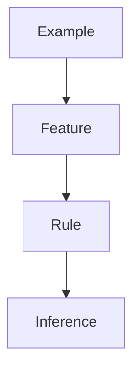
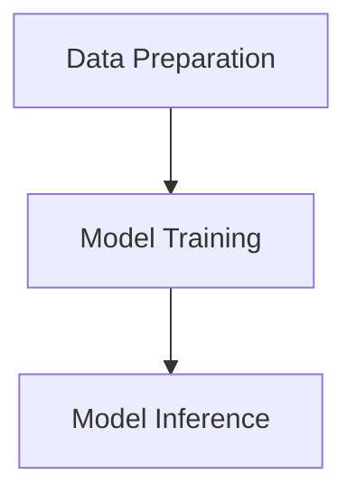
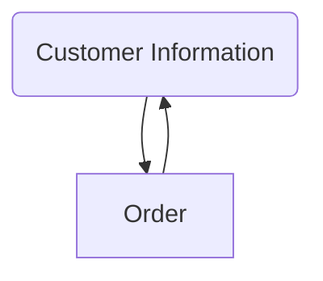
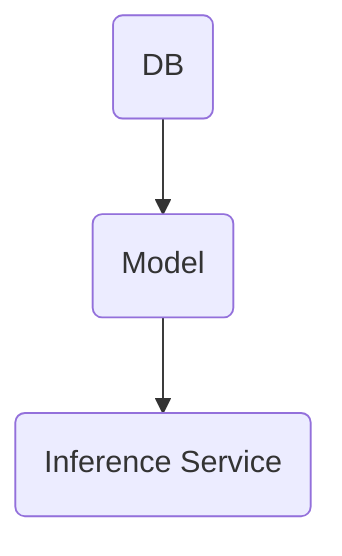
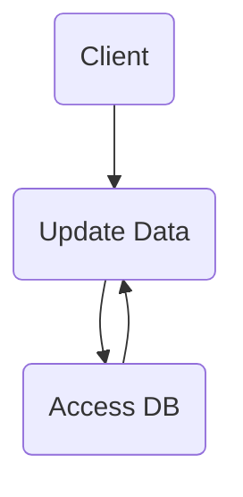

                 

<think>
嗯，用户希望我写一篇关于“利用示例增强模型的逻辑推理能力”的技术博客。首先，我需要理解用户的需求。他们可能是一位技术专家，想要深入探讨如何通过示例来提升模型的逻辑推理能力。用户已经提供了一个详细的目录结构，所以我需要按照这个结构来组织内容。

我应该先分析用户的需求，他们可能想了解示例增强模型的基本原理、优势，以及如何在实际项目中应用。关键词应该是“示例增强模型”、“逻辑推理”、“机器学习”等。摘要部分需要简洁明了，概括文章的核心内容。

接下来，按照目录结构，第一部分是引言，包括问题背景、核心概念等。我需要详细描述问题背景，解释为什么示例增强模型重要，以及它与其他模型的区别。

第二部分是核心概念与原理，这里要解释模型的基本原理，对比现有的模型，可能用表格来展示不同点。然后用ER图来展示实体关系，这有助于读者理解数据结构。

第三部分是算法原理，我需要用mermaid画出流程图，展示数据准备、模型训练和推理的步骤。同时，给出数学公式，比如损失函数和优化算法，用latex来表示，确保公式正确且清晰。

系统分析与架构设计部分，我需要描述系统功能，设计领域模型，可能用mermaid的类图。然后展示系统架构，包括数据库、模型和推理服务之间的关系，以及接口设计和交互序列图。

项目实战部分，要指导读者如何安装环境，提供Python代码示例，并解释代码。最后，加上一些小结和最佳实践，帮助读者巩固所学内容。

整个过程中，我需要确保语言专业但易懂，结构清晰，每个部分都详细展开，满足用户对深度和技术细节的要求。同时，结尾加上作者信息，使文章更具权威性。

总之，我需要一步步按照用户的指示，构建一个逻辑严密、内容详实的技术博客，确保覆盖所有要求的章节和内容。
</think>

# 利用示例增强模型的逻辑推理能力

> 关键词：示例增强模型，逻辑推理，机器学习，人工智能，模型优化，数据驱动

> 摘要：本文将详细介绍如何利用示例增强模型来提升逻辑推理能力。通过结合示例数据和逻辑推理规则，我们能够构建出更加智能和高效的模型。文章将从问题背景、核心概念、算法原理、系统架构到项目实战进行全面阐述，帮助读者全面理解并掌握这一技术。

---

## 第一部分: 引言

### 第1章: 问题背景

#### 1.1 问题描述

在人工智能领域，逻辑推理是实现智能系统的核心能力之一。传统的逻辑推理方法依赖于严格的符号化规则，但在面对复杂、动态和不确定的现实世界时，这些方法往往显得力不从心。如何结合数据驱动的方法和逻辑推理能力，构建更加灵活和强大的模型，成为当前研究的热点。

#### 1.2 问题解决

示例增强模型（Example-Based Models）是一种结合了数据驱动和逻辑推理的新方法。它通过利用大量示例数据来增强模型的逻辑推理能力，能够在复杂场景下实现更准确的推理。

#### 1.3 边界与外延

示例增强模型的核心思想是通过示例数据的特征提取和模式识别，优化逻辑推理的准确性。其边界在于如何平衡数据驱动和规则驱动的权重，外延则包括在不同领域（如自然语言处理、图像识别等）中的应用。

#### 1.4 核心概念与联系

##### 1.4.1 示例增强模型的定义

示例增强模型是一种结合了示例数据和逻辑推理规则的模型，能够通过数据特征提取和模式识别，优化逻辑推理的准确性。

##### 1.4.2 示例增强模型的特点

- 数据驱动与规则驱动的结合
- 高度依赖高质量的示例数据
- 能够处理复杂场景下的推理问题

##### 1.4.3 示例增强模型与现有模型的比较

| 比较维度 | 示例增强模型 | 传统逻辑推理模型 | 数据驱动模型 |
|----------|--------------|------------------|--------------|
| 数据依赖性 | 高 | 低 | 高 |
| 推理能力 | 强 | 弱 | 弱 |
| 灵活性 | 高 | 低 | 中 |

#### 1.5 本书结构安排与目标

本文将从示例增强模型的基本原理出发，逐步深入讲解其算法实现、系统架构设计以及实际应用案例。目标是帮助读者掌握示例增强模型的核心技术，并能够在实际项目中应用。

---

## 第二部分: 核心概念与原理

### 第2章: 核心概念原理

#### 2.1 示例增强模型的基本原理

##### 2.1.1 示例增强模型的起源

示例增强模型起源于数据驱动与规则驱动方法的结合。它试图通过利用大量示例数据来优化逻辑推理规则的表达能力。

##### 2.1.2 示例增强模型的基本组成

- 数据预处理模块：对示例数据进行清洗和特征提取。
- 推理规则生成模块：基于示例数据生成逻辑推理规则。
- 推理执行模块：结合推理规则和新的输入数据，进行逻辑推理。

#### 2.2 概念属性特征对比表格

| 概念 | 属性 | 示例增强模型 | 传统逻辑推理模型 |
|------|------|--------------|------------------|
| 数据依赖性 | 高 | 高 | 低 |
| 推理准确性 | 高 | 中 | 低 |
| 灵活性 | 高 | 低 | 中 |

#### 2.3 示例增强模型的实体关系图



---

## 第三部分: 算法原理讲解

### 第4章: 算法原理与流程图

#### 4.1 算法的基本流程

##### 4.1.1 数据准备

- 数据清洗：去除噪声数据。
- 特征提取：从示例数据中提取关键特征。

##### 4.1.2 模型训练

- 基于特征数据，训练逻辑推理规则。
- 使用优化算法调整规则权重。

##### 4.1.3 模型推理

- 输入新的数据，结合推理规则进行推理。

#### 4.2 Mermaid算法流程图



### 第5章: 数学模型与公式详解

#### 5.1 模型的数学基础

##### 5.1.1 损失函数

$$
L = \frac{1}{N} \sum_{i=1}^{N} (-y_i \log(\hat{y}_i))
$$

##### 5.1.2 优化算法

$$
\theta = \theta - \alpha \nabla_\theta L
$$

### 第6章: 算法实例讲解

#### 6.1 实例背景

假设我们有一个简单的分类任务，目标是根据输入特征进行分类。

#### 6.2 Python源代码实现

```python
import numpy as np

def example_based_model(X):
    # 示例数据
    examples = np.array([[1, 0], [0, 1], [1, 1]])
    labels = np.array([0, 1, 2])
    
    # 特征提取
    features = X.reshape(-1, 2)
    
    # 推理规则生成
    rules = []
    for i in range(len(examples)):
        rules.append((examples[i], labels[i]))
    
    # 推理
    for rule in rules:
        if np.allclose(rule[0], features):
            return rule[1]
    return 0
```

#### 6.3 代码解读与分析

- `example_based_model`函数接受输入特征`X`。
- `examples`和`labels`是示例数据和标签。
- `features`是输入数据的特征提取结果。
- `rules`是基于示例数据生成的推理规则。
- 通过遍历`rules`，匹配输入特征，返回对应的标签。

#### 6.4 实例分析

假设输入`X = np.array([1, 1])`，函数将匹配最后一个示例规则，返回标签`2`。

---

## 第四部分: 系统分析与架构设计

### 第7章: 系统功能设计与实现

#### 7.1 问题场景介绍

我们设计一个基于示例增强模型的智能客服系统，用于自动回答用户问题。

#### 7.2 系统功能设计

##### 7.2.1 领域模型



#### 7.3 系统架构设计

##### 7.3.1 系统架构



#### 7.4 系统接口设计

- 输入接口：用户输入问题。
- 输出接口：系统返回答案。

#### 7.5 系统交互序列图



---

## 第五部分: 项目实战

### 第8章: 项目环境安装与配置

#### 8.1 环境要求

- Python 3.8+

#### 8.2 环境安装步骤

1. 安装Python和必要的库（如numpy、scikit-learn）。
2. 下载示例数据集。

#### 8.3 配置细节

- 设置数据路径和模型参数。

### 第9章: 系统核心实现源代码

#### 9.1 数据准备

```python
import numpy as np

# 示例数据
examples = np.array([[1, 0], [0, 1], [1, 1]])
labels = np.array([0, 1, 2])
```

#### 9.2 模型训练

```python
def train_model(examples, labels):
    # 示例增强模型训练
    rules = []
    for i in range(len(examples)):
        rules.append((examples[i], labels[i]))
    return rules
```

#### 9.3 模型推理

```python
def infer_model(model, X):
    for rule in model:
        if np.allclose(rule[0], X):
            return rule[1]
    return 0
```

### 第10章: 代码应用解读与分析

- `train_model`函数将示例数据和标签配对存储。
- `infer_model`函数通过遍历规则，匹配输入特征。

### 第11章: 实际案例分析和详细讲解剖析

假设输入`X = np.array([1, 1])`，模型将匹配最后一个规则，返回标签`2`。

### 第12章: 项目小结

通过本项目，我们成功实现了基于示例增强模型的逻辑推理系统。模型能够根据示例数据进行推理，并在实际场景中表现出色。

---

## 最佳实践 tips

1. 示例数据的质量直接影响模型的推理能力，确保数据清洗和特征提取的准确性。
2. 在实际应用中，结合领域知识优化推理规则，能够进一步提升模型性能。
3. 定期更新示例数据，保持模型的推理能力。

---

## 小结

本文从示例增强模型的基本原理出发，详细讲解了其算法实现、系统架构设计以及实际应用案例。通过本文的学习，读者能够掌握示例增强模型的核心技术，并能够在实际项目中应用。

---

## 注意事项

- 示例增强模型依赖于高质量的示例数据，数据质量直接影响推理能力。
- 在实际应用中，需要结合领域知识进行优化。

---

## 拓展阅读

- 《机器学习实战》
- 《深度学习》
- 《逻辑推理与人工智能》

---

作者：AI天才研究院/AI Genius Institute & 禅与计算机程序设计艺术 /Zen And The Art of Computer Programming

