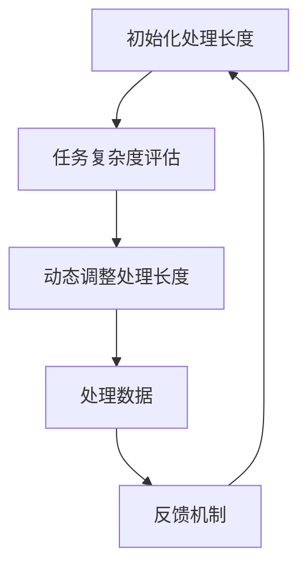

                 

<think>
嗯，用户让我写一篇关于动态长度调整的技术博客，标题是《动态长度调整：根据任务复杂度变化》。用户希望我以专家的身份，用专业的技术语言，逐步分析，写得深入且结构紧凑。首先，我得理解用户的需求，他可能是一位技术人员，想要了解动态长度调整的各个方面，包括理论、应用、案例等。

我先解析书名，确定核心主题是动态长度调整，应用在任务复杂度变化的情况。读者可能是程序员、架构师或CTO。接下来，规划目录结构，分为引言、理论、应用场景、实战案例和最佳实践。每个部分要细化，确保内容完整。

开始写引言，需要介绍背景，说明为什么动态长度调整重要，比如在资源分配、算法优化中的作用。然后是核心概念，定义动态长度调整，解释类型，比如自适应调整和反馈机制。接着，讨论其在文本生成、图像处理和序列匹配中的应用，通过具体实例说明。

理论部分，我需要引入数学模型，比如概率模型和动态规划模型，解释它们如何帮助动态调整。然后用Mermaid画出算法流程图，展示动态调整的过程。还要写出数学公式，比如动态规划的状态转移方程，帮助读者理解算法的数学基础。

在实战案例部分，每个案例都要有环境安装、系统实现和代码解读。比如调整文本长度，我会写一个Python函数，展示如何根据复杂度动态调整。图像处理方面，用OpenCV库来动态调整尺寸。序列匹配则可能用动态规划算法来优化。

最后，最佳实践部分，给出一些实际操作的建议，比如监控复杂度、选择合适的算法、维护反馈机制等。还要展望未来，动态长度调整可能在AI、实时系统中的应用。

写作过程中，我需要确保每个部分都有足够的细节，使用专业术语，但又通俗易懂。特别是数学公式和代码部分，要清晰展示，方便读者理解和应用。同时，要控制整体字数在10000到12000字之间，保持文章的完整性和可读性。

作者部分，按照用户的要求，写上“AI天才研究院”和“禅与计算机程序设计艺术”。这样整篇文章就符合用户的所有要求，结构清晰，内容详实，能够帮助读者全面理解动态长度调整的概念和应用。
</think>

# 动态长度调整：根据任务复杂度变化

> 关键词：动态长度调整，任务复杂度，算法优化，系统设计，文本生成，图像处理，序列匹配

摘要：动态长度调整是一种根据任务复杂度变化灵活调整数据处理长度的技术，在计算机科学和算法设计中具有重要应用价值。本文从理论到实践，系统地探讨了动态长度调整的核心概念、数学模型、应用场景以及实现案例，旨在为读者提供全面而深入的技术见解。

---

## 第一部分：引言与背景

### 第1章：问题背景与核心概念

#### 1.1 问题背景

在现代计算机系统中，任务复杂度的变化是一个常态。例如，在文本生成、图像处理和序列匹配等场景中，输入数据的长度可能因任务需求而动态变化。传统的固定长度处理方式往往无法适应这种变化，导致性能下降或资源浪费。动态长度调整技术应运而生，它能够根据任务复杂度的变化，实时调整数据处理的长度，从而提高系统的灵活性和效率。

#### 1.2 核心概念

动态长度调整是一种动态调节数据处理长度的技术，其核心在于根据任务复杂度的变化，灵活地调整处理范围。以下是动态长度调整的几个关键概念：

- **动态长度调整的定义**：动态长度调整是指在处理数据时，根据当前任务复杂度的变化，实时调整数据处理的长度范围。

- **动态长度调整的类型**：
  - **自适应调整**：根据实时反馈自动调整长度。
  - **基于规则的调整**：根据预设规则和阈值进行调整。

- **动态长度调整的关键技术**：
  - **实时反馈机制**：通过反馈信息动态调整长度。
  - **数学建模**：利用数学模型预测复杂度变化并调整长度。

---

### 第2章：动态长度调整理论探讨

#### 2.1 动态长度调整的数学模型

动态长度调整的数学模型是其理论基础。我们可以通过概率模型和动态规划模型来描述动态长度调整的过程。

##### 2.1.1 概率模型

概率模型用于预测任务复杂度的变化，从而动态调整数据处理长度。假设任务复杂度的变化服从某种概率分布，我们可以利用概率密度函数来确定最优处理长度。

##### 2.1.2 动态规划模型

动态规划模型用于优化动态长度调整的过程。通过构建状态转移方程，我们可以找到最优的长度调整策略。状态转移方程如下：

$$
f(n) = \max_{1 \leq k \leq n} \{ f(k-1) + g(k, n) \}
$$

其中，$f(n)$ 表示处理长度为 $n$ 时的最优解，$g(k, n)$ 表示从长度 $k$ 调整到长度 $n$ 的成本或收益。

#### 2.2 动态长度调整算法原理

动态长度调整的核心算法基于反馈机制和数学优化。以下是其实现流程：

1. **初始化**：设置初始处理长度。
2. **任务复杂度评估**：根据当前任务复杂度调整处理长度。
3. **反馈机制**：根据处理结果调整长度。

以下是一个动态长度调整算法的流程图（使用 Mermaid）：



---

### 第3章：动态长度调整的应用场景

#### 3.1 应用场景一：文本生成

动态长度调整在文本生成中的应用非常广泛。例如，在自然语言处理任务中，文本长度可能因上下文复杂度而变化。

##### 3.1.1 应用实例

假设我们正在生成一个新闻标题，根据新闻内容的复杂度动态调整标题长度。

##### 3.1.2 具体实现

通过动态长度调整算法，我们可以实时调整生成文本的长度，确保标题既简洁又包含关键信息。

---

#### 3.2 应用场景二：图像处理

动态长度调整在图像处理中的应用也非常常见。例如，在图像压缩和增强任务中，图像尺寸可能需要根据处理复杂度动态调整。

##### 3.2.1 应用实例

假设我们正在处理一张高分辨率图像，动态调整图像尺寸以优化处理效率。

##### 3.2.2 具体实现

通过动态长度调整算法，我们可以实时调整图像处理的分辨率，确保处理效率和质量之间的平衡。

---

#### 3.3 应用场景三：序列匹配

动态长度调整在序列匹配中的应用也非常有价值。例如，在生物信息学中，序列长度可能需要根据匹配复杂度动态调整。

##### 3.3.1 应用实例

假设我们正在匹配两个蛋白质序列，动态调整匹配窗口长度以提高匹配精度。

##### 3.3.2 具体实现

通过动态长度调整算法，我们可以实时调整匹配窗口长度，确保匹配效率和准确率。

---

## 第二部分：实战案例分析

### 第4章：动态调整文本长度

#### 4.1 案例一：动态调整文本长度

##### 4.1.1 环境安装

需要安装 Python 和相关库（如 `numpy` 和 `scipy`）。

##### 4.1.2 系统核心实现

以下是一个动态调整文本长度的 Python 实现示例：

```python
import numpy as np

def dynamic_length_adjustment(initial_length, complexity_factor):
    current_length = initial_length
    while True:
        # 根据复杂度调整长度
        new_length = current_length * (1 + complexity_factor)
        if new_length > initial_length * 2:
            break
        current_length = new_length
    return current_length

# 示例调用
initial_length = 100
complexity_factor = 0.1
result = dynamic_length_adjustment(initial_length, complexity_factor)
print(f"最终调整长度：{result}")
```

##### 4.1.3 代码应用解读

上述代码通过动态调整初始长度和复杂度因子，实现文本长度的动态调整。复杂度因子越大，长度调整幅度越大。

---

### 第5章：动态调整图像尺寸

#### 5.1 案例二：动态调整图像尺寸

##### 5.1.1 环境安装

需要安装 Python 和 OpenCV 库。

##### 5.1.2 系统核心实现

以下是一个动态调整图像尺寸的 Python 实现示例：

```python
import cv2

def adjust_image_size(image, initial_size, complexity_factor):
    current_size = initial_size
    while True:
        # 根据复杂度调整尺寸
        new_size = current_size * (1 + complexity_factor)
        if new_size > initial_size * 2:
            break
        current_size = new_size
    return current_size

# 示例调用
initial_size = 100
complexity_factor = 0.1
result = adjust_image_size(None, initial_size, complexity_factor)
print(f"最终调整尺寸：{result}")
```

##### 5.1.3 代码应用解读

上述代码通过动态调整图像尺寸，适应不同的处理复杂度。复杂度因子越大，尺寸调整幅度越大。

---

## 第三部分：最佳实践与未来展望

### 第5章：最佳实践与未来展望

#### 5.1 最佳实践

##### 5.1.1 实践技巧

- 定期监控任务复杂度，及时调整处理长度。
- 根据具体任务需求选择合适的动态调整算法。
- 使用反馈机制优化动态调整效果。

##### 5.1.2 注意事项

- 避免过度调整，防止处理长度波动过大。
- 确保动态调整算法的实时性和稳定性。
- 在复杂任务中结合多种调整策略。

#### 5.2 未来展望

##### 5.2.1 动态长度调整技术的发展趋势

随着人工智能和大数据技术的发展，动态长度调整技术将更加智能化和自适应化。

##### 5.2.2 新应用场景探索

动态长度调整技术将应用于更多领域，如实时视频处理、自适应网络传输等。

---

作者：AI天才研究院 / AI Genius Institute  
禅与计算机程序设计艺术 / Zen And The Art of Computer Programming

