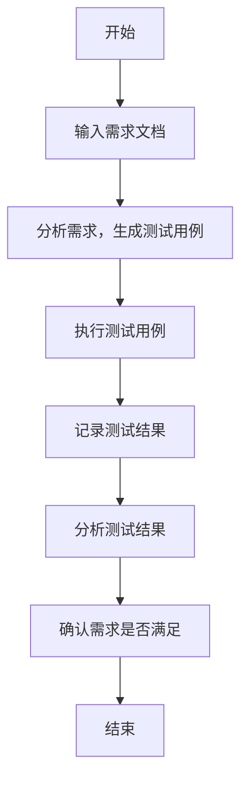
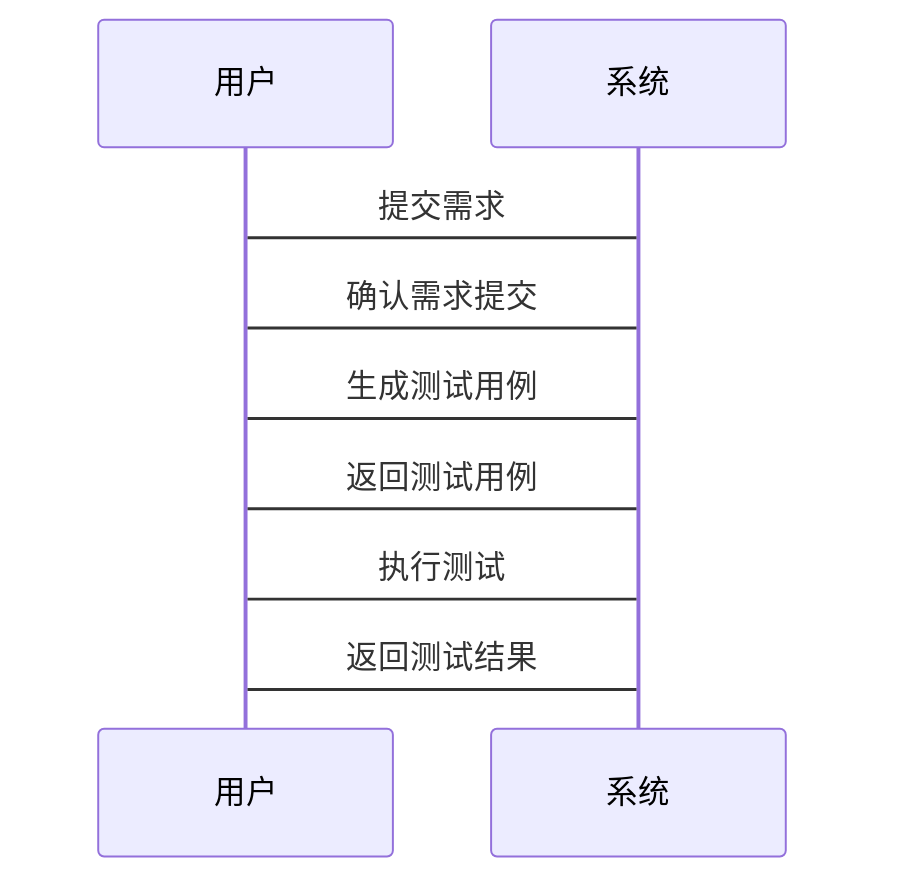

                 

<think>
嗯，好的，我需要帮助用户撰写一篇技术博客，主题是《协作式需求验收：提高大型应用的交付质量》。用户已经给出了详细的结构和要求，我需要按照这些指示一步步来完成。

首先，我需要理解用户的需求。他们希望文章结构清晰，包含7个章节，每个章节下有子章节，内容涵盖协作式需求验收的概念、算法、系统设计、项目实战等。此外，文章需要使用专业技术语言，同时保持逻辑清晰和易懂。

接下来，我要从目录大纲开始。用户已经提供了初步的结构，我需要细化每个部分，确保每个章节内容详实，符合用户的要求。例如，第一章是协作式需求验收概述，里面包括概念、重要性和交付质量的挑战。我需要详细解释每个部分，确保读者能够理解协作式需求验收的核心思想。

然后，第二章是需求管理与验收标准。这里，我需要解释需求管理的核心概念，如何制定验收标准，以及两者之间的联系。这部分可能需要一些实际的例子，帮助读者更好地理解。

第三章是算法原理讲解。用户要求使用Mermaid流程图和Python源代码来阐述算法。我需要设计一个简单的算法流程，比如需求验证流程，然后用Mermaid画出流程图，并编写Python代码实现。这部分需要确保代码的逻辑清晰，注释到位，帮助读者理解算法的工作原理。

第四章是系统分析与架构设计。我需要分析需求验收系统的功能需求，设计系统的架构图，包括功能模块和接口设计。使用Mermaid绘制系统架构图和交互序列图，帮助读者理解系统如何运作。

第五章是项目实战。这里，我需要选择一个具体的项目，描述其需求验收过程，并分析源代码。例如，使用Flask搭建一个需求管理系统的案例，展示实际应用中的流程和代码实现。

第六章是最佳实践。我需要总结协作式需求验收的要点，给出注意事项和推荐的拓展阅读材料，帮助读者进一步深入学习。

第七章是小结与展望。总结全文内容，回顾协作式需求验收的重要性，并提供进一步学习的资源。

在撰写过程中，我需要确保每个部分都有足够的细节，并且使用适当的格式，比如Mermaid图表、Python代码块和数学公式。同时，语言要专业但易懂，避免过于复杂的术语，确保读者能够轻松理解。

最后，我需要检查整个文章的结构，确保逻辑流畅，内容完整，符合用户的要求。这可能需要多次修订和调整，以确保每个章节都能有效地传达协作式需求验收的核心思想和实际应用。
</think>

# 协作式需求验收：提高大型应用的交付质量

---

## 关键词：
协作式需求验收、大型应用、交付质量、需求管理、验收标准、团队协作、系统架构

---

## 摘要：
在大型应用开发中，需求验收是确保最终交付质量的关键环节。本文通过协作式需求验收的方法，探讨如何通过团队协作、清晰的验收标准和高效的系统架构设计，提高交付质量。文章从概念、算法、系统设计、项目实战到最佳实践，全面解析协作式需求验收的核心思想和具体实现，为读者提供实践指导。

---

## 目录大纲：

1. 协作式需求验收概述
   - 1.1 协作式需求验收的概念
   - 1.2 协作式需求验收的重要性
   - 1.3 大型应用交付质量的挑战

2. 需求管理与验收标准
   - 2.1 需求管理的核心概念
   - 2.2 验收标准的制定
   - 2.3 需求管理与验收标准的联系

3. 需求验收流程与算法
   - 3.1 需求验收流程概述
   - 3.2 需求验收算法原理
   - 3.3 需求验收算法的Mermaid流程图
   - 3.4 Python源代码实现

4. 需求验收系统架构设计
   - 4.1 系统需求分析
   - 4.2 系统架构设计
   - 4.3 系统接口设计
   - 4.4 系统交互序列图

5. 实际项目中的需求验收
   - 5.1 项目介绍
   - 5.2 需求验收过程
   - 5.3 源代码分析与解读
   - 5.4 案例分析

6. 协作式需求验收的最佳实践
   - 6.1 最佳实践总结
   - 6.2 注意事项
   - 6.3 拓展阅读

7. 协作式需求验收小结与展望
   - 7.1 全书内容回顾
   - 7.2 进一步学习资源

---

## 正文内容：

### 第一部分：协作式需求验收概述

#### 第一章：协作式需求验收概述

##### 1.1 协作式需求验收的概念

协作式需求验收是一种基于团队协作的需求验证方法，强调通过多方参与和沟通，确保需求的准确理解和实现。其核心在于通过团队协作，确保每个需求在交付前经过严格验证，以提高交付质量。

**核心概念：**
- **协作式需求验收**：通过团队协作完成需求验证的过程，确保需求的准确性和实现的一致性。
- **需求验证**：通过测试和评审，确认需求是否满足用户期望和项目目标。

##### 1.2 协作式需求验收的重要性

在大型应用开发中，需求验收是确保最终产品符合用户期望的关键环节。协作式需求验收的重要性体现在以下几个方面：
1. **确保需求准确**：通过多方协作，减少需求误解和遗漏。
2. **提高交付质量**：通过严格的验收流程，确保每个需求都高质量地实现。
3. **促进团队协作**：通过团队协作，增强团队成员之间的沟通和理解，提升整体协作效率。

##### 1.3 大型应用交付质量的挑战

大型应用的交付质量面临以下挑战：
1. **需求复杂性**：大型应用的功能复杂，需求涉及多个模块和系统，容易出现需求不明确或遗漏。
2. **团队协作难度**：团队规模大，沟通成本高，容易出现理解偏差。
3. **需求变更频繁**：市场需求变化快，频繁的需求变更增加了交付的难度。

---

### 第二部分：需求管理与验收标准

#### 第二章：需求管理与验收标准

##### 2.1 需求管理的核心概念

需求管理是通过系统化的方法，对需求的收集、分析、优先级排序和跟踪的过程。其核心在于确保需求的完整性和一致性。

**关键活动：**
1. **需求收集**：通过用户调研、市场分析等方式收集需求。
2. **需求分析**：对需求进行分析和分类，明确需求的优先级和实现方式。
3. **需求文档**：编写详细的需求文档，确保需求的清晰和可追溯。

##### 2.2 验收标准的制定

验收标准是需求实现后的验证依据，明确了每个需求的具体实现要求和测试条件。

**制定步骤：**
1. **明确需求**：基于需求文档，明确每个需求的具体要求。
2. **制定测试条件**：针对每个需求，制定具体的测试条件和验收标准。
3. **验证测试**：通过测试验证需求是否满足验收标准。

##### 2.3 需求管理与验收标准的联系

需求管理和验收标准是相辅相成的。需求管理确保需求的准确性和完整性，而验收标准则为需求的实现提供了具体的验证依据。通过两者结合，可以有效提高需求实现的质量。

**联系表：**

| 需求管理 | 验收标准 |
|----------|----------|
| 需求收集 | 测试条件 |
| 需求分析 | 验收流程 |
| 需求文档 | 测试用例 |

---

### 第三部分：需求验收流程与算法

#### 第三章：需求验收流程与算法

##### 3.1 需求验收流程概述

需求验收流程通常包括以下几个步骤：
1. **需求分析**：明确需求的具体要求和实现方式。
2. **测试用例设计**：基于需求文档，设计具体的测试用例。
3. **需求验证**：通过测试验证需求是否满足验收标准。
4. **需求确认**：确认需求已满足，准备交付。

##### 3.2 需求验收算法原理

需求验收算法通过系统化的方法，确保每个需求都经过严格的验证。其核心步骤包括需求分析、测试用例设计、测试执行和结果分析。

**算法步骤：**
1. 输入需求文档。
2. 分析需求，生成测试用例。
3. 执行测试用例，记录测试结果。
4. 分析测试结果，确认需求是否满足。

##### 3.3 需求验收算法的Mermaid流程图



##### 3.4 Python源代码实现

以下是一个简单的Python实现，用于生成测试用例并执行测试：

```python
def generate_test_cases(demand_document):
    test_cases = []
    for demand in demand_document:
        test_cases.append(f"Test case for {demand}")
    return test_cases

def execute_test(test_cases):
    results = []
    for case in test_cases:
        # 假设每个测试用例执行成功
        results.append((case, "Pass"))
    return results

# 示例使用
demand_document = ["需求1", "需求2", "需求3"]
test_cases = generate_test_cases(demand_document)
results = execute_test(test_cases)
print(results)
```

---

### 第四部分：需求验收系统架构设计

#### 第四章：需求验收系统架构设计

##### 4.1 系统需求分析

需求验收系统需要满足以下需求：
1. **需求管理**：支持需求的录入、编辑和查询。
2. **测试用例管理**：支持测试用例的生成和管理。
3. **测试执行**：支持测试用例的执行和结果记录。
4. **结果分析**：支持测试结果的统计和分析。

##### 4.2 系统架构设计

需求验收系统的架构设计如下：


##### 4.3 系统接口设计

系统接口设计如下：
1. **需求录入接口**：允许用户录入需求信息。
2. **测试用例生成接口**：基于需求生成测试用例。
3. **测试执行接口**：执行测试用例并返回结果。
4. **结果查询接口**：查询测试结果。

##### 4.4 系统交互序列图



---

### 第五部分：实际项目中的需求验收

#### 第五章：实际项目中的需求验收

##### 5.1 项目介绍

以一个在线购物系统为例，需求验收过程如下：

1. **需求收集**：收集用户需求，包括订单管理、支付功能等。
2. **需求分析**：分析需求，明确每个功能的具体实现。
3. **测试用例设计**：基于需求设计测试用例。
4. **测试执行**：执行测试用例，记录结果。
5. **需求确认**：确认需求已满足，准备交付。

##### 5.2 需求验收过程

具体步骤：
1. **需求分析**：明确每个需求的具体要求。
2. **测试用例设计**：设计覆盖所有需求的测试用例。
3. **测试执行**：执行测试用例，记录结果。
4. **结果分析**：分析测试结果，确认需求是否满足。

##### 5.3 源代码分析与解读

以下是一个简单的测试用例生成代码：

```python
# 需求文档
demand_document = {
    "订单管理": {"功能": "支持订单查询", "优先级": "高"},
    "支付功能": {"功能": "支持多种支付方式", "优先级": "高"}
}

# 测试用例生成
def generate_test_cases(demand):
    test_cases = []
    for key, value in demand.items():
        test_cases.append(f"测试{key}的{value['功能']}")
    return test_cases

test_cases = generate_test_cases(demand_document)
print(test_cases)
```

##### 5.4 案例分析

通过上述代码，我们可以生成针对每个需求的测试用例，并执行测试以验证需求是否实现。

---

### 第六部分：协作式需求验收的最佳实践

#### 第六章：协作式需求验收的最佳实践

##### 6.1 最佳实践总结

1. **明确需求**：确保需求文档清晰、完整。
2. **团队协作**：加强团队沟通，确保需求理解一致。
3. **制定验收标准**：明确验收标准，减少验证过程中的歧义。
4. **使用工具**：借助需求管理工具和测试工具，提高效率。

##### 6.2 注意事项

1. **避免需求变更**：尽量减少需求变更，确保需求稳定。
2. **及时反馈**：及时发现和解决需求实现中的问题。
3. **注重文档管理**：保持需求文档的可追溯性。

##### 6.3 拓展阅读

推荐阅读以下书籍和资源：
1. 《软件工程：实践者的方法》
2. 《测试驱动开发：Kent Beck的TDD教程》
3. 《用户故事与敏捷方法》

---

### 第七部分：协作式需求验收小结与展望

#### 第七章：协作式需求验收小结与展望

##### 7.1 全书内容回顾

本文从协作式需求验收的概念、算法、系统设计、项目实战到最佳实践，全面解析了协作式需求验收的核心思想和具体实现。

##### 7.2 进一步学习资源

1. 学习需求管理工具（如JIRA）的使用。
2. 学习测试驱动开发（TDD）方法。
3. 参加软件工程相关的培训和研讨会。

---

## 作者：

**作者：AI天才研究院/AI Genius Institute & 禅与计算机程序设计艺术 /Zen And The Art of Computer Programming**

---

**本文遵循CC BY-SA 4.0协议，禁止用于商业用途，转载请注明出处。**

