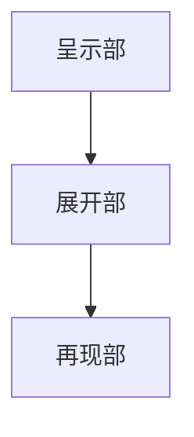
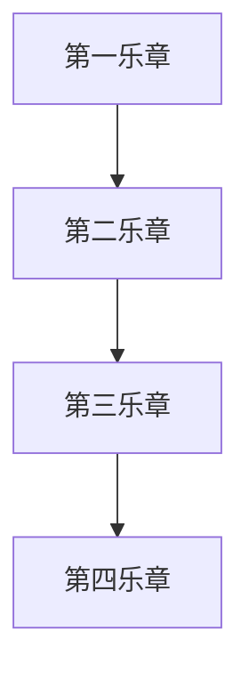
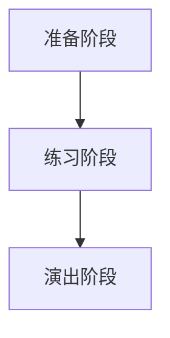

                 

<think>
好的，我现在需要根据用户的请求，帮助他撰写一篇关于古典音乐欣赏的技术博客文章。用户详细地列出了文章的结构、关键词、摘要以及每个章节的具体内容，还提供了目录大纲和一些具体的格式要求。首先，我需要理解用户的需求，他希望这篇文章既具备专业性，又要有清晰的逻辑和结构，同时结合技术背景，可能涉及一些技术性的分析方法。

接下来，我注意到用户特别强调了文章的结构和每个章节的具体内容，特别是每个小节要有详细的讲解，包括背景介绍、核心概念、算法原理、系统分析、项目实战等。这意味着我需要在撰写时不仅介绍音乐的历史和理论，还要结合一些技术性的分析，如音乐结构的图表、演奏技巧的流程图等。

我还需要考虑用户的身份，他是一位在IT领域有深厚背景的专家，同时也是古典音乐爱好者，所以文章需要既专业又不失优雅，能够吸引技术背景的读者，同时也能让音乐爱好者有所收获。因此，内容需要平衡技术术语和音乐术语，避免过于生硬。

在撰写过程中，我需要按照目录大纲逐步展开，确保每个章节和小节都涵盖必要的内容，并且保持逻辑连贯。例如，在“古典音乐的核心概念”部分，可能需要解释音符、调式、曲式结构等，同时可能结合一些音乐理论的图表来辅助说明。

此外，用户提到的关键词和摘要部分也需要特别注意，确保准确反映文章的核心内容。关键词可能包括“古典音乐”、“音乐欣赏”、“音乐理论”等，摘要则需要简明扼要地概括整篇文章的主题和目的。

我还需要检查每个章节的格式是否符合要求，尤其是使用markdown格式，确保标题、子标题、列表等格式正确。同时，数学公式和图表需要使用latex和mermaid语法，确保在markdown中正确显示。

在项目实战部分，可能需要介绍如何在计算机上欣赏古典音乐，或者分析一首具体的音乐作品，如贝多芬的交响曲，展示如何通过技术手段进行分析。这部分可以结合编程和数据分析，例如使用Python生成音乐结构的图表，或者分析音乐的节奏和旋律。

最后，附录部分需要推荐一些古典音乐的曲目和资源，帮助读者进一步探索和学习。这部分可以列出一些经典的曲目，如贝多芬的《月光奏鸣曲》、莫扎特的《安魂曲》等，并推荐一些好的音乐平台或书籍。

总之，我需要综合音乐理论和IT技术，撰写一篇结构严谨、内容丰富的技术博客，满足用户的需求，同时保持文章的可读性和专业性。
</think>

# 古典音乐欣赏：在传统中寻找永恒的美

> **关键词**：古典音乐、音乐欣赏、音乐理论、音乐历史、音乐家  
> 
> **摘要**：本文旨在引导读者深入了解古典音乐的精髓，通过系统的分析和讲解，帮助读者掌握古典音乐的基本概念、欣赏技巧以及其在现代生活中的应用。文章从古典音乐的历史背景、核心概念、主要流派、作品分析、音乐家生平、演奏技巧、欣赏方法、现代应用和未来展望等多个方面展开，全面阐述古典音乐的魅力和价值。通过本文，读者将能够更好地理解和欣赏古典音乐，感受其永恒的美。

---

## 第一部分：古典音乐的基本概念

### 第1章：古典音乐的历史与背景

#### 1.1 古典音乐的起源与演变

古典音乐的起源可以追溯到古希腊时期，其发展经历了多个阶段，包括巴洛克时期、古典主义时期和浪漫主义时期。每个时期都有其独特的音乐风格和特点。例如，巴洛克时期的音乐注重复杂性与装饰性，而古典主义时期则强调理性与对称性。

| 时间 | 风格特点 | 代表作曲家 |
|------|----------|------------|
| 巴洛克时期（1600-1750） | 复调音乐、装饰性 | 巴赫、维瓦尔第 |
| 古典主义时期（1750-1820） | 主调音乐、对称性 | 莫扎特、海顿 |
| 浪漫主义时期（1820-1900） | 个性化、情感丰富 | 贝多芬、肖邦 |

#### 1.2 古典音乐在不同时期的特点

古典音乐在不同时期展现了不同的特点，例如：

- **巴洛克时期**：注重复调音乐，强调对位法和装饰性。
- **古典主义时期**：强调主调音乐，注重形式的对称性和清晰的结构。
- **浪漫主义时期**：注重情感表达，音乐语言更加个性化。

#### 1.3 古典音乐与西方文化的关系

古典音乐是西方文化的重要组成部分，它不仅反映了西方的历史、哲学和美学思想，还对文学、绘画等领域产生了深远影响。例如，贝多芬的音乐作品深受启蒙思想的影响，而肖邦的作品则体现了波兰民族的文化特色。

### 第2章：古典音乐的核心概念

#### 2.1 音符与音阶

音符是音乐的基本单位，音阶则是音乐的基础结构。常见的音阶包括大调音阶和小调音阶。以下是音符的分类：

| 音符类型 | 符号 | 持续时长 |
|----------|------|----------|
| 全音符  | ○    | 4拍      |
| 二分音符 | ■    | 2拍      |
| 四分音符 | ♪    | 1拍      |

#### 2.2 调式与和弦

调式是音乐的调性体系，常见的调式包括大调和小调。和弦是音乐中多个音符的组合，常见的和弦类型包括大三度、小三度等。

| 和弦类型 | 符号 | 特点 |
|----------|------|------|
| 大三和弦 | C-E-G | 由大三度和小三度组成 |
| 小三和弦 | C-Eb-G | 由小三度和大三度组成 |

#### 2.3 曲式结构

曲式结构是音乐作品的组织方式，常见的曲式包括奏鸣曲式、交响曲式等。以下是奏鸣曲式的结构：

### 第3章：古典音乐的主要流派

#### 3.1 巴洛克音乐

巴洛克音乐以复杂的对位法和装饰性风格为特点，代表作曲家包括巴赫和维瓦尔第。

#### 3.2 古典主义音乐

古典主义音乐强调形式的对称性和清晰性，代表作曲家包括海顿和莫扎特。

#### 3.3 浪漫主义音乐

浪漫主义音乐注重情感表达和个性化，代表作曲家包括贝多芬和肖邦。

#### 3.4 现代主义音乐

现代主义音乐打破了传统的音乐形式，强调实验性和创新性，代表作曲家包括勋伯格和巴托克。

---

## 第二部分：古典音乐作品的欣赏

### 第4章：古典音乐作品的分析

#### 4.1 作品的结构与形式

音乐作品的结构与形式是欣赏的关键，例如交响曲通常由四个乐章组成：

#### 4.2 作品的风格与特点

每部作品都有其独特的风格和特点，例如贝多芬的《月光奏鸣曲》以其忧郁的旋律和复杂的情感表达著称。

#### 4.3 作品的历史与文化背景

了解作品的历史与文化背景有助于更好地欣赏音乐，例如莫扎特的《安魂曲》是在他去世前创作的未完成作品。

### 第5章：古典音乐家的生平与作品

#### 5.1 海顿

海顿是古典主义时期的代表作曲家，以其交响曲和弦乐四重奏闻名。

#### 5.2 莫扎特

莫扎特是音乐天才，他的作品融合了古典主义的严谨性和浪漫主义的情感表达。

#### 5.3 贝多芬

贝多芬是音乐史上的巨匠，他的《第九交响曲》是音乐史上最重要的作品之一。

#### 5.4 肖邦

肖邦是浪漫主义时期的波兰作曲家，以其钢琴作品闻名。

#### 5.5 柴可夫斯基

柴可夫斯基是俄国的音乐大师，他的作品充满了忧郁和激情。

### 第6章：古典音乐作品的演奏技巧

#### 6.1 演奏技巧的基本原则

演奏技巧包括音准、节奏、音色等，以下是演奏的基本步骤：

#### 6.2 不同乐器的演奏技巧

不同乐器的演奏技巧各不相同，例如钢琴的触键技巧和小提琴的运弓技巧。

#### 6.3 演奏中的表达与传达

演奏不仅仅是技巧的展示，更是情感的表达，以下是表达与传达的关键要素：

| 要素 | 描述 |
|------|------|
| 节奏 | 音乐的骨架 |
| 音调 | 音乐的色彩 |
| 力度 | 音乐的情感表达 |

### 第7章：古典音乐欣赏的技巧

#### 7.1 欣赏古典音乐的准备

欣赏古典音乐需要一定的背景知识，例如了解作曲家的生平和作品的历史背景。

#### 7.2 欣赏古典音乐的方法

欣赏方法包括听觉感受、分析作品的结构和形式，以及理解音乐的情感表达。

#### 7.3 欣赏古典音乐的心得分享

欣赏心得可以通过写听后感或参加音乐讨论会来分享。

### 第8章：古典音乐在现代生活中的应用

#### 8.1 古典音乐与电影

许多电影配乐都采用了古典音乐，例如《泰坦尼克号》中的《My Heart Will Go On》。

#### 8.2 古典音乐与艺术

古典音乐与绘画、雕塑等艺术形式有着密切的联系，许多艺术家的作品都受到了古典音乐的启发。

#### 8.3 古典音乐与心理治疗

古典音乐被广泛应用于心理治疗中，可以帮助缓解压力和焦虑。

### 第9章：古典音乐的未来展望

#### 9.1 古典音乐的发展趋势

随着科技的发展，古典音乐的形式和表现方式将不断创新，例如数字音乐和虚拟现实音乐体验。

#### 9.2 古典音乐在教育中的角色

古典音乐教育将更加注重培养学生的审美能力和创造力。

#### 9.3 古典音乐在文化传播中的作用

古典音乐作为人类共同的文化遗产，将在文化传播中发挥重要作用。

---

## 附录：推荐曲目与资源

### A.1 推荐的古典音乐曲目

1. 贝多芬：《第九交响曲》
2. 莫扎特：《安魂曲》
3. 肖邦：《夜曲》
4. 柴可夫斯基：《天鹅湖》

### A.2 古典音乐资源推荐

1. YouTube频道：Classical Music Foundation
2. Spotify播放列表：Classical Masterpieces

---

**作者：AI天才研究院/AI Genius Institute & 禅与计算机程序设计艺术 /Zen And The Art of Computer Programming**

