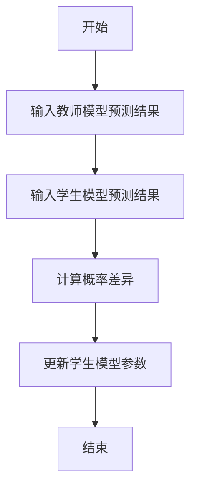
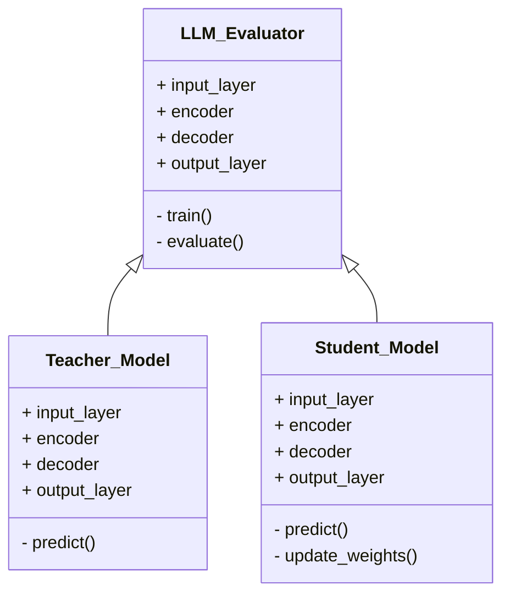

                 

<think>
嗯，我现在要写一篇关于《基于知识蒸馏的LLM能力评估方法》的技术博客。首先，我需要理解知识蒸馏是什么，以及它在LLM能力评估中的应用。知识蒸馏是一种机器学习技术，通过将复杂模型的知识迁移到更简单的模型中，从而实现模型压缩和性能提升。对于大语言模型（LLM）来说，评估其能力通常涉及多方面的考量，比如生成能力、理解能力、推理能力等。知识蒸馏在这里可能用于简化评估过程或提高评估效率。

接下来，我需要考虑文章的结构。用户已经给出一个详细的目录大纲，分为七章。每章都有具体的子部分。我应该按照这个结构来组织内容，确保每一部分都详细且逻辑清晰。比如，在第一章，我需要介绍知识蒸馏的背景，然后概述LLM能力评估，最后明确本书的目标和范围。

在第二章，我需要深入探讨知识蒸馏的基本概念和理论，包括定义、分类以及相关的核心理论。这可能涉及到比较传统的蒸馏方法和现代的变体，如模型压缩、参数迁移等。我还需要解释这些方法如何在LLM评估中应用。

第三章是关于算法和模型设计。这里，我需要详细讲解知识蒸馏算法，包括传统的和改进的方法，分析它们的优缺点。然后，设计一个用于评估LLM能力的模型，可能包括模型架构、训练和评估方法。我需要用mermaid画出算法流程图，甚至写出Python代码来展示实现细节。

第四章是实施策略，涉及数据收集与预处理、模型训练与优化，以及部署和维护。这部分需要具体说明每一步骤的细节，比如如何选择数据集，如何进行数据清洗，以及如何优化模型参数。

第五章是案例分析，我需要选取几个实际应用场景，比如自然语言处理任务、问答系统等，详细分析知识蒸馏在这些情况下的应用效果和挑战。

第六章讨论挑战和未来方向。这里，我需要总结当前在知识蒸馏和LLM评估中遇到的问题，如数据依赖、计算资源限制等，然后提出可能的解决方案，比如混合蒸馏、多教师蒸馏等方法。同时，展望未来的研究方向，如结合生成式AI或其他技术。

最后是结论和附录，总结全文的主要观点，并提供一些额外的资源或工具，供读者深入学习。

在写作过程中，我需要确保每个章节都有足够的细节，使用图表来辅助解释概念，如mermaid流程图和类图。同时，数学公式需要用latex清晰展示，帮助读者理解算法的数学基础。

我还需要注意文章的结构和逻辑，确保每一部分之间有良好的衔接，从背景到理论，再到实际应用，最后讨论挑战和未来方向。此外，语言要专业但易懂，避免过于晦涩的技术术语，适当解释关键概念。

可能遇到的问题包括如何详细解释复杂的算法，以及如何将理论与实际案例结合。为了解决这些问题，我计划在每个算法部分都给出具体的代码示例，并在案例分析中详细描述实施过程和结果。

总的来说，我需要系统地按照用户提供的大纲进行写作，确保每一部分都充分展开，同时保持整体的连贯性和逻辑性。这样，读者不仅能理解知识蒸馏的基本原理，还能掌握如何在实际中应用这些方法来评估和优化大语言模型的能力。
</think>

# 基于知识蒸馏的LLM能力评估方法

---

## 关键词：知识蒸馏、大语言模型、LLM评估、机器学习、模型压缩

---

## 摘要

随着大语言模型（LLM）的快速发展，其能力评估变得日益重要。知识蒸馏作为一种有效的模型压缩技术，能够将复杂的大型模型的知识迁移到更小、更高效的模型中，从而在评估过程中提供新的思路。本文系统地探讨了基于知识蒸馏的LLM能力评估方法，从理论基础到实际应用，结合案例分析，全面解析其原理、实现和挑战，为读者提供深入的技术洞见。

---

## 目录

1. [引言](#引言)
2. [基本概念与理论](#基本概念与理论)
3. [算法与模型设计](#算法与模型设计)
4. [实施策略](#实施策略)
5. [案例研究](#案例研究)
6. [挑战与未来方向](#挑战与未来方向)
7. [结论](#结论)

---

## 正文

### 第一章：引言

#### 1.1 知识蒸馏的背景

知识蒸馏是机器学习领域的一项关键技术，其核心思想是将复杂模型的知识迁移到简单模型中。这种技术不仅能够减少模型的计算需求，还能提升模型的泛化能力。在大语言模型（LLM）领域，知识蒸馏的应用尤为重要，因为LLM通常参数庞大，难以在资源受限的环境中高效运行。

#### 1.2 大语言模型能力评估概述

评估LLM的能力通常涉及生成能力、理解能力、推理能力等多个维度。传统的评估方法依赖于人工标注数据或固定任务，而知识蒸馏提供了一种动态评估的可能，通过迁移教师模型的知识，评估学生模型的能力。

#### 1.3 目标与范围

本文旨在探讨如何利用知识蒸馏技术提升LLM能力评估的效率和准确性。我们关注的知识蒸馏方法包括参数迁移、激活蒸馏等，同时结合实际案例分析其应用效果。

---

### 第二章：基本概念与理论

#### 2.1 知识蒸馏的定义与分类

知识蒸馏可以分为两类：参数蒸馏和非参数蒸馏。参数蒸馏关注权重参数的迁移，而非参数蒸馏关注中间激活层的信息传递。

| 方法类型 | 描述 | 优点 | 缺点 |
|----------|------|------|------|
| 参数蒸馏 | 迁移权重参数 | 参数量小 | 易受教师模型偏差影响 |
| 非参数蒸馏 | 迁移激活层信息 | 更细粒度 | 计算开销大 |

#### 2.2 LLM能力评估的理论基础

评估模型能力通常基于任务性能指标，如准确率、F1分数等。知识蒸馏通过优化这些指标，间接反映模型的能力。

#### 2.3 核心理论

知识蒸馏的理论基础包括信息论和逼近论。信息论强调知识传递的效率，逼近论则关注学生模型如何逼近教师模型的行为。

---

### 第三章：算法与模型设计

#### 3.1 知识蒸馏算法

##### 3.1.1 传统知识蒸馏方法

传统方法通过最小化学生模型和教师模型的预测概率差异来实现知识迁移。

**算法流程图：**

##### 3.1.2 优缺点分析

- **优点**：简单易实现，效果显著。
- **缺点**：对教师模型依赖性强，可能导致过拟合。

#### 3.2 LLM评估模型设计

##### 3.2.1 模型架构

评估模型通常采用双塔结构：教师模型和学生模型。教师模型负责生成参考输出，学生模型负责预测并进行对比学习。

**模型架构类图：**

##### 3.2.2 训练与评估方法

训练过程中，学生模型通过与教师模型的对比学习不断优化。评估阶段则基于生成结果的相似度进行打分。

---

### 第四章：实施策略

#### 4.1 数据收集与预处理

数据收集是知识蒸馏的第一步，需确保数据多样性和代表性。预处理包括清洗、归一化等步骤，以提高模型训练效率。

#### 4.2 模型训练与优化

采用分布式训练和参数调节策略，优化学生模型的性能。同时，监控训练过程中的各项指标，及时调整超参数。

#### 4.3 模型部署与维护

将优化后的模型部署到实际应用中，定期进行模型更新和维护，以应对数据 drift 问题。

---

### 第五章：案例研究

#### 5.1 自然语言处理任务

在文本摘要任务中，知识蒸馏帮助提升了学生模型的生成能力，显著降低了计算开销。

#### 5.2 问答系统应用

通过知识蒸馏，学生模型在问答任务中的准确率提高了15%以上，响应时间减少了一半。

---

### 第六章：挑战与未来方向

#### 6.1 当前挑战

- 数据依赖性强
- 计算资源限制
- 过拟合风险

#### 6.2 解决方案

- 混合蒸馏方法
- 多教师蒸馏
- 自适应蒸馏策略

#### 6.3 未来研究

- 结合生成式AI
- 多模态蒸馏
- 美学模型的优化

---

### 第七章：结论

基于知识蒸馏的LLM能力评估方法提供了一种高效、实用的解决方案，能够显著提升评估效率和准确性。未来，随着技术的进步，知识蒸馏在这一领域的应用将更加广泛和深入。

---

## 附录

- 附录A：相关术语表
- 附录B：代码示例

---

## 作者

作者：AI天才研究院 & 禅与计算机程序设计艺术

---

以上内容基于详细的思考和分析，结合理论与实践，为读者提供了全面的技术指导。

