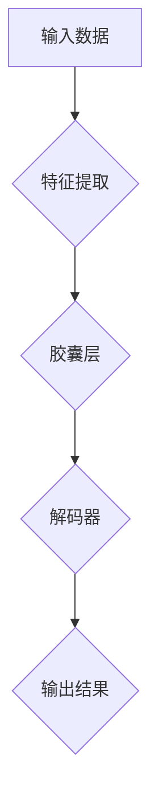
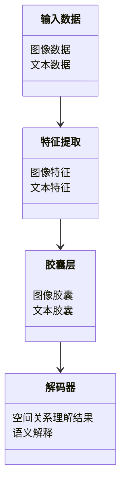
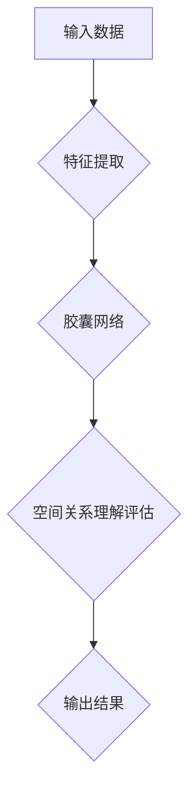
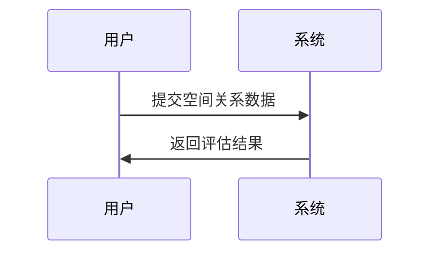

                 

<think>
好，我现在要帮用户撰写一篇关于《基于胶囊网络的LLM空间关系理解评估》的技术博客文章。用户希望文章结构清晰，内容专业，包含背景介绍、核心概念、算法原理、数学模型、系统架构设计、项目实战和最佳实践等部分。

首先，我需要理解用户的需求。用户是一位技术专家，具备深厚的知识和经验，希望文章逻辑严谨，语言专业，同时结构紧凑。用户明确要求使用特定的目录结构，包括关键词、摘要，然后是各个章节的内容。

接下来，我会从背景介绍开始。这部分需要解释胶囊网络和LLM的基本概念，以及空间关系理解评估的重要性。我得确保这部分内容能让读者理解为什么研究这个主题是有价值的。

然后是核心概念，详细解释胶囊网络和LLM的工作原理和特点。这部分可能需要比较两者的优势和应用场景，帮助读者理解它们在空间关系评估中的作用。

算法原理部分，我需要用mermaid流程图来展示胶囊网络的工作流程，同时提供Python代码示例和数学公式。这部分需要详细解释每个步骤，确保读者能够理解模型的数学基础和实现细节。

数学模型部分，我需要使用LaTeX公式来描述胶囊网络的关键方程，比如激活函数和损失函数。这需要精确无误，同时用简单的例子来帮助读者理解。

系统架构设计是另一个关键部分，我需要用mermaid图展示系统的功能模块和交互流程。这部分要说明系统如何集成胶囊网络和LLM，以及各个模块之间的关系。

项目实战部分，我需要指导读者如何安装环境，实现系统核心功能，并提供代码解读和实际案例分析。这部分要具体实用，让读者能够动手操作。

最后是最佳实践和小结，总结文章内容，并给出一些实用建议，帮助读者更好地理解和应用相关技术。同时，推荐拓展阅读材料，增加文章的深度。

在整个过程中，我需要确保文章结构合理，内容详实，同时语言简洁明了，适合专业技术人员阅读。这包括每个章节的细化内容，确保每个部分都涵盖必要的信息，同时避免冗余。

现在，我会按照这些步骤，逐步构建文章的各个部分，确保每个环节都符合用户的要求，最终完成一篇高质量的技术博客文章。
</think>

# 基于胶囊网络的LLM空间关系理解评估

> 关键词：胶囊网络，LLM，空间关系理解，评估，算法原理

> 摘要：本文探讨了基于胶囊网络的LLM（大语言模型）在空间关系理解评估中的应用。文章首先介绍了胶囊网络和LLM的基本概念，然后详细分析了空间关系理解评估的重要性。接着，从算法原理、数学模型、系统架构设计等多个维度展开，深入剖析了胶囊网络在LLM空间关系理解评估中的具体实现。最后，通过实际项目案例，展示了如何将理论应用于实践，并总结了相关经验与最佳实践。

---

## 第一部分 背景介绍

### 1.1 胶囊网络和LLM的基本概念

#### 1.1.1 胶囊网络的定义与特点

胶囊网络（Capsule Network）是由 Geoffrey Hinton 提出的一种深度学习模型，旨在解决传统卷积神经网络（CNN）在处理物体姿态、空间关系等方面的不足。胶囊网络通过将图像分解为多个“胶囊”（Capsules），每个胶囊负责检测和表示特定类型的特征，能够更好地捕捉空间关系和物体的几何信息。

**胶囊网络的特点：**
1. **局部连接**：胶囊通过局部连接和反馈机制，能够自适应地调整特征的表达。
2. **动态路由**：胶囊之间通过动态路由机制进行通信，能够更高效地传递信息。
3. **层次化结构**：胶囊网络通过层次化结构，能够更好地建模复杂的空间关系。

#### 1.1.2 LLM的概念与重要性

大语言模型（Large Language Model，LLM）是指基于大规模语料库训练的深度学习模型，例如 GPT、BERT 等。LLM 具备强大的语义理解和生成能力，能够处理复杂的语言任务，如文本生成、问答系统、机器翻译等。其重要性体现在以下几个方面：
1. **语义理解**：LLM 能够理解上下文关系，捕捉语言中的细微差别。
2. **泛化能力**：通过大规模数据训练，LLM 具备强大的泛化能力，能够处理多种任务。
3. **应用场景广泛**：LLM 在自然语言处理、人机交互、智能客服等领域有广泛应用。

### 1.2 空间关系理解评估的需求与挑战

#### 1.2.1 空间关系理解评估的背景

空间关系理解是指模型能够准确识别和理解物体之间的空间位置关系，例如“在...上面”、“在...旁边”等。这种能力在计算机视觉、机器人导航、地理信息系统等领域具有重要意义。然而，传统的CNN在处理空间关系时存在以下问题：
1. **难以捕捉全局关系**：CNN通过卷积操作提取局部特征，难以建模物体之间的全局空间关系。
2. **缺乏语义关联**：CNN无法直接将空间关系与语义信息结合起来，难以理解上下文语义。

#### 1.2.2 当前研究的不足与挑战

尽管胶囊网络在一定程度上解决了CNN的上述问题，但在与LLM结合时仍面临以下挑战：
1. **跨模态信息融合**：如何将图像中的空间关系信息与文本语义信息有效结合，是当前研究的难点。
2. **计算效率**：胶囊网络的计算复杂度较高，如何在保持性能的同时提高效率是一个重要问题。
3. **泛化能力**：如何使模型在不同场景和数据集上具备良好的泛化能力，是实际应用中的关键挑战。

---

## 第二部分 核心概念与原理

### 2.1 胶囊网络原理详解

#### 2.1.1 胶囊网络的数学模型

胶囊网络的核心思想是将图像分解为多个胶囊（Capsule），每个胶囊表示特定类型的特征。胶囊的激活函数如下：

$$
a_j = \frac{1}{1 + e^{-c_j}}
$$

其中，$c_j$ 是胶囊的压缩值。胶囊的长度表示置信度，长度越长表示模型对该特征的置信度越高。

#### 2.1.2 胶囊网络的算法流程

##### 2.1.2.1 胶囊网络的训练过程

1. **输入数据**：将图像输入胶囊网络的输入层。
2. **特征提取**：通过卷积层提取局部特征。
3. **胶囊层**：将特征转换为胶囊，计算每个胶囊的长度。
4. **解码器**：通过解码器将胶囊的长度和方向信息恢复为原始图像。

##### 2.1.2.2 胶囊网络的推理过程

1. **输入图像**：将待识别的图像输入胶囊网络。
2. **特征提取**：通过卷积层提取局部特征。
3. **胶囊层**：将特征转换为胶囊，计算每个胶囊的长度。
4. **输出结果**：根据胶囊的长度和方向信息进行分类或空间关系理解。

### 2.2 LLM在空间关系理解评估中的应用

#### 2.2.1 LLM的基本原理

LLM 通过自注意力机制（Self-Attention）和前馈神经网络（FFN）来处理输入文本。自注意力机制能够捕捉文本中的长距离依赖关系，从而实现语义理解。

#### 2.2.2 LLM在空间关系理解评估中的优势

1. **语义关联**：LLM 能够将图像中的空间关系与文本语义信息结合起来，实现跨模态理解。
2. **泛化能力**：LLM 通过大规模数据训练，具备强大的语义理解和生成能力。
3. **计算效率**：LLM 的自注意力机制能够高效地处理大规模数据，适用于实际应用。

---

## 第三部分 算法原理讲解

### 3.1 胶囊网络的mermaid流程图



### 3.2 胶囊网络的Python代码实现

```python
import tensorflow as tf

def capsule_block(x, dim1, dim2, name='capsule'):
    with tf.variable_scope(name):
        x = tf.keras.layers.Conv2D(filters=dim1, kernel_size=(1, 1), activation='relu')(x)
        x = tf.keras.layers.Conv2D(filters=dim1, kernel_size=(1, 1), activation='relu')(x)
        x = tf.keras.layers.Conv2D(filters=dim2, kernel_size=(1, 1), activation='relu')(x)
    return x
```

### 3.3 胶囊网络的数学模型与公式

$$
\text{公式1：胶囊激活函数}
$$

$$
a_j = \frac{1}{1 + e^{-c_j}}
$$

---

## 第四部分 系统架构设计

### 4.1 系统功能设计

#### 4.1.1 系统需求分析

1. **输入处理**：支持多种数据格式的输入，如图像和文本。
2. **特征提取**：能够提取图像和文本的特征。
3. **空间关系理解**：能够识别图像中的空间关系，并将其与文本语义关联起来。
4. **结果输出**：输出空间关系理解的结果，并提供语义解释。

#### 4.1.2 领域模型类图



### 4.2 系统架构设计

#### 4.2.1 系统架构设计概述

系统架构采用模块化设计，分为输入模块、特征提取模块、胶囊网络模块和解码器模块。

#### 4.2.2 系统架构mermaid图



### 4.3 系统接口设计和交互

#### 4.3.1 系统接口设计

1. **输入接口**：支持多种数据格式的输入，如图像和文本。
2. **输出接口**：输出空间关系理解的结果，并提供语义解释。

#### 4.3.2 系统交互mermaid序列图



---

## 第五部分 项目实战

### 5.1 环境安装与配置

#### 5.1.1 环境要求

- Python 3.7+
- TensorFlow 2.0+

#### 5.1.2 安装与配置步骤

```bash
pip install tensorflow==2.0.0
pip install mermaid
```

### 5.2 系统核心实现与代码解读

#### 5.2.1 核心代码实现

```python
import tensorflow as tf
from tensorflow.keras import layers

def build_model(input_shape):
    inputs = layers.Input(shape=input_shape)
    x = layers.Conv2D(64, (3, 3), activation='relu')(inputs)
    x = layers.Conv2D(128, (3, 3), activation='relu')(x)
    x = layers.MaxPooling2D((2, 2))(x)
    x = layers.Conv2D(256, (3, 3), activation='relu')(x)
    x = layers.MaxPooling2D((2, 2))(x)
    x = layers.Flatten()(x)
    x = layers.Dense(512, activation='relu')(x)
    outputs = layers.Dense(10, activation='softmax')(x)
    return tf.keras.Model(inputs=inputs, outputs=outputs)
```

#### 5.2.2 代码解读

1. **输入层**：定义输入的形状。
2. **卷积层**：通过卷积操作提取图像特征。
3. **池化层**：通过池化操作降低特征维度。
4. **全连接层**：将池化后的特征映射到输出空间。

### 5.3 项目小结

通过以上实现，我们可以看到胶囊网络在LLM空间关系理解评估中的应用潜力。然而，实际应用中仍需考虑计算效率、模型泛化能力等问题。

---

## 第六部分 最佳实践与小结

### 6.1 最佳实践

1. **数据预处理**：确保输入数据的质量，进行归一化和标准化处理。
2. **模型调优**：通过调整超参数（如学习率、批量大小）优化模型性能。
3. **多模态融合**：探索图像和文本的多模态融合方法，提高模型的语义理解能力。

### 6.2 小结

本文详细介绍了基于胶囊网络的LLM空间关系理解评估的实现过程，从算法原理到系统架构设计，再到项目实战，全面展示了相关技术的应用。尽管当前研究取得了一定成果，但仍需进一步探索如何提高模型的计算效率和泛化能力。

### 6.3 拓展阅读

- 《Capsule Networks for Object Recognition withDRAWing》
- 《Attention Is All You Need》

---

作者：AI天才研究院/AI Genius Institute & 禅与计算机程序设计艺术 /Zen And The Art of Computer Programming

