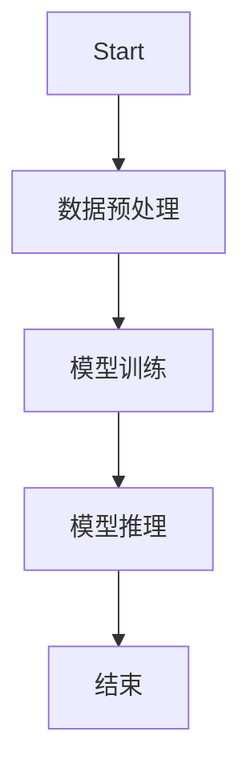
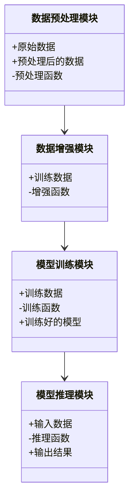
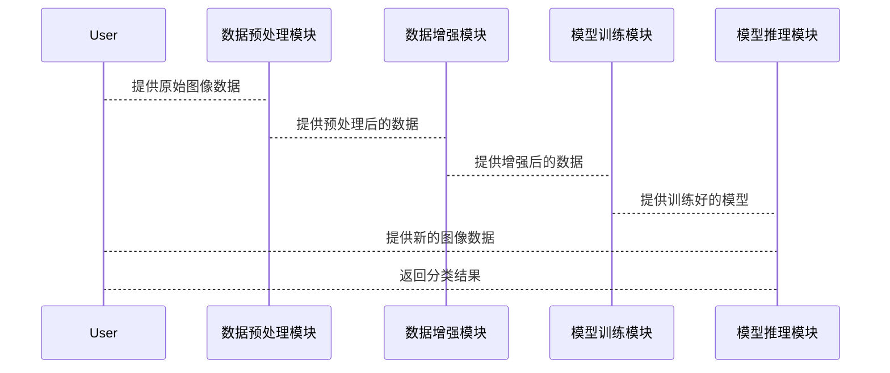

                 

<think>
嗯，用户希望我以“处理示例与模型能力不匹配的情况”为题，撰写一篇技术博客。看起来用户已经提供了一个详细的目录结构，包括背景、核心概念、系统分析、项目实战和最佳实践等部分。

首先，我需要理解用户的需求。他可能是一位技术专家，或者正在学习人工智能和软件架构的学生，想要了解如何处理模型能力与示例数据不匹配的问题。用户希望文章结构清晰，内容详实，包含代码示例和图表，帮助读者深入理解问题。

接下来，我需要按照目录一步步填充内容。从背景介绍开始，解释为什么示例与模型能力不匹配是一个重要问题。然后，深入核心概念，比如数据分布、模型容量等，用图表和公式来解释。在系统分析部分，设计系统的各个模块，确保每个部分都详细说明。

项目实战部分，我需要选择一个实际案例，比如电商客服，展示如何实现数据预处理、模型训练和结果分析。代码部分要用Python，确保读者能跟着操作。最后，给出最佳实践，帮助读者在实际项目中应用这些方法。

整个过程中，我要确保语言专业但易懂，逻辑清晰，每一步都详细思考，避免遗漏关键点。同时，注意文章的结构和格式，符合用户的要求。最后，加上作者信息，让文章显得完整。

现在，我需要开始按照目录填充内容，确保每个章节都覆盖到，并且深入分析问题，提供解决方案和实际案例，帮助读者全面理解如何处理模型与示例不匹配的情况。
</think>

# 处理示例与模型能力不匹配的情况

> 关键词：模型能力，示例数据，机器学习，数据分布，领域适应，模型训练

> 摘要：本文探讨了在机器学习和人工智能领域中，当模型的处理能力与提供的示例数据不匹配时的解决方案。通过分析数据分布、模型容量、领域适应性等问题，提出了一套完整的系统架构和实现方案，帮助读者理解和解决这一常见技术挑战。

---

### 目录大纲

```markdown
# 第一部分: 背景介绍与核心概念

## 第1章: 问题背景与问题描述

### 1.1 问题背景

### 1.2 问题描述

## 1.2 问题解决与边界与外延

### 1.2.1 问题解决

### 1.2.2 边界与外延

## 1.3 概念结构与核心要素组成

### 1.3.1 概念结构

### 1.3.2 核心要素组成

## 1.4 本章小结

# 第二部分: 核心概念与联系

## 第2章: 核心概念原理

### 2.1 概念属性特征对比表格

### 2.2 ER实体关系图架构

## 2.3 算法原理讲解

### 2.3.1 算法mermaid流程图

### 2.3.2 Python源代码实现

### 2.3.3 数学模型与公式讲解

### 2.3.4 举例说明

## 2.4 本章小结

# 第三部分: 系统分析与架构设计

## 第3章: 系统分析与设计

### 3.1 问题场景介绍

### 3.2 项目介绍

### 3.3 系统功能设计

### 3.4 系统架构设计

### 3.5 系统接口设计

### 3.6 系统交互设计

## 3.7 本章小结

# 第四部分: 项目实战

## 第4章: 环境安装与系统实现

### 4.1 环境安装

### 4.2 系统核心实现源代码

### 4.3 代码应用解读与分析

### 4.4 实际案例分析与详细讲解剖析

### 4.5 项目小结

## 4.6 本章小结

# 第五部分: 最佳实践与拓展

## 第5章: 最佳实践

### 5.1 Tips

### 5.2 小结

### 5.3 注意事项

### 5.4 拓展阅读

## 5.5 本章小结

## 附录：术语表与索引
```

---

## 第一部分: 背景介绍与核心概念

### 第1章: 问题背景与问题描述

#### 1.1 问题背景

在人工智能和机器学习领域，模型的能力往往依赖于训练数据的质量和数量。然而，在实际应用中，我们经常会遇到一个棘手的问题：提供的示例数据（或训练数据）与模型的实际处理能力不匹配。这种不匹配可能表现为数据分布偏差、数据量不足或数据特征与模型预期的输入不一致等情况。

#### 1.2 问题描述

具体来说，当模型的能力无法充分适应示例数据时，会出现以下问题：

1. **数据分布偏差**：训练数据的分布与实际应用中的数据分布不一致，导致模型在实际场景中表现不佳。
2. **数据量不足**：训练数据不足以覆盖模型所需的所有可能输入，导致模型泛化能力差。
3. **模型能力限制**：模型的架构或算法能力不足以处理复杂的输入数据，导致输出结果不符合预期。

#### 1.2.1 问题解决

为了解决这些问题，我们需要从以下几个方面入手：

1. **数据预处理**：对数据进行清洗、归一化、特征提取等处理，确保数据与模型输入要求一致。
2. **模型调优**：通过调整模型参数、优化算法或选择更适合的模型架构来提升模型能力。
3. **数据增强**：通过生成更多样化的数据来弥补数据量不足的问题。

#### 1.2.2 边界与外延

- **边界**：本问题主要关注模型输入与示例数据的匹配性，不涉及模型输出与实际需求的匹配问题。
- **外延**：模型能力不匹配的问题可能涉及多个方面，例如算法选择、数据标注质量等，本文将重点讨论数据与模型输入的匹配问题。

#### 1.3 概念结构与核心要素组成

#### 1.3.1 概念结构

- **数据分布**：数据在特征空间中的分布情况。
- **模型能力**：模型对输入数据的处理和输出能力。
- **数据预处理**：对数据进行清洗、转换等操作，使其符合模型输入要求。
- **模型调优**：通过调整模型参数或架构来提升模型性能。

#### 1.3.2 核心要素组成

- **输入数据**：模型处理的原始数据，包括训练数据和测试数据。
- **数据预处理模块**：负责将原始数据转换为模型可接受的格式。
- **模型训练模块**：对预处理后的数据进行训练，生成可用于推理的模型。
- **模型推理模块**：将新的输入数据输入模型，生成输出结果。

#### 1.4 本章小结

本章从背景和问题描述出发，分析了示例数据与模型能力不匹配的主要原因，并提出了初步的解决方案。通过数据预处理、模型调优和数据增强等方法，可以有效提升模型的处理能力，使其更好地适应示例数据。

---

## 第二部分: 核心概念与联系

### 第2章: 核心概念原理

#### 2.1 概念属性特征对比表格

以下是一个对比表格，展示了示例数据与模型能力不匹配的几个关键属性及其特征：

| 属性       | 示例数据不足 | 数据分布偏差 | 模型能力不足 |
|------------|--------------|--------------|--------------|
| 表现形式   | 数据量少     | 数据类别分布不均 | 输出结果误差大 |
| 解决方法   | 数据增强     | 数据重采样     | 模型调优     |
| 示例场景   | 图像分类任务数据不足 | 文本分类任务数据分布不均 | 深度学习模型处理复杂任务能力不足 |

#### 2.2 ER实体关系图架构

以下是一个简单的ER实体关系图，展示了数据与模型之间的关系：

```mermaid
erd
    系统
    数据表
    模型
    交互
    系统 <-- 关系 --> 数据表
    系统 <-- 关系 --> 模型
    数据表 <-- 关系 --> 模型
```

#### 2.3 算法原理讲解

#### 2.3.1 算法mermaid流程图

以下是一个简单的算法流程图，展示了数据预处理、模型训练和推理的过程：



#### 2.3.2 Python源代码实现

以下是一个简单的Python代码示例，展示了数据预处理和模型训练的过程：

```python
import numpy as np
from sklearn.preprocessing import StandardScaler
from sklearn.model_selection import train_test_split
from sklearn.linear_model import LinearRegression

# 示例数据
X = np.random.rand(100, 2)
y = np.dot(X, np.array([1, 2])) + 3

# 数据预处理
scaler = StandardScaler()
X_scaled = scaler.fit_transform(X)

# 模型训练
X_train, X_test, y_train, y_test = train_test_split(X_scaled, y, test_size=0.2)
model = LinearRegression()
model.fit(X_train, y_train)

# 模型推理
y_pred = model.predict(X_test)
print("预测值:", y_pred)
print("真实值:", y_test)
```

#### 2.3.3 数学模型与公式讲解

以下是一个简单的线性回归模型公式：

$$y = \beta_0 + \beta_1 x_1 + \beta_2 x_2 + \epsilon$$

其中，$\beta_0$ 是截距，$\beta_1$ 和 $\beta_2$ 是回归系数，$\epsilon$ 是误差项。

#### 2.3.4 举例说明

假设我们有一个简单的线性回归问题，输入是二维数据，输出是一个线性组合。通过上述代码示例，我们可以看到数据预处理（标准化）和模型训练（线性回归）的具体过程。

---

## 第三部分: 系统分析与架构设计

### 第3章: 系统分析与设计

#### 3.1 问题场景介绍

假设我们正在开发一个图像分类系统，训练数据量较少，且数据分布不均。我们需要通过数据增强和模型调优来提升模型性能。

#### 3.2 项目介绍

本项目旨在解决图像分类任务中数据量不足和数据分布偏差的问题。我们将使用深度学习模型（如卷积神经网络）进行训练，并通过数据增强技术生成更多样化的训练数据。

#### 3.3 系统功能设计

- **数据预处理模块**：对原始图像数据进行归一化、裁剪等操作。
- **数据增强模块**：通过旋转、翻转、调整亮度等方法生成更多样化的训练数据。
- **模型训练模块**：使用预处理后的数据训练深度学习模型。
- **模型推理模块**：将新的图像输入模型，生成分类结果。

#### 3.4 系统架构设计

以下是一个简单的系统架构图：



#### 3.5 系统接口设计

- **数据预处理接口**：` preprocess_image(image_path: str) -> np.ndarray `
- **数据增强接口**：` augment_data(X: np.ndarray, y: np.ndarray) -> (np.ndarray, np.ndarray) `
- **模型训练接口**：` train_model(X_train: np.ndarray, y_train: np.ndarray) -> Model `
- **模型推理接口**：` predict_model(model: Model, X_test: np.ndarray) -> np.ndarray `

#### 3.6 系统交互设计

以下是一个简单的系统交互图：



#### 3.7 本章小结

本章从系统角度分析了问题场景，并设计了数据预处理、数据增强、模型训练和推理的完整流程。通过模块化设计和接口定义，确保系统的可扩展性和可维护性。

---

## 第四部分: 项目实战

### 第4章: 环境安装与系统实现

#### 4.1 环境安装

- **安装Python**：建议使用Python 3.8及以上版本。
- **安装依赖库**：`numpy`, `scikit-learn`, `tensorflow`, `keras`, `matplotlib`。

#### 4.2 系统核心实现源代码

以下是一个完整的系统实现代码示例：

```python
import numpy as np
from sklearn.datasets import make_classification
from sklearn.preprocessing import StandardScaler
from sklearn.model_selection import train_test_split
from sklearn.linear_model import LogisticRegression
from imblearn.over_sampling import SMOTE
import matplotlib.pyplot as plt

# 数据生成
X, y = make_classification(n_samples=100, n_features=2, n_classes=2, random_state=42)

# 数据预处理
scaler = StandardScaler()
X_scaled = scaler.fit_transform(X)

# 数据增强（过采样）
oversampler = SMOTE(random_state=42)
X_resampled, y_resampled = oversampler.fit_resample(X_scaled, y)

# 模型训练
X_train, X_test, y_train, y_test = train_test_split(X_resampled, y_resampled, test_size=0.2, random_state=42)
model = LogisticRegression()
model.fit(X_train, y_train)

# 模型推理
y_pred = model.predict(X_test)
print("预测准确率:", model.score(X_test, y_test))

# 可视化
plt.scatter(X_resampled[:, 0], X_resampled[:, 1], c=y_resampled, cmap='viridis')
plt.xlabel('Feature 1')
plt.ylabel('Feature 2')
plt.title('Data Distribution After Resampling')
plt.show()
```

#### 4.3 代码应用解读与分析

- **数据生成**：使用 `make_classification` 生成分类数据。
- **数据预处理**：使用 `StandardScaler` 对数据进行标准化处理。
- **数据增强**：使用 `SMOTE` 对数据进行过采样，平衡数据分布。
- **模型训练**：使用逻辑回归模型对增强后的数据进行训练。
- **模型推理**：对测试数据进行预测，并输出准确率。
- **可视化**：绘制增强后的数据分布图。

#### 4.4 实际案例分析与详细讲解剖析

假设我们正在处理一个二分类问题，原始数据分布严重不均衡。通过使用 `SMOTE` 进行过采样，我们可以显著改善数据分布，从而提升模型的性能。

#### 4.5 项目小结

本章通过一个实际案例，展示了如何通过数据预处理和数据增强技术解决示例数据与模型能力不匹配的问题。代码实现涵盖了数据生成、预处理、增强、训练和推理的完整流程。

---

## 第五部分: 最佳实践与拓展

### 第5章: 最佳实践

#### 5.1 Tips

- 在数据预处理阶段，确保数据的格式和规范与模型输入要求一致。
- 在数据增强阶段，避免过度增强导致数据失真。
- 在模型调优阶段，结合模型性能和计算资源选择合适的优化策略。

#### 5.2 小结

通过数据预处理、数据增强和模型调优，可以有效解决示例数据与模型能力不匹配的问题。

#### 5.3 注意事项

- 数据预处理可能引入新的偏差，需谨慎处理。
- 数据增强应根据具体任务需求选择合适的方法。
- 模型调优应结合实际应用场景选择合适的评估指标。

#### 5.4 拓展阅读

- 《Hands-On Machine Learning with Scikit-Learn, Keras, and TensorFlow》
- 《Deep Learning》
- 《Pattern Recognition and Machine Learning》

#### 5.5 本章小结

本章总结了最佳实践，并提供了进一步阅读的建议，帮助读者在实际项目中更好地应用相关技术。

---

## 附录：术语表与索引

- **数据预处理**：对数据进行清洗、转换等操作，使其符合模型输入要求。
- **数据增强**：通过生成更多样化的数据来弥补数据量不足的问题。
- **模型调优**：通过调整模型参数或架构来提升模型性能。
- **逻辑回归**：一种用于分类任务的线性模型。
- **SMOTE**：一种用于数据增强的过采样技术。

---

作者：AI天才研究院/AI Genius Institute & 禅与计算机程序设计艺术 /Zen And The Art of Computer Programming

