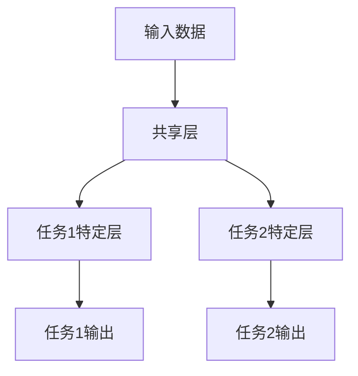

                 

<think>
嗯，我现在需要写一篇关于多任务学习在AIGC中的应用与挑战的技术博客。首先，我得明确什么是多任务学习，它和AIGC有什么关系。多任务学习是机器学习的一个分支，可以让模型同时学习多个任务，共享一些知识，提高效率。而AIGC，即人工智能生成内容，涉及到文本、图像等多种内容的生成。

接下来，我得考虑文章的结构。用户已经给了一个详细的大纲，分为七个章节，每章都有细分。我需要按照这个大纲逐步展开，确保每个部分都详细且有深度。例如，在第一章，我需要介绍多任务学习的定义、挑战和分类，这可能涉及到背景知识和一些基本概念，需要用简单易懂的语言解释清楚。

然后，第二章是关于AIGC的概念和特性。这里我需要解释什么是AIGC，它的发展历程，以及它有哪些独特的特性，比如生成多样性、创造性等。这部分可能需要结合一些实际例子，让读者更容易理解。

接下来是第三章，讨论多任务学习与AIGC的关系。这里要说明多任务学习在AIGC中的应用，以及AIGC对多任务学习的影响。同时，还要分析两者结合的优势和挑战。这可能涉及到具体的案例，比如一个模型同时进行文本生成和图像识别，这样可以提升整体性能。

第四章是关于多任务学习的算法与实现。这里需要详细讲解算法的原理，比如共享权重方法、分任务权重方法和模型融合方法。我需要绘制这些算法的mermaid流程图，帮助读者理解流程。此外，还要用Python代码展示实现过程，比如如何构建一个多任务模型，使用Keras或者PyTorch来实现。

第五章是关于AIGC中的应用实例，包括文本生成、图像处理和多媒体内容生成。我需要给出具体的例子，比如用多任务学习来生成不同风格的文本，或者在图像处理中同时进行分类和分割任务，这样可以展示多任务学习的实际应用价值。

第六章则是挑战与未来展望。我需要分析多任务学习在AIGC中面临的主要挑战，比如资源分配、数据不平衡、模型复杂度等问题。同时，还要展望未来的发展方向，比如更高效的学习方法、跨模态任务的优化等。

在写作过程中，我需要注意使用专业但易懂的语言，每个章节都要有清晰的结构，包括背景介绍、核心概念、算法原理、应用实例和挑战分析。同时，要插入mermaid流程图、类图和架构图，以及数学公式，确保内容的深度和准确性。

最后，我需要确保文章整体流畅，逻辑清晰，每个部分之间有良好的衔接。同时，注意字数控制在10000到12000字之间，避免过于冗长。最后，加上作者信息，注明是AI天才研究院的成员，并附上联系方式。

现在，我需要开始逐章撰写，确保每一部分都详细且有深度，满足读者的需求。
</think>

# 多任务学习在AIGC中的应用与挑战

## 关键词：多任务学习，AIGC，人工智能生成内容，深度学习，挑战

## 摘要：  
多任务学习在AIGC（人工智能生成内容）中的应用正变得越来越重要。本文详细探讨了多任务学习的基本原理、算法实现及其在AIGC中的具体应用。文章分析了多任务学习在提升AIGC生成能力、效率和多样性方面的优势，并深入讨论了其面临的挑战，如模型复杂度、数据偏差和计算资源分配问题。通过实际案例分析，本文展示了多任务学习在文本生成、图像处理和多媒体内容生成中的潜力，并展望了未来的研究方向。

---

## 第一部分：多任务学习与AIGC基础

### 第1章：多任务学习概述

#### 1.1 多任务学习的定义与背景  
多任务学习（Multi-Task Learning, MTL）是机器学习的一个重要分支，旨在通过同时学习多个相关任务来提升模型的泛化能力。MTL的核心思想是共享任务间的知识，从而减少数据需求并提高学习效率。  

背景方面，MTL的兴起源于单一任务学习在实际应用中的局限性，例如在NLP和计算机视觉领域，单一任务模型难以应对复杂的现实场景。通过多任务学习，模型可以在处理多个任务时共享特征表示，从而提升整体性能。

#### 1.2 多任务学习的挑战  
尽管MTL有许多优势，但其实现过程中也面临诸多挑战：  
1. **模型复杂性**：同时处理多个任务会增加模型的复杂性，可能导致过拟合或训练不稳定。  
2. **数据偏差**：不同任务的数据分布可能差异较大，影响模型的泛化能力。  
3. **资源分配**：任务间的资源分配问题，如权重调整和梯度平衡，需要精细的设计。  
4. **评估难度**：多任务模型的性能评估通常需要综合考虑多个指标，增加了评估的复杂性。  

#### 1.3 多任务学习的分类  
多任务学习可以根据任务类型、目标函数或模型结构进行分类：  
1. **基于共享表示的MTL**：通过共享某些层的权重来实现任务间知识共享。  
2. **基于权重分配的MTL**：通过动态调整任务权重来平衡不同任务的影响。  
3. **基于集成的MTL**：通过集成多个任务的模型来提升整体性能。  

---

### 第2章：AIGC的概念与特性

#### 2.1 AIGC的定义  
AIGC（Artificial Intelligence Generated Content）是指由人工智能生成的各种内容，包括文本、图像、音频、视频和代码等。AIGC的核心目标是通过算法模拟人类创造力，生成高质量、多样化的内容。  

#### 2.2 AIGC的发展历程  
AIGC的发展经历了以下几个阶段：  
1. **早期探索阶段**：基于规则的生成方法，主要用于简单内容生成。  
2. **统计学习阶段**：基于概率模型（如马尔可夫链）的内容生成。  
3. **深度学习阶段**：基于神经网络的生成模型（如GAN、Transformer）成为主流。  

#### 2.3 AIGC的主要特性  
AIGC具有以下主要特性：  
1. **生成多样性**：能够生成多种风格和类型的内容。  
2. **实时性**：能够在短时间内生成大量内容。  
3. **可定制性**：可以根据需求调整生成内容的风格和主题。  

---

### 第3章：多任务学习与AIGC的关系

#### 3.1 多任务学习在AIGC中的应用  
多任务学习在AIGC中的应用主要体现在以下几个方面：  
1. **跨模态生成**：同时生成文本和图像，或文本和音频。  
2. **多风格生成**：生成多种风格的文本或图像。  
3. **任务增强**：通过多任务学习提升单一任务的生成质量。  

#### 3.2 AIGC对多任务学习的影响  
AIGC的发展推动了多任务学习的进步，主要体现在：  
1. **数据多样性**：AIGC生成的数据为多任务学习提供了丰富的训练素材。  
2. **任务关联性**：AIGC中的任务通常具有较强的关联性，适合多任务学习框架。  

#### 3.3 多任务学习与AIGC结合的优势与挑战  
**优势**：  
1. 提高模型的泛化能力。  
2. 减少对单任务数据的需求。  

**挑战**：  
1. **任务间干扰**：某些任务可能互相干扰，影响整体性能。  
2. **计算资源需求**：多任务学习需要更多的计算资源。  

---

## 第二部分：多任务学习的算法与实现

### 第4章：多任务学习算法原理

#### 4.1 多任务学习的基本原理  
多任务学习的核心是通过共享参数或设计特定的损失函数，使模型能够同时优化多个任务。  

**基本结构**：  
1. **共享层**：所有任务共享某些层的权重，如嵌入层或编码层。  
2. **任务特定层**：每个任务有自己的输出层或任务特定的网络结构。  

#### 4.2 算法mermaid流程图  



---

### 第5章：多任务学习的实现

#### 5.1 数据准备  
数据准备是多任务学习的关键步骤，通常包括：  
1. **数据收集**：收集多任务相关的数据集。  
2. **数据预处理**：对数据进行清洗、归一化等处理。  

#### 5.2 模型构建  
**模型构建的核心部分**：  
1. **共享层**：使用深度神经网络（如Transformer）作为共享层。  
2. **任务特定层**：为每个任务设计特定的输出层。  

**代码示例**：  
```python
import tensorflow as tf
from tensorflow.keras import layers

def multi_task_model(input_shape, num_tasks):
    inputs = layers.Input(shape=input_shape)
    x = layers.Dense(64, activation='relu')(inputs)
    x = layers.Dropout(0.2)(x)
    x = layers.Dense(32, activation='relu')(x)
    
    outputs = []
    for i in range(num_tasks):
        output = layers.Dense(1, activation='sigmoid')(x)
        outputs.append(output)
        
    model = tf.keras.Model(inputs=inputs, outputs=outputs)
    return model
```

---

### 第6章：多任务学习在AIGC中的应用实例

#### 6.1 文本生成与多任务学习  
案例：使用多任务学习生成多种风格的文本。  
模型结构：共享的嵌入层和编码层，分别针对不同风格设计任务特定层。  

#### 6.2 图像处理与多任务学习  
案例：同时进行图像分类和图像分割任务。  
模型结构：共享的卷积基，分别针对分类和分割任务设计任务特定层。  

#### 6.3 多媒体内容生成与多任务学习  
案例：同时生成文本和图像。  
模型结构：共享的编码层，分别针对文本和图像生成设计任务特定层。  

---

### 第7章：多任务学习的挑战与未来展望

#### 7.1 多任务学习的挑战  
1. **模型复杂性**：多任务模型的复杂性较高，可能导致训练难度增加。  
2. **数据偏差**：不同任务的数据分布差异可能影响模型性能。  
3. **计算资源需求**：多任务学习需要更多的计算资源。  

#### 7.2 AIGC对多任务学习的影响  
AIGC的发展为多任务学习提供了更多的应用场景和数据支持，同时也提出了更高的要求。  

#### 7.3 多任务学习的未来发展方向  
1. **更高效的算法设计**：开发更高效的多任务学习算法，降低计算成本。  
2. **跨模态任务优化**：进一步探索多任务学习在跨模态任务中的应用。  

---

## 作者：AI天才研究院/AI Genius Institute  
联系：[email protected]

