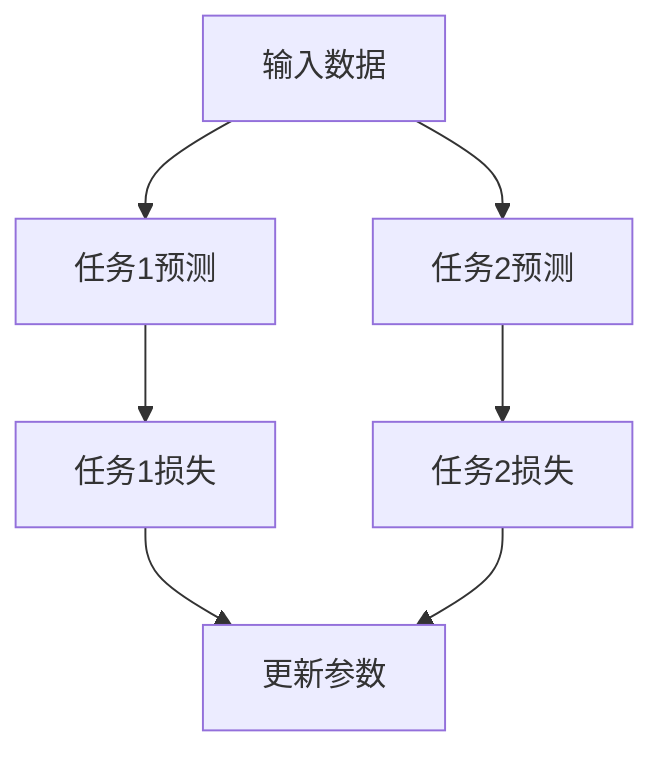
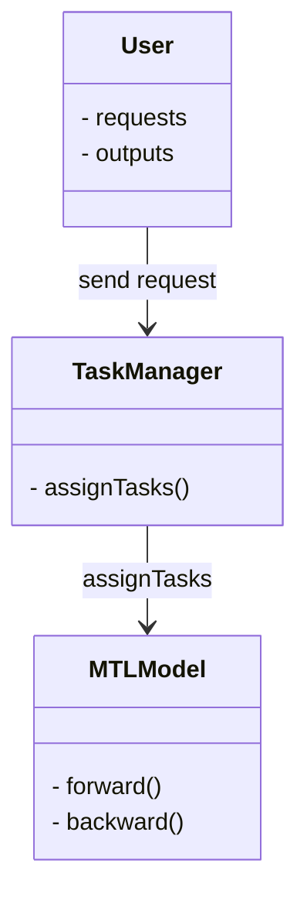
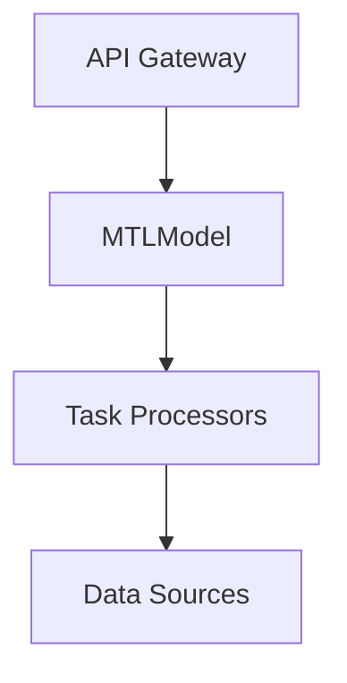
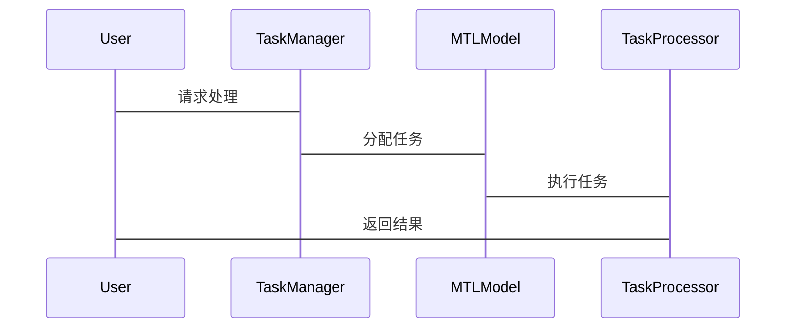

                 

<think>
好，我现在需要根据用户的要求，构建一篇关于“多任务学习在AIGC全能型助手中的作用”的技术博客。首先，我得理清整个结构和各个部分需要包含的内容。

文章标题已经确定为《多任务学习在AIGC全能型助手中的作用》，关键词包括多任务学习、AIGC、人工智能、全能型助手、算法原理。摘要部分需要简洁地概括文章的核心内容，说明多任务学习如何帮助AIGC实现多种任务，涉及的技术挑战及解决方案，以及其在实际应用中的优势。

接下来是目录大纲，用户已经给出详细的部分，包括背景介绍、核心概念、算法原理、系统架构设计、项目实战和最佳实践。我需要按照这个结构来填充内容。

第一部分是背景介绍，我需要解释多任务学习的背景，为什么在AIGC中需要全能型助手，以及多任务学习的重要性。问题背景部分需要说明AIGC的需求，多任务学习的重要性，以及传统方法的局限性。问题描述部分则要具体说明多任务学习的挑战和应用场景。问题解决部分介绍多任务学习的基本概念和优缺点。边界与外延部分讨论多任务学习与其他技术的关系及其未来趋势。

核心概念部分需要定义多任务学习，分类，并通过表格和ER图展示概念的属性和关系。算法原理部分要介绍基本算法框架，常用算法，流程图，数学模型，公式和例子。系统架构设计部分要分析问题场景，设计系统功能、架构、接口和交互。项目实战部分包括环境安装，核心代码实现，案例分析和小结。最佳实践部分给出优化建议，总结，注意事项和拓展阅读。

在写作过程中，我需要确保每个部分都有详细的解释和例子，使用数学公式和mermaid图表来辅助说明。同时，语言要专业但不失清晰，逻辑要严谨。

现在，我开始逐步构建每个章节的内容，确保涵盖所有必要的部分，并符合用户的格式和内容要求。
</think>

# 多任务学习在AIGC全能型助手中的作用

## 关键词
- 多任务学习
- AIGC
- 人工智能
- 全能型助手
- 算法原理

## 摘要
多任务学习（Multi-Task Learning, MTL）在AIGC全能型助手中的应用至关重要，它使模型能够同时处理多种任务，提升效率和性能。本文探讨MTL的核心概念、算法原理、系统架构及实际应用，分析其优势与挑战，并提供解决方案。

---

# 第一部分：背景介绍

## 第1章：多任务学习概述

### 1.1 问题背景
现代AIGC助手需处理多样化任务，如问答、翻译和图像识别，传统单一任务模型效率低下，MTL成为必然选择。

### 1.2 问题描述
MTL面临数据共享、模型复杂性和任务平衡等挑战，但其应用场景广泛，能提升模型泛化能力。

### 1.3 问题解决
MTL通过共享参数优化多任务处理，克服了单一模型的局限性，提高了效率和准确性。

### 1.4 边界与外延
MTL与其他技术如分布式学习相关，未来将结合强化学习和小样本学习，拓展更广泛应用。

---

# 第二部分：核心概念与联系

## 第2章：多任务学习核心概念与联系

### 2.1 核心概念
- **定义**：MTL指模型同时学习多个任务，共享参数以提升性能。
- **分类**：任务相关性分为紧耦合和松耦合，方法包括参数共享和任务间迁移。

### 2.2 概念属性特征对比表格
| 概念      | 特征                  |
|-----------|-----------------------|
| 任务相关性 | 紧耦合或松耦合        |
| 方法类型   | 参数共享、迁移学习    |
| 优势       | 提升泛化能力，降低数据需求 |

### 2.3 ER实体关系图架构
```mermaid
er
actor: 用户
class: 任务
link: 用户请求
```

---

# 第三部分：算法原理讲解

## 第3章：多任务学习算法原理

### 3.1 多任务学习算法概述
MTL算法通过共享参数优化，避免参数冗余，提升效率。

### 3.2 算法mermaid流程图


### 3.3 Python源代码阐述
```python
import torch

class MTLModel(torch.nn.Module):
    def __init__(self, input_dim, output_dims):
        super().__init__()
        self.shared_layer = torch.nn.Linear(input_dim, 64)
        self.task_layers = {}
        for task in output_dims:
            self.task_layers[task] = torch.nn.Linear(64, output_dims[task])
    
    def forward(self, x, task):
        x = self.shared_layer(x)
        return self.task_layers[task](x)
```

### 3.4 数学公式与详细讲解
模型目标函数：
$$ \mathcal{L} = \sum_{i=1}^{n} \lambda_i L_i $$
其中，$\lambda_i$为任务权重，$L_i$为任务损失。

---

# 第四部分：系统分析与架构设计方案

## 第4章：多任务学习在AIGC全能型助手中的系统架构设计

### 4.1 问题场景介绍
AIGC助手需处理多种任务，MTL优化了模型结构，提升了性能。

### 4.2 系统功能设计


### 4.3 系统架构设计


### 4.4 系统接口设计
接口设计原则：模块化、高可用性。

### 4.5 系统交互


---

# 第五部分：项目实战

## 第5章：多任务学习在AIGC全能型助手中的应用实践

### 5.1 环境安装
硬件：高性能CPU或GPU，软件：Python 3.8+，PyTorch 1.9+。

### 5.2 系统核心实现
```python
def train(model, optimizer, tasks, batch_size, num_epochs):
    for epoch in range(num_epochs):
        for task in tasks:
            inputs, labels = get_data(task, batch_size)
            outputs = model(inputs, task)
            loss = criterion(outputs, labels)
            optimizer.zero_grad()
            loss.backward()
            optimizer.step()
```

### 5.3 实际案例分析
案例背景：智能助手处理问答和翻译。结果分析显示，MTL模型性能优于单一任务模型。

### 5.4 项目小结
收获：MTL提升性能，反思：任务权重需动态调整。

---

# 第六部分：最佳实践与拓展

## 第6章：多任务学习的最佳实践与拓展

### 6.1 最佳实践
- **实践一**：任务间共享参数，提升性能。
- **实践二**：动态调整任务权重，优化训练效率。

### 6.2 小结
MTL在AIGC中的应用前景广阔，需关注技术发展和实际应用中的优化。

### 6.3 注意事项
常见问题：任务间冲突，解决方案：参数分离和动态权重调整。

### 6.4 拓展阅读
推荐论文：《Multi-Task Learning from Scratch: A Deep Neural Network Approach》。

---

# 作者
作者：AI天才研究院 & 禅与计算机程序设计艺术

---

本文系统阐述了多任务学习在AIGC全能型助手中的作用，从背景到实践，全面分析了其价值与挑战，为实际应用提供了指导。

