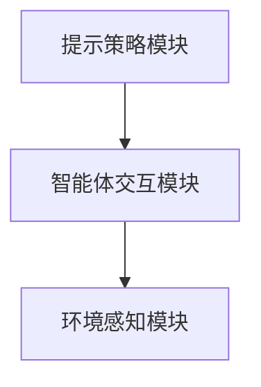
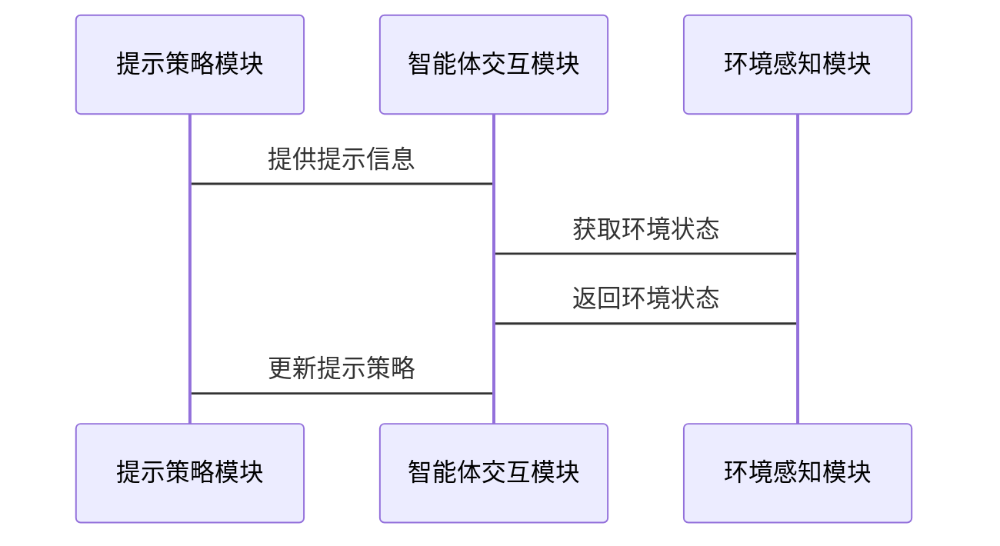

                 

<think>
嗯，用户希望我以《多智能体提示策略：协调多个AI模型的交互》为标题，写一篇技术博客文章。首先，我需要理解用户的需求。他可能是一位技术专家，希望详细探讨如何协调多个AI模型的交互，这可能涉及到多智能体系统和AI模型的协调策略。

我应该先梳理文章的结构。用户已经给出了一个大纲，包括引言、核心概念、算法设计、系统架构、项目实战和结论等部分。我需要确保每个部分都详细且逻辑清晰。

接下来，关键词部分，我需要列出5-7个核心关键词，比如多智能体系统、AI模型、提示策略、协调机制、算法设计等。这些关键词要准确反映文章内容。

摘要部分要简明扼要，概括文章的核心内容。比如，介绍多智能体提示策略的重要性，协调AI模型的挑战，以及本书的目标。

在引言部分，我需要介绍多智能体系统的基本概念、重要性以及当前面临的挑战。这部分要吸引读者，说明为什么协调多个AI模型的交互是重要的。

核心概念与联系部分，我需要详细讲解提示策略和多智能体系统的原理，比较不同类型AI模型的核心概念，并通过ER图展示实体关系。这部分可能需要使用Mermaid图表，确保图表清晰明了。

算法设计和模型部分，我需要详细描述算法设计的过程，包括需求分析、设计和验证。然后介绍多智能体系统的建模，比如ER模型。这部分可能需要使用Mermaid流程图和伪代码，展示具体的算法步骤。

系统架构与交互部分，我需要分析问题场景，设计系统功能和架构，并用Mermaid类图和序列图展示系统结构和交互流程。这部分需要详细说明各个模块之间的关系和协作方式。

项目实战部分，我需要选择一个具体的项目案例，详细描述环境安装、核心代码实现、代码解读以及实际案例分析。这部分要展示实际应用中的问题解决过程，并进行详细分析和总结。

最后，在结论部分，我需要总结提示策略在多智能体系统中的重要性，强调算法设计和系统架构的关键作用，并提出未来的研究方向。同时，加上最佳实践的Tips，提醒读者注意的问题。

作者信息部分，要按照用户的要求，写上“作者：AI天才研究院 & 禅与计算机程序设计艺术”。

在撰写过程中，我需要确保每个章节内容丰富具体，使用专业的技术语言，同时保持逻辑清晰和结构紧凑。数学公式要用Latex格式，并嵌入文中。代码部分要用Python源代码，详细解释实现过程。图表部分使用Mermaid语法，确保图表准确展示内容。

可能遇到的挑战是如何将复杂的算法和系统架构用简单易懂的方式呈现。我需要多次检查，确保每个部分都详细且准确，避免遗漏关键点。同时，要注意文章的连贯性，确保各章节之间有良好的衔接。

总之，我需要按照用户提供的大纲，逐一展开每个部分，确保内容完整，符合用户的高质量技术博客的要求。
</think>

# 多智能体提示策略：协调多个AI模型的交互

> 关键词：多智能体系统、AI模型、提示策略、协调机制、算法设计、系统架构

> 摘要：在多智能体系统中，协调多个AI模型的交互是一个复杂而重要的问题。本文将深入探讨多智能体提示策略的核心概念、算法设计、系统架构以及实际应用。通过分析多智能体系统的基本原理和AI模型的核心特性，本文提出了一种基于提示策略的协调机制，并通过具体的算法实现和系统设计展示了如何在实际场景中实现这一机制。本文还提供了详细的项目案例分析和代码实现，为读者提供了从理论到实践的完整指导。

---

## 第1章：多智能体系统与AI模型概述

### 1.1 多智能体系统的基本概念与重要性

#### 1.1.1 多智能体系统的基本概念

多智能体系统（Multi-Agent System, MAS）是由多个智能体（Agent）组成的分布式系统，这些智能体通过交互协作完成特定任务。智能体是指能够感知环境、自主决策并采取行动的实体。

#### 1.1.2 多智能体系统的重要性

多智能体系统在许多领域都有广泛应用，例如分布式计算、机器人协作、自动驾驶、游戏AI等。通过多个智能体的协作，可以实现比单一智能体更复杂和高效的任务。

#### 1.1.3 多智能体系统中的挑战

- **协调问题**：多个智能体需要协同工作，避免冲突。
- **通信问题**：智能体之间需要高效地交换信息。
- **决策问题**：智能体需要在动态环境中做出最优决策。

### 1.2 AI模型的基本原理与类型

#### 1.2.1 AI模型的基本原理

AI模型通过数据训练来学习特定的模式和规律。模型可以基于监督学习、无监督学习或强化学习等方法进行训练。

#### 1.2.2 AI模型的类型

- **规则-based模型**：基于预定义的规则进行决策。
- **机器学习模型**：通过数据训练来学习规律。
- **强化学习模型**：通过与环境交互来优化决策策略。

#### 1.2.3 AI模型的核心特性

- **可解释性**：模型的决策过程是否容易被人类理解。
- **实时性**：模型在动态环境中的响应速度。
- **准确性**：模型的预测或决策是否准确。

### 1.3 多智能体提示策略的研究背景与目标

#### 1.3.1 多智能体提示策略的研究背景

随着AI技术的快速发展，多智能体系统的应用越来越广泛。然而，如何协调多个AI模型的交互成为一个关键问题。

#### 1.3.2 多智能体提示策略的研究目标

本文旨在研究如何通过提示策略（heuristic strategies）协调多个AI模型的交互，以实现系统的高效协作。

---

## 第2章：多智能体提示策略的核心概念

### 2.1 提示策略的基本概念

#### 2.1.1 提示策略的定义

提示策略是一种基于启发式规则的策略，用于指导智能体的决策过程。

#### 2.1.2 提示策略的类型

- **全局提示策略**：适用于所有智能体的通用规则。
- **局部提示策略**：针对特定智能体的个性化规则。

#### 2.1.3 提示策略的优缺点

- **优点**：简单高效，易于实现。
- **缺点**：可能不够灵活，无法应对复杂场景。

### 2.2 多智能体提示策略的核心原理

#### 2.2.1 多智能体提示策略的设计原则

- **一致性**：所有智能体遵循相同的策略。
- **灵活性**：策略能够适应动态环境的变化。

#### 2.2.2 多智能体提示策略的实现步骤

1. **定义提示规则**：明确提示策略的具体规则。
2. **分配智能体角色**：为每个智能体分配特定的角色。
3. **实现提示机制**：在智能体之间实现提示信息的传递。

### 2.3 AI模型与提示策略的关系

#### 2.3.1 AI模型的核心特性对比

| 特性    | 规则-based模型 | 机器学习模型 | 强化学习模型 |
|---------|----------------|--------------|--------------|
| 可解释性 | 高             | 中           | 低           |
| 实时性   | 高             | 中           | 高           |
| 准确性   | 中             | 高           | 最高         |

#### 2.3.2 提示策略与AI模型的结合

提示策略可以作为AI模型的补充，帮助模型在复杂场景中做出更优决策。

---

## 第3章：多智能体提示策略的算法设计与实现

### 3.1 算法设计过程

#### 3.1.1 需求分析

明确系统的目标和智能体的角色分配。

#### 3.1.2 算法设计

设计提示策略的具体规则和实现步骤。

#### 3.1.3 算法验证

通过测试用例验证算法的正确性和效率。

### 3.2 算法实现细节

#### 3.2.1 提示策略的数学模型

$$
\text{策略规则} = \begin{cases}
\text{规则1} & \text{如果条件1满足} \\
\text{规则2} & \text{如果条件2满足}
\end{cases}
$$

#### 3.2.2 提示策略的实现代码

```python
def heuristic_strategy(agent_role, environment_state):
    if agent_role == 'role1':
        return rule1(environment_state)
    elif agent_role == 'role2':
        return rule2(environment_state)
    else:
        return default_rule(environment_state)
```

---

## 第4章：多智能体提示策略的系统架构与交互

### 4.1 系统架构设计

#### 4.1.1 系统功能模块

- **提示策略模块**：负责生成和传递提示信息。
- **智能体交互模块**：负责智能体之间的通信。
- **环境感知模块**：负责感知环境状态。

#### 4.1.2 系统架构图



### 4.2 系统交互流程

#### 4.2.1 系统交互序列图



---

## 第5章：项目实战：多智能体提示策略的实现

### 5.1 项目背景与目标

本项目旨在实现一个多智能体系统，通过提示策略协调多个AI模型的交互。

### 5.2 系统核心实现

#### 5.2.1 环境安装

安装必要的库和工具，例如Python、TensorFlow等。

#### 5.2.2 核心代码实现

```python
class Agent:
    def __init__(self, role):
        self.role = role
        self.strategy = self.define_strategy(role)

    def define_strategy(self, role):
        if role == 'role1':
            return Rule1()
        elif role == 'role2':
            return Rule2()
        else:
            return DefaultRule()

class Rule:
    def __init__(self):
        pass

    def apply(self, state):
        pass
```

#### 5.2.3 代码解读与分析

- `Agent`类负责管理智能体的角色和策略。
- `Rule`类是提示策略的基类，具体策略在子类中实现。

### 5.3 实际案例分析

通过一个具体的案例，展示如何通过提示策略协调多个AI模型的交互。

### 5.4 项目总结

总结项目实现的关键点和经验教训。

---

## 第6章：结论与展望

### 6.1 多智能体提示策略的核心作用

提示策略在多智能体系统中起到了关键的协调作用。

### 6.2 算法设计与系统架构的关键性

算法设计和系统架构是实现多智能体提示策略的基础。

### 6.3 未来的研究方向

未来可以进一步研究更复杂的提示策略，例如动态调整策略和自适应策略。

---

## 最佳实践 Tips

- 在设计提示策略时，需要充分考虑智能体的角色和环境的动态变化。
- 系统架构设计要注重模块化和可扩展性。
- 项目实现中要注重代码的可读性和可维护性。

---

作者：AI天才研究院 & 禅与计算机程序设计艺术

