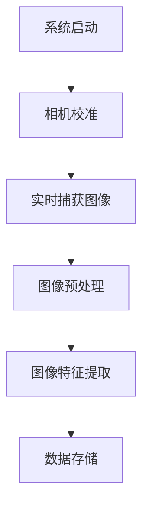
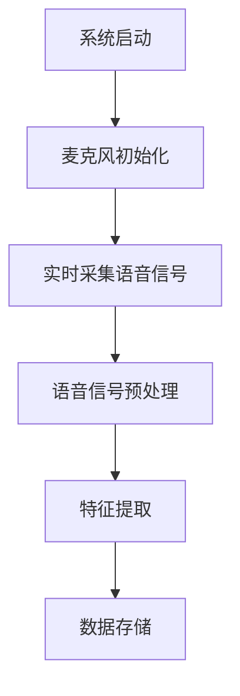

                 

<think>
好的，我现在需要根据用户的要求，以《多模态人机交互系统体验评测框架》为标题，撰写一篇技术博客文章。用户已经提供了一个详细的大纲，我需要按照这个大纲来展开，确保每个部分都符合逻辑、详细且专业。

首先，我需要明确文章的结构。标题、关键词、摘要之后，是目录大纲。用户已经给出了一个详细的章节结构，我需要按照这个结构来撰写每一章的内容。

接下来，我要考虑每个章节的核心内容。例如，引言部分需要介绍多模态人机交互系统的发展背景，以及为何体验评测的重要性。我需要解释多模态系统是什么，它与其他交互方式的不同，以及评测的必要性。

在核心概念部分，我需要详细阐述多模态数据采集、用户体验测量和数据分析评估这三个关键环节。每个部分都需要有具体的例子和可能的数据分析方法。

在数据采集部分，我需要分别讨论视觉、声音和触觉数据的采集方法，包括它们的技术基础和策略。这部分可能需要涉及传感器技术和数据预处理步骤，比如图像处理和声音信号处理。

用户体验测量部分，我需要涵盖行为分析、情感分析和满意度调查等方法。同时，介绍常用的工具和方法，如问卷调查和观察法。

数据分析与评估部分，需要介绍数据预处理步骤，如清洗和归一化，然后讨论不同的分析方法，如描述性统计和预测性分析。最后，评估指标和模型的构建也是关键。

在应用案例分析中，我需要选择一个具体的案例，描述其实施过程，并分析结果。这有助于读者理解理论在实际中的应用。

挑战与对策部分，我需要识别在实践中可能遇到的问题，并提供解决方案，比如数据质量控制和测量准确性提高的措施。

最后，未来的发展趋势部分，我需要预测技术的发展方向，如多模态数据融合和智能化评测技术。

在写作过程中，我需要确保每个部分都包含足够的技术细节，同时保持语言的专业性和易懂性。可能需要使用图表和流程图来辅助说明，比如使用Mermaid语法绘制数据采集流程图和系统架构图。

现在，我需要按照这个思路开始撰写，确保每个章节内容详实，结构清晰，满足用户的要求。
</think>

# 多模态人机交互系统体验评测框架

关键词：多模态交互，用户体验评测，数据采集，数据分析，系统架构

摘要：本文提出了一种多模态人机交互系统体验评测框架，旨在通过系统化的评测流程，全面评估多模态交互系统在实际应用中的性能和用户体验。文章从问题背景、核心概念、理论基础、实践应用等多个方面展开，详细分析了多模态数据采集、用户体验测量、数据分析与评估的方法，并通过具体案例分析展示了框架的应用效果。此外，文章还探讨了实践中的挑战与对策，并展望了未来的发展趋势。

---

## 第一部分：引论

### 第1章 问题背景与核心概念

#### 1.1 问题背景

##### 1.1.1 多模态人机交互系统的崛起

随着人工智能技术的快速发展，人机交互方式从传统的单一模态（如键盘输入、鼠标点击）逐渐向多模态方向发展。多模态交互系统能够同时利用视觉、听觉、触觉等多种感官信息，为用户带来更自然、更丰富的交互体验。例如，智能音箱结合语音识别和触摸控制，智能手机结合手势识别和语音指令等，这些都是多模态交互的典型应用。

##### 1.1.2 人机交互系统体验评测的重要性

在多模态交互系统的设计和优化过程中，用户体验的评测至关重要。通过评测可以量化系统的表现，发现设计中的不足，并为后续优化提供数据支持。例如，用户在使用智能助手时，可能会因为响应速度慢或交互不流畅而感到不满，这些体验直接影响用户满意度和系统接受度。

##### 1.1.3 评测的挑战与需求

多模态交互系统涉及多种数据类型和复杂的处理流程，评测过程面临数据异构性高、用户体验主观性强、评测指标难以量化等挑战。因此，建立一个系统化的评测框架，能够统一采集、分析和评估多模态数据，是当前研究和实践中的重要需求。

#### 1.2 核心概念

##### 1.2.1 多模态人机交互系统概述

多模态人机交互系统是一种能够同时处理多种感官数据（如视觉、听觉、触觉）的交互系统。它通过整合不同模态的信息，提供更智能、更自然的用户体验。例如，智能汽车可以通过语音指令、手势操作和面部识别等多种方式与用户互动。

##### 1.2.2 体验评测的概念与要素

体验评测是对用户在使用多模态交互系统时的感受和效果进行全面评估的过程。其核心要素包括数据采集、用户体验测量、数据分析与评估三个部分。评测的目标是通过量化用户行为、情感和满意度，优化系统设计，提升用户体验。

##### 1.2.3 体验评测的目标与方法

评测的目标是通过分析多模态数据，识别系统在交互过程中的优缺点，并提出改进建议。常用方法包括问卷调查、行为观察、生理测量等，结合定量分析和定性分析手段，全面评估系统性能。

---

## 第二部分：理论基础

### 第2章 体验评测框架概述

#### 2.1 体验评测框架的定义与作用

体验评测框架是一种系统化的评测方法，用于规范多模态交互系统的数据采集、分析和评估过程。它能够统一不同模态数据的处理流程，确保评测结果的准确性和可比性。

#### 2.2 关键概念与联系

##### 2.2.1 多模态数据采集

多模态数据采集是评测框架的基础，涉及视觉、听觉、触觉等多种数据的获取。例如，视觉数据采集包括图像和视频的捕捉，听觉数据采集包括语音信号的获取，触觉数据采集包括压力和温度传感器的数据采集。

##### 2.2.2 用户体验测量

用户体验测量是通过问卷、观察和生理测量等手段，评估用户在使用系统时的感受和反应。例如，用户满意度调查、行为分析和情感分析都是常用的测量方法。

##### 2.2.3 数据分析与评估

数据分析与评估是通过统计和机器学习方法，对多模态数据进行处理，生成评测结果。例如，使用描述性统计分析用户行为，利用机器学习模型预测用户满意度。

---

## 第三部分：系统架构与实现

### 第3章 多模态数据采集方法

#### 3.1 数据采集的技术基础

##### 3.1.1 视觉数据采集

视觉数据采集主要通过摄像头和相关算法实现。以下是一个视觉数据采集的流程图：

##### 3.1.2 声音数据采集

声音数据采集主要通过麦克风和语音处理算法实现。流程如下：

---

## 第四部分：实践与应用

### 第4章 用户体验测量方法

#### 4.1 用户体验测量的原理与过程

用户体验测量需要结合主观和客观指标。例如，用户满意度可以通过问卷调查进行测量，而用户情感可以通过生理指标（如心率、皮肤电反应）进行评估。

#### 4.2 用户体验测量的工具与方法

常用的工具包括问卷调查、观察法和生理测量设备。问卷调查法适用于定量分析，观察法适用于定性分析，生理测量法适用于情感分析。

---

## 第五部分：总结与展望

### 5.1 项目小结

多模态人机交互系统体验评测框架为系统设计者和开发者提供了一种系统化的评测方法，能够有效提升用户体验和系统性能。未来的研究可以进一步优化数据采集和分析算法，探索更智能化的评测技术。

### 5.2 未来发展趋势

随着人工智能和传感器技术的进步，多模态数据融合和智能化评测技术将成为未来发展的主要方向。实时体验评测和个性化评测也将得到更广泛的应用。

---

作者：AI天才研究院 & 禅与计算机程序设计艺术

