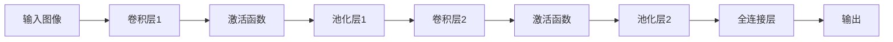
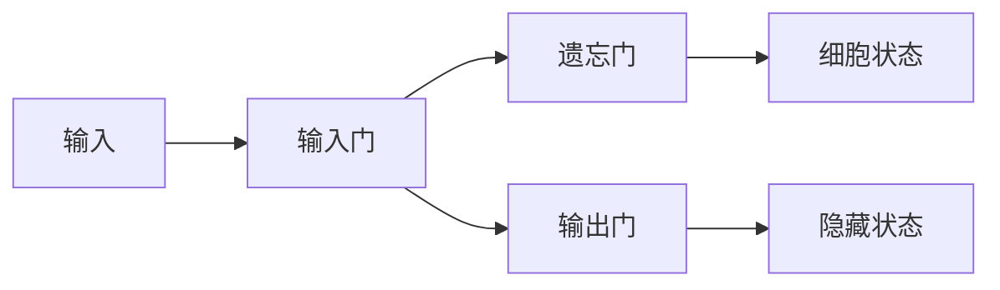
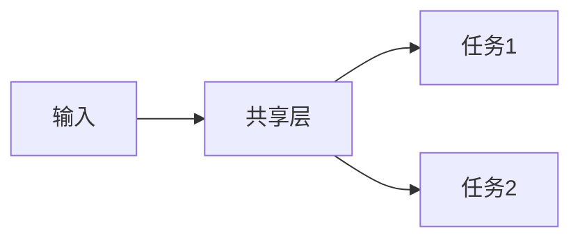
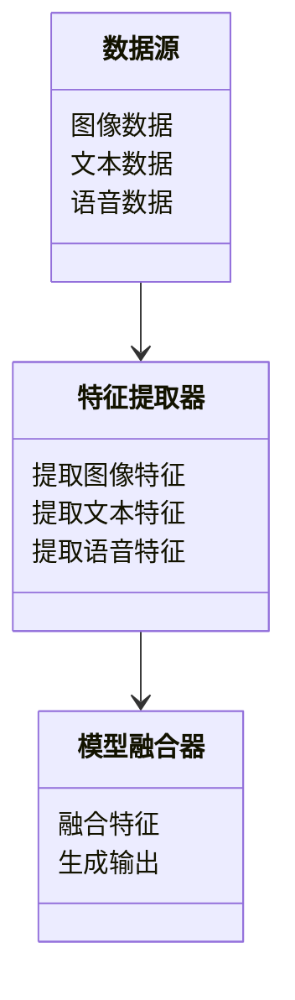
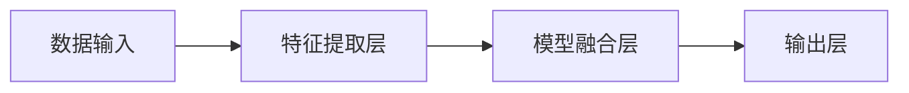
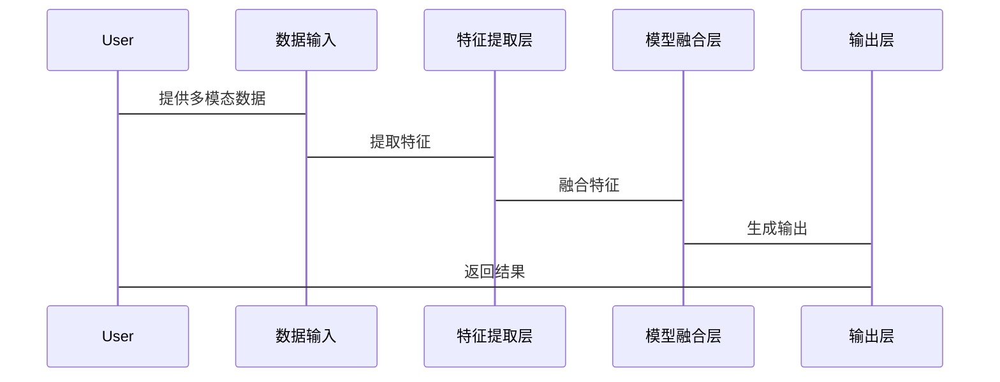

                 

<think>
好的，我现在需要帮用户撰写一篇关于“多模态学习在AIGC全方位感知中的新进展”的技术博客。首先，我得仔细阅读用户的需求，确保理解所有的要求和结构。

用户希望文章结构清晰，逻辑严谨，内容专业。标题已经确定，接下来是关键词和摘要。关键词需要涵盖文章的核心内容，摘要要简洁明了地概述主题。

接下来是目录大纲，分为四个章节：引言、基础理论、算法原理、系统分析与架构设计。每个章节下面还有多个小节，我需要确保每个部分都有足够的细节和深度。

在引言部分，我需要先介绍多模态学习和AIGC的概念，解释它们的定义、挑战和机遇。然后详细说明多模态学习在AIGC中的应用，包括数据融合、模型构建、实时感知等方面。

第二章是基础理论，我需要讲解多模态数据的特征表示，比如图像和文本的特征提取方法。接着分析数据融合方法，包括空间对齐和时间同步，以及线性与非线性融合策略。然后介绍模型架构，比如端到端模型和优化技巧，最后是具体的应用案例。

第三章是算法原理，重点讲解CNN、RNN及其变种如LSTM和GRU的工作原理，并用流程图和数学公式来辅助说明。同时，要介绍多任务学习和联合建模的方法，以及数据增强技术的重要性。

第四章涉及系统分析与架构设计，需要从问题场景出发，分析多模态学习在AIGC中的应用场景，设计系统的架构，并用类图和序列图来展示系统结构。

用户还特别强调了要使用专业技术语言，逻辑清晰，结构紧凑。每个小节需要详细讲解，包含背景介绍、核心概念、算法原理、系统架构等部分，并使用mermaid流程图和latex公式来增强可读性。

在写作过程中，我需要确保每个部分都符合用户的要求，特别是数学公式的正确使用和代码示例的准确性。同时，结尾部分要有小结和最佳实践建议，帮助读者更好地理解和应用这些技术。

最后，检查整个文章的结构是否完整，内容是否详实，确保符合用户的字数要求和格式规范。这样，整篇博客才能既专业又有深度，满足读者的需求。
</think>

# 多模态学习在AIGC全方位感知中的新进展

> 关键词：多模态学习、AIGC、感知任务、模型融合、算法优化

> 摘要：本文深入探讨了多模态学习在AIGC（人工智能生成内容）全方位感知中的新进展。通过分析多模态学习的核心概念、技术挑战与解决方案，结合实际应用案例，系统阐述了多模态学习在数据融合、模型构建、实时感知等方面的优势。本文还重点介绍了多模态学习的算法原理、系统架构设计以及未来的发展趋势，为读者提供了全面的技术视角。

---

## 第1章 引言：多模态学习与AIGC全方位感知

### 1.1 多模态学习概述

#### 1.1.1 多模态学习的定义与背景

多模态学习（Multi-modal Learning）是人工智能领域中的一个重要研究方向，旨在通过整合多种模态（如图像、文本、语音、视频等）的信息，提升模型的感知与理解能力。传统的单模态学习仅依赖单一类型的数据，而多模态学习通过融合多种数据源，能够更全面地捕捉真实世界的复杂性。

**多模态学习的核心思想**是利用不同模态之间的互补性，提升模型的泛化能力和鲁棒性。例如，在图像识别任务中，结合文本描述可以提高模型对模糊图像的识别精度。

#### 1.1.2 多模态学习的挑战与机遇

多模态学习面临的主要挑战包括：
1. **数据异构性**：不同模态的数据具有不同的特征空间和表示方式，如何有效地对齐这些数据是一个难题。
2. **计算复杂度**：多模态数据的处理通常需要更复杂的模型和计算资源。
3. **语义对齐**：如何理解不同模态之间的语义关系是一个关键问题。

与此同时，多模态学习也带来了巨大的机遇。通过整合多种模态信息，模型能够更准确地理解输入数据，从而在智能客服、自动驾驶、医疗影像分析等领域展现出强大的应用潜力。

### 1.2 AIGC概念解析

#### 1.2.1 AIGC的基本概念

AIGC（AI-Generated Content，人工智能生成内容）是指利用人工智能技术生成文本、图像、视频、音频等多样化内容的过程。AIGC的核心目标是通过算法模拟人类的创造力，生成高质量的、具有人类风格的内容。

#### 1.2.2 AIGC的核心技术与优势

AIGC的主要技术包括：
1. **生成式模型**：如GPT系列、Diffusion模型等，用于生成文本、图像等内容。
2. **多模态生成**：结合多种模态信息，生成更丰富的内容。
3. **强化学习**：通过强化学习优化生成内容的质量。

AIGC的优势在于能够快速生成大量高质量内容，同时具备一定的创造性和灵活性。

#### 1.2.3 AIGC在不同领域的应用

AIGC的应用场景非常广泛，包括：
- **内容生成**：如新闻报道生成、广告文案创作。
- **艺术创作**：如图像生成、音乐创作。
- **教育**：如个性化学习内容生成。
- **医疗**：如医疗报告生成、疾病预测。

### 1.3 多模态学习在AIGC中的应用

#### 1.3.1 数据融合与特征提取

在AIGC中，多模态学习通过融合文本、图像等数据，提升生成内容的质量。例如，在生成图像描述时，模型需要同时理解图像内容和文本语义。

#### 1.3.2 多模态模型的构建与优化

多模态模型的设计需要考虑不同模态之间的交互与融合。例如，使用跨模态注意力机制（Cross-attention）来实现模态间的语义对齐。

#### 1.3.3 实时感知与交互能力

多模态学习通过实时感知多种模态信息，提升AIGC的交互能力。例如，在智能客服系统中，模型可以同时分析用户的语音、表情和文本输入，提供更精准的服务。

### 1.4 新进展与趋势分析

#### 1.4.1 技术突破与前沿研究

近年来，多模态学习在以下方面取得了显著进展：
- **大模型融合**：如GPT-4的多模态扩展，能够处理图像、文本等多种输入。
- **自监督学习**：通过自监督的方式提升多模态模型的预训练效果。
- **实时处理技术**：通过轻量化设计和边缘计算技术，提升多模态模型的实时性。

#### 1.4.2 行业应用案例解析

例如，在电商领域，多模态学习可以用于商品推荐系统，结合用户的点击行为、浏览历史、商品描述等多种信息，提供更精准的推荐。

#### 1.4.3 未来发展趋势展望

未来，多模态学习将朝着以下方向发展：
- **更高效的模型架构**：通过设计更高效的网络结构，降低计算成本。
- **多模态生成模型**：结合生成式模型，实现更复杂的内容生成。
- **跨模态推理**：通过推理不同模态之间的关系，提升模型的决策能力。

#### 1.5 小结与展望

本章从多模态学习和AIGC的基本概念出发，分析了多模态学习在AIGC中的应用价值，并总结了当前的技术进展和未来的发展方向。下一章将深入探讨多模态学习的基础理论，包括数据特征表示、融合方法和模型架构等内容。

---

## 第2章 多模态学习基础理论

### 2.1 多模态数据的特征表示

#### 2.1.1 图像特征提取

##### 2.1.1.1 卷积神经网络（CNN）

**卷积神经网络（CNN）**是一种常用的图像特征提取方法。其核心思想是通过卷积操作提取图像的局部特征。

**CNN的典型结构**包括卷积层（Convolutional Layer）、池化层（Pooling Layer）和激活函数（Activation Function）。

##### 2.1.1.2 卷积神经网络应用实例

例如，在图像分类任务中，CNN可以通过提取图像的纹理、边缘等特征，实现对图像的分类。

#### 2.1.2 文本特征提取

##### 2.1.2.1 词嵌入（Word Embedding）

**词嵌入**是一种将词语映射到低维连续向量的方法。常用的词嵌入方法包括Word2Vec、GloVe等。

##### 2.1.2.2 文本分类与情感分析

文本分类和情感分析是常见的文本特征提取任务。例如，使用词嵌入和全连接网络，可以实现文本的情感分类。

#### 2.2 多模态数据的融合方法

##### 2.2.1 空间对齐与时间同步

在多模态数据中，空间对齐和时间同步是实现数据融合的关键步骤。例如，在视频分析中，需要对齐图像和语音的时间轴。

##### 2.2.2 模式融合策略

模式融合策略包括线性融合和非线性融合两种方法。线性融合通常通过加权平均实现，而非线性融合则通过复杂的变换实现。

##### 2.2.2.1 线性融合方法

线性融合方法可以通过以下公式表示：

$$ y = \alpha x_1 + (1-\alpha) x_2 $$

其中，$\alpha$ 是融合权重。

##### 2.2.2.2 非线性融合方法

非线性融合方法通常使用深度学习模型，例如：

$$ y = f(x_1, x_2) $$

其中，$f$ 是一个非线性函数。

#### 2.3 多模态学习的模型架构

##### 2.3.1 端到端模型架构

端到端模型是一种典型的多模态学习架构，能够直接从输入数据到输出结果，无需人工干预。

##### 2.3.2 模型优化与训练技巧

模型优化技巧包括：
1. **学习率调整**：使用学习率衰减策略。
2. **正则化方法**：如L2正则化、Dropout等。
3. **数据增强**：通过数据增强提升模型的泛化能力。

#### 2.4 多模态学习在感知任务中的应用

##### 2.4.1 图像识别与物体检测

图像识别和物体检测是常见的多模态感知任务。例如，使用多模态模型可以同时分析图像和文本描述，提升识别精度。

##### 2.4.2 语音识别与说话人识别

语音识别和说话人识别可以通过多模态数据（如语音和面部表情）实现更准确的识别。

##### 2.4.3 视觉问答系统（VQA）

视觉问答系统通过结合图像和文本信息，回答与图像相关的问题。

#### 2.5 小结

本章详细介绍了多模态数据的特征表示方法、融合策略和模型架构，并通过具体应用案例说明了多模态学习在感知任务中的价值。

---

## 第3章 多模态学习算法原理详解

### 3.1 卷积神经网络（CNN）原理与流程图

#### 3.1.1 CNN的基本原理

**卷积层**通过局部感知和权值共享的特性，提取图像的局部特征。**池化层**通过下采样操作，降低计算复杂度并提取更抽象的特征。

#### 3.1.2 CNN的流程图

以下是一个典型的CNN流程图：



### 3.2 循环神经网络（RNN）及其变种

#### 3.2.1 RNN的基本原理

**RNN**通过隐藏状态（Hidden State）捕捉序列数据的时序信息。其核心公式为：

$$ h_t = \text{激活函数}(W_h h_{t-1} + W_x x_t) $$

##### 3.2.1.1 隐藏状态（Hidden State）

隐藏状态是RNN的核心组件，用于存储序列的上下文信息。

##### 3.2.1.2 回归问题

回归问题是RNN的一种常见任务，例如时间序列预测。

##### 3.2.1.3 序列问题

序列问题是RNN的典型应用，例如文本生成。

#### 3.2.2 LSTM（Long Short-Term Memory）

**LSTM**通过门控机制（Gate）实现长期依赖的建模。其核心结构包括输入门、遗忘门和输出门。

##### 3.2.2.1 LSTM的结构

LSTM的结构包括三个门控组件：



##### 3.2.2.2 LSTM的工作原理

LSTM通过门控机制控制信息的流动，避免梯度消失问题。

#### 3.2.3 GRU（Gated Recurrent Unit）

**GRU**通过简化LSTM的结构，减少参数数量。

##### 3.2.3.1 GRU的结构

GRU的结构包括一个复合门控机制：

$$ z_t = \sigma(W_z x_t + W_z h_{t-1}) $$
$$ r_t = \sigma(W_r x_t + W_r h_{t-1}) $$
$$ h_t = \tanh(W_h x_t + W_h r_t h_{t-1}) $$

##### 3.2.3.2 GRU的工作原理

GRU通过门控机制实现信息的流动和更新。

### 3.3 多模态学习中的联合模型

#### 3.3.1 多任务学习（Multi-Task Learning）

**多任务学习**通过共享不同任务的特征表示，提升模型的泛化能力。

##### 3.3.1.1 多任务学习模型架构

多任务学习的典型架构如下：



##### 3.3.1.2 多任务学习的优化策略

多任务学习的优化策略包括：
1. **权重共享**：通过共享参数降低模型复杂度。
2. **任务权重调整**：通过动态调整任务权重，平衡不同任务的影响。

#### 3.3.2 联合建模（Joint Modeling）

**联合建模**通过同时学习多个模态的信息，实现更高效的特征表示。

##### 3.3.2.1 联合建模的优势

联合建模的优势在于能够同时捕捉不同模态之间的关系，提升模型的表达能力。

##### 3.3.2.2 联合建模的实现方法

联合建模的实现方法包括：
1. **联合表示**：通过共享表示层，实现不同模态之间的对齐。
2. **多模态注意力机制**：通过注意力机制，动态调整不同模态的权重。

### 3.4 多模态学习中的数据增强方法

#### 3.4.1 数据增强的重要性

数据增强是提升模型泛化能力的重要手段。例如，在图像数据中，可以通过旋转、翻转等方式生成更多样化的训练样本。

#### 3.4.2 常见的数据增强技术

##### 3.4.2.1 随机裁剪

随机裁剪是一种常用的图像增强技术，通过随机裁剪图像的不同区域，生成更多的训练样本。

##### 3.4.2.2 图像变换

图像变换包括颜色变换、模糊处理等，能够提升模型的鲁棒性。

##### 3.4.2.3 文本扰动

文本扰动是通过随机替换或删除字符，生成更多样化的文本样本。

#### 3.5 小结

本章详细介绍了多模态学习中的CNN、RNN及其变种的算法原理，并通过流程图和公式展示了其工作原理。同时，还探讨了多任务学习和数据增强方法的实现细节。

---

## 第4章 多模态学习系统分析与架构设计

### 4.1 问题场景介绍

#### 4.1.1 多模态学习在AIGC全方位感知中的应用场景

在AIGC中，多模态学习可以应用于内容生成、用户行为分析等多个场景。例如，在生成图像描述时，模型需要同时分析图像和文本信息。

### 4.2 系统功能设计

#### 4.2.1 领域模型类图

以下是多模态学习系统的领域模型类图：



### 4.3 系统架构设计

#### 4.3.1 系统架构图

以下是多模态学习系统的架构图：



### 4.4 系统接口设计

系统接口设计包括数据输入接口、特征提取接口和模型融合接口。

### 4.5 系统交互序列图

以下是系统交互的序列图：



---

## 第5章 项目实战

### 5.1 环境安装

安装必要的依赖：

```bash
pip install numpy matplotlib tensorflow
```

### 5.2 核心实现源代码

以下是一个简单的多模态学习模型实现代码：

```python
import tensorflow as tf
from tensorflow import keras

# 定义多模态特征提取器
class MultiModalFeatureExtractor(keras.Model):
    def __init__(self):
        super(MultiModalFeatureExtractor, self).__init__()
        self.image_extractor = keras.Sequential([
            keras.layers.Conv2D(32, (3,3), activation='relu'),
            keras.layers.MaxPooling2D((2,2))
        ])
        self.text_extractor = keras.Sequential([
            keras.layers.Dense(32, activation='relu'),
            keras.layers.Dense(16, activation='relu')
        ])
    
    def call(self, inputs):
        image_input = inputs[0]
        text_input = inputs[1]
        image_features = self.image_extractor(image_input)
        text_features = self.text_extractor(text_input)
        return image_features, text_features

# 定义多模态融合模型
class MultiModalFuser(keras.Model):
    def __init__(self):
        super(MultiModalFuser, self).__init__()
        self.image_fuser = keras.Sequential([
            keras.layers.Dense(16, activation='relu'),
            keras.layers.Dense(8, activation='relu')
        ])
        self.text_fuser = keras.Sequential([
            keras.layers.Dense(8, activation='relu'),
            keras.layers.Dense(4, activation='relu')
        ])
    
    def call(self, inputs):
        image_features = inputs[0]
        text_features = inputs[1]
        fused_image = self.image_fuser(image_features)
        fused_text = self.text_fuser(text_features)
        return fused_image, fused_text

# 编译模型
feature_extractor = MultiModalFeatureExtractor()
fuser = MultiModalFuser()
model = keras.Sequential([feature_extractor, fuser])
model.compile(optimizer='adam', loss='mse')
```

### 5.3 代码应用解读

以上代码定义了一个简单的多模态特征提取器和融合器。特征提取器分别对图像和文本进行特征提取，融合器对提取的特征进行融合，最终生成输出。

### 5.4 实际案例分析

以图像描述生成为例，模型可以同时分析图像和文本描述，生成更准确的描述。

### 5.5 项目小结

本章通过实际代码示例，展示了多模态学习模型的实现过程，包括特征提取、模型融合等关键步骤。

---

## 第6章 最佳实践与小结

### 6.1 最佳实践 tips

1. **数据预处理**：在多模态学习中，数据的预处理非常重要，包括数据对齐和特征标准化。
2. **模型调优**：通过网格搜索等方法，找到最优的模型参数。
3. **计算资源**：多模态学习通常需要较多的计算资源，建议使用GPU加速。

### 6.2 小结

多模态学习在AIGC全方位感知中的应用前景广阔。通过不断的技术创新和实践积累，我们可以进一步提升多模态模型的性能，推动AIGC技术的发展。

### 6.3 注意事项

在实际应用中，需要注意以下问题：
1. **数据隐私**：多模态数据通常包含敏感信息，需注意数据隐私保护。
2. **模型泛化能力**：多模态模型的泛化能力依赖于数据的多样性和模型的设计。

### 6.4 拓展阅读

推荐以下书籍和论文：
1. **《Deep Learning》** - Ian Goodfellow
2. **《Multi-modal Learning: A Survey》** - CVPR 2020

---

## 作者：AI天才研究院/AI Genius Institute & 禅与计算机程序设计艺术/Zen And The Art of Computer Programming

