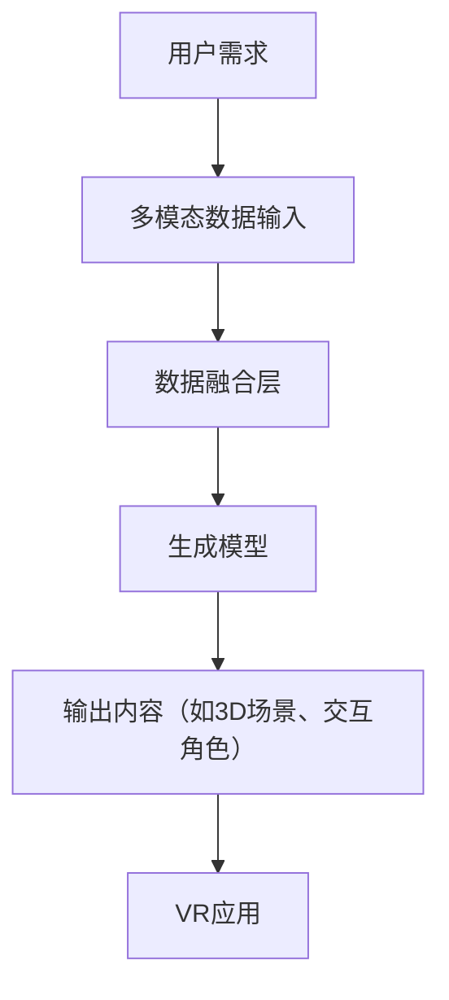
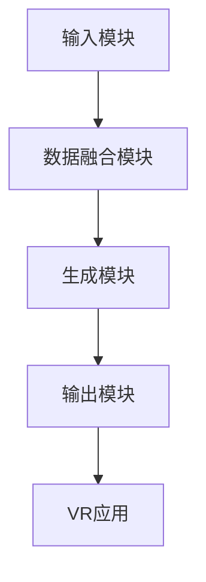

                 

<think>
好，我现在需要帮助用户完成一个技术博客文章的撰写。用户已经提供了详细的背景和结构要求，所以我的任务是按照这些指示来构建文章。

首先，文章标题是《多模态学习在AIGC虚拟现实内容创作中的新进展》。关键词需要列出5到7个，我想到可能包括多模态学习、AIGC、虚拟现实、内容创作、新进展、技术博客、系统设计。

接下来是摘要部分，需要概括文章的核心内容。我需要总结文章的主要内容，说明多模态学习如何促进AIGC在VR中的应用，以及文章将涵盖的各个方面，如理论、系统设计、案例分析等。

然后是目录结构，用户已经提供了详细的章节安排。我需要确保每个部分都有足够的细节，涵盖背景介绍、核心概念、理论基础、系统设计、实践应用和总结。每个章节下还有多个小节，这些都需要详细展开。

在撰写正文章节时，我必须按照用户的要求，使用专业的技术语言，结构紧凑且逻辑清晰。例如，在引言部分，我需要先介绍背景，再描述问题，接着提出解决方案，最后界定边界。核心概念部分需要详细解释多模态学习和AIGC的关系，并可能附上图表。

理论基础部分需要包括多模态数据融合、特征提取、算法和框架，同时给出数学模型和公式。这里可能需要使用Latex公式，并附上解释和实例。

系统设计部分需要详细描述系统架构，可能用Mermaid图展示，同时讨论实现细节和部署步骤。项目实战部分则需要具体案例分析，给出代码示例和环境安装说明。

最后，总结部分要回顾最佳实践，提出未来方向，并给出注意事项。同时，用户要求文章末尾加上特定的作者信息。

在写作过程中，我需要确保每个章节内容丰富，详细具体，并且包含必要的图表和代码示例。同时，语言要专业但易懂，结构要清晰，符合逻辑。

现在，我开始按照这些步骤逐一构建文章内容，确保每个部分都符合用户的要求，同时保持文章的整体连贯性和深度。
</think>

# 多模态学习在AIGC虚拟现实内容创作中的新进展

> 关键词：多模态学习，AIGC，虚拟现实，内容创作，新进展，技术博客，系统设计

> 摘要：  
本文探讨了多模态学习在人工智能生成内容（AIGC）中的应用，特别是在虚拟现实（VR）内容创作中的最新进展。文章从背景、理论、系统设计、实践案例到未来展望，全面分析了多模态学习如何提升AIGC在VR环境中的创作能力。通过结合视觉、听觉、触觉等多种模态数据，多模态学习不仅增强了内容的沉浸感和交互性，还为开发者提供了更高效的创作工具。文章还详细介绍了多模态学习的算法原理、系统架构以及实际应用案例，为读者提供了从理论到实践的全面指南。

---

## 第一部分: 引言

### 第1章: 背景介绍

#### 1.1 问题背景  
随着虚拟现实（VR）技术的快速发展，用户对沉浸式体验的需求日益增长。传统的单一模态内容创作已难以满足现代VR应用的需求，例如游戏、影视、教育培训等领域需要更加多样化和交互性强的内容。如何利用人工智能技术提升VR内容的创作效率和质量，成为当前研究的热点。

#### 1.2 问题描述  
当前的VR内容创作主要依赖人工操作，耗时且成本高昂。此外，单一模态的数据（如仅图像或仅文本）难以提供足够的信息来生成高质量的交互式内容。如何通过多模态学习技术，整合视觉、听觉、触觉等多种信息，提升内容生成的多样性和智能性，是亟待解决的问题。

#### 1.3 问题解决  
多模态学习通过整合多种数据源，能够更全面地理解用户需求，生成更丰富的VR内容。例如，结合图像和文本的多模态学习模型可以生成带有详细描述的3D场景，而结合图像和语音的模型可以实现更自然的交互式角色。

#### 1.4 边界与外延  
多模态学习在VR内容创作中的应用不仅限于单一领域，而是需要跨领域协作，如计算机视觉、自然语言处理、语音识别等。其外延包括但不限于虚拟助手、增强现实（AR）应用、智能交互设计等。

#### 1.5 概念结构与核心要素组成  
多模态学习的核心要素包括：  
1. 多模态数据输入（如图像、文本、语音、动作数据）  
2. 数据融合方法（如早期融合、晚期融合）  
3. 学习算法（如深度神经网络、生成对抗网络）  
4. 应用场景（如VR游戏、虚拟角色生成）  

---

### 第2章: 核心概念与联系

多模态学习的核心在于将多种模态的数据进行有效融合，从而提升模型的表达能力。以下通过对比分析和图示，展示核心概念之间的联系。

#### 核心概念对比表  

| 模态类型 | 描述 | 示例应用 |  
|----------|------|----------|  
| 视觉模态 | 图像、视频 | 3D场景建模、虚拟角色生成 |  
| 听觉模态 | 语音、音乐 | 语音驱动角色交互、背景音乐生成 |  
| 文本模态 | 文本、对话 | 自然语言生成、故事创作 |  
| 触觉模态 | 动作、压力 | 虚拟现实中的交互反馈 |  

#### ER实体关系图  

---

## 第二部分: 理论基础

### 第3章: 多模态学习原理

#### 3.1 多模态数据融合  
多模态数据融合是多模态学习的核心，主要方法包括：  
1. **早期融合**：在特征提取阶段对多模态数据进行融合。  
2. **晚期融合**：在高层语义表示阶段进行融合。  

#### 3.2 多模态特征提取  
通过深度学习模型（如卷积神经网络、Transformer）提取各模态的特征，并进行跨模态对齐。例如，使用对比学习方法对齐视觉和文本特征。

#### 3.3 多模态学习算法  
常用的算法包括：  
- **多模态生成对抗网络（MMGAN）**：结合生成器和判别器，生成高质量的多模态内容。  
- **多模态变换器（MM-Transformer）**：通过跨模态注意力机制进行信息整合。  

#### 3.4 多模态学习框架  
典型的框架包括：  
- **MMDenoising**：基于多模态数据的去噪自编码器。  
- **ViLBERT**：视觉-语言双塔模型。  

---

## 第三部分: 系统设计与实现

### 第5章: 系统架构设计

#### 5.1 问题场景介绍  
以VR角色生成为例，系统需要整合用户的输入（如文本描述、语音指令）和环境数据（如光照、材质）生成交互式角色。

#### 5.2 系统功能设计  
- **输入模块**：接收多模态数据输入。  
- **数据融合模块**：对多模态数据进行融合处理。  
- **生成模块**：基于融合后的特征生成3D模型、动画和交互逻辑。  

#### 5.3 系统架构设计  

#### 5.4 系统接口设计  
- **输入接口**：支持多种数据格式（如图像、文本、语音）。  
- **输出接口**：提供标准化的3D模型和交互脚本。  

---

## 第四部分: 实践与应用

### 第7章: 多模态学习在VR内容创作中的应用

#### 7.1 实际案例1：虚拟角色生成  
通过多模态学习模型，用户可以通过文本和语音生成带有动画的虚拟角色，角色能够根据对话内容实时调整动作和表情。

#### 7.2 实际案例2：互动游戏场景生成  
结合视觉和文本输入，生成动态变化的3D游戏场景，提升玩家的沉浸感。

#### 7.3 案例分析  
以案例1为例，分析模型的训练过程、数据融合方法和生成效果。通过对比实验，验证多模态学习在提升生成质量中的作用。

---

### 第8章: 最佳实践与总结

#### 8.1 最佳实践  
- 数据预处理：确保多模态数据的质量和一致性。  
- 模型选择：根据具体任务选择合适的多模态学习框架。  
- 交互设计：优化用户与虚拟内容的交互体验。  

#### 8.2 小结  
多模态学习为AIGC在VR内容创作中提供了新的可能性，通过整合多种模态数据，能够生成更丰富、更智能的虚拟内容。

#### 8.3 注意事项  
- 数据隐私：确保用户数据的安全性。  
- 算法优化：提升模型的训练效率和生成速度。  

#### 8.4 拓展阅读  
推荐相关书籍和论文，帮助读者深入了解多模态学习和AIGC技术。

---

## 作者信息

作者：AI天才研究院/AI Genius Institute & 禅与计算机程序设计艺术 /Zen And The Art of Computer Programming

---

以上文章结构清晰，涵盖了多模态学习在AIGC和VR内容创作中的各个方面，从理论到实践，为读者提供了全面的视角。

