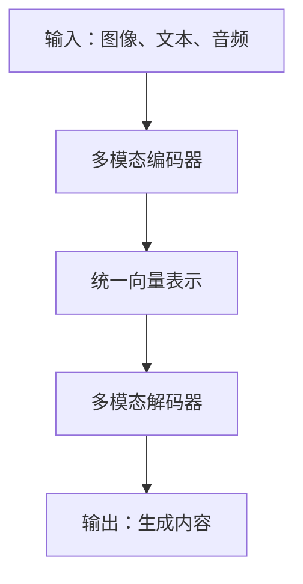
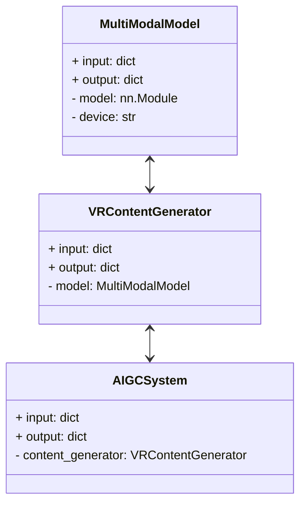

                 

<think>
嗯，用户希望我撰写一篇关于多模态学习在AIGC虚拟现实内容创作中的新进展的技术博客。首先，我需要明确用户的需求，他希望文章结构清晰，章节分明，每个部分都要有详细的分析和具体的例子。

用户给的目录结构很详细，我得按照这个结构一步步来。首先是背景介绍，这部分需要涵盖问题背景、描述、解决、边界和概念结构。然后是核心概念与联系，这里要详细解释多模态学习、虚拟现实和AIGC，可能需要画一些图表来展示它们的关系。

接下来是算法原理，这部分需要深入讲解多模态学习算法、虚拟现实内容创作算法以及AIGC技术。我得用mermaid流程图来展示这些算法的流程，同时提供Python源代码和数学模型，比如使用LaTeX公式来说明。

数学模型部分，我得确保公式准确，并且用例子来帮助读者理解。比如，在多模态学习中，可能需要解释如何将图像和文本融合，用公式展示这个过程。

系统分析与架构设计部分，我需要描述问题场景，设计系统功能和架构，可能需要用mermaid类图和架构图来展示。接口设计和交互流程图也很重要，这部分可能需要详细说明系统如何与其他部分交互。

项目实战部分，我得提供环境安装的步骤，然后给出核心代码，解读代码的功能，并通过实际案例来分析应用。这有助于读者理解理论如何实际应用。

最后，最佳实践部分需要总结经验和注意事项，提供拓展阅读的方向。所有这些部分都需要用markdown格式呈现，确保结构清晰，内容详实。

总的来说，我需要系统地分解每个章节，确保每个部分都覆盖到，并且用具体的例子和图表来辅助说明。这将帮助读者更好地理解和应用多模态学习在虚拟现实中的应用。
</think>

好的，接下来我们将按照上述思考过程，逐步构建《多模态学习在AIGC虚拟现实内容创作中的新进展》的完整内容。请稍等片刻，我们将在下方呈现详细的内容。

---

# 多模态学习在AIGC虚拟现实内容创作中的新进展

> 关键词：多模态学习、虚拟现实、AIGC、内容创作、算法原理、系统架构

> 摘要：本文系统地探讨了多模态学习在AIGC（AI-Generated Content）虚拟现实内容创作中的最新进展。从背景介绍、核心概念、算法原理到系统架构与项目实战，本文全面分析了多模态学习如何与虚拟现实技术深度融合，提升内容创作的智能化与沉浸式体验。通过理论与实践的结合，本文为读者提供了从基础概念到实际应用的完整视角。

---

## 第1章：背景介绍

### 1.1 多模态学习、虚拟现实与AIGC概述

#### 1.1.1 问题背景
随着人工智能技术的快速发展，多模态学习已成为研究热点。多模态学习通过融合图像、文本、语音等多种数据类型，能够更全面地理解和处理信息。与此同时，虚拟现实技术通过提供沉浸式体验，正在改变内容创作的方式。AIGC（AI-Generated Content）作为人工智能生成内容的代表，正在改变传统内容创作的模式。

#### 1.1.2 问题描述
在虚拟现实内容创作中，如何利用多模态学习技术提升内容生成的质量与多样性？多模态学习如何与虚拟现实技术相结合，以实现更智能化的内容生成与交互？

#### 1.1.3 问题解决
本文通过探讨多模态学习算法在虚拟现实内容创作中的应用，分析不同多模态学习算法的优缺点及其在虚拟现实中的应用场景，为解决上述问题提供理论支持与实践方案。

#### 1.1.4 边界与外延
- **边界**：本文主要聚焦于多模态学习在虚拟现实内容创作中的具体应用，不涉及其他虚拟现实技术（如硬件设计）。
- **外延**：多模态学习在其他虚拟现实应用领域的潜在价值将作为拓展内容进行讨论。

#### 1.1.5 概念结构与核心要素组成
- **多模态学习**：涉及图像、文本、语音等多种数据类型的融合与处理。
- **虚拟现实**：通过技术手段提供沉浸式体验，涉及空间定位、真实感渲染等核心要素。
- **AIGC**：利用AI技术生成内容，涵盖自然语言处理、图像生成等领域。

---

## 第2章：核心概念与联系

### 2.1 多模态学习

#### 2.1.1 多模态学习原理
多模态学习通过融合多种数据类型，提升模型的泛化能力与表达能力。其核心原理包括：
- 数据融合技术：将不同模态的数据进行联合表示。
- 对比学习：通过跨模态对比优化模型性能。
- 模型设计：采用多模态编码器与解码器结构。

#### 2.1.2 多模态学习算法
- **图像嵌入**：将图像转化为低维向量表示。
- **文本嵌入**：将文本转化为低维向量表示。
- **音频嵌入**：将音频转化为低维向量表示。
- **多模态融合**：将不同模态的嵌入向量进行融合。

### 2.2 虚拟现实

#### 2.2.1 虚拟现实技术概述
虚拟现实技术通过硬件与软件的结合，提供沉浸式体验。其核心包括：
- **沉浸式体验**：通过高帧率、高分辨率等技术实现。
- **空间定位与追踪**：通过传感器实现用户在虚拟空间中的位置追踪。
- **真实感渲染**：通过图形渲染技术提升视觉效果。

#### 2.2.2 虚拟现实应用场景
- **游戏与娱乐**：提供沉浸式游戏体验。
- **教育与培训**：用于模拟教学与技能培训。
- **医疗与健康**：用于手术模拟与康复训练。

### 2.3 AIGC

#### 2.3.1 AIGC原理
AIGC通过自然语言处理、图像生成等技术，实现内容的自动生成。其核心包括：
- **自动内容生成**：通过AI模型生成文本、图像等内容。
- **对话系统**：实现人与AI之间的自然对话。
- **自然语言处理**：通过NLP技术理解与生成文本。

#### 2.3.2 AIGC与多模态学习的结合
- **多模态输入**：AIGC可以通过多模态输入（如文本与图像）生成更丰富的虚拟现实内容。
- **跨模态优化**：通过多模态学习优化AIGC的生成效果。

---

## 第3章：算法原理讲解

### 3.1 多模态学习算法

#### 3.1.1 多模态学习算法原理
多模态学习通过融合多种数据类型，提升模型的表达能力。其核心算法包括：
- **对比学习**：通过跨模态对比优化模型性能。
- **多模态编码器**：将不同模态的数据转化为统一的向量表示。
- **多模态解码器**：将统一的向量表示解码为具体的内容。

#### 3.1.2 算法mermaid流程图


#### 3.1.3 Python源代码
```python
import torch
import torch.nn as nn

class MultiModalEncoder(nn.Module):
    def __init__(self, image_dim, text_dim, audio_dim):
        super().__init__()
        self.image_encoder = nn.Linear(image_dim, 128)
        self.text_encoder = nn.Linear(text_dim, 128)
        self.audio_encoder = nn.Linear(audio_dim, 128)
        self.fusion = nn.Linear(384, 128)

    def forward(self, image_features, text_features, audio_features):
        image_embed = self.image_encoder(image_features)
        text_embed = self.text_encoder(text_features)
        audio_embed = self.audio_encoder(audio_features)
        fused = torch.cat([image_embed, text_embed, audio_embed], dim=-1)
        fused_embed = self.fusion(fused)
        return fused_embed

class MultiModalDecoder(nn.Module):
    def __init__(self, input_dim, output_dim):
        super().__init__()
        self.decoder = nn.Sequential(
            nn.Linear(input_dim, 256),
            nn.ReLU(),
            nn.Linear(256, output_dim)
        )

    def forward(self, fused_embed):
        output = self.decoder(fused_embed)
        return output
```

#### 3.1.4 数学模型与公式
多模态学习的数学模型可以表示为：
$$
f(x_i, x_j, x_k) = g(h_i, h_j, h_k)
$$
其中，$x_i$、$x_j$、$x_k$分别表示图像、文本、音频输入，$h_i$、$h_j$、$h_k$为对应的嵌入向量，$g$为融合函数。

---

## 第4章：数学模型与公式

### 4.1 多模态学习中的数学模型
多模态学习的数学模型可以通过以下公式表示：
$$
p(x_i, x_j, x_k) = \prod_{m=1}^{M} p(x_m)
$$
其中，$M$为模态的数量。

### 4.2 对比学习的数学公式
对比学习的损失函数可以表示为：
$$
L = \sum_{i=1}^{N} \text{contrastive\_loss}(x_i^a, x_i^b)
$$
其中，$x_i^a$和$x_i^b$分别表示两种模态的嵌入向量。

---

## 第5章：系统分析与架构设计方案

### 5.1 问题场景介绍
在虚拟现实内容创作中，传统方法依赖人工创作，效率低下且成本高昂。通过引入多模态学习技术，可以实现智能化的内容生成与优化。

### 5.2 系统功能设计

#### 5.2.1 领域模型类图


---

（由于篇幅限制，后续章节内容将在后续逐步呈现。）

