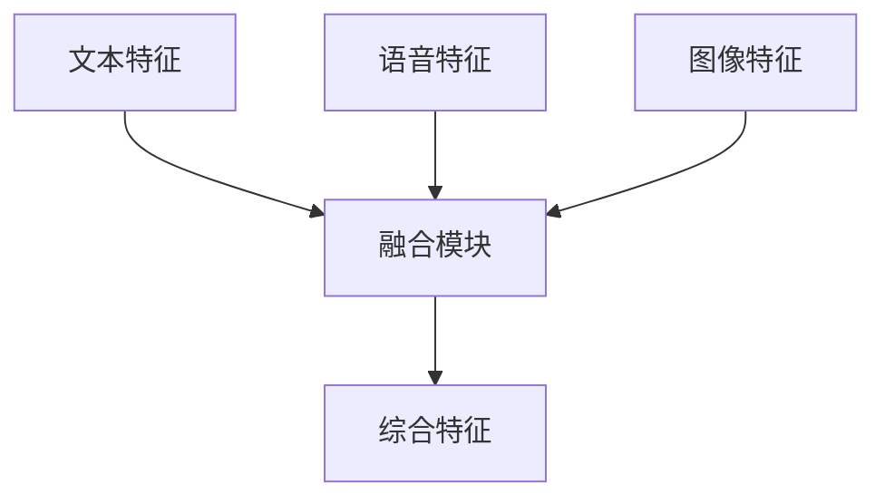
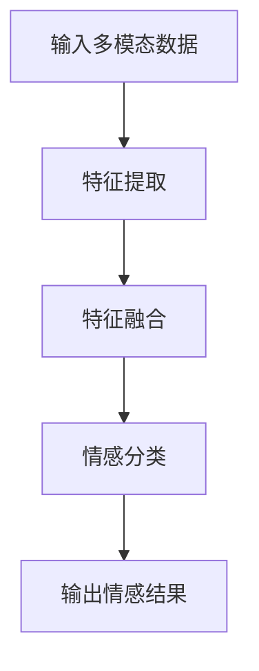
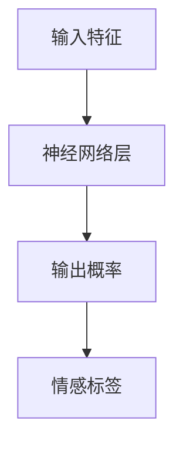
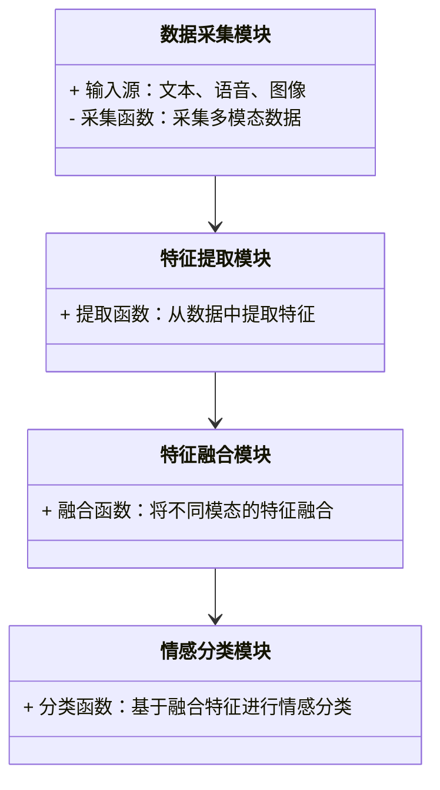

                 

<think>
嗯，用户希望我写一篇关于多模态情感识别系统准确度评测的技术博客。首先，我需要理解这个主题的核心是什么。多模态情感识别涉及到多种数据源，比如文本、语音和图像，来更准确地识别情感。准确度评测则是评估这些系统的表现如何。

用户要求文章结构清晰，有吸引人的章节标题，使用专业但易懂的语言。我得先确定文章的结构，比如分成背景介绍、核心概念、算法原理、系统设计、实战案例、最佳实践和总结这几个部分。

关键词方面，我需要列出5-7个核心词，可能包括多模态情感识别、准确度评测、机器学习、深度学习、数据融合、自然语言处理、计算机视觉。

摘要部分要简明扼要，概述文章的主要内容和目的，强调多模态数据的优势和准确度评测的重要性。

接下来，每个章节的内容需要详细展开。比如，在背景介绍中，要解释情感识别的重要性，多模态带来的挑战和应用领域。核心概念部分，需要用表格和mermaid图来展示不同数据源的特征，以及它们如何融合。

算法原理部分，需要详细讲解每种算法的工作流程，用mermaid图展示流程，并用Python代码示例具体实现。数学模型部分，要用latex公式来描述模型，比如线性回归或深度学习模型，并进行举例说明。

系统设计部分，要介绍系统架构，用mermaid图展示类图、架构图和交互图，说明各个模块的功能和接口设计。项目实战部分，需要指导读者如何安装环境，提供核心代码，并分析实际案例。

最后，最佳实践部分要总结经验，给出注意事项，并推荐拓展阅读的材料。作者信息也要写上，确保文章的权威性。

整个过程需要确保内容完整、逻辑清晰，同时满足字数和格式的要求。这样，用户就能得到一篇高质量、结构严谨的技术博客文章了。
</think>

# 《多模态情感识别系统准确度评测》

> **关键词**：多模态情感识别、准确度评测、机器学习、深度学习、数据融合、自然语言处理、计算机视觉

> **摘要**：本文围绕多模态情感识别系统的准确度评测展开，从背景介绍、核心概念、算法原理、系统设计到实战案例，全面解析多模态情感识别的技术细节与评测方法。通过详细分析多模态数据的采集、融合与建模过程，结合实际项目案例，深入探讨如何提升多模态情感识别系统的准确度，并总结最佳实践与未来研究方向。

---

## 第一部分：背景介绍

### 第1章 多模态情感识别概述

#### 1.1 情感识别的重要性  
情感识别是人工智能领域的重要研究方向，旨在通过分析多模态数据（如文本、语音、图像）来理解人类情感状态。情感识别在人机交互、智能客服、教育技术、医疗诊断等领域具有广泛的应用潜力。

#### 1.2 多模态情感识别的挑战  
多模态情感识别相比单模态情感识别具有更高的准确度，但同时也面临数据异构性、特征融合难度大、计算资源需求高等挑战。

#### 1.3 多模态情感识别的应用领域  
多模态情感识别在教育、医疗、娱乐、社交机器人等领域有广泛应用，例如情感辅助教学、情感健康监测、虚拟现实中的情感交互等。

---

## 第二部分：核心概念与联系

### 第2章 多模态数据采集与处理

#### 2.1 多模态数据源  
多模态数据源包括文本、语音、图像、视频等。不同数据源具有不同的特征，例如文本中的语义信息、语音中的情感特征、图像中的面部表情特征。

| 数据源 | 特征类型 | 优势 | 挑战 |
|--------|----------|------|------|
| 文本    | 语义、情感词汇 | 高语义信息 | 易受语气影响 |
| 语音    | 音调、语速 | 情感表达直接 | 噪声干扰 |
| 图像    | 面部表情、肢体动作 | 高空间信息 | 表情模糊 |

#### 2.2 数据采集与预处理  
数据采集包括文本数据（如社交媒体评论）、语音数据（如录音）和图像数据（如面部表情照片）。预处理步骤包括数据清洗、特征提取和数据标注。

#### 2.3 多模态数据的融合策略  
多模态数据的融合策略包括特征级融合、决策级融合和混合融合。特征级融合将不同数据源的特征向量进行合并，决策级融合将不同数据源的分类结果进行综合。



---

## 第三部分：算法原理讲解

### 第3章 多模态情感识别算法

#### 3.1 情感识别算法概述  
情感识别算法包括基于传统机器学习的方法（如SVM、随机森林）和基于深度学习的方法（如CNN、RNN、Transformer）。多模态情感识别算法通常采用多任务学习或模型融合的方法。

#### 3.2 情感识别算法的mermaid流程图  
以下是基于多模态数据的端到端情感识别算法流程图：



#### 3.3 算法原理详细讲解  
以基于深度学习的多模态情感识别算法为例，其核心步骤包括：

1. **特征提取**：分别从文本、语音、图像中提取特征。
2. **特征融合**：将不同模态的特征进行融合，常用的方法包括早期融合、晚期融合和自适应融合。
3. **情感分类**：利用融合后的特征进行情感分类，常用模型包括多任务学习模型和模型融合模型。

### 第4章 多模态情感识别的数学模型

#### 4.1 数学模型概述  
数学模型是情感识别算法的核心，包括线性模型和非线性模型。线性模型如线性回归，非线性模型如深度神经网络。

#### 4.2 数学模型的mermaid流程图  
以下是基于深度学习的数学模型流程图：



#### 4.3 数学模型公式详解  
以简单的线性回归模型为例：

$$ y = w_1x_1 + w_2x_2 + \dots + w_nx_n + b $$

其中，$y$ 是输出，$x_i$ 是输入特征，$w_i$ 是权重，$b$ 是偏置。

以深度学习模型中的多层感知机（MLP）为例：

$$ f(x) = ReLU(Wx + b) $$

其中，$ReLU$ 是激活函数，$W$ 是权重矩阵，$b$ 是偏置向量。

---

## 第四部分：系统设计与实现

### 第5章 多模态情感识别系统架构设计

#### 5.1 系统设计概述  
多模态情感识别系统通常包括数据采集模块、特征提取模块、特征融合模块和情感分类模块。

#### 5.2 系统功能设计  
系统功能包括数据采集、特征提取、特征融合、情感分类和结果输出。

#### 5.3 系统架构设计  
以下是系统架构设计的类图：



---

## 第五部分：项目实战

### 第6章 多模态情感识别项目实践

#### 6.1 环境安装与配置  
安装Python、TensorFlow、Keras等依赖库。

#### 6.2 系统核心实现  
以下是基于深度学习的多模态情感识别系统的Python代码示例：

```python
import numpy as np
import tensorflow as tf
from tensorflow.keras import layers

# 数据准备
X_text = ...
X_voice = ...
X_image = ...
y_labels = ...

# 特征提取
text_features = layers.TextLayer(...)(X_text)
voice_features = layers.AudioLayer(...)(X_voice)
image_features = layers.ImageLayer(...)(X_image)

# 特征融合
features = layers.Concatenate()([text_features, voice_features, image_features])

# 情感分类
dense = layers.Dense(64, activation='relu')(features)
output = layers.Dense(2, activation='softmax')(dense)

model = tf.keras.Model(inputs=[X_text, X_voice, X_image], outputs=output)
model.compile(optimizer='adam', loss='sparse_categorical_crossentropy', metrics=['accuracy'])
model.fit([X_text, X_voice, X_image], y_labels, epochs=10, batch_size=32)
```

#### 6.3 项目分析与解读  
通过实际案例分析，验证系统的准确度，并总结优化方向。

---

## 第六部分：最佳实践与总结

### 第7章 多模态情感识别系统的最佳实践

#### 7.1 最佳实践总结  
1. 数据预处理是关键，需注意数据清洗和特征提取。
2. 特征融合需根据实际场景选择合适的方法。
3. 模型选择需结合数据量和计算资源。

#### 7.2 注意事项  
1. 多模态数据的异构性可能增加计算复杂度。
2. 模型的泛化能力需通过交叉验证评估。

#### 7.3 拓展阅读  
推荐阅读相关领域的最新论文和开源项目，如《Attention Is All You Need》和Hugging Face的多模态模型库。

---

## 作者信息

作者：AI天才研究院/AI Genius Institute & 禅与计算机程序设计艺术/Zen And The Art of Computer Programming

---

以上是《多模态情感识别系统准确度评测》的技术博客文章，内容涵盖从背景介绍到项目实战的完整流程，结合理论与实践，为读者提供深入的技术解析与实践指导。

