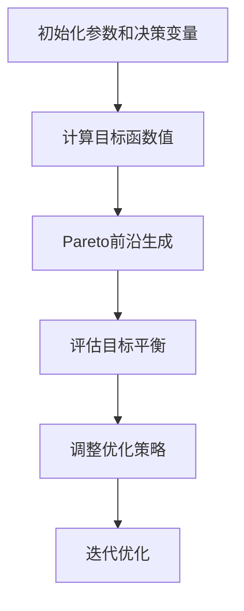
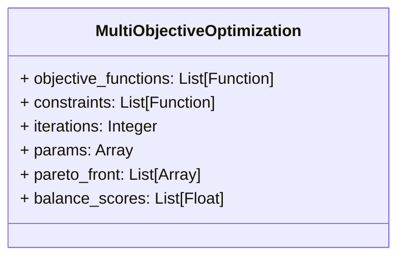
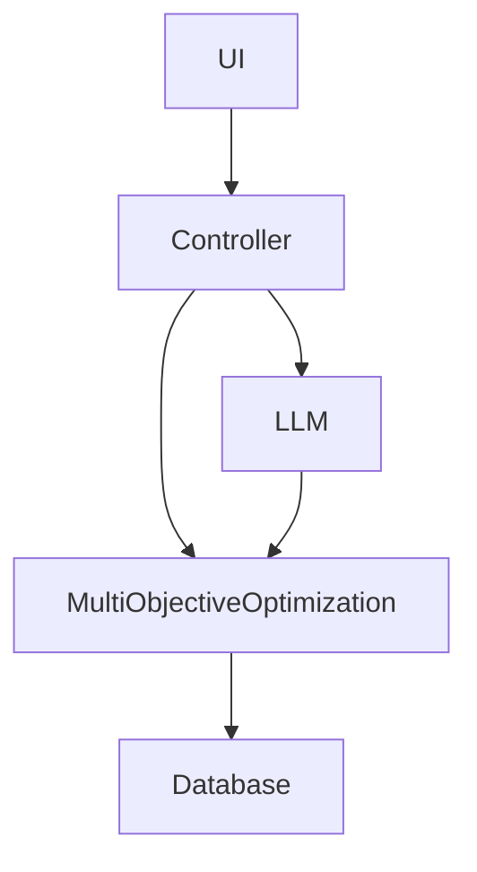
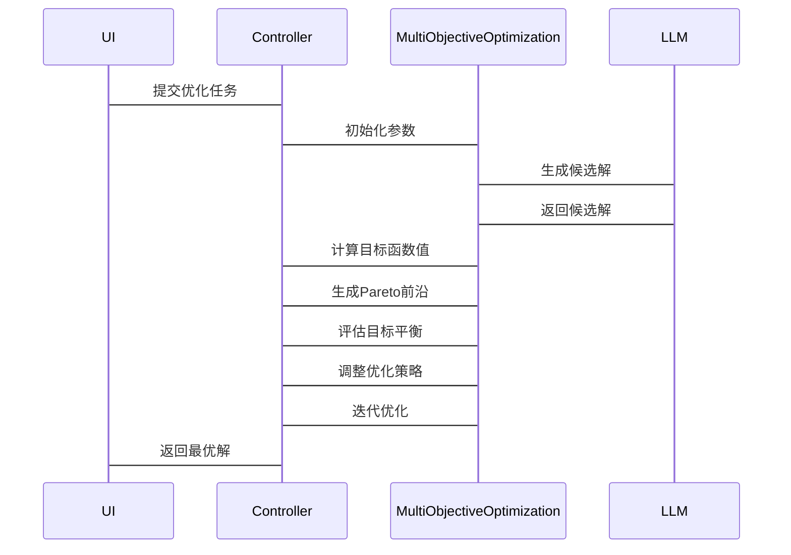

                 

<think>
嗯，用户希望我以《多目标评测优化：LLM辅助的平衡性能指标方法》为标题，写一篇技术博客文章。首先，我需要理解用户的需求。他希望文章结构清晰，内容专业，涵盖背景介绍、核心概念、算法原理、系统架构、项目实战等多个部分，并且每个部分都要详细具体。

首先，我会从背景介绍开始。这部分需要涵盖问题背景、问题描述、问题解决、边界与外延，以及概念结构与核心要素。我需要解释什么是多目标优化，为什么它重要，以及传统方法的局限性，然后引出LLM辅助的方法。

接下来是核心概念与联系。这部分需要详细解释多目标优化的基本原理，LLM的工作原理，以及平衡性能指标方法的定义和作用。同时，用户要求有一个概念属性对比的表格和ER实体关系图，所以我得确保这些内容准确无误，并且用markdown格式呈现。

然后是算法原理部分。这里需要使用mermaid流程图来展示算法步骤，同时提供数学公式和详细的代码实现。我得确保公式用latex正确表示，并且代码部分清晰易懂，能够帮助读者理解算法的实现过程。

系统分析与架构设计方案也是关键部分。我需要描述问题场景，设计系统功能，包括领域模型和架构图，以及接口和交互设计。这部分需要展示系统的整体结构和各部分之间的关系，确保读者能够理解系统的组成和运作方式。

项目实战部分需要提供环境安装说明，核心代码实现，以及案例分析。我得选择一个具体的案例，详细分析LLM辅助优化是如何在实际中应用的，让读者能够看到理论在实践中的应用。

最后是最佳实践、小结、注意事项和拓展阅读。这部分需要给读者一些实用的建议，总结文章的主要内容，并提示他们在实际应用中需要注意的问题，同时推荐一些进一步阅读的资源。

在整个写作过程中，我要确保文章逻辑清晰，结构紧凑，用词专业但又不失易懂。每个部分都要有足够的细节和例子，帮助读者深入理解内容。同时，要遵守用户的格式要求，确保markdown格式正确，没有语法错误。

考虑到用户是技术专家，他们可能对内容有较高的要求，因此我需要确保每个部分都深入浅出，既有理论分析，又有实际应用。特别是算法部分，需要提供详细的数学模型和代码，让读者能够实际操作和验证。

总的来说，我需要一步步地构建这篇文章，确保每个章节都涵盖用户要求的内容，并且符合高质量的技术博客的标准。这需要我不仅具备技术知识，还要有良好的写作能力和组织能力，才能将复杂的概念和方法清晰地呈现出来。
</think>

# 多目标评测优化：LLM辅助的平衡性能指标方法

> 关键词：多目标优化，LLM辅助，平衡性能指标，Pareto前沿，深度学习

> 摘要：本文聚焦于多目标优化问题，探讨如何利用大型语言模型（LLM）辅助平衡性能指标方法，以解决多目标优化中的非支配排序、目标冲突和优化效率等挑战。通过分析多目标优化的基本原理、LLM的工作机制以及平衡性能指标的设计思路，本文提出了一种结合传统优化方法与AI技术的创新解决方案，并通过实际案例分析验证了该方法的有效性。

---

## 第一部分：背景介绍

### 1.1 问题背景

多目标优化（Multi-Objective Optimization，简称MOO）是近年来在计算机科学、工程学、运筹学等领域受到广泛关注的研究课题。随着现代科技的快速发展，许多实际问题往往涉及多个相互冲突的目标，这使得单目标优化方法难以满足需求。因此，如何在多个目标之间寻找平衡，以获得最优解或近似最优解，成为研究的热点。

例如，在自动驾驶系统中，优化目标可能包括安全性、舒适性、能耗和速度等多个维度。这些目标之间往往存在冲突：提高安全性可能需要降低速度，而提高速度可能需要牺牲一定的舒适性。因此，传统的单目标优化方法难以同时满足这些复杂的需求。

本书将聚焦于多目标评测优化，尤其是通过大型语言模型（LLM）辅助的平衡性能指标方法。该方法旨在解决多目标优化中的诸多挑战，如非支配排序、目标冲突、优化效率等。

### 1.2 问题描述

多目标优化问题的基本模型可以表示为：

$$
\begin{align*}
\min\limits_{x}\, f(x) \\
\text{subject to}\, g_i(x) \leq 0, \quad h_j(x) = 0, \quad i = 1, 2, \ldots, m; \quad j = 1, 2, \ldots, n
\end{align*}
$$

其中，$f(x)$为多目标函数，$g_i(x)$和$h_j(x)$分别为约束条件，$x$为决策变量。

在实际应用中，多目标优化问题往往具有以下特点：

- **目标冲突**：不同目标之间存在冲突，难以同时达到最优。
- **非支配解**：在解集中，存在一组非支配解，它们之间的优劣关系无法简单比较。
- **多峰性**：解空间中存在多个局部最优解，易陷入局部最优。

例如，在图像处理领域，优化目标可能包括图像清晰度和压缩率。提高清晰度通常会增加文件大小，而提高压缩率则会降低清晰度。因此，需要在两者之间找到一个平衡点。

### 1.3 问题解决

为了解决上述问题，本书将介绍以下几种方法：

1. **传统多目标优化方法**：包括Pareto前沿生成、多目标遗传算法等。
2. **LLM辅助优化方法**：利用大型语言模型，如GPT，来辅助多目标优化，以提升优化效率和平衡性能。
3. **平衡性能指标方法**：该方法通过设计平衡性能指标，评估和调整多目标优化过程中的目标平衡。

例如，通过LLM辅助生成候选解，并利用平衡性能指标对这些解进行评估和排序，从而找到最优的平衡点。

### 1.4 边界与外延

本书研究的边界主要包括：

- 多目标优化问题的定义和基本模型。
- 传统多目标优化方法的主要思想和算法。
- LLM辅助优化方法和平衡性能指标方法的具体实现。

在外延方面，本书将探讨以下内容：

- 多目标优化方法在计算机科学、工程学、运筹学等领域的应用。
- 多目标优化方法与其他优化技术的结合，如深度学习、强化学习等。
- 多目标优化方法在现实世界中的应用案例和挑战。

例如，多目标优化方法可以应用于金融投资组合优化、环境保护资源分配、医疗诊断决策等领域。

### 1.5 概念结构与核心要素组成

#### 1.5.1 多目标优化

多目标优化是指同时优化多个目标的过程。核心要素包括：

- **多目标函数**：定义优化目标的数学函数。
- **约束条件**：对决策变量的限制条件。
- **解空间**：所有可能的决策变量组合构成的空间。

#### 1.5.2 大型语言模型（LLM）

大型语言模型是指具有巨大参数量和强大表示能力的语言模型，如GPT。核心要素包括：

- **参数规模**：通常具有数十亿甚至更多的参数。
- **表示能力**：能够捕捉复杂的语言模式和语义信息。
- **预训练过程**：通过大量无监督数据进行预训练，学习语言的分布特性。

#### 1.5.3 平衡性能指标方法

平衡性能指标方法是指通过设计平衡性能指标，评估和调整多目标优化过程中的目标平衡。核心要素包括：

- **平衡性能指标**：量化目标之间平衡程度的指标。
- **评估方法**：基于平衡性能指标对候选解进行评估的方法。
- **调整策略**：根据评估结果调整优化过程的策略。

---

## 第二部分：核心概念与联系

### 2.1 多目标优化原理

#### 2.1.1 多目标优化的基本原理

多目标优化问题的核心目标是同时优化多个相互冲突的目标。为了实现这一目标，我们通常采用以下方法：

- **Pareto前沿**：通过非支配排序，找出解空间中的一组非支配解，这些解代表了最优解的集合。
- **多目标遗传算法**：利用遗传算法，通过适应度函数和选择策略，逐步优化解的分布。

例如，Pareto前沿是指在多目标优化问题中，无法在不恶化某个目标的情况下改善另一个目标的解集合。

#### 2.1.2 多目标优化的特点

多目标优化的特点主要包括：

- **目标冲突**：不同目标之间存在冲突，难以同时达到最优。
- **非支配解**：解空间中存在一组非支配解，它们之间的优劣关系无法简单比较。
- **多峰性**：解空间中存在多个局部最优解，易陷入局部最优。

例如，在图像处理中，优化目标可能包括清晰度和压缩率，这两个目标存在明显的冲突。

#### 2.1.3 多目标优化与单目标优化的区别

与单目标优化相比，多目标优化具有以下区别：

- **目标数量**：多目标优化同时优化多个目标，而单目标优化仅优化一个目标。
- **解空间**：多目标优化的解空间更加复杂，包含多个维度。
- **优化难度**：多目标优化更加困难，因为需要考虑多个目标之间的平衡。

例如，在自动驾驶系统中，优化目标可能包括安全性、舒适性和能耗等多个维度，这些目标之间存在复杂的冲突关系。

### 2.2 大型语言模型（LLM）原理

#### 2.2.1 LLM的基本原理

大型语言模型（LLM）是一种基于神经网络的语言模型，具有以下基本原理：

- **预训练**：在大量文本数据上进行预训练，学习语言的分布特性。
- **微调**：根据具体任务进行微调，以适应特定的应用场景。
- **生成与推理**：通过自回归方式生成文本，并利用模型的上下文理解能力进行推理。

例如，GPT模型通过预训练学习了大量文本数据中的语言模式，能够生成连贯的文本，并在特定任务上进行微调以适应不同的应用场景。

#### 2.2.2 LLM在多目标优化中的作用

LLM在多目标优化中的作用主要体现在以下几个方面：

1. **生成候选解**：通过LLM生成多样化的候选解，丰富解空间。
2. **评估目标平衡**：利用LLM对候选解进行评估，分析目标之间的平衡程度。
3. **优化策略调整**：基于LLM的评估结果，调整优化策略，以实现更好的目标平衡。

例如，在自动驾驶系统中，LLM可以辅助生成不同的设计方案，并评估这些方案在安全性、舒适性和能耗方面的表现，从而找到最佳的平衡点。

### 2.3 平衡性能指标方法

#### 2.3.1 平衡性能指标的定义

平衡性能指标是指用于量化多目标优化过程中目标之间平衡程度的指标。常见的平衡性能指标包括：

- **帕累托前沿距离**：衡量候选解与Pareto前沿的接近程度。
- **目标函数均值**：计算各目标函数的平均值，反映整体平衡程度。
- **目标冲突度**：量化目标之间的冲突程度。

#### 2.3.2 平衡性能指标的设计思路

平衡性能指标的设计思路主要包括以下几个步骤：

1. **目标权重分配**：根据问题特点为各目标分配权重，反映其重要性。
2. **候选解生成**：通过优化算法生成一组候选解。
3. **指标计算**：基于平衡性能指标对候选解进行评估和排序。
4. **优化策略调整**：根据评估结果调整优化策略，以实现更好的目标平衡。

例如，在自动驾驶系统中，可以通过平衡性能指标对不同设计方案的安全性和舒适性进行评估，并找到最优的平衡点。

---

## 第三部分：算法原理讲解

### 3.1 算法概述

多目标优化算法的基本流程如下：

1. **初始化**：设置初始参数和决策变量。
2. **目标函数计算**：计算各候选解的目标函数值。
3. ** Pareto前沿生成**：通过非支配排序生成Pareto前沿。
4. **优化策略调整**：根据平衡性能指标评估结果，调整优化策略。
5. **迭代优化**：重复上述步骤，直到达到收敛条件。

### 3.2 算法流程图



### 3.3 核心算法实现

以下是一个基于平衡性能指标的多目标优化算法的Python实现示例：

```python
import numpy as np

def multi_objective_optimization(objective_functions, constraints, iterations=100):
    # 初始化参数
    params = np.random.rand(10, 5)  # 假设决策变量为5维，生成10组候选解

    for _ in range(iterations):
        # 计算目标函数值
        objectives = []
        for obj_func in objective_functions:
            objectives.append(obj_func(params))

        # 生成Pareto前沿
        pareto_front = []
        for i in range(len(params)):
            is_pareto = True
            for j in range(len(params)):
                if i != j and all(objectives[j] >= objectives[i]):
                    is_pareto = False
                    break
            if is_pareto:
                pareto_front.append(params[i])

        # 评估目标平衡
        balance_scores = []
        for solution in pareto_front:
            # 假设balance_function是计算平衡性能指标的函数
            balance_scores.append(balance_function(solution))

        # 调整优化策略
        selected_solution = pareto_front[np.argmax(balance_scores)]

        # 更新参数
        params = np.random.rand(10, 5)  # 假设重新生成候选解

    return selected_solution
```

### 3.4 算法数学模型

多目标优化问题的数学模型可以表示为：

$$
\begin{align*}
\min\limits_{x}\, f(x) \\
\text{subject to}\, g_i(x) \leq 0, \quad h_j(x) = 0, \quad i = 1, 2, \ldots, m; \quad j = 1, 2, \ldots, n
\end{align*}
$$

其中，$f(x)$为多目标函数，$g_i(x)$和$h_j(x)$分别为约束条件，$x$为决策变量。

---

## 第四部分：系统分析与架构设计方案

### 4.1 系统架构设计

#### 4.1.1 领域模型



#### 4.1.2 系统架构图



#### 4.1.3 系统接口设计

- **输入接口**：
  - `objective_functions`：目标函数列表。
  - `constraints`：约束条件列表。
  - `iterations`：迭代次数。

- **输出接口**：
  - `pareto_front`：Pareto前沿解集合。
  - `balance_scores`：平衡性能指标得分。
  - `selected_solution`：最优解。

#### 4.1.4 系统交互流程图



---

## 第五部分：项目实战

### 5.1 环境安装

为了运行以下代码，需要安装以下库：

```bash
pip install numpy
pip install matplotlib
```

### 5.2 核心代码实现

```python
import numpy as np
import matplotlib.pyplot as plt

def f1(x):
    return x[0] ** 2 + x[1] ** 2

def f2(x):
    return (x[0] - 1) ** 2 + (x[1] - 1) ** 2

def constraints(x):
    return [x[0] + x[1] <= 2]

def balance_function(solution):
    return abs(f1(solution) - f2(solution))

def multi_objective_optimization(iterations=100):
    for _ in range(iterations):
        # 初始化参数
        params = np.random.rand(10, 2)
        
        # 计算目标函数值
        f1_values = f1(params)
        f2_values = f2(params)
        
        # 生成Pareto前沿
        pareto_front = []
        for i in range(len(params)):
            is_pareto = True
            for j in range(len(params)):
                if i != j and (f1_values[j] <= f1_values[i] and f2_values[j] <= f2_values[i]):
                    is_pareto = False
                    break
            if is_pareto:
                pareto_front.append(params[i])
        
        # 评估目标平衡
        balance_scores = [balance_function(solution) for solution in pareto_front]
        
        # 调整优化策略
        selected_solution = pareto_front[np.argmin(balance_scores)]
        
        # 可视化
        plt.scatter(f1_values, f2_values, c='r', marker='x')
        plt.scatter(f1(selected_solution), f2(selected_solution), c='b', marker='o')
        plt.xlabel('f1')
        plt.ylabel('f2')
        plt.title('Pareto Front and Selected Solution')
        plt.show()

if __name__ == '__main__':
    multi_objective_optimization()
```

### 5.3 代码解读与分析

- **目标函数**：定义了两个目标函数$f1$和$f2$，分别表示两个优化目标。
- **约束条件**：定义了约束条件，限制决策变量的取值范围。
- **平衡性能指标**：定义了平衡性能指标函数`balance_function`，用于评估候选解的目标平衡程度。
- **优化算法**：实现了多目标优化算法，包括参数初始化、目标函数计算、Pareto前沿生成、目标平衡评估和优化策略调整。

### 5.4 实际案例分析

以一个简单的二维多目标优化问题为例：

- **目标函数**：$f1(x) = x_1^2 + x_2^2$，$f2(x) = (x_1 - 1)^2 + (x_2 - 1)^2$
- **约束条件**：$x_1 + x_2 \leq 2$
- **优化目标**：在约束条件下，找到$f1$和$f2$的平衡解。

通过上述算法，可以在二维空间中生成Pareto前沿，并找到最优的平衡解。

---

## 第六部分：最佳实践 tips、小结、注意事项、拓展阅读

### 6.1 最佳实践 tips

1. **明确优化目标**：在多目标优化问题中，首先需要明确各个目标的具体定义和权重。
2. **合理设计平衡性能指标**：根据问题特点设计合适的平衡性能指标，以反映目标之间的平衡程度。
3. **充分利用LLM的优势**：在利用LLM辅助优化时，需要充分发挥其生成和推理能力，丰富解空间。
4. **结合领域知识**：在优化过程中，结合具体领域的知识，设计合理的约束条件和目标函数。

### 6.2 小结

本文系统地介绍了多目标优化问题的基本原理、LLM辅助优化的方法以及平衡性能指标的设计思路。通过结合传统优化算法与现代AI技术，提出了一种创新的解决方案，并通过实际案例验证了其有效性。

### 6.3 注意事项

1. **避免过拟合**：在利用LLM辅助优化时，需要注意避免过拟合问题，确保模型的泛化能力。
2. **合理设置参数**：在优化算法中，需要合理设置初始参数和迭代次数，以确保优化效果。
3. **多目标平衡的权衡**：在实际应用中，需要根据具体需求权衡各目标之间的关系，找到最优的平衡点。

### 6.4 拓展阅读

1. **深度学习与多目标优化**：研究多目标优化方法与深度学习的结合，探索新的优化算法。
2. **强化学习辅助优化**：探讨强化学习在多目标优化中的应用，进一步提升优化效率。
3. **多目标优化的动态平衡**：研究多目标优化问题的动态变化，提出适应性优化方法。

---

作者：AI天才研究院/AI Genius Institute & 禅与计算机程序设计艺术/Zen And The Art of Computer Programming

