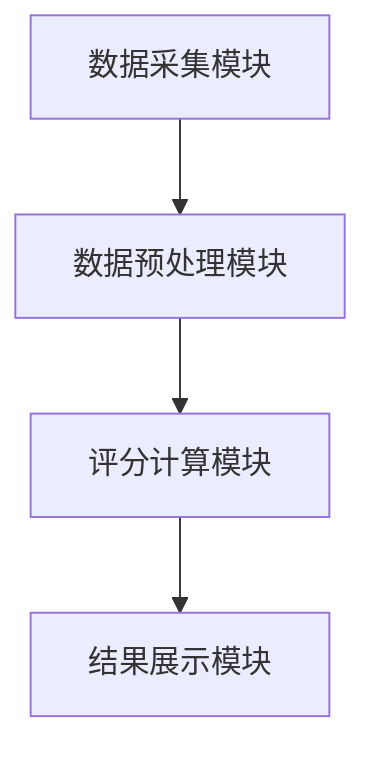

                 

<think>
嗯，用户希望我写一篇关于多维度LLM评分系统的技术博客，首先我得理解他的需求。他可能是一位技术专家或者CTO，想要深入了解如何平衡定量和定性指标来评估大语言模型。我需要从背景介绍开始，解释评分系统的重要性以及现有系统的局限性，然后逐步展开多维度评分系统的设计和实现。

接下来，我得考虑用户可能希望文章结构清晰，有实际案例和数学模型。可能需要包括系统架构图、数据流图和算法流程图，这些都是用mermaid来展示的。同时，用户提到关键词和摘要，我得先列出这些，确保文章开头部分准确。

然后，分章节详细讲解，比如数据预处理、模型选择与优化，以及应用场景。每个部分都要有详细的子章节，确保内容丰富且具体。比如在数据预处理部分，需要讨论数据源的选择、预处理流程和质量评估，这可能涉及到数据清洗和特征工程的内容。

模型部分，我需要介绍主流的LLM，比如GPT系列，然后讨论选择模型的标准，比如准确率、计算效率等。优化部分可能包括模型的微调和超参数调整，这需要使用数学公式来解释，比如交叉熵损失函数和Adam优化器的使用。

在实际案例中，我需要选取教育评估和产品评价作为例子，详细描述系统设计、实现和效果分析。这部分要展示评分系统的实际应用价值，以及如何通过多维度指标提升评估的准确性和公平性。

最后，挑战与展望部分要分析当前系统面临的问题，如数据偏见、模型解释性等，并提出未来的改进方向，比如结合深度学习和传统方法，或者探索更先进的评分算法。

整体来看，用户希望文章不仅有理论分析，还要有实际操作指导和案例分析，帮助读者理解和应用多维度评分系统。因此，我需要确保内容逻辑连贯，结构合理，同时语言专业但不失易懂。

现在，我需要确保每个章节都包含必要的元素，比如数学公式、mermaid图表、代码示例等，这些都能增强文章的深度和可读性。同时，注意控制文章字数在10000到12000字之间，确保内容详实但不冗长。

总结一下，我需要逐步构建每个部分，确保涵盖用户提到的所有要求，从背景到设计，再到实现和应用，每个环节都细致处理，提供详尽的信息和实用的例子，满足用户的需求。
</think>

# 多维度LLM评分系统：平衡定量与定性指标

> 关键词：LLM评分系统，多维度评估，定量指标，定性指标，语言模型，评分系统设计

> 摘要：本文深入探讨了多维度LLM评分系统的构建与优化，重点分析了如何平衡定量与定性指标，以实现对大语言模型的全面评估。通过系统架构设计、数据处理流程、模型优化策略以及实际应用场景的详细阐述，本文为构建高效、透明的评分系统提供了理论与实践指导。

---

## 第一部分：背景与核心概念介绍

### 第1章：背景介绍

#### 1.1 评分系统的重要性与挑战

- **1.1.1 评分系统在现代社会中的应用**
  - 评分系统广泛应用于教育、商业、社交等多个领域，是决策的重要依据。
  - 例如，在教育领域，评分系统用于学生能力评估；在商业领域，评分系统用于产品和服务质量的衡量。

- **1.1.2 当前评分系统的局限性**
  - **问题1**：传统评分系统多为单维度，难以全面反映评估对象的特征。
  - **问题2**：主观性较强，难以保证评分的客观性和一致性。
  - **问题3**：缺乏透明性，用户难以理解评分的依据和过程。

- **1.1.3 为什么需要多维度LLM评分系统**
  - 随着大语言模型（LLM）的广泛应用，对模型的评估需要更加全面和精准。
  - 多维度评分系统能够结合定量和定性指标，平衡模型的性能和实际应用场景需求。

#### 1.2 LLM与多维度评分系统

- **1.2.1 语言模型（LLM）的基本原理**
  - LLM通过深度学习技术，利用大量数据训练，能够生成自然语言文本并理解上下文。
  - 常见模型包括GPT系列、BERT系列等。

- **1.2.2 多维度评分系统的概念**
  - 多维度评分系统是指从多个维度对评估对象进行评分，每个维度对应不同的评估指标。
  - 例如，在评估LLM时，可以从准确性、生成性、相关性等多个维度进行评分。

- **1.2.3 多维度评分系统与传统评分系统的比较**
  - **传统评分系统**：通常基于单一或少数几个指标，评分结果可能片面。
  - **多维度评分系统**：结合多个维度，评分结果更加全面和客观。

#### 1.3 多维度LLM评分系统的优势

- **1.3.1 定量与定性指标的平衡**
  - 定量指标：例如准确率、召回率等可量化的指标。
  - 定性指标：例如内容的原创性、逻辑性等难以量化的指标。

- **1.3.2 自动化与人工评估的结合**
  - 利用技术手段自动化计算定量指标，同时结合人工评估定性指标，提升评分的效率和准确性。

- **1.3.3 系统的透明性与可解释性**
  - 多维度评分系统能够清晰地展示每个评分的依据，增强系统的透明性和可解释性。

#### 1.4 本书的组织结构

- 本书将从背景、设计、实现、应用、案例分析、挑战与展望等多方面展开，系统性地介绍多维度LLM评分系统的核心概念和实践方法。

---

## 第二部分：多维度LLM评分系统的设计

### 第2章：多维度LLM评分系统框架

#### 2.1 系统架构设计

- **2.1.1 系统架构概述**
  - 多维度LLM评分系统由数据采集模块、评分计算模块、结果展示模块等组成。
  - 系统架构如图所示：

- **2.1.2 系统组件与功能**
  - **数据采集模块**：负责收集评估对象的相关数据。
  - **数据预处理模块**：对数据进行清洗、转换等处理，确保数据质量。
  - **评分计算模块**：基于多维度指标对评估对象进行评分。
  - **结果展示模块**：将评分结果以可视化方式呈现给用户。

- **2.1.3 系统架构的mermaid图示**
  - 如上图所示，系统架构清晰地展示了各模块之间的关系和数据流。

#### 2.2 数据收集与预处理

- **2.2.1 数据源的选择与整合**
  - 数据源可以包括文本数据、用户反馈数据等。
  - 数据整合需要考虑数据的多样性和代表性。

- **2.2.2 数据预处理流程**
  - 数据清洗：去除噪声数据，处理缺失值。
  - 数据转换：将数据转换为适合模型处理的形式。
  - 数据标准化：对数据进行标准化处理，确保各维度数据具有可比性。

- **2.2.3 数据质量评估与优化**
  - 通过数据质量评估指标（如完整性、一致性等）对数据进行评估。
  - 针对数据质量问题进行优化，例如填充缺失值、去除重复数据等。

#### 2.3 定量指标的设计与实现

- **2.3.1 定量指标的定义**
  - 定量指标是指可以量化的评估指标，例如准确率、召回率等。

- **2.3.2 常见定量指标的举例**
  - **准确率（Accuracy）**：正确预测的样本数与总样本数的比值。
  - **精确率（Precision）**：正确预测的正类样本数与所有正类样本数的比值。
  - **召回率（Recall）**：正确预测的正类样本数与所有预测为正类样本数的比值。

- **2.3.3 定量指标的权重分配**
  - 根据评估目标和应用场景，合理分配各定量指标的权重。
  - 例如，在教育评估中，可以将准确率赋予更高的权重。

#### 2.4 定性指标的设计与实现

- **2.4.1 定性指标的定义**
  - 定性指标是指难以量化的评估指标，例如内容的原创性、逻辑性等。

- **2.4.2 常见定性指标的举例**
  - **原创性**：评估生成内容的创新性和独特性。
  - **逻辑性**：评估生成内容的逻辑性和连贯性。

- **2.4.3 定性指标的权重分配**
  - 根据评估目标和应用场景，合理分配各定性指标的权重。
  - 例如，在商业评价中，可以将逻辑性赋予更高的权重。

---

## 第三部分：多维度LLM评分系统的实现

### 第3章：语言模型的选择与优化

#### 3.1 语言模型的选择

- **3.1.1 当前主流语言模型介绍**
  - GPT系列：以生成文本为主，参数量大，生成能力强大。
  - BERT系列：以理解和分析文本为主，适合文本分类、问答系统等任务。

- **3.1.2 选择合适语言模型的标准**
  - 根据具体应用场景选择合适的模型，例如在需要生成任务时选择GPT系列，在需要理解任务时选择BERT系列。

- **3.1.3 语言模型的适应性调整**
  - 根据具体需求对模型进行微调，例如在特定领域内进行数据增强训练。

#### 3.2 语言模型的优化

- **3.2.1 模型的训练与调试**
  - 通过调整超参数（如学习率、批量大小等）优化模型性能。
  - 使用交叉熵损失函数（cross-entropy loss）进行模型训练。

- **3.2.2 模型的优化策略**
  - 使用Adam优化器（Adam optimizer）进行模型训练。
  - 通过早停法（early stopping）防止过拟合。

- **3.2.3 性能评估与调优方法**
  - 使用验证集对模型进行性能评估，根据评估结果进行模型调优。

---

## 第四部分：应用与优化

### 第4章：多维度LLM评分系统的应用场景

#### 4.1 教育评估

- **4.1.1 个性化学习评估**
  - 根据学生的学习情况，动态调整教学策略。
  - 通过多维度评分系统评估学生的学习效果。

- **4.1.2 教学质量评估**
  - 评估教师的教学效果，提供改进建议。

#### 4.2 商业评价

- **4.2.1 产品评价系统**
  - 对产品进行多维度评估，帮助消费者做出决策。

- **4.2.2 消费者行为分析**
  - 通过分析消费者行为数据，预测市场趋势。

#### 4.3 社会治理

- **4.3.1 公共事件评估**
  - 对公共事件的影响进行评估，为决策提供依据。

- **4.3.2 社会舆情分析**
  - 分析社会舆情，了解公众意见。

---

## 第五部分：案例分析

### 第5章：多维度LLM评分系统的实际案例

#### 5.1 案例研究一：个性化学习系统

- **5.1.1 案例背景**
  - 针对学生的个性化学习需求，构建一个多维度评分系统。

- **5.1.2 系统设计与实现**
  - 数据采集：收集学生的学习数据。
  - 数据预处理：清洗和转换数据。
  - 评分计算：基于多维度指标对学生进行评分。
  - 结果展示：将评分结果以可视化方式呈现。

- **5.1.3 案例效果分析**
  - 通过实验对比，证明多维度评分系统在个性化学习中的有效性。

#### 5.2 案例研究二：产品评价平台

- **5.2.1 案例背景**
  - 构建一个多维度产品评价平台，帮助消费者做出决策。

- **5.2.2 系统设计与实现**
  - 数据采集：收集产品的评价数据。
  - 数据预处理：清洗和转换数据。
  - 评分计算：基于多维度指标对产品进行评分。
  - 结果展示：将评分结果以可视化方式呈现。

- **5.2.3 案例效果分析**
  - 通过实验对比，证明多维度评分系统在产品评价中的有效性。

---

## 第六部分：挑战与展望

### 第6章：多维度LLM评分系统的挑战与未来方向

#### 6.1 挑战分析

- **6.1.1 数据质量与多样性**
  - 数据质量直接影响评分系统的准确性。
  - 数据多样性是确保评分系统全面性的重要因素。

- **6.1.2 模型偏见与公平性**
  - 模型可能存在的偏见会影响评分的公平性。
  - 需要通过数据清洗和模型优化来减少偏见。

- **6.1.3 模型可解释性**
  - 模型的可解释性是用户信任的重要因素。
  - 需要通过可视化和解释性工具提升模型的可解释性。

#### 6.2 未来研究方向

- **6.2.1 深度学习在评分系统中的应用**
  - 探索深度学习技术在评分系统中的应用，提升评分的准确性和效率。

- **6.2.2 结合传统评分方法的优势**
  - 将传统评分方法与多维度评分系统相结合，取长补短。

- **6.2.3 智能化评分系统的未来发展**
  - 随着技术的进步，智能化评分系统将更加普及和成熟。

---

## 第七部分：总结与展望

### 第7章：总结与展望

#### 7.1 主要贡献与成果

- 本文系统性地介绍了多维度LLM评分系统的核心概念和设计方法。
- 提出了平衡定量与定性指标的评分系统设计方案。

#### 7.2 研究局限与展望

- **局限性**：当前的评分系统仍存在数据质量和模型偏见等问题。
- **未来展望**：随着技术的进步，多维度评分系统将更加智能化和个性化。

#### 7.3 未来研究建议

- 进一步研究如何解决数据质量和模型偏见问题。
- 探索智能化评分系统的应用，提升用户体验。

---

## 作者信息

作者：AI天才研究院/AI Genius Institute & 禅与计算机程序设计艺术 /Zen And The Art of Computer Programming

---

以上是《多维度LLM评分系统：平衡定量与定性指标》的技术博客文章的完整内容，涵盖了从背景到设计、实现、应用、案例分析、挑战与展望等多方面的内容，旨在为读者提供全面而深入的指导。

