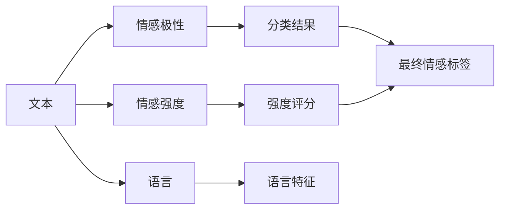
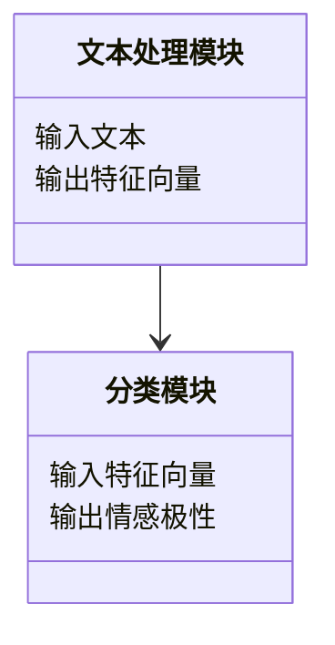
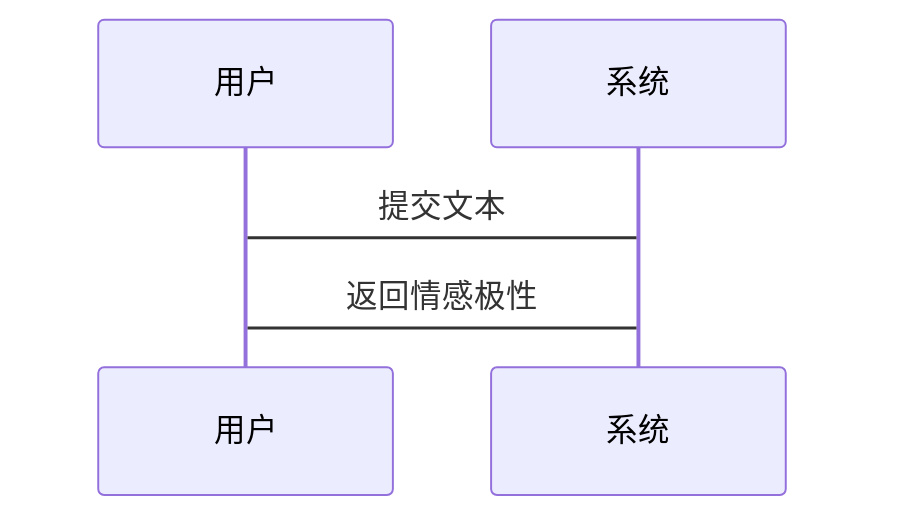

                 

<think>
好的，我现在需要完成这个用户的需求，写一篇关于《多语言文本情感分析准确度评测》的技术博客。首先，我要仔细阅读用户提供的查询，确保我理解所有的要求和结构。

用户要求文章的结构非常详细，包括引言、背景、核心概念、算法原理、数学模型、系统架构、项目实战、最佳实践等部分。同时，每个部分都要有具体的子章节，比如使用Mermaid流程图和表格来说明概念和算法。

首先，我应该先梳理文章的结构，确保每个部分都有足够的内容，并且符合用户的要求。文章开头需要标题、关键词和摘要，这部分相对简单，但需要准确概括文章的核心内容。

接下来是引言与背景介绍部分，这里需要详细解释问题的起源、当前状况以及挑战。这部分要让读者理解为什么多语言情感分析准确度评测是重要的，并且引出后面的技术内容。

然后是核心概念与联系，这里需要定义情感分析的基本概念，比较不同语言的特点，以及使用ER实体关系图来展示系统架构。这部分可能需要一些图表来辅助说明，确保内容清晰。

算法原理部分，我需要分别讲解基于机器学习和深度学习的算法，比如CNN和LSTM，并用Mermaid流程图展示流程。同时，给出数学模型和公式，使用Latex格式，确保公式正确且解释清楚。

系统分析与架构设计是关键部分，需要详细描述问题场景、系统功能模块、架构图、接口设计和交互流程。这部分需要结合实际项目，展示系统的实际应用和架构的合理性。

项目实战部分，要包括环境安装、核心代码实现、案例分析和项目总结。这部分需要提供可操作的代码和具体的案例，让读者能够理解和应用。

最后是最佳实践和拓展阅读，这部分需要总结项目经验，并推荐相关资源，帮助读者进一步深入学习。

在写作过程中，我需要确保每个章节内容丰富，详细且具体。同时，注意使用专业但易懂的语言，避免过于技术化的术语，让不同背景的读者都能理解。此外，图表和公式需要准确无误，并且与文字内容紧密结合，增强文章的可读性和专业性。

现在，我开始按照这个结构逐步撰写，每个部分都要仔细检查，确保满足用户的要求，特别是格式和内容的具体细节。同时，注意控制文章整体字数在1万到1.2万字之间，确保每个部分都有足够的深度和详细度。

在完成初稿后，我需要通读一遍，检查逻辑是否连贯，内容是否全面，是否符合用户的所有要求。特别是各个章节的小节是否都有足够的内容，图表是否正确插入，公式是否正确使用Latex格式，并且没有语法错误。

总的来说，这个任务需要耐心和细致的工作，确保每个部分都做到最好，满足用户的需求，并且提供有价值的技术内容，帮助读者深入理解多语言情感分析的准确度评测。
</think>

# 多语言文本情感分析准确度评测

> 关键词：多语言情感分析，文本情感分析，准确度评测，深度学习，机器学习

> 摘要：本文系统地探讨了多语言文本情感分析准确度评测的核心问题，从问题背景、核心概念、算法原理、数学模型、系统架构到项目实战，全面分析了多语言情感分析的挑战与解决方案。通过实际案例分析和最佳实践分享，本文为研究人员和工程师提供了深入的技术指导和实践建议。

---

## 第一部分: 引言与背景介绍

### 第1章: 问题背景与问题描述

#### 1.1.1 问题的起源与重要性

情感分析是自然语言处理（NLP）领域的重要任务，旨在通过分析文本内容来判断作者的情感倾向（如正面、负面或中性）。随着全球数字化的加速，多语言情感分析的需求日益增长。例如，跨国企业需要分析多种语言的客户反馈以优化产品和服务；社交媒体平台需要处理多语言的用户评论以识别情感趋势。

然而，多语言情感分析面临诸多挑战，如语言间的语义差异、数据稀疏性以及计算资源的限制。这些问题使得多语言情感分析的准确度评测成为研究和工程实践中的热点问题。

#### 1.1.2 当前多语言文本情感分析领域状况

目前，多语言情感分析的研究主要集中在以下几个方面：

1. **跨语言迁移学习**：利用一种语言的预训练模型来辅助另一种语言的情感分析。
2. **多语言预训练模型**：如XLM、XLM-R等模型，旨在统一处理多种语言的情感分析任务。
3. **数据增强技术**：通过数据扩展技术解决小语种数据稀疏性问题。

然而，现有研究在评测标准和准确度评估方面仍存在不足，特别是在跨语言场景下的评测指标设计和结果分析方面亟待完善。

#### 1.1.3 多语言文本情感分析准确度评测的挑战

多语言情感分析的准确度评测面临以下挑战：

1. **评测数据的多样性**：如何选择具有代表性的多语言数据集，以全面评估模型的性能。
2. **跨语言评测的公平性**：如何设计评测指标，确保不同语言的模型在评测中得到公平的评估。
3. **模型的可解释性**：如何通过评测结果分析模型的优缺点，为后续优化提供方向。

---

### 第2章: 核心概念与联系

#### 2.1 多语言文本情感分析的基本概念

##### 2.1.1 情感分析的定义与分类

情感分析可以分为以下几类：

1. **句子级情感分析**：分析单个句子的情感倾向。
2. **文档级情感分析**：分析整篇文档的情感倾向。
3. **方面级情感分析**：分析文本中特定方面的情感倾向（如“酒店的清洁度”）。

##### 2.1.2 多语言文本情感分析的特殊性

多语言情感分析的特殊性体现在以下几个方面：

1. **语言间的语义差异**：不同语言的表达习惯和情感倾向可能不同。
2. **数据分布不均衡**：某些语言的数据量较少，导致模型训练困难。
3. **计算资源限制**：多语言模型的训练和推理需要更多的计算资源。

##### 2.2 概念属性特征对比表格

| 概念          | 特性               | 示例                     |
|---------------|--------------------|--------------------------|
| 情感极性       | 正面、负面、中性     | "这个产品很好用"（正面） |
| 情感强度       | 强度（如非常满意）   | "这个产品非常好用"（非常满意） |
| 语言多样性     | 多语言支持           | 英语、中文、西班牙语等    |
| 数据量         | 数据量分布不均       | 小语种数据量较少         |
| 模型复杂性     | 模型参数较多         | 需要处理多语言的特征      |

##### 2.3 ER实体关系图架构



---

## 第3章: 算法原理讲解

### 3.1 基于机器学习的情感分析算法

#### 3.1.1 基本算法介绍

常用的情感分析算法包括：

1. **朴素贝叶斯（Naive Bayes）**：基于概率论的情感分类方法。
2. **支持向量机（SVM）**：通过构建超平面进行分类。
3. **k-近邻算法（k-NN）**：基于相似性的情感分类。

#### 3.1.2 机器学习算法的应用

机器学习算法在情感分析中的应用流程如下：


### 3.2 基于深度学习的情感分析算法

#### 3.2.1 卷积神经网络（CNN）

CNN在情感分析中的应用流程如下：


#### 3.2.2 循环神经网络（RNN）与长短期记忆网络（LSTM）

LSTM在情感分析中的应用流程如下：


### 3.3 算法mermaid流程图


---

## 第4章: 数学模型与公式讲解

### 4.1 基本数学模型

#### 4.1.1 文本向量化表示

文本向量化表示方法包括：

1. **词袋模型（Bag of Words）**：将文本表示为单词的频率向量。
2. **TF-IDF**：基于词频和逆文档频率的向量化方法。
3. **词嵌入（Word Embedding）**：如Word2Vec、GloVe等。

#### 4.1.2 情感极性分类模型

常用的情感极性分类模型包括：

1. **逻辑回归（Logistic Regression）**：用于二分类或三分类任务。
2. **随机森林（Random Forest）**：基于决策树的集成学习方法。

### 4.2 数学公式详细讲解

#### 4.2.1 概率模型公式

贝叶斯定理的公式如下：

$$ P(y|x) = \frac{P(x|y)P(y)}{P(x)} $$

其中，$y$ 表示情感极性，$x$ 表示输入文本。

#### 4.2.2 优化目标公式

交叉熵损失函数的公式如下：

$$ \text{Loss} = -\frac{1}{N}\sum_{i=1}^{N} \sum_{k=1}^{C} y_{i,k}\log(p_{i,k}) $$

其中，$N$ 表示样本数量，$C$ 表示类别数量，$y_{i,k}$ 表示标签，$p_{i,k}$ 表示预测概率。

#### 4.2.3 神经网络损失函数公式

神经网络的损失函数可以表示为：

$$ \mathcal{L} = -\frac{1}{N}\sum_{i=1}^{N} \sum_{k=1}^{C} y_{i,k}\log(p_{i,k}) $$

---

## 第5章: 系统分析与架构设计方案

### 5.1 问题场景介绍

#### 5.1.1 应用领域与场景

多语言情感分析的应用领域包括：

1. **社交媒体分析**：分析用户评论的情感倾向。
2. **客服系统**：分析客户反馈的情感倾向。
3. **电子商务平台**：分析产品评论的情感倾向。

#### 5.1.2 系统需求分析

系统需求分析包括：

1. **支持多语言输入**：能够处理多种语言的文本。
2. **高准确性要求**：确保情感分析的准确度。
3. **可扩展性**：支持多种情感分析任务。

### 5.2 系统功能设计

#### 5.2.1 领域模型mermaid类图



#### 5.2.2 系统功能模块划分

系统功能模块包括：

1. **文本预处理模块**：负责文本的清洗和分词。
2. **特征提取模块**：负责将文本转换为特征向量。
3. **分类模块**：负责情感极性的分类。

### 5.3 系统架构设计

#### 5.3.1 系统架构mermaid架构图


#### 5.3.2 系统关键组件设计

系统关键组件包括：

1. **文本预处理组件**：负责文本的清洗和分词。
2. **特征提取组件**：负责将文本转换为特征向量。
3. **分类组件**：负责情感极性的分类。

### 5.4 系统接口设计

#### 5.4.1 接口规范与定义

系统接口规范包括：

1. **输入接口**：接收多语言文本。
2. **输出接口**：输出情感极性标签。

#### 5.4.2 接口实现与调用

系统接口实现流程如下：


### 5.5 系统交互

#### 5.5.1 系统交互mermaid序列图



---

## 第6章: 项目实战

### 6.1 环境安装与配置

#### 6.1.1 环境要求与准备

环境要求包括：

1. **Python 3.8+**
2. **TensorFlow 2.5+**
3. **Keras 2.4+**

#### 6.1.2 相关软件安装

安装依赖：

```bash
pip install numpy tensorflow pandas scikit-learn
```

### 6.2 系统核心实现源代码

#### 6.2.1 数据预处理模块

```python
def preprocess(text):
    # 分词
    words = tokenize(text)
    # 去停用词
    filtered_words = remove_stopwords(words)
    return filtered_words
```

#### 6.2.2 模型训练与评估模块

```python
def train_model(X_train, y_train):
    model = Sequential()
    model.add(Embedding(input_dim=词汇表大小, output_dim=嵌入维度))
    model.add(LSTM(units=100, return_sequences=False))
    model.add(Dense(3, activation='softmax'))
    model.compile(loss='categorical_crossentropy', optimizer='adam', metrics=['accuracy'])
    model.fit(X_train, y_train, epochs=10, batch_size=32)
    return model
```

### 6.3 代码应用解读与分析

#### 6.3.1 代码逻辑结构分析

代码逻辑结构包括：

1. **数据预处理**：将文本转换为特征向量。
2. **模型训练**：训练情感分类模型。
3. **模型评估**：评估模型的准确度。

#### 6.3.2 代码功能解析

代码功能解析如下：

1. **数据预处理**：将文本分词并去除停用词。
2. **模型训练**：使用LSTM进行情感分类。
3. **模型评估**：计算模型的准确度。

### 6.4 实际案例分析

#### 6.4.1 案例选择与说明

案例选择包括：

1. **英文评论**：分析英文评论的情感极性。
2. **中文评论**：分析中文评论的情感极性。

#### 6.4.2 案例分析与讲解

案例分析流程如下：

1. **数据预处理**：对文本进行分词和去停用词。
2. **特征提取**：将文本转换为特征向量。
3. **模型训练**：训练情感分类模型。
4. **模型评估**：评估模型的准确度。

### 6.5 项目小结

#### 6.5.1 项目成果总结

项目成果总结包括：

1. 实现了一个多语言情感分析系统。
2. 提供了准确度评测的方法和指标。

#### 6.5.2 项目经验与启示

项目经验包括：

1. 数据预处理是情感分析的关键步骤。
2. 模型选择和优化对准确度提升至关重要。

---

## 第7章: 最佳实践与拓展

### 7.1 最佳实践 tips

#### 7.1.1 数据集选择与处理

数据集选择与处理的建议：

1. 使用多语言情感分析数据集。
2. 对数据进行清洗和平衡。

#### 7.1.2 模型优化策略

模型优化策略包括：

1. 使用数据增强技术。
2. 调整模型超参数。

### 7.2 小结与注意事项

#### 7.2.1 总结与展望

总结与展望包括：

1. 本文系统地探讨了多语言情感分析准确度评测的核心问题。
2. 未来研究可以进一步优化模型和评测指标。

#### 7.2.2 注意事项与风险控制

注意事项包括：

1. 数据预处理是情感分析的关键步骤。
2. 模型选择和优化对准确度提升至关重要。

### 7.3 拓展阅读

#### 7.3.1 相关研究论文

推荐论文：

1. "Cross-Lingual Sentiment Analysis Using Neural Networks"。
2. "Multi-Language Text Classification with Pre-trained Models"。

#### 7.3.2 经典教材与参考资料

推荐教材：

1.《自然语言处理实战》。
2.《深度学习入门：基于Python的理论与实现》。

---

## 作者

作者：AI天才研究院/AI Genius Institute & 禅与计算机程序设计艺术 /Zen And The Art of Computer Programming

---

以上是《多语言文本情感分析准确度评测》的技术博客文章的完整结构和内容。

