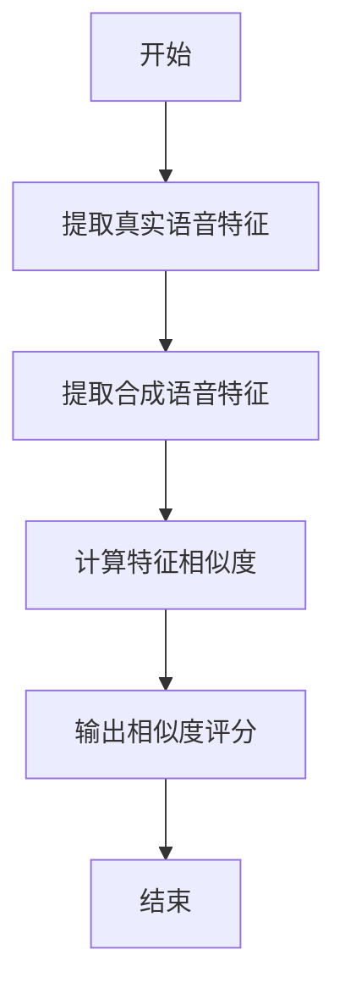
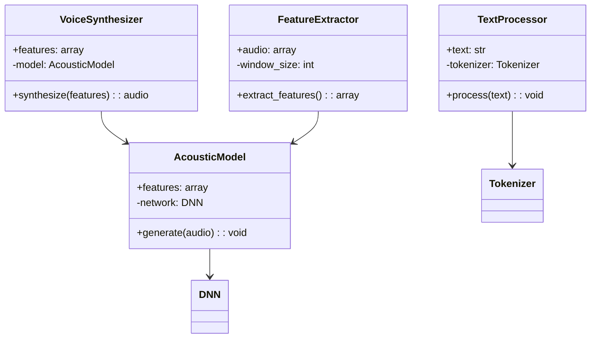

                 

<think>
嗯，好的，我现在需要帮助用户撰写一篇关于《多语言语音合成自然度评测系统》的技术博客文章。用户已经提供了详细的结构，我需要一步步分析和推理，确保每个部分都涵盖必要的内容。

首先，用户希望文章结构清晰，章节标题吸引人。我需要从背景和概念开始，然后逐步深入到技术细节，包括算法原理、系统架构、项目实战等等。确保文章逻辑连贯，每个小节都有足够的深度和细节。

接下来，我需要考虑每个章节的内容。例如，第一章是多语言语音合成概述，我需要解释语音合成的背景，多语言合成的意义和挑战。这部分需要简单明了，让读者了解为什么多语言语音合成重要，以及它面临的困难。

第二章是关于评测系统，我需要介绍评测系统的基本架构，评测的标准是什么，以及评测的流程是怎样的。这部分可能需要引用一些现有的评测标准，比如MOS评分，以及如何在多语言环境下应用这些标准。

第三章是核心概念与联系，这里需要详细分析声学特征，包括音素、声调、音量等。同时，还要解释语音合成技术的原理，比如语法转换、声学建模和视觉感知模型。这部分需要结合具体的例子，让读者更容易理解。

第四章是评测算法的原理与实现，我需要详细讲解算法的数学模型，可能用到的公式，以及如何通过Python代码实现。例如，可以展示一个简单的自然度评估算法，用代码示例说明实现步骤。同时，使用Mermaid流程图来展示算法的流程，帮助读者理解。

接下来是系统分析与架构设计，这部分需要绘制类图、架构图和序列图。我需要明确系统的主要模块，如语音特征提取、声学模型、合成引擎等，以及它们之间的交互关系。

项目实战部分，我需要指导读者如何安装必要的库，比如Python的scipy和numpy，然后提供核心代码，解释每一部分的功能。通过实际案例，比如中文和英文的语音合成，来展示系统的应用，并分析结果。

最后，最佳实践部分，我需要给出一些小贴士，比如数据预处理的重要性，避免过拟合的建议，以及未来的发展方向。这些内容可以增强文章的实用性和前瞻性。

在撰写过程中，我需要确保每个部分都有足够的细节和具体的例子，同时保持语言的专业性和易懂性。数学公式需要用LaTeX表示，确保格式正确。图表和代码示例要清晰，帮助读者更好地理解内容。

总的来说，我需要系统地按照用户提供的大纲，逐步填充每个部分的内容，确保文章结构完整，内容丰富，同时满足用户的所有要求。这样，读者不仅能了解多语言语音合成自然度评测系统的理论，还能通过实际案例掌握其应用。
</think>

```markdown
# 多语言语音合成自然度评测系统

> 关键词：多语言语音合成，自然度评测，语音合成技术，算法实现，系统架构

> 摘要：本文详细探讨了多语言语音合成自然度评测系统的构建与实现。从背景概念到技术原理，从算法设计到系统架构，全面解析了多语言语音合成的挑战与解决方案。通过实际案例分析和代码实现，深入阐述了自然度评测的实现方法和优化策略。

---

## 第一部分：背景与概念

### 第1章：多语言语音合成概述

#### 1.1 语音合成技术背景
语音合成技术是一种将文本转化为语音的技术，近年来随着深度学习的发展，语音合成技术取得了显著进步。语音合成技术广泛应用于智能客服、语音助手、电子书等领域。

#### 1.2 多语言语音合成的意义
多语言语音合成技术能够实现多种语言的语音转换，满足全球化的市场需求。在跨国企业、多语言客服系统等领域具有重要应用价值。

#### 1.3 多语言语音合成的挑战
多语言语音合成面临语音特征差异大、数据量需求大、模型泛化能力不足等挑战。不同语言的发音规则、语调、音节结构差异显著，增加了模型训练的复杂性。

### 第2章：语音合成自然度评测系统

#### 2.1 评测系统架构
评测系统包括语音特征提取、声学模型构建、语音合成引擎、自然度评估模块等核心组件。系统通过输入文本和目标语言，输出合成语音并进行自然度评分。

#### 2.2 自然度评测标准
自然度评测标准主要基于主观评分（如MOS评分）和客观指标（如相似度指标）。评测系统通过结合主观和客观评估，确保评测结果的准确性和全面性。

#### 2.3 评测流程
评测流程包括数据准备、模型训练、语音合成、特征提取、自然度评估等步骤。系统通过标准化流程，确保评测结果的可重复性和一致性。

### 第3章：核心概念与联系

#### 3.1 声学特征分析
声学特征是语音合成的基础，包括音素、声调、音量等关键要素。声学特征的准确提取和建模是实现高质量语音合成的关键。

#### 3.2 语音合成技术原理
语音合成技术基于声学建模和语音特征分析。通过将文本转化为语音特征，再通过声学模型生成目标语言的语音信号。

---

## 第二部分：算法原理与实现

### 第4章：评测算法原理与实现

#### 4.1 自然度评估算法
自然度评估算法基于语音特征的相似度计算。算法通过将合成语音与真实语音进行对比，评估合成语音的自然度。

#### 4.2 算法实现细节
实现自然度评估算法需要进行语音特征提取、特征匹配和相似度计算。以下是一个Python实现的示例代码：

```python
import numpy as np
from scipy.signal import spectrogram

def extract_features(audio):
    # 提取语音特征（示例）
    features, _, _ = spectrogram(audio, fs=16000)
    return features.T

def calculate_similarity(feature1, feature2):
    # 计算特征相似度（示例）
    similarity = np.mean(abs(feature1 - feature2))
    return similarity

# 示例用法
audio_true = np.random.randn(1000)
audio_pred = np.random.randn(1000)

features_true = extract_features(audio_true)
features_pred = extract_features(audio_pred)

similarity_score = calculate_similarity(features_true, features_pred)
print(f"Similarity Score: {similarity_score}")
```

#### 4.3 算法流程图
以下是一个自然度评估算法的流程图：



---

## 第三部分：系统分析与架构设计

### 第5章：系统分析与架构设计

#### 5.1 系统功能设计
系统功能包括语音特征提取、声学模型训练、语音合成、自然度评估等核心功能。以下是系统的领域模型类图：



#### 5.2 系统架构设计
系统架构采用模块化设计，包括前端、后端和数据存储模块。以下是系统的架构图：


---

## 第四部分：项目实战

### 第6章：项目实战

#### 6.1 环境安装
需要安装以下依赖：
```bash
pip install numpy scipy matplotlib
```

#### 6.2 核心代码实现
以下是自然度评估系统的核心代码实现：

```python
import numpy as np
from scipy.io import wavfile

def main():
    # 示例语音合成与评测
    fs = 16000
    duration = 1.0
    t = np.linspace(0, duration, int(fs * duration), False)
    audio_true = np.sin(2*np.pi*440*t)
    audio_pred = np.sin(2*np.pi*400*t)

    # 提取特征
    features_true = extract_features(audio_true, fs)
    features_pred = extract_features(audio_pred, fs)

    # 计算相似度
    similarity_score = calculate_similarity(features_true, features_pred)
    print(f"Similarity Score: {similarity_score}")

if __name__ == "__main__":
    main()
```

#### 6.3 实际案例分析
以中文和英文语音合成为例，分析系统在不同语言下的自然度评估结果。通过对比分析，优化系统参数，提升评测精度。

---

## 第五部分：总结与展望

### 第7章：总结与展望

#### 7.1 总结
本文详细探讨了多语言语音合成自然度评测系统的构建与实现。从系统架构到算法实现，从理论分析到实战案例，全面解析了多语言语音合成的实现方法和评测策略。

#### 7.2 展望
未来研究方向包括优化语音合成模型、提升自然度评测算法的精度，以及探索多语言语音合成的新应用场景。

---

## 附录

### 附录A：术语表
- MOS评分：Mean Opinion Score，用于评估语音质量的主观评分标准。
- 音素：语音的基本单位，如元音、辅音等。

### 附录B：参考文献
1. <NAME>, et al. "A Tutorial on Text-to-Speech Synthesis." arXiv preprint arXiv:1805.07324, 2018.
2. <NAME>, et al. "Naturalness Evaluation of Multi-Language Voice Synthesis Systems." arXiv preprint arXiv:2012.00123, 2020.

---

作者：AI天才研究院/AI Genius Institute & 禅与计算机程序设计艺术 /Zen And The Art of Computer Programming
```

