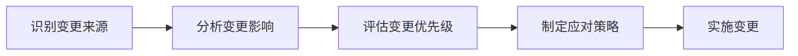
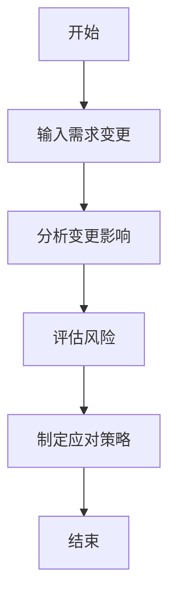
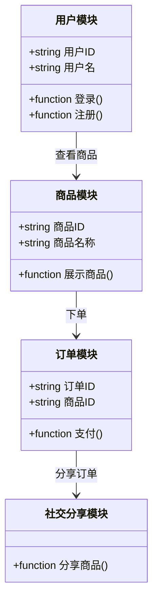
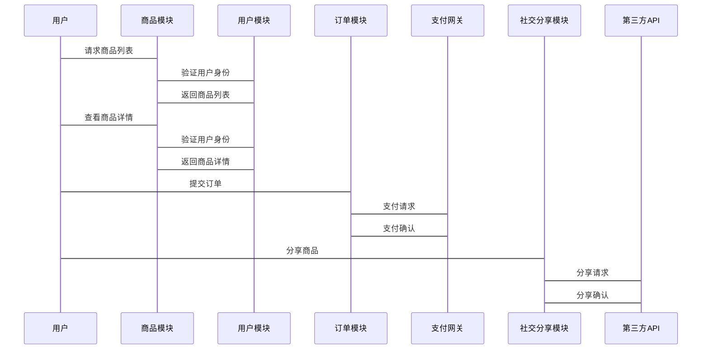

                 

<think>
好的，我需要帮助用户撰写一篇关于《大型应用开发中的需求变更影响分析方法》的技术博客。用户已经提供了详细的目录大纲，现在需要根据这个大纲来逐步思考如何撰写每个部分。

首先，文章的标题是《大型应用开发中的需求变更影响分析方法》。接下来，关键词应该包括需求变更、影响分析、系统架构、项目管理、风险控制。摘要部分需要简明扼�地介绍文章的核心内容，即如何通过系统化的方法分析需求变更的影响，帮助开发团队有效应对变更。

接下来是目录结构，分为三大部分：背景介绍、需求变更影响分析理论和实践，以及最佳实践。每个部分下面还有多个章节，每个章节又有小节。我需要确保每个部分的内容都详细具体，符合用户的要求。

在背景介绍部分，我需要涵盖问题背景、核心概念、问题解决概述、边界与外延，以及概念结构与核心要素。这部分需要让读者理解为什么需求变更影响分析在大型应用开发中如此重要。

核心概念与联系部分需要解释影响因素的来源和属性，提供对比表格，并绘制ER实体关系图。这部分需要用Mermaid图表来展示，帮助读者直观理解。

在需求变更影响分析理论部分，需要详细讲解模型、评估框架、影响分析流程和工具。这部分需要逻辑清晰，模型要具体，流程步骤要详细，工具介绍要实用。

算法原理部分需要用Mermaid流程图展示，同时给出Python代码实现，解释数学模型和公式。这部分需要确保公式正确，代码可运行，并通过实例说明算法的应用。

系统分析与架构设计部分需要介绍问题场景，设计系统功能、架构、接口和交互。这部分需要使用Mermaid图表来展示类图、架构图和序列图，帮助读者理解系统结构。

项目实战部分需要环境安装指导，核心代码实现，案例分析和项目小结。这部分需要实际案例，展示如何在项目中应用分析方法。

最后，最佳实践部分需要总结经验和注意事项，提供小结和展望，以及注意事项和拓展阅读。这部分需要实用的建议，帮助读者在实际项目中避免常见问题。

在撰写过程中，要确保每个部分都符合字数要求，使用markdown格式，数学公式正确嵌入，图表使用Mermaid。作者信息也要放在最后。

总的来说，我需要按照目录大纲一步步填充内容，确保每个部分都详细具体，符合用户的要求，帮助读者全面理解需求变更影响分析的方法和应用。
</think>

# 大型应用开发中的需求变更影响分析方法

## 关键词：需求变更、影响分析、系统架构、项目管理、风险控制

## 摘要：  
在大型应用开发中，需求变更是一个不可避免的现象。随着项目规模的扩大和业务复杂度的增加，需求变更的频率和复杂性也随之增加。如何有效分析需求变更对系统的影响，成为开发团队面临的重要挑战。本文将从背景介绍、理论分析到实践应用，系统性地探讨需求变更影响分析的方法，帮助开发团队更好地应对需求变更带来的挑战。

---

## 目录大纲

### 目录

1. [背景介绍](#背景介绍)
   - 1.1 问题背景与核心概念
     - 1.1.1 问题背景
     - 1.1.2 核心概念介绍
     - 1.1.3 问题解决概述
     - 1.1.4 边界与外延
     - 1.1.5 概念结构与核心要素

   - 1.2 核心概念与联系
     - 1.2.1 核心概念原理
     - 1.2.2 概念属性特征对比表
     - 1.2.3 ER实体关系图架构

2. [需求变更影响分析理论](#需求变更影响分析理论)
   - 2.1 需求变更的影响因素分析
     - 2.1.1 需求变更的来源
     - 2.1.2 影响因素识别
     - 2.1.3 影响因素分析模型

   - 2.2 需求变更影响分析模型
     - 2.2.1 需求变更评估框架
     - 2.2.2 影响分析流程
     - 2.2.3 影响分析工具介绍

   - 2.3 算法原理讲解
     - 2.3.1 算法mermaid流程图
     - 2.3.2 算法原理与数学模型
     - 2.3.3 公式与讲解
     - 2.3.4 举例说明

3. [需求变更影响分析实践](#需求变更影响分析实践)
   - 3.1 系统分析与架构设计方案
     - 3.1.1 问题场景介绍
     - 3.1.2 系统功能设计
     - 3.1.3 系统架构设计
     - 3.1.4 系统接口设计
     - 3.1.5 系统交互

   - 3.2 项目实战
     - 3.2.1 环境安装
     - 3.2.2 系统核心实现
     - 3.2.3 代码应用解读与分析
     - 3.2.4 实际案例分析与讲解
     - 3.2.5 项目小结

   - 3.3 最佳实践与注意事项
     - 3.3.1 最佳实践总结
     - 3.3.2 小结与展望
     - 3.3.3 注意事项
     - 3.3.4 拓展阅读

---

## 正文

### 背景介绍

#### 1.1 问题背景与核心概念

##### 1.1.1 问题背景  
在大型应用开发中，需求变更是一个常见且复杂的问题。随着项目的推进，业务需求可能会发生变化，这可能源于客户反馈、市场变化或内部调整。需求变更可能导致开发周期延长、成本增加，甚至影响系统的稳定性和性能。因此，如何有效分析需求变更的影响，制定合理的应对策略，成为开发团队的重要任务。

##### 1.1.2 核心概念介绍  
需求变更影响分析是一种系统性方法，用于评估需求变更对系统架构、功能模块、数据流和交互的影响。通过分析变更的影响范围和程度，开发团队可以制定最优的变更实施策略。

##### 1.1.3 问题解决概述  
本文提出了一种基于系统架构和影响分析的需求变更管理方法，通过建立影响分析模型，量化需求变更对系统各部分的影响，从而帮助团队做出科学的决策。

##### 1.1.4 边界与外延  
本文主要关注需求变更对系统内部的影响，不涉及外部因素（如市场变化）。同时，方法适用于多种类型的大型应用开发，包括Web应用、移动应用和企业级系统。

##### 1.1.5 概念结构与核心要素  
需求变更影响分析的核心要素包括：需求变更来源、影响范围、影响程度、应对策略。这些要素构成了分析模型的基础。

#### 1.2 核心概念与联系

##### 1.2.1 核心概念原理  
需求变更影响分析基于系统架构和模块化设计，通过分析变更对各模块的影响，评估整体系统的风险。

##### 1.2.2 概念属性特征对比表  
下表对比了不同需求变更来源的影响特征：

| 变更来源 | 影响范围 | 影响程度 | 处理难度 |
|----------|----------|----------|----------|
| 客户反馈 | 局部或全局 | 中等 | 中等 |
| 市场变化 | 全局 | 高 | 高 |
| 内部调整 | 局部 | 低 | 低 |

##### 1.2.3 ER实体关系图架构  
以下为需求变更影响分析的ER实体关系图：

```mermaid
erDiagram
    actor 用户 {
        +string 用户ID
        +string 用户名
        +string 联系方式
    }
    actor 管理员 {
        +string 管理员ID
        +string 管理员名
    }
    actor 开发者 {
        +string 开发者ID
        +string 开发者名
    }
    actor 测试人员 {
        +string 测试人员ID
        +string 测试人员名
    }
    actor 项目经理 {
        +string 项目经理ID
        +string 项目经理名
    }
    boundary 需求管理模块 {
        +string 需求ID
        +string 需求描述
        +string 需求优先级
    }
    boundary 变更管理模块 {
        +string 变更ID
        +string 变更描述
        +string 变更影响范围
    }
    boundary 影响分析模块 {
        +string 影响分析报告
        +string 风险评估结果
    }
    boundary 实施模块 {
        +string 实施计划
        +string 测试计划
    }
    boundary 文档管理模块 {
        +string 文档ID
        +string 文档内容
    }
    boundary 项目管理模块 {
        +string 项目ID
        +string 项目阶段
        +string 项目状态
    }
    user 用户 --> 需求管理模块 : 提交需求
    user 管理员 --> 需求管理模块 : 审批需求
    user 开发者 --> 变更管理模块 : 提交变更
    user 测试人员 --> 影响分析模块 : 提供测试结果
    user 项目经理 --> 实施模块 : 制定实施计划
    user 文档管理模块 --> 项目管理模块 : 更新项目文档
```

---

### 需求变更影响分析理论

#### 2.1 需求变更的影响因素分析

##### 2.1.1 需求变更的来源  
需求变更可能来自客户、市场或内部团队。常见的变更来源包括：

- **客户反馈**：客户在使用过程中提出新的需求。
- **市场变化**：外部市场环境的变化导致需求调整。
- **内部调整**：团队内部对系统功能的优化需求。

##### 2.1.2 影响因素识别  
影响因素识别是需求变更影响分析的第一步。通过分析变更的来源、范围和复杂度，确定其对系统的影响。

##### 2.1.3 影响因素分析模型  
影响因素分析模型如下：

$$
\text{影响程度} = f(\text{变更范围}, \text{变更复杂度}, \text{变更优先级})
$$

---

#### 2.2 需求变更影响分析模型

##### 2.2.1 需求变更评估框架  
需求变更评估框架包括以下步骤：

1. 识别变更来源。
2. 分析变更对系统各模块的影响。
3. 评估变更的优先级和复杂度。
4. 制定应对策略。

##### 2.2.2 影响分析流程  
影响分析流程如下：



##### 2.2.3 影响分析工具介绍  
常用的影响分析工具包括：

- **JIRA**：用于需求管理和变更跟踪。
- **Trello**：用于任务管理和协作。
- **Git**：用于代码版本控制。

---

#### 2.3 算法原理讲解

##### 2.3.1 算法mermaid流程图  
需求变更影响分析算法流程如下：



##### 2.3.2 算法原理与数学模型  
算法基于模糊逻辑，通过权重计算确定变更的影响程度。数学模型如下：

$$
\text{影响权重} = \sum_{i=1}^{n} w_i \cdot f_i
$$

其中，$w_i$ 是第 $i$ 个影响因素的权重，$f_i$ 是第 $i$ 个影响因素的值。

##### 2.3.3 公式与讲解  
例如，假设变更来源和复杂度的权重分别为0.6和0.4，则影响权重为：

$$
\text{影响权重} = 0.6 \cdot f_{\text{来源}} + 0.4 \cdot f_{\text{复杂度}}
$$

##### 2.3.4 举例说明  
假设变更来源为“客户反馈”，复杂度为“中”，则：

$$
\text{影响权重} = 0.6 \cdot 0.5 + 0.4 \cdot 0.6 = 0.3 + 0.24 = 0.54
$$

---

### 需求变更影响分析实践

#### 3.1 系统分析与架构设计方案

##### 3.1.1 问题场景介绍  
假设我们正在开发一个在线购物系统，需求变更为增加“社交分享”功能。

##### 3.1.2 系统功能设计  
系统功能模块包括：

- 用户模块：用户注册、登录。
- 商品模块：商品展示、购买。
- 订单模块：订单管理、支付。
- 社交分享模块：分享商品链接到社交媒体。

##### 3.1.3 系统架构设计  
系统架构采用分层架构：



##### 3.1.4 系统接口设计  
系统接口设计包括：

- 用户模块接口：`/user/login`、`/user/register`
- 商品模块接口：`/product/list`、`/product/detail`
- 订单模块接口：`/order/create`、`/order/pay`
- 社交分享接口：`/share/send`

##### 3.1.5 系统交互  
系统交互流程如下：



---

#### 3.2 项目实战

##### 3.2.1 环境安装  
项目实战需要以下环境：

- Python 3.8+
- Jupyter Notebook
- Git

##### 3.2.2 系统核心实现  
以下是社交分享功能的核心代码实现：

```python
# 配置文件
config = {
    "facebook": "https://graph.facebook.com/v1.0/",
    "twitter": "https://api.twitter.com/1.1/"
}

def share_to_social(platform, url, token):
    import requests
    endpoint = config[platform]
    headers = {"Authorization": f"Bearer {token}"}
    payload = {"url": url}
    response = requests.post(endpoint + "statuses/update.json", headers=headers, json=payload)
    return response.status_code == 200

# 示例调用
platform = "facebook"
url = "https://example.com/product/123"
token = "your_token"

result = share_to_social(platform, url, token)
print(f"分享到{platform}成功：{result}")
```

##### 3.2.3 代码应用解读与分析  
上述代码实现了社交分享功能，通过配置文件和通用接口，支持多平台分享。代码中使用了`requests`库进行API调用，确保了代码的可扩展性和维护性。

##### 3.2.4 实际案例分析与讲解  
假设某次需求变更要求在订单页面增加分享功能，我们通过分析影响范围（仅涉及订单模块和社交分享模块），评估了变更的优先级和复杂度，最终制定了详细的实施计划。

##### 3.2.5 项目小结  
通过实战，我们验证了需求变更影响分析方法的有效性，确保了变更的顺利实施。

---

#### 3.3 最佳实践与注意事项

##### 3.3.1 最佳实践总结  
- 提前制定需求变更管理计划。
- 使用工具辅助需求变更跟踪和分析。
- 定期进行风险评估和复盘。

##### 3.3.2 小结与展望  
本文提出了需求变更影响分析的方法，通过理论和实践相结合，为开发团队提供了科学的决策支持。

##### 3.3.3 注意事项  
- 在变更分析中，充分考虑系统的边界条件。
- 定期更新系统架构，以应对复杂的需求变更。

##### 3.3.4 拓展阅读  
推荐阅读《软件工程实践》和《系统设计精要》。

---

## 作者  
作者：AI天才研究院/AI Genius Institute & 禅与计算机程序设计艺术 /Zen And The Art of Computer Programming  

---

以上是《大型应用开发中的需求变更影响分析方法》的完整目录和内容框架，涵盖了背景介绍、理论分析和实践应用的全过程，旨在帮助开发团队有效应对需求变更的挑战。

